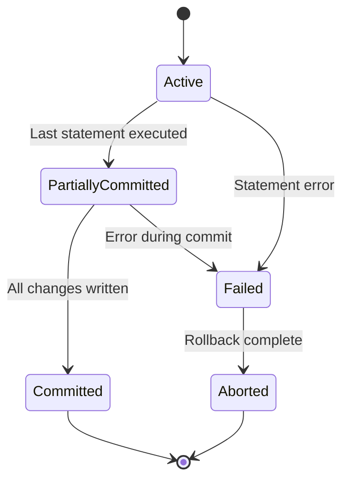
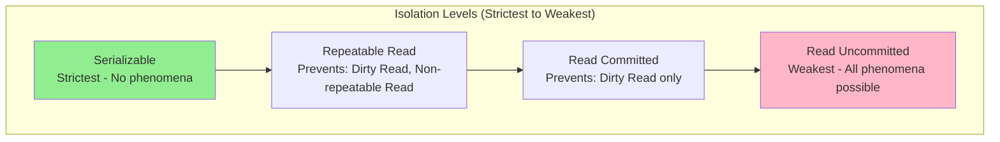

# Transactions and ACID Properties

## What You'll Learn

- Transaction concepts and lifecycle
- ACID properties in depth (Atomicity, Consistency, Isolation, Durability)
- Transaction states and state transitions
- Isolation levels and their trade-offs
- Concurrent transaction problems (dirty reads, lost updates, phantom reads)
- Implementation techniques for ACID guarantees
- Transaction logs and recovery mechanisms
- Savepoints and nested transactions

## Why This Matters

Transactions are the fundamental unit of work in database systems, ensuring data integrity even in the face of failures, concurrent access, and system crashes. Understanding ACID properties is crucial for designing reliable systems that handle financial transactions, inventory management, booking systems, and any application where data consistency is non-negotiable. A single bug in transaction handling can lead to data corruption, financial losses, or regulatory violations. Modern distributed systems face additional challenges in maintaining ACID properties, making this knowledge essential for senior engineers working with microservices, event-driven architectures, and cloud-native applications.

## Transaction Basics

A **transaction** is a logical unit of work that contains one or more SQL statements. All operations in a transaction either complete successfully (commit) or are rolled back entirely (abort).

### Transaction Example

```sql
-- Banking transfer transaction
START TRANSACTION;

-- Deduct from source account
UPDATE accounts 
SET balance = balance - 1000 
WHERE account_id = 'ACC001';

-- Add to destination account
UPDATE accounts 
SET balance = balance + 1000 
WHERE account_id = 'ACC002';

-- Record the transfer
INSERT INTO transfers (from_account, to_account, amount, transfer_date)
VALUES ('ACC001', 'ACC002', 1000, CURRENT_TIMESTAMP);

COMMIT;
```

### Transaction States



**State Descriptions:**

1. **Active**: Initial state; transaction is executing
2. **Partially Committed**: After the last statement executes but before changes are permanently written
3. **Committed**: Transaction completed successfully; changes are permanent
4. **Failed**: Transaction cannot proceed due to error
5. **Aborted**: Transaction rolled back; database restored to pre-transaction state

### Transaction Implementation in Different Languages

```java
// Java with JDBC
public class TransactionExample {
    public void transferMoney(Connection conn, 
                             String fromAccount, 
                             String toAccount, 
                             BigDecimal amount) throws SQLException {
        // Disable auto-commit
        conn.setAutoCommit(false);
        
        try {
            // Deduct from source
            PreparedStatement deduct = conn.prepareStatement(
                "UPDATE accounts SET balance = balance - ? WHERE account_id = ?"
            );
            deduct.setBigDecimal(1, amount);
            deduct.setString(2, fromAccount);
            int rowsAffected = deduct.executeUpdate();
            
            if (rowsAffected == 0) {
                throw new SQLException("Source account not found");
            }
            
            // Check for sufficient balance
            PreparedStatement checkBalance = conn.prepareStatement(
                "SELECT balance FROM accounts WHERE account_id = ?"
            );
            checkBalance.setString(1, fromAccount);
            ResultSet rs = checkBalance.executeQuery();
            if (rs.next() && rs.getBigDecimal("balance").compareTo(BigDecimal.ZERO) < 0) {
                throw new SQLException("Insufficient funds");
            }
            
            // Add to destination
            PreparedStatement credit = conn.prepareStatement(
                "UPDATE accounts SET balance = balance + ? WHERE account_id = ?"
            );
            credit.setBigDecimal(1, amount);
            credit.setString(2, toAccount);
            credit.executeUpdate();
            
            // Log the transfer
            PreparedStatement log = conn.prepareStatement(
                "INSERT INTO transfers (from_account, to_account, amount, transfer_date) " +
                "VALUES (?, ?, ?, ?)"
            );
            log.setString(1, fromAccount);
            log.setString(2, toAccount);
            log.setBigDecimal(3, amount);
            log.setTimestamp(4, new Timestamp(System.currentTimeMillis()));
            log.executeUpdate();
            
            // Commit transaction
            conn.commit();
            
        } catch (SQLException e) {
            // Rollback on any error
            conn.rollback();
            throw e;
        } finally {
            // Restore auto-commit
            conn.setAutoCommit(true);
        }
    }
}
```

```python
# Python with psycopg2
import psycopg2
from decimal import Decimal

def transfer_money(conn, from_account, to_account, amount):
    """Transfer money between accounts with transaction safety"""
    cursor = conn.cursor()
    
    try:
        # Start transaction (implicit with psycopg2)
        
        # Deduct from source
        cursor.execute(
            "UPDATE accounts SET balance = balance - %s WHERE account_id = %s",
            (amount, from_account)
        )
        
        if cursor.rowcount == 0:
            raise ValueError("Source account not found")
        
        # Check for sufficient balance
        cursor.execute(
            "SELECT balance FROM accounts WHERE account_id = %s",
            (from_account,)
        )
        balance = cursor.fetchone()[0]
        if balance < 0:
            raise ValueError("Insufficient funds")
        
        # Add to destination
        cursor.execute(
            "UPDATE accounts SET balance = balance + %s WHERE account_id = %s",
            (amount, to_account)
        )
        
        if cursor.rowcount == 0:
            raise ValueError("Destination account not found")
        
        # Log the transfer
        cursor.execute(
            """INSERT INTO transfers (from_account, to_account, amount, transfer_date)
               VALUES (%s, %s, %s, CURRENT_TIMESTAMP)""",
            (from_account, to_account, amount)
        )
        
        # Commit transaction
        conn.commit()
        
    except Exception as e:
        # Rollback on error
        conn.rollback()
        raise e
```

## ACID Properties

### Atomicity

Ensures that all operations within a transaction are completed successfully, or none are applied. There's no partial completion.

**Implementation Techniques:**

1. **Transaction Log (Write-Ahead Logging)**
2. **Shadow Paging**

```python
# Transaction log implementation concept
class TransactionLog:
    """
    Write-Ahead Logging (WAL) implementation
    All modifications are logged before being written to database
    """
    def __init__(self, log_file):
        self.log_file = log_file
        self.log_sequence_number = 0
    
    def log_transaction_start(self, txn_id):
        """Log transaction start"""
        self.log_sequence_number += 1
        entry = {
            'lsn': self.log_sequence_number,
            'txn_id': txn_id,
            'type': 'BEGIN',
            'timestamp': time.time()
        }
        self._write_log_entry(entry)
    
    def log_update(self, txn_id, table, record_id, old_value, new_value):
        """Log update operation with before and after images"""
        self.log_sequence_number += 1
        entry = {
            'lsn': self.log_sequence_number,
            'txn_id': txn_id,
            'type': 'UPDATE',
            'table': table,
            'record_id': record_id,
            'old_value': old_value,  # For undo
            'new_value': new_value,  # For redo
            'timestamp': time.time()
        }
        self._write_log_entry(entry)
        # Force log to disk before modifying database
        self._flush_log()
    
    def log_commit(self, txn_id):
        """Log transaction commit"""
        self.log_sequence_number += 1
        entry = {
            'lsn': self.log_sequence_number,
            'txn_id': txn_id,
            'type': 'COMMIT',
            'timestamp': time.time()
        }
        self._write_log_entry(entry)
        # Force commit to disk
        self._flush_log()
    
    def log_abort(self, txn_id):
        """Log transaction abort"""
        self.log_sequence_number += 1
        entry = {
            'lsn': self.log_sequence_number,
            'txn_id': txn_id,
            'type': 'ABORT',
            'timestamp': time.time()
        }
        self._write_log_entry(entry)
    
    def recover_from_crash(self):
        """
        Recovery after system crash
        Uses ARIES algorithm: Analysis, Redo, Undo
        """
        # Phase 1: Analysis - identify transactions to redo/undo
        active_transactions = set()
        committed_transactions = set()
        aborted_transactions = set()
        
        for entry in self._read_all_log_entries():
            txn_id = entry['txn_id']
            
            if entry['type'] == 'BEGIN':
                active_transactions.add(txn_id)
            elif entry['type'] == 'COMMIT':
                committed_transactions.add(txn_id)
                active_transactions.discard(txn_id)
            elif entry['type'] == 'ABORT':
                aborted_transactions.add(txn_id)
                active_transactions.discard(txn_id)
        
        # Phase 2: Redo - reapply all committed transactions
        for entry in self._read_all_log_entries():
            if entry['type'] == 'UPDATE' and entry['txn_id'] in committed_transactions:
                self._redo_update(entry)
        
        # Phase 3: Undo - rollback all active (incomplete) transactions
        for entry in reversed(self._read_all_log_entries()):
            if entry['type'] == 'UPDATE' and entry['txn_id'] in active_transactions:
                self._undo_update(entry)
```

**Real-World Example: E-commerce Order Processing**

```java
@Service
@Transactional
public class OrderService {
    
    @Autowired
    private OrderRepository orderRepository;
    
    @Autowired
    private InventoryService inventoryService;
    
    @Autowired
    private PaymentService paymentService;
    
    /**
     * Process order atomically
     * All steps succeed or all are rolled back
     */
    public Order processOrder(OrderRequest request) {
        // Step 1: Create order
        Order order = new Order();
        order.setCustomerId(request.getCustomerId());
        order.setStatus(OrderStatus.PENDING);
        orderRepository.save(order);
        
        // Step 2: Reserve inventory
        for (OrderItem item : request.getItems()) {
            boolean reserved = inventoryService.reserveStock(
                item.getProductId(), 
                item.getQuantity()
            );
            if (!reserved) {
                // Atomicity: Exception triggers rollback of order creation
                throw new InsufficientStockException(
                    "Product " + item.getProductId() + " out of stock"
                );
            }
        }
        
        // Step 3: Process payment
        Payment payment = paymentService.processPayment(
            request.getCustomerId(),
            order.getTotalAmount()
        );
        
        if (!payment.isSuccessful()) {
            // Atomicity: Rollback order and inventory reservations
            throw new PaymentFailedException("Payment declined");
        }
        
        // Step 4: Confirm order
        order.setStatus(OrderStatus.CONFIRMED);
        order.setPaymentId(payment.getId());
        orderRepository.save(order);
        
        // All steps succeeded - transaction commits
        return order;
    }
}
```

### Consistency

Ensures that a transaction brings the database from one valid state to another, maintaining all defined rules, constraints, and triggers.

**Consistency Types:**

1. **Database Consistency**: Enforced by constraints
2. **Application Consistency**: Enforced by business logic

```sql
-- Database-level consistency through constraints
CREATE TABLE accounts (
    account_id VARCHAR(20) PRIMARY KEY,
    customer_id VARCHAR(20) NOT NULL,
    balance DECIMAL(15, 2) NOT NULL,
    account_type VARCHAR(20) NOT NULL,
    created_at TIMESTAMP DEFAULT CURRENT_TIMESTAMP,
    
    -- Constraint: Balance cannot be negative
    CONSTRAINT chk_balance CHECK (balance >= 0),
    
    -- Constraint: Account type must be valid
    CONSTRAINT chk_account_type 
        CHECK (account_type IN ('SAVINGS', 'CHECKING', 'CREDIT')),
    
    FOREIGN KEY (customer_id) REFERENCES customers(customer_id)
);

-- Trigger to maintain consistency across tables
CREATE TRIGGER update_customer_total_balance
AFTER UPDATE ON accounts
FOR EACH ROW
BEGIN
    -- Update customer's total balance
    UPDATE customers
    SET total_balance = (
        SELECT COALESCE(SUM(balance), 0)
        FROM accounts
        WHERE customer_id = NEW.customer_id
    )
    WHERE customer_id = NEW.customer_id;
END;
```

**Application-Level Consistency:**

```python
class BankAccount:
    """Application-level consistency enforcement"""
    
    def __init__(self, account_id, balance, overdraft_limit=0):
        self.account_id = account_id
        self.balance = balance
        self.overdraft_limit = overdraft_limit
    
    def withdraw(self, amount):
        """Enforce business rule: withdrawal cannot exceed balance + overdraft"""
        if amount <= 0:
            raise ValueError("Withdrawal amount must be positive")
        
        # Business rule: Consistency check
        available_funds = self.balance + self.overdraft_limit
        if amount > available_funds:
            raise InsufficientFundsError(
                f"Cannot withdraw {amount}. Available: {available_funds}"
            )
        
        # Consistency maintained
        self.balance -= amount
        return self.balance
    
    def transfer_to(self, destination_account, amount):
        """Transfer maintaining consistency across accounts"""
        if amount <= 0:
            raise ValueError("Transfer amount must be positive")
        
        # Consistency: Sum of balances before = Sum after
        total_before = self.balance + destination_account.balance
        
        self.withdraw(amount)
        destination_account.deposit(amount)
        
        total_after = self.balance + destination_account.balance
        
        # Invariant check
        assert total_before == total_after, "Consistency violated in transfer"
```

### Isolation

Ensures that concurrent transactions do not interfere with each other. Each transaction executes as if it's the only transaction in the system.

#### Isolation Levels



**Isolation Level Comparison:**

| Isolation Level | Dirty Read | Non-Repeatable Read | Phantom Read | Performance |
|----------------|------------|---------------------|--------------|-------------|
| Read Uncommitted | Possible ❌ | Possible ❌ | Possible ❌ | Highest |
| Read Committed | Prevented ✅ | Possible ❌ | Possible ❌ | High |
| Repeatable Read | Prevented ✅ | Prevented ✅ | Possible ❌ | Medium |
| Serializable | Prevented ✅ | Prevented ✅ | Prevented ✅ | Lowest |

#### Concurrency Problems

**1. Dirty Read**

Reading uncommitted changes from another transaction.

```sql
-- Time: Transaction T1
START TRANSACTION;
UPDATE accounts SET balance = balance - 1000 WHERE account_id = 'ACC001';
-- Balance is now 4000 (was 5000)
-- Not committed yet!

-- Time: Transaction T2 (concurrent)
SET TRANSACTION ISOLATION LEVEL READ UNCOMMITTED;
START TRANSACTION;
-- Dirty read: Sees uncommitted balance of 4000
SELECT balance FROM accounts WHERE account_id = 'ACC001';
-- Returns 4000

-- Time: Transaction T1
ROLLBACK;  -- T1 aborts, balance returns to 5000

-- Problem: T2 read data that never existed in committed state
```

**2. Non-Repeatable Read**

Same query returns different results within a transaction.

```sql
-- Transaction T1
START TRANSACTION;
-- First read: balance = 5000
SELECT balance FROM accounts WHERE account_id = 'ACC001';

-- Transaction T2 (concurrent)
START TRANSACTION;
UPDATE accounts SET balance = 6000 WHERE account_id = 'ACC001';
COMMIT;

-- Transaction T1 (continuing)
-- Second read: balance = 6000 (different!)
SELECT balance FROM accounts WHERE account_id = 'ACC001';
-- Non-repeatable read: Same query, different result
COMMIT;
```

**3. Phantom Read**

New rows appear in a result set within a transaction.

```sql
-- Transaction T1
START TRANSACTION;
-- First query: Returns 5 accounts
SELECT * FROM accounts WHERE balance > 10000;

-- Transaction T2 (concurrent)
START TRANSACTION;
INSERT INTO accounts (account_id, balance) VALUES ('ACC999', 15000);
COMMIT;

-- Transaction T1 (continuing)
-- Second query: Returns 6 accounts (phantom row appeared!)
SELECT * FROM accounts WHERE balance > 10000;
COMMIT;
```

**4. Lost Update**

One transaction's update is overwritten by another.

```sql
-- Transaction T1
START TRANSACTION;
SELECT balance FROM accounts WHERE account_id = 'ACC001';  -- balance = 5000
-- User decides to withdraw 1000

-- Transaction T2 (concurrent)
START TRANSACTION;
SELECT balance FROM accounts WHERE account_id = 'ACC001';  -- balance = 5000
-- User decides to deposit 2000

-- Transaction T1
UPDATE accounts SET balance = 4000 WHERE account_id = 'ACC001';  -- 5000 - 1000
COMMIT;

-- Transaction T2
UPDATE accounts SET balance = 7000 WHERE account_id = 'ACC001';  -- 5000 + 2000
COMMIT;

-- Lost update: T1's update is lost! Balance should be 6000, but is 7000
```

#### Setting Isolation Levels

```sql
-- SQL Standard
SET TRANSACTION ISOLATION LEVEL SERIALIZABLE;
SET TRANSACTION ISOLATION LEVEL REPEATABLE READ;
SET TRANSACTION ISOLATION LEVEL READ COMMITTED;
SET TRANSACTION ISOLATION LEVEL READ UNCOMMITTED;

-- PostgreSQL (connection level)
SET SESSION CHARACTERISTICS AS TRANSACTION ISOLATION LEVEL SERIALIZABLE;

-- MySQL (session level)
SET SESSION TRANSACTION ISOLATION LEVEL REPEATABLE READ;
```

```java
// Java JDBC
connection.setTransactionIsolation(Connection.TRANSACTION_SERIALIZABLE);
connection.setTransactionIsolation(Connection.TRANSACTION_REPEATABLE_READ);
connection.setTransactionIsolation(Connection.TRANSACTION_READ_COMMITTED);
connection.setTransactionIsolation(Connection.TRANSACTION_READ_UNCOMMITTED);

// Spring @Transactional
@Transactional(isolation = Isolation.SERIALIZABLE)
public void criticalOperation() {
    // Strictest isolation
}

@Transactional(isolation = Isolation.READ_COMMITTED)
public void normalOperation() {
    // Default for most operations
}
```

### Durability

Once a transaction is committed, its effects are permanent, even if the system crashes.

**Implementation Techniques:**

```python
class DurabilityManager:
    """
    Ensures durability through write-ahead logging
    and forced writes to stable storage
    """
    def __init__(self, log_file, data_file):
        self.log_file = log_file
        self.data_file = data_file
    
    def commit_transaction(self, transaction):
        """
        Commit with durability guarantee
        """
        # Step 1: Write all changes to log
        for operation in transaction.operations:
            self._write_to_log(operation)
        
        # Step 2: Force log to disk (fsync)
        # This is the durability guarantee point
        os.fsync(self.log_file.fileno())
        
        # Step 3: Write commit record to log
        self._write_commit_record(transaction.id)
        os.fsync(self.log_file.fileno())
        
        # Step 4: Apply changes to database
        # Can happen asynchronously after commit
        for operation in transaction.operations:
            self._apply_to_database(operation)
        
        # Step 5: Checkpoint periodically
        if self._should_checkpoint():
            self._checkpoint()
    
    def _checkpoint(self):
        """
        Checkpoint: Flush all dirty pages to disk
        Allows log truncation
        """
        # Flush all pending changes to data file
        self._flush_all_dirty_pages()
        os.fsync(self.data_file.fileno())
        
        # Write checkpoint record
        self._write_checkpoint_record()
        
        # Can now truncate log before checkpoint
        self._truncate_log()
```

**Real-World Scenario: Financial Transaction Durability**

```java
@Service
public class PaymentProcessor {
    
    @Autowired
    private TransactionLog transactionLog;
    
    @Autowired
    private DataSource dataSource;
    
    /**
     * Process payment with durability guarantee
     */
    @Transactional
    public PaymentResult processPayment(Payment payment) {
        try {
            // Log payment attempt
            transactionLog.logPaymentStart(payment);
            
            // Process payment with external gateway
            GatewayResponse response = paymentGateway.charge(
                payment.getAmount(),
                payment.getCardToken()
            );
            
            if (response.isSuccessful()) {
                // Update database
                Payment confirmedPayment = paymentRepository.save(payment);
                
                // Force log to disk before returning success
                // This ensures durability even if system crashes
                transactionLog.logPaymentSuccess(payment);
                transactionLog.flush();  // fsync
                
                return PaymentResult.success(confirmedPayment);
            } else {
                transactionLog.logPaymentFailure(payment, response.getError());
                return PaymentResult.failure(response.getError());
            }
            
        } catch (Exception e) {
            // Log exception and rollback
            transactionLog.logPaymentError(payment, e);
            throw e;
        }
    }
    
    /**
     * Recovery after system crash
     * Replay transaction log to restore state
     */
    @PostConstruct
    public void recoverFromCrash() {
        List<LogEntry> uncommittedTransactions = 
            transactionLog.getUncommittedTransactions();
        
        for (LogEntry entry : uncommittedTransactions) {
            if (entry.getType() == LogType.PAYMENT_START) {
                // Transaction started but not completed
                // Need to verify with payment gateway
                reconcilePayment(entry.getPaymentId());
            }
        }
    }
}
```

## Savepoints

Savepoints allow partial rollback within a transaction.

```sql
-- Using savepoints for complex operations
START TRANSACTION;

-- Initial operations
INSERT INTO orders (order_id, customer_id, total) 
VALUES (1001, 'CUST001', 500.00);

-- Savepoint after order creation
SAVEPOINT order_created;

-- Try to add items
INSERT INTO order_items (order_id, product_id, quantity, price)
VALUES (1001, 'PROD001', 2, 100.00);

INSERT INTO order_items (order_id, product_id, quantity, price)
VALUES (1001, 'PROD002', 3, 100.00);

-- Savepoint after items
SAVEPOINT items_added;

-- Try to apply discount
UPDATE orders SET discount = 50, total = 450 WHERE order_id = 1001;

-- Error: discount violates business rule
-- Rollback just the discount, keep order and items
ROLLBACK TO SAVEPOINT items_added;

-- Continue with order processing
UPDATE orders SET status = 'CONFIRMED' WHERE order_id = 1001;

COMMIT;
```

```java
// Java savepoint example
public void processOrderWithSavepoints(Connection conn, Order order) 
        throws SQLException {
    conn.setAutoCommit(false);
    
    try {
        // Create order
        createOrder(conn, order);
        Savepoint sp1 = conn.setSavepoint("order_created");
        
        try {
            // Add items
            for (OrderItem item : order.getItems()) {
                addOrderItem(conn, item);
            }
            Savepoint sp2 = conn.setSavepoint("items_added");
            
            try {
                // Apply promotions (risky operation)
                applyPromotions(conn, order);
                
            } catch (InvalidPromotionException e) {
                // Rollback just the promotion, keep items
                conn.rollback(sp2);
                log.warn("Promotion failed, continuing without discount", e);
            }
            
        } catch (OutOfStockException e) {
            // Rollback items, keep order in pending state
            conn.rollback(sp1);
            updateOrderStatus(conn, order.getId(), "PENDING");
            log.error("Items out of stock", e);
        }
        
        conn.commit();
        
    } catch (Exception e) {
        conn.rollback();
        throw e;
    }
}
```

## Nested Transactions

Some databases support nested transactions with autonomous transactions.

```sql
-- PostgreSQL: Autonomous transaction using dblink
CREATE OR REPLACE FUNCTION log_audit_entry(
    p_action VARCHAR,
    p_details TEXT
) RETURNS VOID AS $$
BEGIN
    -- This runs in separate transaction
    -- Won't rollback even if main transaction fails
    PERFORM dblink_exec(
        'dbname=mydb',
        format('INSERT INTO audit_log (action, details, log_time) 
                VALUES (%L, %L, CURRENT_TIMESTAMP)',
               p_action, p_details)
    );
END;
$$ LANGUAGE plpgsql;

-- Usage: Audit entry persists even if main transaction fails
START TRANSACTION;

UPDATE accounts SET balance = balance - 1000 WHERE account_id = 'ACC001';

-- Log the action (separate transaction)
SELECT log_audit_entry('WITHDRAW', 'Account ACC001 withdrawal of 1000');

-- Even if this fails and rolls back, audit entry is saved
UPDATE accounts SET balance = balance + 1000 WHERE account_id = 'ACC002';

COMMIT;  -- or ROLLBACK
```

## Real-World Scenarios

### Scenario 1: Flight Booking System

**Requirements:**
- Atomically reserve seat, charge payment, send confirmation
- Prevent double booking (isolation)
- Maintain seat inventory consistency
- Ensure booking survives system crash (durability)

```python
class FlightBookingService:
    """
    Flight booking with ACID guarantees
    """
    @transactional(isolation_level='SERIALIZABLE')
    def book_flight(self, flight_id, passenger_id, seat_number):
        """
        Book flight with strict isolation to prevent double booking
        """
        # Check seat availability with lock
        seat = self.seat_repository.find_by_id_for_update(
            flight_id, seat_number
        )
        
        if seat.status != 'AVAILABLE':
            raise SeatNotAvailableException(
                f"Seat {seat_number} is {seat.status}"
            )
        
        # Reserve seat (consistency: status transition)
        seat.status = 'RESERVED'
        seat.reserved_at = datetime.now()
        seat.passenger_id = passenger_id
        self.seat_repository.save(seat)
        
        # Create booking
        booking = Booking(
            flight_id=flight_id,
            passenger_id=passenger_id,
            seat_number=seat_number,
            status='PENDING_PAYMENT',
            amount=self.calculate_price(flight_id, seat_number)
        )
        booking = self.booking_repository.save(booking)
        
        # Process payment
        try:
            payment = self.payment_service.charge(
                passenger_id,
                booking.amount
            )
            
            if not payment.successful:
                raise PaymentFailedException("Payment declined")
            
            # Confirm booking (atomicity: all or nothing)
            booking.status = 'CONFIRMED'
            booking.payment_id = payment.id
            seat.status = 'BOOKED'
            
            self.booking_repository.save(booking)
            self.seat_repository.save(seat)
            
            # Send confirmation email (async after commit)
            self.notification_service.send_confirmation(booking)
            
            # Durability: Changes committed to database
            return booking
            
        except PaymentFailedException as e:
            # Atomicity: Release seat on payment failure
            # Transaction will rollback automatically
            raise e
```

### Scenario 2: Inventory Management with Concurrent Updates

```java
@Service
public class InventoryService {
    
    /**
     * Update inventory with optimistic locking
     * Prevents lost updates
     */
    @Transactional(isolation = Isolation.REPEATABLE_READ)
    public void updateStock(Long productId, int quantity) {
        // Version-based optimistic locking
        Product product = productRepository.findById(productId)
            .orElseThrow(() -> new ProductNotFoundException(productId));
        
        int currentVersion = product.getVersion();
        int currentStock = product.getStockQuantity();
        int newStock = currentStock + quantity;
        
        if (newStock < 0) {
            throw new InsufficientStockException(
                "Cannot reduce stock below zero"
            );
        }
        
        // Update with version check
        int updated = productRepository.updateStockWithVersion(
            productId,
            newStock,
            currentVersion,
            currentVersion + 1
        );
        
        if (updated == 0) {
            // Version mismatch - concurrent modification detected
            throw new OptimisticLockException(
                "Product was modified by another transaction"
            );
        }
        
        // Log inventory change
        auditLog.record(
            "INVENTORY_UPDATE",
            productId,
            currentStock,
            newStock
        );
    }
    
    /**
     * Alternative: Pessimistic locking for critical operations
     */
    @Transactional(isolation = Isolation.SERIALIZABLE)
    public void reserveStockPessimistic(Long productId, int quantity) {
        // Lock row for update
        Product product = productRepository
            .findByIdWithLock(productId)  // SELECT ... FOR UPDATE
            .orElseThrow(() -> new ProductNotFoundException(productId));
        
        if (product.getStockQuantity() < quantity) {
            throw new InsufficientStockException(
                "Only " + product.getStockQuantity() + " units available"
            );
        }
        
        product.setStockQuantity(product.getStockQuantity() - quantity);
        productRepository.save(product);
        
        // Lock is held until transaction commits
    }
}
```

## Best Practices

### ✅ Choose Appropriate Isolation Level

Match isolation level to business requirements vs. performance needs.

```python
# Decision framework
def choose_isolation_level(operation_type):
    if operation_type == 'financial_transaction':
        # Strictest - prevent all anomalies
        return IsolationLevel.SERIALIZABLE
    
    elif operation_type == 'inventory_update':
        # Prevent lost updates
        return IsolationLevel.REPEATABLE_READ
    
    elif operation_type == 'report_generation':
        # Read committed is sufficient
        return IsolationLevel.READ_COMMITTED
    
    elif operation_type == 'analytics_scan':
        # Dirty reads acceptable for better performance
        return IsolationLevel.READ_UNCOMMITTED
    
    else:
        # Default: Good balance
        return IsolationLevel.READ_COMMITTED
```

### ✅ Keep Transactions Short

Minimize transaction duration to reduce lock contention.

```java
// ✅ Good: Short transaction
@Transactional
public void processPayment(Payment payment) {
    // Quick database operations only
    paymentRepository.save(payment);
    accountRepository.updateBalance(payment.getAccountId(), payment.getAmount());
    
    // Long-running operations outside transaction
}

public void notifyPaymentProcessed(Payment payment) {
    // Email sending (slow) - separate from transaction
    emailService.sendReceipt(payment);
}

// ❌ Bad: Long transaction
@Transactional
public void processPaymentWithNotification(Payment payment) {
    paymentRepository.save(payment);
    accountRepository.updateBalance(payment.getAccountId(), payment.getAmount());
    
    // Holding transaction lock while sending email!
    emailService.sendReceipt(payment);  // May take seconds
}
```

### ✅ Handle Deadlocks Gracefully

Implement retry logic for deadlock situations.

```python
from tenacity import retry, stop_after_attempt, wait_exponential, retry_if_exception_type

class DeadlockException(Exception):
    pass

@retry(
    retry=retry_if_exception_type(DeadlockException),
    stop=stop_after_attempt(3),
    wait=wait_exponential(multiplier=1, min=1, max=10)
)
def transfer_with_deadlock_retry(from_account, to_account, amount):
    """
    Transfer with automatic deadlock retry
    """
    try:
        with transaction():
            # Always lock accounts in consistent order to minimize deadlocks
            accounts = sorted([from_account, to_account])
            
            for account_id in accounts:
                # Lock account
                account = Account.objects.select_for_update().get(id=account_id)
            
            # Perform transfer
            deduct_from_account(from_account, amount)
            credit_to_account(to_account, amount)
            
    except OperationalError as e:
        if 'deadlock detected' in str(e).lower():
            raise DeadlockException("Deadlock occurred, will retry") from e
        raise
```

### ✅ Use Write-Ahead Logging

Ensure all changes are logged before modifying database.

```sql
-- PostgreSQL configuration for durability
-- postgresql.conf

-- Write-ahead log settings
wal_level = replica  -- Sufficient logging for durability
fsync = on  -- Force writes to disk
synchronous_commit = on  -- Wait for WAL write before returning success

-- Checkpoint settings
checkpoint_timeout = 5min  -- Checkpoint frequency
max_wal_size = 1GB  -- WAL size before checkpoint

-- Durability vs. performance trade-off
# High durability (slower):
synchronous_commit = on

# Better performance (risk of losing last few transactions):
synchronous_commit = off
```

### ✅ Implement Idempotency

Design operations to be safely retried.

```java
@Service
public class IdempotentPaymentService {
    
    /**
     * Idempotent payment processing
     * Can be safely retried without duplicate charges
     */
    @Transactional
    public PaymentResult processPayment(String idempotencyKey, Payment payment) {
        // Check if already processed
        Optional<PaymentResult> existing = 
            paymentResultRepository.findByIdempotencyKey(idempotencyKey);
        
        if (existing.isPresent()) {
            // Already processed - return same result
            return existing.get();
        }
        
        // Process payment
        PaymentResult result = chargeCard(payment);
        
        // Store result with idempotency key
        result.setIdempotencyKey(idempotencyKey);
        paymentResultRepository.save(result);
        
        return result;
    }
}
```

## Anti-Patterns

### ❌ Long-Running Transactions

Holding locks for extended periods causes performance issues.

```python
# ❌ Anti-pattern: Long transaction with external API calls
@transactional
def process_order_bad(order_id):
    order = Order.query.get(order_id)
    
    # External API call inside transaction!
    payment_result = payment_gateway.charge(order.amount)  # May take 5-10 seconds
    
    # Another slow operation
    shipping_label = shipping_api.create_label(order)  # May take 3-5 seconds
    
    order.status = 'PROCESSED'
    db.session.commit()
    # Transaction held for 10-15 seconds!

# ✅ Better: Quick transaction, external calls outside
@transactional
def process_order_good(order_id):
    order = Order.query.get(order_id)
    order.status = 'PROCESSING'
    db.session.commit()
    # Transaction ends here

# External operations outside transaction
try:
    payment_result = payment_gateway.charge(order.amount)
    shipping_label = shipping_api.create_label(order)
    
    # Quick transaction to update status
    @transactional
    def finalize():
        order.status = 'PROCESSED'
        order.payment_id = payment_result.id
        db.session.commit()
    
    finalize()
except Exception as e:
    # Handle failure
    mark_order_failed(order_id, str(e))
```

### ❌ Ignoring Isolation Levels

Using default isolation without understanding implications.

```java
// ❌ Anti-pattern: Default isolation for critical operation
@Transactional  // Uses default READ_COMMITTED
public void transferMoney(Long fromId, Long toId, BigDecimal amount) {
    Account from = accountRepository.findById(fromId).get();
    Account to = accountRepository.findById(toId).get();
    
    // Problem: Another transaction could modify accounts between reads and writes
    from.setBalance(from.getBalance().subtract(amount));
    to.setBalance(to.getBalance().add(amount));
    
    accountRepository.save(from);
    accountRepository.save(to);
}

// ✅ Better: Appropriate isolation and locking
@Transactional(isolation = Isolation.SERIALIZABLE)
public void transferMoney(Long fromId, Long toId, BigDecimal amount) {
    // Lock both accounts
    Account from = accountRepository.findByIdWithLock(fromId).get();
    Account to = accountRepository.findByIdWithLock(toId).get();
    
    // Safe modifications
    from.setBalance(from.getBalance().subtract(amount));
    to.setBalance(to.getBalance().add(amount));
    
    accountRepository.save(from);
    accountRepository.save(to);
}
```

### ❌ Silent Constraint Violations

Not checking consistency constraints in application code.

```python
# ❌ Anti-pattern: Assuming database will catch all errors
def withdraw_money(account_id, amount):
    with transaction():
        account = Account.query.get(account_id)
        account.balance -= amount
        # What if balance goes negative?
        # Relies entirely on database constraint

# ✅ Better: Explicit consistency checks
def withdraw_money(account_id, amount):
    if amount <= 0:
        raise ValueError("Withdrawal amount must be positive")
    
    with transaction():
        account = Account.query.get(account_id)
        
        # Application-level consistency check
        if account.balance < amount:
            raise InsufficientFundsError(
                f"Cannot withdraw {amount}. Available: {account.balance}"
            )
        
        account.balance -= amount
        # Database constraint is backup, not primary check
```

### ❌ Mixing Transaction Boundaries

Unclear transaction scope leads to partial commits.

```java
// ❌ Anti-pattern: Nested @Transactional methods
@Service
public class OrderService {
    
    @Transactional
    public void processOrder(Order order) {
        saveOrder(order);  // Has its own @Transactional
        
        // If this fails, saveOrder is already committed!
        processPayment(order);
    }
    
    @Transactional(propagation = Propagation.REQUIRES_NEW)
    public void saveOrder(Order order) {
        orderRepository.save(order);
        // Commits independently!
    }
}

// ✅ Better: Clear transaction boundary
@Service
public class OrderService {
    
    @Transactional
    public void processOrder(Order order) {
        // Single transaction for entire operation
        orderRepository.save(order);
        paymentService.processPayment(order);
        // All-or-nothing
    }
}
```
