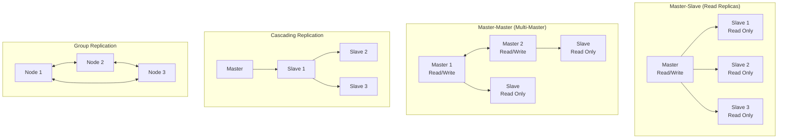

# Database Backup and Recovery

## What You'll Learn

- Backup strategies (full, incremental, differential) and when to use each
- Point-in-Time Recovery (PITR) and transaction log management
- Hot vs cold backups and their trade-offs
- Database replication architectures (master-slave, master-master, multi-master)
- Disaster recovery planning and RTO/RPO objectives
- Backup verification and recovery testing procedures
- Cloud backup strategies and tools

---

## Why This Matters

Data loss can be catastrophic for any organization. A robust backup and recovery strategy ensures:
- **Business Continuity**: Recover from hardware failures, data corruption, or disasters
- **Compliance**: Meet regulatory requirements for data retention and recovery (GDPR, HIPAA, SOX)
- **Data Integrity**: Restore to known good states and recover from logical errors
- **Availability**: Minimize downtime through replication and quick recovery
- **Audit Trail**: Maintain historical data for forensics and compliance

Organizations like GitLab have experienced major data losses that could have been prevented with proper backup strategies. Production databases require multiple layers of protection.

---

## Backup Strategies

### Types of Backups

**1. Full Backup**
```sql
-- PostgreSQL: Full database backup
pg_dump -h localhost -U postgres -d myapp -F c -b -v -f myapp_full_backup.dump

-- MySQL: Full database backup
mysqldump -u root -p --single-transaction --routines --triggers myapp > myapp_full_backup.sql

-- Backup all databases
pg_dumpall -h localhost -U postgres -f all_databases_backup.sql
```

Characteristics:
- Complete copy of entire database
- Longest backup time and largest storage requirement
- Fastest restore time (single operation)
- Baseline for incremental/differential backups
- Should be performed at regular intervals (daily, weekly)

**2. Incremental Backup**
```bash
# PostgreSQL: Continuous archiving with WAL
# postgresql.conf
wal_level = replica
archive_mode = on
archive_command = 'cp %p /backup/archive/%f'
max_wal_senders = 3

# Trigger base backup
pg_basebackup -h localhost -D /backup/base -U replication -P -v

# Only WAL files changed since last backup are archived
# Each incremental backup depends on all previous backups
```

Characteristics:
- Backs up only changes since last backup (any type)
- Smallest backup size, fastest backup time
- Slower restore (need full + all incrementals)
- Chain dependency: losing one incremental breaks recovery

**3. Differential Backup**
```python
# Python: Differential backup strategy
import subprocess
from datetime import datetime, timedelta

class BackupManager:
    def __init__(self, db_config):
        self.db_config = db_config
        self.last_full_backup = None
    
    def full_backup(self):
        """Perform full backup"""
        timestamp = datetime.now().strftime('%Y%m%d_%H%M%S')
        backup_file = f"/backup/full_{timestamp}.dump"
        
        cmd = [
            'pg_dump',
            '-h', self.db_config['host'],
            '-U', self.db_config['user'],
            '-d', self.db_config['database'],
            '-F', 'c',  # Custom format
            '-f', backup_file
        ]
        
        subprocess.run(cmd, check=True)
        self.last_full_backup = datetime.now()
        return backup_file
    
    def differential_backup(self):
        """Backup changes since last full backup"""
        if not self.last_full_backup:
            raise ValueError("No full backup exists")
        
        timestamp = datetime.now().strftime('%Y%m%d_%H%M%S')
        backup_file = f"/backup/diff_{timestamp}.dump"
        
        # Use transaction log position from last full backup
        # This backs up all changes since last full backup
        cmd = [
            'pg_dump',
            '-h', self.db_config['host'],
            '-U', self.db_config['user'],
            '-d', self.db_config['database'],
            '-F', 'c',
            '-f', backup_file,
            '--no-owner',
            '--no-acl'
        ]
        
        subprocess.run(cmd, check=True)
        return backup_file
    
    def schedule_backup(self):
        """
        Backup schedule:
        - Full backup: Sunday
        - Differential: Monday-Saturday
        """
        today = datetime.now().weekday()
        
        if today == 6:  # Sunday
            return self.full_backup()
        else:
            return self.differential_backup()
```

Characteristics:
- Backs up changes since last full backup only
- Faster backup than full, larger than incremental
- Faster restore than incremental (full + last differential)
- No chain dependency beyond the full backup

### Backup Strategy Comparison

| Strategy | Backup Time | Backup Size | Restore Time | Complexity | Use Case |
|----------|-------------|-------------|--------------|------------|----------|
| **Full** | Longest | Largest | Fastest | Simple | Small databases, weekly backups |
| **Incremental** | Shortest | Smallest | Slowest | Complex | Large databases, frequent backups |
| **Differential** | Medium | Medium | Medium | Moderate | Balanced approach, daily backups |

### Recommended Strategy

```python
# Hybrid backup strategy
class HybridBackupStrategy:
    """
    - Full backup: Weekly (Sunday)
    - Differential backup: Daily (Mon-Sat)
    - Transaction logs: Continuous archiving
    - Retention: 4 weeks of full, 1 week of differential
    """
    
    def __init__(self):
        self.retention_policy = {
            'full_backups': 28,  # days
            'differential_backups': 7,  # days
            'transaction_logs': 28  # days
        }
    
    def execute_backup(self):
        day = datetime.now().weekday()
        
        if day == 6:  # Sunday
            self.full_backup()
        else:
            self.differential_backup()
        
        # Always archive transaction logs
        self.archive_transaction_logs()
        
        # Clean up old backups
        self.cleanup_old_backups()
    
    def cleanup_old_backups(self):
        """Remove backups older than retention policy"""
        cutoff_full = datetime.now() - timedelta(days=self.retention_policy['full_backups'])
        cutoff_diff = datetime.now() - timedelta(days=self.retention_policy['differential_backups'])
        
        # Remove old full backups
        self.remove_backups_before('/backup/full_*', cutoff_full)
        
        # Remove old differential backups
        self.remove_backups_before('/backup/diff_*', cutoff_diff)
        
        # Keep transaction logs for compliance
        cutoff_logs = datetime.now() - timedelta(days=self.retention_policy['transaction_logs'])
        self.remove_backups_before('/backup/wal/*', cutoff_logs)
```

---

## Point-in-Time Recovery (PITR)

PITR allows restoring a database to any specific point in time using base backups plus transaction logs.

### PostgreSQL PITR Setup

```bash
# 1. Configure postgresql.conf
wal_level = replica
archive_mode = on
archive_command = 'test ! -f /backup/archive/%f && cp %p /backup/archive/%f'
archive_timeout = 300  # Force WAL switch every 5 minutes
max_wal_senders = 5
wal_keep_size = 1GB

# 2. Create base backup
pg_basebackup -h localhost -D /backup/base -U replication -P -v -R -X stream

# 3. Perform recovery to specific point in time
# Create recovery.conf (PostgreSQL < 12) or recovery.signal (PostgreSQL >= 12)
restore_command = 'cp /backup/archive/%f %p'
recovery_target_time = '2024-01-15 14:30:00'
recovery_target_action = 'promote'

# 4. Start PostgreSQL - it will recover to target time
pg_ctl start -D /var/lib/postgresql/data
```

### MySQL PITR Setup

```bash
# 1. Enable binary logging in my.cnf
[mysqld]
log-bin=/var/log/mysql/mysql-bin
binlog_format=ROW
expire_logs_days=7
server-id=1

# 2. Create full backup with position
mysqldump -u root -p --single-transaction --master-data=2 --routines --triggers myapp > myapp_backup.sql

# Position is recorded in backup file:
# -- CHANGE MASTER TO MASTER_LOG_FILE='mysql-bin.000003', MASTER_LOG_POS=154;

# 3. Restore backup
mysql -u root -p myapp < myapp_backup.sql

# 4. Apply binary logs up to specific time
mysqlbinlog --stop-datetime="2024-01-15 14:30:00" \
  /var/log/mysql/mysql-bin.000003 \
  /var/log/mysql/mysql-bin.000004 | mysql -u root -p myapp
```

### PITR Recovery Example

```python
import subprocess
import re
from datetime import datetime

class PITRManager:
    def __init__(self, base_backup_path, wal_archive_path):
        self.base_backup_path = base_backup_path
        self.wal_archive_path = wal_archive_path
    
    def restore_to_time(self, target_time: datetime, data_directory: str):
        """
        Restore database to specific point in time
        
        Args:
            target_time: datetime to restore to
            data_directory: PostgreSQL data directory
        """
        # 1. Stop PostgreSQL
        subprocess.run(['pg_ctl', 'stop', '-D', data_directory], check=True)
        
        # 2. Remove existing data directory
        subprocess.run(['rm', '-rf', data_directory], check=True)
        
        # 3. Restore base backup
        subprocess.run(['cp', '-r', self.base_backup_path, data_directory], check=True)
        
        # 4. Create recovery configuration
        recovery_conf = f"""
restore_command = 'cp {self.wal_archive_path}/%f %p'
recovery_target_time = '{target_time.strftime('%Y-%m-%d %H:%M:%S')}'
recovery_target_action = 'promote'
"""
        
        # PostgreSQL 12+
        with open(f'{data_directory}/recovery.signal', 'w') as f:
            f.write('')  # Create empty signal file
        
        with open(f'{data_directory}/postgresql.auto.conf', 'a') as f:
            f.write(recovery_conf)
        
        # 5. Start PostgreSQL - it will perform recovery
        subprocess.run(['pg_ctl', 'start', '-D', data_directory], check=True)
        
        print(f"Recovery to {target_time} initiated")
    
    def get_recovery_progress(self, data_directory: str):
        """Monitor recovery progress"""
        log_file = f'{data_directory}/log/postgresql.log'
        
        with open(log_file, 'r') as f:
            for line in f:
                if 'redo' in line.lower() or 'recovery' in line.lower():
                    print(line.strip())
```

### Recovery Scenarios

```sql
-- Scenario 1: Recover to before accidental DELETE
-- Incident: Deleted all orders at 2024-01-15 14:30:00
recovery_target_time = '2024-01-15 14:29:59'

-- Scenario 2: Recover to specific transaction
-- Find transaction ID from logs
recovery_target_xid = '12345678'

-- Scenario 3: Recover to WAL location
recovery_target_lsn = '0/15000000'

-- Scenario 4: Recover as far as possible
recovery_target = 'immediate'

-- Scenario 5: Recover until error
recovery_target_action = 'pause'  -- Pause at target for inspection
```

---

## Hot vs Cold Backups

### Cold Backup

Backup taken while database is shut down.

```bash
# PostgreSQL cold backup
pg_ctl stop -D /var/lib/postgresql/data
tar -czf /backup/postgres_cold_backup.tar.gz /var/lib/postgresql/data
pg_ctl start -D /var/lib/postgresql/data

# MySQL cold backup
systemctl stop mysql
tar -czf /backup/mysql_cold_backup.tar.gz /var/lib/mysql
systemctl start mysql
```

**Advantages**:
- Consistent snapshot (no transaction conflicts)
- Simple and reliable
- Fastest backup (no database overhead)
- Complete file-level backup

**Disadvantages**:
- Requires downtime ❌
- Not suitable for 24/7 applications
- Inflexible backup schedule

### Hot Backup

Backup taken while database is running.

```bash
# PostgreSQL hot backup
pg_basebackup -h localhost -D /backup/hot_backup -U replication -P -v -X stream

# MySQL hot backup (InnoDB)
mysqldump -u root -p --single-transaction --routines --triggers myapp > myapp_hot_backup.sql

# Or use Percona XtraBackup for MySQL
xtrabackup --backup --target-dir=/backup/hot_backup --user=root --password=pwd
```

**Advantages**:
- No downtime ✅
- Can run during business hours
- Flexible scheduling
- Supports continuous archiving

**Disadvantages**:
- Requires transaction log coordination
- Slightly higher overhead during backup
- More complex setup
- Potential consistency issues if not configured correctly

### Online Backup Tools

```python
# Using pg_basebackup for PostgreSQL hot backup
class HotBackupManager:
    def __init__(self, connection_config):
        self.config = connection_config
    
    def create_hot_backup(self, backup_dir: str):
        """Create hot backup using pg_basebackup"""
        cmd = [
            'pg_basebackup',
            '-h', self.config['host'],
            '-U', self.config['replication_user'],
            '-D', backup_dir,
            '-P',  # Show progress
            '-v',  # Verbose
            '-X', 'stream',  # Stream WAL
            '-c', 'fast',  # Fast checkpoint
            '-R'  # Create recovery config
        ]
        
        try:
            result = subprocess.run(
                cmd,
                check=True,
                capture_output=True,
                text=True
            )
            print(f"Hot backup created successfully: {backup_dir}")
            return True
        except subprocess.CalledProcessError as e:
            print(f"Backup failed: {e.stderr}")
            return False
    
    def verify_backup(self, backup_dir: str):
        """Verify backup integrity"""
        # Check backup_label exists
        if not os.path.exists(f'{backup_dir}/backup_label'):
            return False
        
        # Verify required files
        required_files = ['PG_VERSION', 'postgresql.conf', 'pg_hba.conf']
        for file in required_files:
            if not os.path.exists(f'{backup_dir}/{file}'):
                return False
        
        return True
```

---

## Database Replication

Replication provides real-time data redundancy and high availability.

### Master-Slave Replication (Primary-Replica)

```sql
-- PostgreSQL: Configure Primary Server
-- postgresql.conf
wal_level = replica
max_wal_senders = 10
max_replication_slots = 10
synchronous_commit = on
synchronous_standby_names = 'replica1'

-- Create replication user
CREATE USER replication_user REPLICATION LOGIN ENCRYPTED PASSWORD 'secure_password';

-- pg_hba.conf: Allow replication connections
host    replication     replication_user    replica_ip/32    md5

-- PostgreSQL: Configure Replica Server
-- Create replica using pg_basebackup
pg_basebackup -h primary_host -U replication_user -D /var/lib/postgresql/data -P -v -R

-- standby.signal file is created automatically with -R flag
-- postgresql.auto.conf will contain:
primary_conninfo = 'host=primary_host port=5432 user=replication_user password=secure_password'
```

```sql
-- MySQL: Configure Master
-- my.cnf
[mysqld]
server-id = 1
log-bin = mysql-bin
binlog_format = ROW
gtid_mode = ON
enforce_gtid_consistency = ON

-- Create replication user
CREATE USER 'replication_user'@'%' IDENTIFIED BY 'secure_password';
GRANT REPLICATION SLAVE ON *.* TO 'replication_user'@'%';

-- Get master position
SHOW MASTER STATUS;
-- Note: File=mysql-bin.000001, Position=154

-- MySQL: Configure Slave
-- my.cnf
[mysqld]
server-id = 2
relay-log = relay-bin
read_only = ON

-- Configure replication
CHANGE MASTER TO
    MASTER_HOST='master_host',
    MASTER_USER='replication_user',
    MASTER_PASSWORD='secure_password',
    MASTER_LOG_FILE='mysql-bin.000001',
    MASTER_LOG_POS=154;

-- Start replication
START SLAVE;

-- Check status
SHOW SLAVE STATUS\G
```

### Replication Monitoring

```python
import psycopg2
import mysql.connector
from typing import Dict, List

class ReplicationMonitor:
    def __init__(self, primary_config, replica_configs):
        self.primary_config = primary_config
        self.replica_configs = replica_configs
    
    def check_postgresql_replication(self) -> List[Dict]:
        """Monitor PostgreSQL replication status"""
        conn = psycopg2.connect(**self.primary_config)
        cursor = conn.cursor()
        
        # Check replication slots
        cursor.execute("""
            SELECT
                client_addr,
                state,
                sent_lsn,
                write_lsn,
                flush_lsn,
                replay_lsn,
                sync_state,
                pg_wal_lsn_diff(sent_lsn, replay_lsn) AS replication_lag_bytes
            FROM pg_stat_replication
        """)
        
        replicas = []
        for row in cursor.fetchall():
            replicas.append({
                'client_addr': row[0],
                'state': row[1],
                'sent_lsn': row[2],
                'replay_lsn': row[5],
                'sync_state': row[6],
                'lag_bytes': row[7]
            })
        
        cursor.close()
        conn.close()
        
        return replicas
    
    def check_mysql_replication(self, replica_config) -> Dict:
        """Monitor MySQL replication status"""
        conn = mysql.connector.connect(**replica_config)
        cursor = conn.cursor(dictionary=True)
        
        cursor.execute("SHOW SLAVE STATUS")
        status = cursor.fetchone()
        
        if not status:
            return {'error': 'Replication not configured'}
        
        result = {
            'slave_io_running': status['Slave_IO_Running'],
            'slave_sql_running': status['Slave_SQL_Running'],
            'seconds_behind_master': status['Seconds_Behind_Master'],
            'master_log_file': status['Master_Log_File'],
            'relay_master_log_file': status['Relay_Master_Log_File'],
            'last_error': status['Last_Error']
        }
        
        cursor.close()
        conn.close()
        
        return result
    
    def alert_on_lag(self, max_lag_seconds: int = 60):
        """Alert if replication lag exceeds threshold"""
        for replica_config in self.replica_configs:
            status = self.check_mysql_replication(replica_config)
            
            if status.get('seconds_behind_master', 0) > max_lag_seconds:
                self.send_alert(
                    f"Replication lag on {replica_config['host']}: "
                    f"{status['seconds_behind_master']} seconds"
                )
            
            if status['slave_io_running'] != 'Yes' or status['slave_sql_running'] != 'Yes':
                self.send_alert(
                    f"Replication stopped on {replica_config['host']}: "
                    f"{status.get('last_error', 'Unknown error')}"
                )
```

### Replication Architectures



### Synchronous vs Asynchronous Replication

```sql
-- PostgreSQL: Synchronous replication
-- Primary waits for replica acknowledgment before commit
synchronous_commit = on
synchronous_standby_names = 'replica1'

-- Quorum-based synchronous replication
-- Wait for any 2 out of 3 replicas
synchronous_standby_names = 'ANY 2 (replica1, replica2, replica3)'

-- Asynchronous replication (default)
-- Primary commits immediately without waiting
synchronous_commit = off
```

| Type | Durability | Performance | Use Case |
|------|------------|-------------|----------|
| **Synchronous** | High ✅ | Slower ❌ | Critical data, zero data loss |
| **Asynchronous** | Lower ❌ | Faster ✅ | Read scaling, reporting |
| **Semi-Synchronous** | Medium | Medium | Balanced approach |

---

## Disaster Recovery Planning

### Recovery Objectives

**Recovery Time Objective (RTO)**
- Maximum acceptable downtime
- Time from disaster to full recovery
- Determines backup strategy and infrastructure

**Recovery Point Objective (RPO)**
- Maximum acceptable data loss
- Time between last backup and disaster
- Determines backup frequency

```python
class DisasterRecoveryPlan:
    def __init__(self, rto_minutes: int, rpo_minutes: int):
        self.rto_minutes = rto_minutes
        self.rpo_minutes = rpo_minutes
    
    def calculate_backup_frequency(self) -> int:
        """
        Calculate required backup frequency based on RPO
        
        RPO = 0: Synchronous replication required
        RPO <= 5 min: Continuous archiving + replication
        RPO <= 1 hour: Frequent incremental backups
        RPO <= 24 hours: Daily differential backups
        """
        if self.rpo_minutes == 0:
            return "Synchronous replication with automatic failover"
        elif self.rpo_minutes <= 5:
            return "Continuous WAL archiving + streaming replication"
        elif self.rpo_minutes <= 60:
            return "Incremental backups every 15 minutes"
        else:
            return "Daily differential backups"
    
    def calculate_infrastructure_needs(self) -> Dict:
        """Determine infrastructure based on RTO"""
        if self.rto_minutes <= 5:
            # Hot standby with automatic failover
            return {
                'strategy': 'Hot Standby',
                'replicas': 2,
                'replication_type': 'synchronous',
                'failover': 'automatic',
                'load_balancer': True
            }
        elif self.rto_minutes <= 60:
            # Warm standby with manual failover
            return {
                'strategy': 'Warm Standby',
                'replicas': 1,
                'replication_type': 'asynchronous',
                'failover': 'manual',
                'backup_frequency': 'hourly'
            }
        else:
            # Cold standby with backup restore
            return {
                'strategy': 'Cold Standby',
                'replicas': 0,
                'backup_frequency': 'daily',
                'restore_time_estimate': f'{self.rto_minutes} minutes'
            }
```

### Disaster Recovery Scenarios

```python
class DisasterRecoveryScenarios:
    """Common DR scenarios and recovery procedures"""
    
    def hardware_failure(self):
        """
        Scenario: Primary database server hardware failure
        
        Recovery Steps:
        1. Detect failure (monitoring alerts)
        2. Promote replica to primary
        3. Redirect application traffic
        4. Fix/replace failed hardware
        5. Rebuild as new replica
        """
        print("Promoting replica to primary...")
        # PostgreSQL: Promote standby
        subprocess.run(['pg_ctl', 'promote', '-D', '/var/lib/postgresql/data'])
        
        # Update DNS or load balancer to point to new primary
        # self.update_dns_record('db.example.com', new_primary_ip)
    
    def data_corruption(self, corruption_time: datetime):
        """
        Scenario: Logical data corruption or accidental deletion
        
        Recovery Steps:
        1. Identify corruption time from logs
        2. Restore backup taken before corruption
        3. Apply transaction logs up to corruption time
        4. Verify data integrity
        5. Resume normal operations
        """
        print(f"Performing PITR to {corruption_time}")
        # Restore to point before corruption
        # self.pitr_manager.restore_to_time(corruption_time, data_dir)
    
    def datacenter_failure(self):
        """
        Scenario: Complete datacenter outage
        
        Recovery Steps:
        1. Activate DR site
        2. Restore latest backup
        3. Configure networking
        4. Verify data integrity
        5. Switch application to DR site
        """
        print("Activating disaster recovery site...")
        # Switch to geographically distant backup site
        # self.activate_dr_site()
    
    def ransomware_attack(self, last_known_good_time: datetime):
        """
        Scenario: Ransomware encryption of database
        
        Recovery Steps:
        1. Isolate infected systems
        2. Verify backup integrity
        3. Restore from clean backup
        4. Scan for malware
        5. Update security measures
        """
        print("Restoring from pre-infection backup...")
        # Restore from backup taken before ransomware
        # self.restore_clean_backup(last_known_good_time)
```

### Multi-Region Disaster Recovery

```yaml
# AWS Multi-Region DR Setup
disaster_recovery:
  primary_region: us-east-1
  dr_region: us-west-2
  
  rto: 15 minutes
  rpo: 5 minutes
  
  architecture:
    primary:
      - RDS Multi-AZ deployment
      - Automated backups every 5 minutes
      - Point-in-time recovery enabled
      - Read replicas in same region
    
    dr_site:
      - Cross-region read replica
      - Automated snapshots
      - Separate VPC and security groups
      - Can be promoted to primary
  
  failover_procedure:
    - automated_health_checks: true
    - dns_update_on_failover: true
    - application_connection_retry: true
    - manual_approval_required: false
```

---

## Backup Verification and Testing

### Backup Verification

```python
class BackupVerification:
    def verify_backup_integrity(self, backup_file: str) -> bool:
        """Verify backup file is not corrupted"""
        # Check file exists and is readable
        if not os.path.exists(backup_file):
            return False
        
        # Verify file size is reasonable
        file_size = os.path.getsize(backup_file)
        if file_size < 1024:  # Less than 1KB is suspicious
            return False
        
        # For compressed backups, test decompression
        if backup_file.endswith('.gz'):
            try:
                subprocess.run(['gzip', '-t', backup_file], check=True)
            except subprocess.CalledProcessError:
                return False
        
        # For PostgreSQL custom format, use pg_restore --list
        if backup_file.endswith('.dump'):
            try:
                result = subprocess.run(
                    ['pg_restore', '--list', backup_file],
                    capture_output=True,
                    check=True
                )
                # Should list tables and data
                if len(result.stdout) < 100:
                    return False
            except subprocess.CalledProcessError:
                return False
        
        return True
    
    def test_restore(self, backup_file: str, test_db: str) -> bool:
        """
        Perform test restore to verify backup can be restored
        
        This should be done regularly (monthly) to ensure backups are valid
        """
        try:
            # Create test database
            subprocess.run(['createdb', test_db], check=True)
            
            # Restore backup to test database
            subprocess.run(
                ['pg_restore', '-d', test_db, backup_file],
                check=True
            )
            
            # Verify basic functionality
            conn = psycopg2.connect(database=test_db)
            cursor = conn.cursor()
            
            # Check table count
            cursor.execute("""
                SELECT COUNT(*) 
                FROM information_schema.tables 
                WHERE table_schema = 'public'
            """)
            table_count = cursor.fetchone()[0]
            
            if table_count == 0:
                return False
            
            # Check row counts in major tables
            cursor.execute("""
                SELECT table_name 
                FROM information_schema.tables 
                WHERE table_schema = 'public' 
                LIMIT 5
            """)
            
            for table in cursor.fetchall():
                cursor.execute(f"SELECT COUNT(*) FROM {table[0]}")
                row_count = cursor.fetchone()[0]
                print(f"Table {table[0]}: {row_count} rows")
            
            cursor.close()
            conn.close()
            
            # Cleanup test database
            subprocess.run(['dropdb', test_db], check=True)
            
            return True
            
        except Exception as e:
            print(f"Test restore failed: {e}")
            return False
```

### Recovery Testing Schedule

```python
class RecoveryTestingSchedule:
    """
    Regular testing ensures recovery procedures work when needed
    """
    
    def monthly_full_restore_test(self):
        """
        Test 1: Full Restore Test (Monthly)
        - Restore latest full backup to test environment
        - Verify all data is present
        - Test application connectivity
        - Document restore time
        """
        start_time = datetime.now()
        
        success = self.backup_verification.test_restore(
            '/backup/latest_full.dump',
            'test_restore_db'
        )
        
        end_time = datetime.now()
        restore_duration = (end_time - start_time).total_seconds()
        
        print(f"Full restore test: {'PASSED' if success else 'FAILED'}")
        print(f"Restore duration: {restore_duration} seconds")
        
        # Document results
        self.log_test_result('full_restore', success, restore_duration)
    
    def quarterly_pitr_test(self):
        """
        Test 2: Point-in-Time Recovery Test (Quarterly)
        - Insert test data with known timestamp
        - Perform PITR to point before insertion
        - Verify test data is not present
        - Perform PITR to point after insertion
        - Verify test data is present
        """
        # This validates transaction log archiving works correctly
        pass
    
    def biannual_dr_failover_test(self):
        """
        Test 3: Disaster Recovery Failover Test (Every 6 months)
        - Simulate primary datacenter failure
        - Activate DR site
        - Redirect application traffic
        - Verify application functionality
        - Document failover time
        - Fail back to primary
        """
        pass
    
    def annual_full_dr_drill(self):
        """
        Test 4: Full DR Drill (Annually)
        - Notify all stakeholders
        - Simulate complete disaster
        - Execute full recovery procedure
        - Involve all teams (Dev, Ops, Management)
        - Document lessons learned
        - Update DR procedures
        """
        pass
```

---

## Cloud Backup Strategies

### AWS RDS Automated Backups

```python
import boto3

class AWSBackupManager:
    def __init__(self):
        self.rds = boto3.client('rds')
    
    def configure_automated_backups(self, db_instance_id: str):
        """Configure RDS automated backups"""
        response = self.rds.modify_db_instance(
            DBInstanceIdentifier=db_instance_id,
            BackupRetentionPeriod=35,  # days (max 35)
            PreferredBackupWindow='03:00-04:00',  # UTC
            CopyTagsToSnapshot=True,
            EnableCloudwatchLogsExports=['postgresql']
        )
        return response
    
    def create_manual_snapshot(self, db_instance_id: str, snapshot_id: str):
        """Create manual snapshot for long-term retention"""
        response = self.rds.create_db_snapshot(
            DBSnapshotIdentifier=snapshot_id,
            DBInstanceIdentifier=db_instance_id,
            Tags=[
                {'Key': 'Type', 'Value': 'Manual'},
                {'Key': 'Purpose', 'Value': 'Long-term retention'}
            ]
        )
        return response
    
    def restore_from_snapshot(self, snapshot_id: str, new_instance_id: str):
        """Restore database from snapshot"""
        response = self.rds.restore_db_instance_from_db_snapshot(
            DBInstanceIdentifier=new_instance_id,
            DBSnapshotIdentifier=snapshot_id,
            DBInstanceClass='db.t3.medium',
            MultiAZ=False,  # Single-AZ for test/dev
            PubliclyAccessible=False
        )
        return response
    
    def restore_to_point_in_time(self, source_instance: str, 
                                   target_instance: str, 
                                   restore_time: datetime):
        """Restore to specific point in time"""
        response = self.rds.restore_db_instance_to_point_in_time(
            SourceDBInstanceIdentifier=source_instance,
            TargetDBInstanceIdentifier=target_instance,
            RestoreTime=restore_time,
            UseLatestRestorableTime=False
        )
        return response
```

### Multi-Cloud Backup Strategy

```python
class MultiCloudBackup:
    """
    Backup strategy across multiple cloud providers
    for maximum redundancy
    """
    
    def __init__(self):
        self.aws_s3 = boto3.client('s3')
        # self.azure_blob = BlobServiceClient(...)
        # self.gcp_storage = storage.Client(...)
    
    def backup_to_multiple_clouds(self, backup_file: str):
        """
        Upload backup to multiple cloud providers
        
        Strategy: 3-2-1 Rule
        - 3 copies of data
        - 2 different storage types
        - 1 offsite backup
        """
        # Upload to AWS S3
        self.aws_s3.upload_file(
            backup_file,
            'my-backup-bucket',
            f'backups/{os.path.basename(backup_file)}'
        )
        
        # Upload to Azure Blob Storage
        # self.upload_to_azure(backup_file)
        
        # Upload to Google Cloud Storage
        # self.upload_to_gcp(backup_file)
        
        # Keep local copy on different disk
        subprocess.run([
            'cp', backup_file, '/backup/offsite/'
        ])
```

---

## Best Practices

### Backup Strategy

✅ **Implement 3-2-1 Rule**
```
3 copies of data (original + 2 backups)
2 different storage media (disk, tape, cloud)
1 offsite backup (different location)
```

✅ **Automate Backup Process**
```bash
# Cron job for automated backups
0 2 * * 0 /scripts/full_backup.sh       # Weekly full backup
0 2 * * 1-6 /scripts/diff_backup.sh     # Daily differential
*/15 * * * * /scripts/archive_wal.sh    # Continuous WAL archiving
```

✅ **Encrypt Backups**
```bash
# PostgreSQL: Encrypt backup with GPG
pg_dump myapp | gzip | gpg --encrypt --recipient admin@company.com > backup.sql.gz.gpg

# MySQL: Encrypt with OpenSSL
mysqldump myapp | openssl enc -aes-256-cbc -salt -pbkdf2 > backup.sql.enc
```

✅ **Test Restores Regularly**
- Monthly full restore tests
- Quarterly PITR tests
- Annual disaster recovery drills

✅ **Monitor Backup Success**
```python
def monitor_backup_health():
    checks = [
        'Last backup completed successfully',
        'Backup file size reasonable',
        'Backup age < 24 hours',
        'Transaction log archiving working',
        'Sufficient storage space',
        'Replication lag < threshold'
    ]
    # Alert if any check fails
```

✅ **Document Recovery Procedures**
- Step-by-step recovery runbooks
- Contact information for stakeholders
- RTO/RPO commitments
- Escalation procedures

✅ **Use Immutable Backups**
```python
# S3: Enable object lock for immutable backups
s3_client.put_object_lock_configuration(
    Bucket='backup-bucket',
    ObjectLockConfiguration={
        'ObjectLockEnabled': 'Enabled',
        'Rule': {
            'DefaultRetention': {
                'Mode': 'COMPLIANCE',  # Cannot be deleted
                'Days': 365
            }
        }
    }
)
```

### Replication Best Practices

✅ **Monitor Replication Lag**
```sql
-- Alert if lag > 60 seconds
SELECT
    client_addr,
    pg_wal_lsn_diff(pg_current_wal_lsn(), replay_lsn) AS lag_bytes,
    EXTRACT(EPOCH FROM (now() - pg_last_xact_replay_timestamp())) AS lag_seconds
FROM pg_stat_replication;
```

✅ **Use Synchronous Replication for Critical Data**
```sql
-- Ensure zero data loss for transactions
synchronous_commit = on
synchronous_standby_names = 'ANY 1 (replica1, replica2)'
```

✅ **Implement Automatic Failover**
```yaml
# Use tools like Patroni, repmgr, or cloud-native solutions
patroni:
  scope: postgres-cluster
  name: node1
  restapi:
    listen: 0.0.0.0:8008
  postgresql:
    data_dir: /var/lib/postgresql/data
    parameters:
      synchronous_commit: "on"
```

---

## Anti-Patterns

❌ **Not Testing Backups**
```python
# BAD: Create backups but never verify they work
def backup_database():
    create_backup()
    # Never tested - backup might be corrupted
```
- Backups are worthless if they can't be restored
- Test restore procedures regularly

❌ **Single Backup Location**
```python
# BAD: Store all backups on same server as database
BACKUP_DIR = '/var/lib/postgresql/backups'  # Same disk!
```
- Hardware failure destroys both database and backups
- Use offsite/cloud storage

❌ **No Backup Retention Policy**
```bash
# BAD: Keep all backups forever
# /backup/ grows infinitely, runs out of space
```
- Define retention periods (e.g., 30 days)
- Implement automatic cleanup

❌ **Ignoring Replication Lag**
```python
# BAD: Never monitor replication status
# Replica falls behind, useless for failover
```
- Monitor lag continuously
- Alert when lag exceeds threshold

❌ **No Documentation**
```python
# BAD: Complex recovery procedure only in your head
# You're on vacation when disaster strikes
```
- Document all procedures
- Train multiple team members

❌ **Unencrypted Backups**
```bash
# BAD: Store sensitive data unencrypted
mysqldump users > /backup/users.sql  # Plain text passwords!
```
- Always encrypt backups at rest and in transit
- Use strong encryption algorithms

❌ **Relying Only on Replication**
```python
# BAD: Replication is not a backup
# Logical errors (DROP TABLE) replicate to all nodes
```
- Replication protects against hardware failure
- Backups protect against logical errors
- Need both

---

## Summary

**Key Takeaways**:

1. **Backup Strategy**: Use hybrid approach (full + differential + continuous archiving)
2. **Testing**: Regular recovery testing is essential
3. **RTO/RPO**: Define objectives and design infrastructure accordingly
4. **Replication**: Provides high availability, not a replacement for backups
5. **Automation**: Automate backups, verification, and monitoring
6. **3-2-1 Rule**: 3 copies, 2 media types, 1 offsite
7. **PITR**: Enable for granular recovery options
8. **Documentation**: Maintain up-to-date recovery procedures

**Recovery Hierarchy**:
1. Replication failover (fastest, RPO ~0)
2. Point-in-time recovery (medium speed, RPO ~minutes)
3. Differential backup restore (slower, RPO ~hours)
4. Full backup restore (slowest, RPO ~day)

Production databases require defense in depth: replication for availability, continuous archiving for recent recovery, and regular backups for long-term protection.
