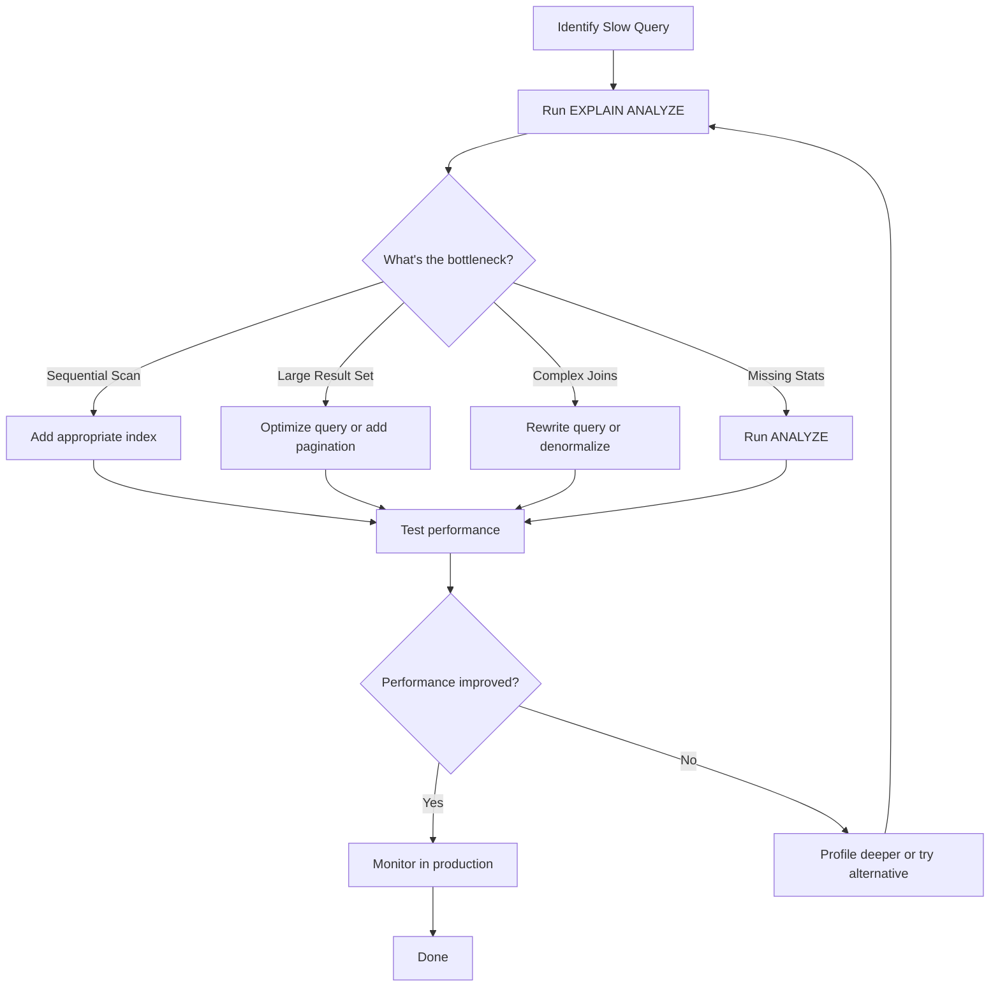

# Database Management Systems (DBMS)

Comprehensive senior-level notes on database systems, covering fundamentals through advanced concepts.

## Contents

### Core Concepts

1. **[DBMS Fundamentals](01-dbms-fundamentals.md)**
   - Database models (Relational, Hierarchical, Network, Document, Object-Oriented)
   - DBMS architecture and components
   - Three-schema architecture and data independence
   - Storage structures (Heap, Sequential, Hash files)
   - Buffer management and replacement policies
   - Query processor and storage manager components

2. **[Transactions and ACID Properties](02-transactions-acid.md)**
   - Transaction lifecycle and states
   - ACID properties in depth (Atomicity, Consistency, Isolation, Durability)
   - Isolation levels (Read Uncommitted, Read Committed, Repeatable Read, Serializable)
   - Concurrency problems (Dirty reads, Non-repeatable reads, Phantom reads, Lost updates)
   - Write-ahead logging and recovery
   - Savepoints and nested transactions
   - Transaction implementation patterns

3. **[Indexing and Database Performance](03-indexing.md)**
   - Index structures (B-Tree, B+ Tree, Hash, Bitmap)
   - Composite indexes and leftmost prefix rule
   - Covering indexes for query optimization
   - Full-text search indexes
   - Spatial indexes for geographic data
   - Index selection strategies
   - Index maintenance and monitoring
   - Performance trade-offs

4. **[Database Normalization](04-normalization.md)**
   - Functional dependencies and Armstrong's axioms
   - Database anomalies (Insertion, Update, Deletion)
   - Normal forms (1NF through 5NF, BCNF)
   - Normalization process with examples
   - When to denormalize for performance
   - Denormalization strategies
   - Materialized views and summary tables

5. **[Query Optimization](05-query-optimization.md)**
   - Query execution plans and how to read them
   - Cost-based vs rule-based optimization
   - Join algorithms (Nested Loop, Hash Join, Merge Join)
   - Query rewriting techniques
   - Predicate pushdown and subquery flattening
   - Index selection for queries
   - Statistics and cardinality estimation
   - Query performance best practices

6. **[Concurrency Control and Locking](06-concurrency-control.md)**
   - Lock types (Shared, Exclusive, Intent locks)
   - Two-Phase Locking protocol (2PL)
   - Deadlock detection and prevention
   - Multi-Version Concurrency Control (MVCC)
   - Optimistic vs Pessimistic locking
   - Lock granularity and performance trade-offs
   - Distributed locking mechanisms

7. **[SQL Advanced Concepts](07-sql-advanced-concepts.md)**
   - Window functions (RANK, ROW_NUMBER, LAG, LEAD)
   - Common Table Expressions (CTEs) and recursive queries
   - LATERAL joins for correlated subqueries
   - JSON and JSONB operations
   - Stored procedures and functions
   - Triggers and their use cases
   - Dynamic SQL and security considerations

8. **[Database Backup and Recovery](08-backup-recovery.md)**
   - Backup strategies (Full, Incremental, Differential)
   - Point-in-Time Recovery (PITR)
   - Hot vs Cold backups
   - Database replication architectures
   - Disaster recovery planning (RTO/RPO)
   - Backup verification and testing
   - Cloud backup strategies

## Quick Reference

### When to Use Different Database Models

| Use Case | Recommended Model | Examples |
|----------|------------------|----------|
| Transactional systems with complex relationships | Relational | PostgreSQL, MySQL, Oracle |
| Flexible schema, high write throughput | Document | MongoDB, CouchDB |
| Graph relationships, social networks | Graph | Neo4j, Amazon Neptune |
| Time-series data, IoT sensors | Time-Series | InfluxDB, TimescaleDB |
| High-performance caching | Key-Value | Redis, Memcached |

### Normalization Quick Guide

| Normal Form | Key Rule | Example Violation |
|-------------|----------|-------------------|
| 1NF | Atomic values only | Comma-separated list in column |
| 2NF | No partial dependencies | Non-key column depends on part of composite key |
| 3NF | No transitive dependencies | Non-key column depends on another non-key column |
| BCNF | Every determinant is a superkey | Non-superkey determines part of key |
| 4NF | No multi-valued dependencies | Independent facts in same table |

### Index Selection Guide

```sql
-- Equality queries: B-Tree or Hash
CREATE INDEX idx_email ON users(email);
SELECT * FROM users WHERE email = 'user@example.com';

-- Range queries: B-Tree only
CREATE INDEX idx_created_at ON orders(created_at);
SELECT * FROM orders WHERE created_at > '2024-01-01';

-- Composite index: Order matters
CREATE INDEX idx_composite ON table(equality_col, range_col, sort_col);
SELECT * FROM table 
WHERE equality_col = ? AND range_col > ?
ORDER BY sort_col;

-- Covering index: Include all needed columns
CREATE INDEX idx_covering ON table(filter_col) 
INCLUDE (select_col1, select_col2);
SELECT select_col1, select_col2 
FROM table WHERE filter_col = ?;
```

### Transaction Isolation Levels

| Level | Dirty Read | Non-Repeatable Read | Phantom Read | Use Case |
|-------|-----------|---------------------|--------------|----------|
| Read Uncommitted | Possible | Possible | Possible | Analytics (rarely used) |
| Read Committed | ✅ Prevented | Possible | Possible | Most web applications |
| Repeatable Read | ✅ Prevented | ✅ Prevented | Possible | Financial reporting |
| Serializable | ✅ Prevented | ✅ Prevented | ✅ Prevented | Critical financial transactions |

### Query Optimization Checklist

✅ **Do:**
- Use appropriate indexes on filter columns
- Select only needed columns (avoid SELECT *)
- Use covering indexes where possible
- Keep statistics up to date with ANALYZE
- Use EXPLAIN ANALYZE to understand query plans
- Partition large tables by date or key ranges
- Use connection pooling
- Batch operations when possible

❌ **Avoid:**
- Functions on indexed columns in WHERE clauses
- SELECT * in production code
- N+1 query problems
- Correlated subqueries (use JOINs instead)
- OR conditions with different columns
- Missing indexes on foreign keys
- Over-indexing (too many indexes)

## Performance Tuning Workflow



## Common Patterns

### Read-Heavy vs Write-Heavy Optimization

**Read-Heavy Workloads:**
```sql
-- More indexes for faster reads
CREATE INDEX idx_category ON products(category_id);
CREATE INDEX idx_price ON products(price);
CREATE INDEX idx_rating ON products(rating DESC);

-- Denormalization for faster queries
ALTER TABLE products ADD COLUMN review_count INT;
ALTER TABLE products ADD COLUMN avg_rating DECIMAL(3, 2);

-- Materialized views for complex aggregations
CREATE MATERIALIZED VIEW product_stats AS
SELECT category_id, COUNT(*) as product_count, AVG(price) as avg_price
FROM products GROUP BY category_id;
```

**Write-Heavy Workloads:**
```sql
-- Fewer indexes to reduce write overhead
CREATE INDEX idx_primary_lookup ON orders(order_id, customer_id);

-- Partition to distribute writes
CREATE TABLE orders (...) PARTITION BY RANGE (order_date);

-- Batch inserts
INSERT INTO orders (order_id, customer_id, order_date)
VALUES 
    (1, 101, '2024-01-01'),
    (2, 102, '2024-01-01'),
    (3, 103, '2024-01-01');
```

### OLTP vs OLAP Schema Design

**OLTP (Normalized):**
```sql
-- Normalized for data integrity
CREATE TABLE orders (
    order_id BIGINT PRIMARY KEY,
    customer_id BIGINT REFERENCES customers(customer_id),
    order_date TIMESTAMP,
    total_amount DECIMAL(12, 2)
);

CREATE TABLE order_items (
    order_id BIGINT REFERENCES orders(order_id),
    product_id BIGINT REFERENCES products(product_id),
    quantity INT,
    unit_price DECIMAL(10, 2),
    PRIMARY KEY (order_id, product_id)
);
```

**OLAP (Denormalized/Star Schema):**
```sql
-- Fact table with denormalized dimensions
CREATE TABLE fact_sales (
    sale_id BIGINT PRIMARY KEY,
    date_key INT,
    product_key INT,
    customer_key INT,
    store_key INT,
    -- Measures
    quantity INT,
    revenue DECIMAL(12, 2),
    cost DECIMAL(12, 2),
    profit DECIMAL(12, 2)
);

-- Small dimension tables
CREATE TABLE dim_date (
    date_key INT PRIMARY KEY,
    full_date DATE,
    year INT,
    quarter INT,
    month INT,
    day_of_week INT
);
```

## Database Selection Guide

### Choosing the Right Database

```python
def choose_database(requirements):
    """Decision framework for database selection"""
    
    if requirements.needs_complex_transactions:
        if requirements.structured_data:
            return "Relational DB (PostgreSQL, MySQL)"
        else:
            return "Multi-model DB with ACID (MongoDB with transactions)"
    
    elif requirements.needs_graph_queries:
        return "Graph DB (Neo4j, Amazon Neptune)"
    
    elif requirements.needs_high_write_throughput:
        if requirements.eventually_consistent_ok:
            return "NoSQL (Cassandra, DynamoDB)"
        else:
            return "Distributed SQL (CockroachDB, YugabyteDB)"
    
    elif requirements.needs_full_text_search:
        return "Search Engine (Elasticsearch, Solr) + Primary DB"
    
    elif requirements.needs_time_series:
        return "Time-Series DB (InfluxDB, TimescaleDB)"
    
    elif requirements.needs_caching:
        return "In-Memory Cache (Redis, Memcached)"
    
    else:
        return "PostgreSQL (best all-around choice)"
```

## Resources for Further Learning

### Books
- "Database Internals" by Alex Petrov
- "Designing Data-Intensive Applications" by Martin Kleppmann
- "SQL Performance Explained" by Markus Winand
- "High Performance MySQL" by Baron Schwartz

### Online Resources
- PostgreSQL Documentation: https://www.postgresql.org/docs/
- MySQL Documentation: https://dev.mysql.com/doc/
- Use The Index, Luke: https://use-the-index-luke.com/
- Database Internals Blog: https://www.databass.dev/

### Tools
- **Explain Visualizers:** 
  - https://explain.depesz.com/ (PostgreSQL)
  - https://www.pgexplain.dev/ (PostgreSQL)
- **Monitoring:**
  - pg_stat_statements (PostgreSQL)
  - Performance Schema (MySQL)
  - pgAdmin, DBeaver, DataGrip

## Practice Exercises

### Exercise 1: Schema Design
Design a normalized schema for a library management system with books, authors, members, and borrowing records. Include appropriate indexes.

### Exercise 2: Query Optimization
Given a slow query, identify bottlenecks using EXPLAIN ANALYZE and propose optimizations (indexes, query rewriting, denormalization).

### Exercise 3: Transaction Design
Implement a banking transfer with proper ACID guarantees, handling concurrent access and potential failures.

### Exercise 4: Index Strategy
For an e-commerce product catalog with 10M products, design an indexing strategy for:
- Browse by category
- Search by name/description
- Filter by price range
- Sort by rating

### Exercise 5: Normalization vs Denormalization
Compare normalized vs denormalized approaches for a social media feed aggregation system. Analyze trade-offs.

## Contributing

These notes are continuously updated. If you find errors or have suggestions for improvements, please contribute!

---

**Last Updated:** January 2026
**Difficulty Level:** Senior Engineer
**Prerequisites:** Basic SQL, Database Fundamentals
