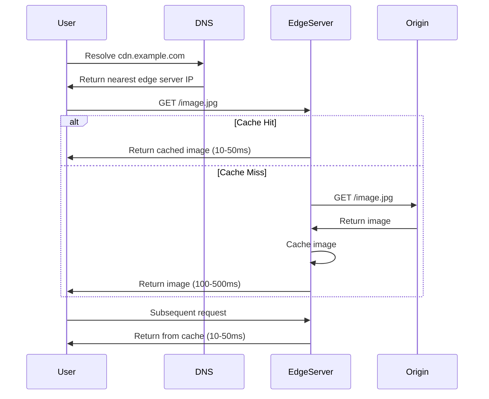

# Content Delivery Networks (CDN)

## What You'll Learn

Content Delivery Networks distribute content across geographically dispersed servers to reduce latency, improve performance, and handle massive traffic spikes. This note covers CDN architecture, caching strategies, edge computing, and real-world implementations at scale.

## Why This Matters

Modern web applications serve users globally. A user in Tokyo accessing a server in Virginia experiences 200+ milliseconds of latency just from network round-trips. CDNs solve this by caching content at edge locations near users. Netflix streams 250 million hours of video daily using CDNs. CloudFlare handles 46 million HTTP requests per second. Understanding CDNs is essential for building performant global applications.

## CDN Architecture

A CDN consists of multiple Points of Presence (PoPs) distributed globally, each containing edge servers that cache and serve content. When a user requests content, DNS resolution directs them to the nearest PoP. The edge server checks if it has cached content. On a cache hit, it serves immediately. On a cache miss, it fetches from the origin server, caches it, and serves it to the user.

### Core Components

**Edge Servers**: Distributed servers that cache and serve content. These run in data centers close to users, typically in major cities worldwide. A CDN provider might have 200+ PoPs globally. Edge servers contain high-speed storage (SSDs or NVMe) and substantial RAM for caching.

**Origin Server**: The authoritative source of content. This is your application server or storage system that contains the original files. Edge servers fetch from the origin when content isn't cached. The CDN shields the origin from most traffic.

**DNS Resolution**: CDN providers use GeoDNS to direct users to the nearest edge server. When a user resolves `cdn.example.com`, the DNS response contains the IP address of a nearby edge server, not the origin. This happens transparently to the application.

**Cache Storage**: Edge servers use tiered storage. Hot content stays in RAM for microsecond access times. Warm content lives on SSD for millisecond access. Cold content may be purged or stored on slower disks. Storage capacity varies but edge servers typically have terabytes of cache.

**Load Balancers**: Each PoP contains multiple edge servers behind load balancers. This provides redundancy and distributes load across servers within the PoP. If one edge server fails, others handle requests seamlessly.

### Request Flow

When a user in London requests `https://cdn.example.com/images/photo.jpg`:

1. **DNS Resolution**: The user's browser queries DNS for `cdn.example.com`. GeoDNS returns the IP of an edge server in London.

2. **Edge Server Check**: The browser sends an HTTP GET request to the London edge server. The server checks its cache for `/images/photo.jpg`.

3. **Cache Hit**: If cached and not expired, the edge server returns the content immediately. Response time is typically 10-50 milliseconds.

4. **Cache Miss**: If not cached, the edge server requests the file from the origin server. This may take 100-500 milliseconds depending on origin location.

5. **Origin Response**: The origin server returns the content. The edge server caches it according to cache headers and forwards it to the user.

6. **Subsequent Requests**: Future requests for the same file from users near London are served from cache without touching the origin.



## Caching Strategies

### Cache Control Headers

HTTP cache control headers determine how CDNs cache content. The origin server sends these headers to instruct edge servers.

```http
# Static assets: cache for 1 year
Cache-Control: public, max-age=31536000, immutable

# HTML pages: cache but revalidate
Cache-Control: public, max-age=3600, must-revalidate

# Private data: do not cache
Cache-Control: private, no-cache, no-store

# API responses: cache for 5 minutes
Cache-Control: public, max-age=300, s-maxage=300
```

**max-age**: Specifies how long content is fresh in seconds. After this time, it's considered stale.

**s-maxage**: Shared cache max-age, specifically for CDNs and proxy caches. Overrides max-age for shared caches.

**public**: Content can be cached by CDNs and browsers even if it contains authorization headers.

**private**: Content is user-specific and should only be cached by browsers, not CDNs.

**immutable**: Content never changes. Browsers and CDNs don't need to revalidate.

**must-revalidate**: When stale, caches must revalidate with origin before serving.

### Cache Key Design

Cache keys uniquely identify cached objects. By default, the cache key is the full URL. However, CDNs allow customizing cache keys to improve hit rates.

```javascript
// CloudFlare Worker: Custom cache key
addEventListener('fetch', event => {
    event.respondWith(handleRequest(event.request));
});

async function handleRequest(request) {
    const url = new URL(request.url);
    
    // Remove query parameters that don't affect response
    // Keep version but ignore analytics parameters
    const relevantParams = new URLSearchParams();
    if (url.searchParams.has('v')) {
        relevantParams.set('v', url.searchParams.get('v'));
    }
    
    // Custom cache key excludes utm_* parameters
    const cacheKey = `${url.origin}${url.pathname}?${relevantParams.toString()}`;
    
    // Check cache
    const cache = caches.default;
    let response = await cache.match(cacheKey);
    
    if (response) {
        console.log('Cache hit');
        return response;
    }
    
    // Cache miss - fetch from origin
    console.log('Cache miss');
    response = await fetch(request);
    
    // Cache response if successful
    if (response.ok) {
        // Clone response because body can only be read once
        const responseToCache = response.clone();
        event.waitUntil(cache.put(cacheKey, responseToCache));
    }
    
    return response;
}
```

Ignoring irrelevant query parameters increases cache hit rates. Two URLs differing only in analytics parameters can share a cached response.

### Cache Invalidation

When content changes at the origin, cached copies at edge servers become stale. CDNs provide mechanisms to invalidate cached content.

**Purge**: Immediately removes content from all edge servers. Use for urgent updates or sensitive data removal. Expensive operation that touches all PoPs.

**Soft Purge**: Marks content as stale but keeps it in cache. Edge servers revalidate with origin before serving. If origin returns 304 Not Modified, edge servers serve cached content. This reduces origin load compared to hard purges.

**Time-Based Invalidation**: Content expires naturally based on Cache-Control headers. This is the most efficient approach. For frequently changing content, use short TTLs.

**Versioned URLs**: Embed version identifiers in URLs: `/styles.css?v=2.0.1` or `/styles.v2.0.1.css`. When content changes, change the URL. Old versions remain cached; new versions are separate cache entries. This provides instant updates without purging.

```python
# Python: CDN purge with Cloudflare API
import requests

class CloudflareCDN:
    def __init__(self, zone_id, api_token):
        self.zone_id = zone_id
        self.api_token = api_token
        self.base_url = 'https://api.cloudflare.com/client/v4'
    
    def purge_files(self, files):
        """Purge specific files from CDN cache"""
        url = f'{self.base_url}/zones/{self.zone_id}/purge_cache'
        
        headers = {
            'Authorization': f'Bearer {self.api_token}',
            'Content-Type': 'application/json'
        }
        
        data = {
            'files': files
        }
        
        response = requests.post(url, json=data, headers=headers)
        
        if response.status_code == 200:
            print(f'Successfully purged {len(files)} files')
        else:
            print(f'Purge failed: {response.text}')
        
        return response.json()
    
    def purge_tags(self, tags):
        """Purge content by cache tags"""
        url = f'{self.base_url}/zones/{self.zone_id}/purge_cache'
        
        headers = {
            'Authorization': f'Bearer {self.api_token}',
            'Content-Type': 'application/json'
        }
        
        data = {
            'tags': tags
        }
        
        response = requests.post(url, json=data, headers=headers)
        return response.json()
    
    def purge_everything(self):
        """Purge entire cache - use sparingly"""
        url = f'{self.base_url}/zones/{self.zone_id}/purge_cache'
        
        headers = {
            'Authorization': f'Bearer {self.api_token}',
            'Content-Type': 'application/json'
        }
        
        data = {
            'purge_everything': True
        }
        
        response = requests.post(url, json=data, headers=headers)
        return response.json()

# Usage
cdn = CloudflareCDN(
    zone_id='your_zone_id',
    api_token='your_api_token'
)

# Purge specific files
cdn.purge_files([
    'https://example.com/styles.css',
    'https://example.com/script.js'
])

# Purge by tag (requires Cache-Tag headers)
cdn.purge_tags(['product-123', 'category-electronics'])
```

### Cache Tagging

Cache tags enable purging related content without listing every URL. The origin server sets `Cache-Tag` headers identifying content categories. When a category changes, purge by tag to invalidate all related content.

```java
// Java Spring: Set cache tags for CDN
@RestController
public class ProductController {
    
    @GetMapping("/products/{id}")
    public ResponseEntity<Product> getProduct(@PathVariable Long id) {
        Product product = productService.findById(id);
        
        // Set cache control
        CacheControl cacheControl = CacheControl
            .maxAge(1, TimeUnit.HOURS)
            .cachePublic();
        
        // Set cache tags for purging
        HttpHeaders headers = new HttpHeaders();
        headers.setCacheControl(cacheControl.getHeaderValue());
        
        // Tag with product ID and category
        headers.add("Cache-Tag", 
            String.format("product-%d,category-%d", 
                product.getId(), 
                product.getCategoryId())
        );
        
        return ResponseEntity
            .ok()
            .headers(headers)
            .body(product);
    }
    
    @PutMapping("/products/{id}")
    public ResponseEntity<Product> updateProduct(
            @PathVariable Long id,
            @RequestBody Product product) {
        
        Product updated = productService.update(id, product);
        
        // Purge CDN cache for this product
        cdnService.purgeByTag("product-" + id);
        
        return ResponseEntity.ok(updated);
    }
    
    @PutMapping("/categories/{id}")
    public ResponseEntity<Category> updateCategory(
            @PathVariable Long id,
            @RequestBody Category category) {
        
        Category updated = categoryService.update(id, category);
        
        // Purge all products in this category
        cdnService.purgeByTag("category-" + id);
        
        return ResponseEntity.ok(updated);
    }
}
```

## Edge Computing

Edge computing runs application logic at CDN edge servers, closer to users. This goes beyond simple caching to execute code at the edge.

### Use Cases

**Request Modification**: Add, remove, or modify headers. Implement authentication at the edge. Redirect users based on geography or device type.

**Response Transformation**: Convert image formats. Resize images on-the-fly. Minify CSS/JS. Compress responses.

**A/B Testing**: Route users to different backends based on cookies or randomization. This happens at the edge without touching origin servers.

**Bot Detection**: Block malicious bots at the edge before they reach origin servers. Use request patterns and behavior analysis.

**API Gateway**: Aggregate multiple backend APIs into a single endpoint. Handle rate limiting and authentication at the edge.

```javascript
// Cloudflare Worker: Edge computing examples
addEventListener('fetch', event => {
    event.respondWith(handleRequest(event.request));
});

async function handleRequest(request) {
    const url = new URL(request.url);
    
    // 1. Geographic routing
    const country = request.cf.country;
    if (country === 'CN') {
        // Route Chinese users to specific backend
        return fetch('https://china-origin.example.com' + url.pathname);
    }
    
    // 2. Device detection and image optimization
    if (url.pathname.match(/\.(jpg|png|webp)$/)) {
        return optimizeImage(request);
    }
    
    // 3. A/B testing
    if (url.pathname === '/') {
        return abTest(request);
    }
    
    // 4. Bot detection
    if (isBot(request)) {
        return new Response('Forbidden', { status: 403 });
    }
    
    // Default: proxy to origin
    return fetch(request);
}

async function optimizeImage(request) {
    const url = new URL(request.url);
    
    // Check if browser supports WebP
    const accept = request.headers.get('Accept') || '';
    const supportsWebP = accept.includes('image/webp');
    
    // Get device type
    const userAgent = request.headers.get('User-Agent') || '';
    const isMobile = /Mobile|Android|iPhone/.test(userAgent);
    
    // Build Cloudflare Image Resizing URL
    const imageParams = new URLSearchParams();
    imageParams.set('format', supportsWebP ? 'webp' : 'auto');
    imageParams.set('width', isMobile ? '640' : '1920');
    imageParams.set('quality', '85');
    
    // Fetch optimized image
    const imageUrl = `/cdn-cgi/image/${imageParams.toString()}${url.pathname}`;
    return fetch(new Request(imageUrl, request));
}

async function abTest(request) {
    // Check for existing variant cookie
    const cookies = request.headers.get('Cookie') || '';
    let variant = extractCookie(cookies, 'ab_variant');
    
    if (!variant) {
        // Assign new variant (50/50 split)
        variant = Math.random() < 0.5 ? 'A' : 'B';
    }
    
    // Fetch appropriate variant
    const originUrl = variant === 'A' 
        ? 'https://origin-a.example.com/'
        : 'https://origin-b.example.com/';
    
    const response = await fetch(originUrl);
    
    // Set variant cookie
    const newResponse = new Response(response.body, response);
    newResponse.headers.append('Set-Cookie', 
        `ab_variant=${variant}; Path=/; Max-Age=86400`);
    
    return newResponse;
}

function isBot(request) {
    const userAgent = request.headers.get('User-Agent') || '';
    const botPatterns = [
        'bot', 'crawler', 'spider', 'scraper',
        'curl', 'wget', 'python-requests'
    ];
    
    const lowerUA = userAgent.toLowerCase();
    return botPatterns.some(pattern => lowerUA.includes(pattern));
}

function extractCookie(cookieString, name) {
    const match = cookieString.match(new RegExp(name + '=([^;]+)'));
    return match ? match[1] : null;
}
```

### Lambda@Edge (AWS CloudFront)

AWS CloudFront provides Lambda@Edge to run Node.js or Python functions at edge locations. Functions can modify requests/responses at four points in the request lifecycle.

```javascript
// Lambda@Edge: Origin request modification
exports.handler = async (event) => {
    const request = event.Records[0].cf.request;
    const headers = request.headers;
    
    // Add custom headers for origin
    headers['x-forwarded-country'] = [{
        key: 'X-Forwarded-Country',
        value: headers['cloudfront-viewer-country'][0].value
    }];
    
    // Route based on path
    if (request.uri.startsWith('/api/')) {
        // API requests go to API backend
        request.origin.custom.domainName = 'api.example.com';
    } else {
        // Web requests go to web backend
        request.origin.custom.domainName = 'web.example.com';
    }
    
    return request;
};
```

## CDN Performance Optimization

### Origin Shield

Origin shield adds an additional caching layer between edge servers and the origin. Edge servers fetch from the shield instead of directly from origin. This reduces origin load by consolidating cache misses from multiple edge servers.

Without origin shield, 100 edge servers with cache misses simultaneously request the same file from origin, creating 100 concurrent connections. With origin shield, 100 edge servers request from the shield. Only the shield requests from origin once.

### Prefetching and Preloading

CDNs can proactively cache content before users request it. When a user visits the homepage, the CDN prefetches linked resources.

```html
<!-- HTML: Prefetch hints for CDN -->
<link rel="prefetch" href="/products/popular">
<link rel="preload" href="/styles.css" as="style">
<link rel="preconnect" href="https://cdn.example.com">
```

### HTTP/2 and HTTP/3

Modern CDNs support HTTP/2 and HTTP/3 for improved performance. HTTP/2 provides multiplexing (multiple requests over one connection), header compression, and server push. HTTP/3 uses QUIC protocol for better performance on unreliable networks.

### Smart Routing

CDNs use real-time network monitoring to route requests along fastest paths. If the shortest geographic path has congestion, route via an alternate path. This happens transparently using BGP Anycast and intelligent routing algorithms.

## Real-World Implementations

### Netflix Open Connect

Netflix operates its own CDN called Open Connect with servers in ISP data centers globally. They cache the entire catalog at each location, enabling unlimited bandwidth. When users stream, content comes from servers within the ISP network, avoiding internet transit costs.

Netflix uses proactive caching. They analyze viewing patterns and pre-populate edge caches overnight with content likely to be watched. Popular shows are cached at every location. Regional content is cached only in relevant regions.

### CloudFlare's Global Network

CloudFlare operates 300+ data centers globally with Anycast routing. Every data center serves all customers, providing natural load distribution and DDoS protection. They use Tiered Caching where edge servers cache from regional data centers, which cache from origin.

CloudFlare Workers enable edge computing at all locations. Customers deploy JavaScript code that runs on every request with <1ms CPU time limit.

### AWS CloudFront

CloudFront integrates deeply with AWS services. It can serve from S3 buckets, EC2 instances, ELB load balancers, or custom origins. Lambda@Edge enables request/response modification. CloudFront supports real-time logs, detailed metrics, and security features like AWS WAF integration.

## Comparison: CDN Providers

| Provider | PoPs | Edge Computing | Free Tier | Best For |
|----------|------|----------------|-----------|----------|
| CloudFlare | 300+ | Workers (JS) | Yes (unlimited bandwidth) | General purpose, DDoS protection |
| AWS CloudFront | 450+ | Lambda@Edge | Yes (50GB/month) | AWS integration, enterprise |
| Fastly | 100+ | Compute@Edge (WASM) | No | Real-time purging, edge computing |
| Akamai | 4,100+ | EdgeWorkers | No | Enterprise, massive scale |
| Google Cloud CDN | 100+ | Cloud Functions | Yes ($300 credit) | GCP integration |

## Best Practices

✅ **Use Long Cache TTLs for Static Assets**: Set 1-year cache times for versioned assets. Change URLs when content changes rather than purging caches.

✅ **Implement Cache Warming**: Proactively cache popular content after deploys. Don't wait for user requests to populate caches.

✅ **Monitor Cache Hit Rates**: Track hit rates per content type. Investigate low hit rates. Optimize cache keys and TTLs.

✅ **Use Origin Shield**: Enable origin shield to reduce origin load, especially with many edge locations.

✅ **Compress Content**: Enable gzip or brotli compression. CDNs can compress responses automatically if origin doesn't.

✅ **Use Separate Domains for Static Content**: Serve static content from `cdn.example.com` and dynamic from `api.example.com`. This enables different caching strategies.

✅ **Implement Graceful Degradation**: If origin fails, configure CDN to serve stale content. Temporary stale content is better than errors.

✅ **Security Headers at Edge**: Add security headers (CSP, HSTS, X-Frame-Options) at the edge rather than origin, reducing origin processing.

## Anti-Patterns

❌ **Caching Personalized Content**: Don't cache user-specific data at CDN edges. This leaks data between users. Use private cache control or session-based routing.

❌ **Frequent Cache Purging**: Purging entire cache repeatedly is expensive and defeats the purpose of caching. Use appropriate TTLs instead.

❌ **Ignoring Cache Headers**: Properly set Cache-Control headers at origin. Don't rely on CDN default behaviors which may not match your needs.

❌ **Not Using CDN for APIs**: Many developers only CDN static assets. API responses can often be cached. Use short TTLs for frequently changing data.

❌ **Single Point of Failure**: Don't rely entirely on one CDN provider. Major outages happen. Use multi-CDN or have fallback mechanisms.

❌ **No Monitoring**: Operating CDN without monitoring cache hit rates, error rates, and latency means flying blind. Monitor CDN performance actively.
