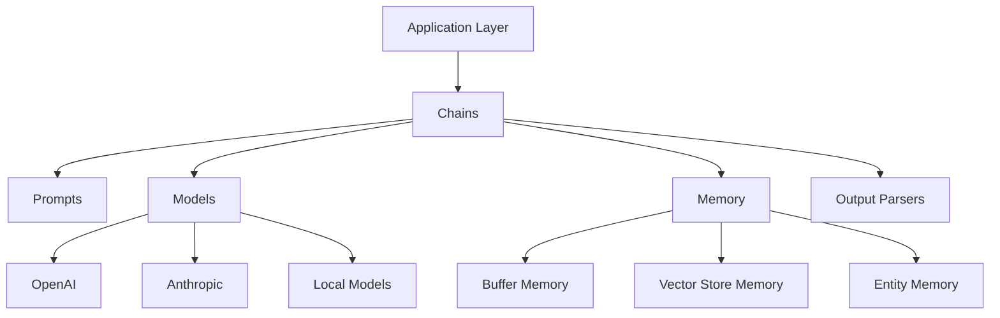

# LangChain Fundamentals

## What You'll Learn

- Core architecture and components of LangChain framework
- How chains, prompts, and models interact in the LangChain ecosystem
- Building blocks for creating LLM-powered applications
- Integration patterns with various LLM providers
- Memory systems and context management
- Output parsing and structured data extraction

## Why This Matters

LangChain has become the de facto framework for building production-grade LLM applications. Understanding its architecture enables you to build sophisticated AI systems that go beyond simple prompt-response patterns. In production environments, you need robust patterns for prompt management, model abstraction, memory handling, and error recovery—all of which LangChain provides through well-tested abstractions.

## Core Architecture

LangChain provides a modular framework where components can be combined to create complex LLM workflows. The framework operates on the principle of composability, where simple components are chained together to create sophisticated behaviors.

### The Component Stack



The architecture separates concerns: prompts define what to ask, models determine how to process, memory provides context, and parsers structure the output.

## Language Model Abstraction

LangChain abstracts different LLM providers behind unified interfaces, allowing you to switch between models without rewriting application logic.

### Python Implementation

```python
from langchain_openai import ChatOpenAI
from langchain_anthropic import ChatAnthropic
from langchain_core.prompts import ChatPromptTemplate
from langchain_core.output_parsers import StrOutputParser

# Model abstraction allows switching providers seamlessly
def create_chain(provider="openai"):
    # Choose model based on provider
    if provider == "openai":
        model = ChatOpenAI(
            model="gpt-4",
            temperature=0.7,
            max_tokens=1000
        )
    elif provider == "anthropic":
        model = ChatAnthropic(
            model="claude-3-opus-20240229",
            temperature=0.7,
            max_tokens=1000
        )
    
    # Define prompt template
    prompt = ChatPromptTemplate.from_messages([
        ("system", "You are a technical expert in {domain}."),
        ("user", "{query}")
    ])
    
    # Create chain using LCEL (LangChain Expression Language)
    chain = prompt | model | StrOutputParser()
    
    return chain

# Usage
chain = create_chain("openai")
result = chain.invoke({
    "domain": "distributed systems",
    "query": "Explain the CAP theorem"
})
print(result)
```

### JavaScript/TypeScript Implementation

```typescript
import { ChatOpenAI } from "@langchain/openai";
import { ChatAnthropic } from "@langchain/anthropic";
import { ChatPromptTemplate } from "@langchain/core/prompts";
import { StringOutputParser } from "@langchain/core/output_parsers";

interface ChainConfig {
  provider: "openai" | "anthropic";
}

async function createChain(config: ChainConfig) {
  // Model abstraction
  const model = config.provider === "openai"
    ? new ChatOpenAI({
        modelName: "gpt-4",
        temperature: 0.7,
        maxTokens: 1000,
      })
    : new ChatAnthropic({
        modelName: "claude-3-opus-20240229",
        temperature: 0.7,
        maxTokens: 1000,
      });

  // Define prompt template
  const prompt = ChatPromptTemplate.fromMessages([
    ["system", "You are a technical expert in {domain}."],
    ["user", "{query}"],
  ]);

  // Create chain using LCEL
  const chain = prompt.pipe(model).pipe(new StringOutputParser());

  return chain;
}

// Usage
const chain = await createChain({ provider: "openai" });
const result = await chain.invoke({
  domain: "distributed systems",
  query: "Explain the CAP theorem",
});
console.log(result);
```

## LangChain Expression Language (LCEL)

LCEL is the declarative way to compose chains in LangChain. It provides a unified interface for building complex workflows with streaming, parallelization, and error handling built-in.

### Basic LCEL Patterns

```python
from langchain_core.runnables import RunnablePassthrough, RunnableParallel

# Sequential chain with pipe operator
basic_chain = prompt | model | output_parser

# Parallel execution
parallel_chain = RunnableParallel({
    "summary": summarize_prompt | model | StrOutputParser(),
    "keywords": keyword_prompt | model | StrOutputParser(),
    "sentiment": sentiment_prompt | model | StrOutputParser()
})

# Pass-through for data transformation
chain_with_passthrough = (
    RunnablePassthrough.assign(
        context=lambda x: retrieve_context(x["query"])
    )
    | prompt
    | model
    | StrOutputParser()
)

# Execute parallel chain
results = parallel_chain.invoke({"text": document})
# Returns: {"summary": "...", "keywords": "...", "sentiment": "..."}
```

### Streaming with LCEL

```python
from langchain_core.runnables import RunnablePassthrough

async def stream_response():
    chain = prompt | model | StrOutputParser()
    
    # Stream tokens as they arrive
    async for chunk in chain.astream({"query": "Explain microservices"}):
        print(chunk, end="", flush=True)

# Batch processing with streaming
async def batch_stream():
    chain = prompt | model | StrOutputParser()
    
    queries = [
        {"query": "What is REST?"},
        {"query": "What is gRPC?"},
        {"query": "What is GraphQL?"}
    ]
    
    # Process multiple inputs with streaming
    async for output in chain.astream_batch(queries):
        print(f"Response: {output}")
```

## Prompt Templates

Prompt templates provide structured ways to format inputs for LLMs, supporting variable interpolation, few-shot examples, and conditional logic.

### Advanced Prompt Patterns

```python
from langchain_core.prompts import (
    ChatPromptTemplate,
    FewShotChatMessagePromptTemplate,
    MessagesPlaceholder
)

# Few-shot learning template
examples = [
    {
        "input": "Calculate 2 + 2",
        "output": "2 + 2 = 4"
    },
    {
        "input": "Calculate 5 * 3",
        "output": "5 * 3 = 15"
    }
]

example_prompt = ChatPromptTemplate.from_messages([
    ("human", "{input}"),
    ("ai", "{output}")
])

few_shot_prompt = FewShotChatMessagePromptTemplate(
    example_prompt=example_prompt,
    examples=examples
)

# Final prompt with examples
final_prompt = ChatPromptTemplate.from_messages([
    ("system", "You are a math calculator. Follow the pattern below."),
    few_shot_prompt,
    ("human", "{input}")
])

# Chat history with messages placeholder
chat_prompt = ChatPromptTemplate.from_messages([
    ("system", "You are a helpful assistant."),
    MessagesPlaceholder(variable_name="chat_history"),
    ("human", "{query}")
])
```

### Prompt with Dynamic Examples

```python
from langchain_core.example_selectors import SemanticSimilarityExampleSelector
from langchain_openai import OpenAIEmbeddings
from langchain_community.vectorstores import Chroma

# Dynamic example selection based on input similarity
examples = [
    {"input": "What is a microservice?", "output": "A microservice is..."},
    {"input": "What is REST?", "output": "REST is..."},
    {"input": "What is Docker?", "output": "Docker is..."},
]

# Select most relevant examples using embeddings
example_selector = SemanticSimilarityExampleSelector.from_examples(
    examples,
    OpenAIEmbeddings(),
    Chroma,
    k=2  # Select 2 most similar examples
)

# Create prompt with dynamic examples
dynamic_prompt = FewShotChatMessagePromptTemplate(
    example_selector=example_selector,
    example_prompt=example_prompt
)

final_prompt = ChatPromptTemplate.from_messages([
    ("system", "Answer technical questions based on the examples."),
    dynamic_prompt,
    ("human", "{input}")
])
```

## Output Parsers

Output parsers structure LLM responses into usable formats like JSON, Pydantic models, or custom data structures.

### Structured Output Parsing

```python
from langchain_core.output_parsers import JsonOutputParser, PydanticOutputParser
from langchain_core.pydantic_v1 import BaseModel, Field
from typing import List

# Define expected output structure
class TechnicalConcept(BaseModel):
    name: str = Field(description="The name of the technical concept")
    definition: str = Field(description="Clear definition")
    use_cases: List[str] = Field(description="Common use cases")
    pros: List[str] = Field(description="Advantages")
    cons: List[str] = Field(description="Disadvantages")

# Create parser
parser = PydanticOutputParser(pydantic_object=TechnicalConcept)

# Inject format instructions into prompt
prompt = ChatPromptTemplate.from_messages([
    ("system", "Extract structured information about technical concepts."),
    ("user", "{query}\n\n{format_instructions}")
])

# Build chain with parsing
chain = (
    {
        "query": RunnablePassthrough(),
        "format_instructions": lambda x: parser.get_format_instructions()
    }
    | prompt
    | model
    | parser
)

# Execute and get structured output
result: TechnicalConcept = chain.invoke("Explain Kubernetes")
print(f"Name: {result.name}")
print(f"Definition: {result.definition}")
print(f"Use cases: {result.use_cases}")
```

### Custom Output Parser

```python
from langchain_core.output_parsers import BaseOutputParser
from typing import List
import re

class BulletPointParser(BaseOutputParser[List[str]]):
    """Parse output into bullet points."""
    
    def parse(self, text: str) -> List[str]:
        # Extract bullet points from text
        lines = text.split('\n')
        bullet_points = []
        
        for line in lines:
            # Match various bullet formats
            match = re.match(r'^[\s]*[-*•]\s+(.+)$', line.strip())
            if match:
                bullet_points.append(match.group(1))
            # Match numbered lists
            match = re.match(r'^[\s]*\d+\.\s+(.+)$', line.strip())
            if match:
                bullet_points.append(match.group(1))
        
        return bullet_points
    
    def get_format_instructions(self) -> str:
        return "Format your response as bullet points."

# Usage
parser = BulletPointParser()
chain = prompt | model | parser
results: List[str] = chain.invoke({"query": "List microservices benefits"})
```

## Memory Systems

Memory provides context persistence across multiple interactions, essential for conversational AI and stateful applications.

### Conversation Buffer Memory

```python
from langchain.memory import ConversationBufferMemory
from langchain_openai import ChatOpenAI
from langchain.chains import ConversationChain

# Simple buffer memory stores all messages
memory = ConversationBufferMemory(
    return_messages=True,
    memory_key="chat_history"
)

# Conversational chain with memory
conversation = ConversationChain(
    llm=ChatOpenAI(model="gpt-4"),
    memory=memory,
    verbose=True
)

# First interaction
response1 = conversation.predict(input="My name is Alice")
# "Nice to meet you, Alice!"

# Second interaction - model remembers
response2 = conversation.predict(input="What's my name?")
# "Your name is Alice."

# Access memory
print(memory.load_memory_variables({}))
# {"chat_history": [HumanMessage(...), AIMessage(...), ...]}
```

### Window Memory

```python
from langchain.memory import ConversationBufferWindowMemory

# Keep only last K interactions
memory = ConversationBufferWindowMemory(
    k=5,  # Keep last 5 message pairs
    return_messages=True,
    memory_key="chat_history"
)

# Useful for managing context window limits
conversation = ConversationChain(
    llm=ChatOpenAI(model="gpt-4"),
    memory=memory
)
```

### Summary Memory

```python
from langchain.memory import ConversationSummaryMemory
from langchain_openai import ChatOpenAI

# Summarize conversation to save tokens
llm = ChatOpenAI(model="gpt-4", temperature=0)
memory = ConversationSummaryMemory(
    llm=llm,
    return_messages=True,
    memory_key="chat_history"
)

# As conversation grows, it's summarized
conversation = ConversationChain(
    llm=llm,
    memory=memory,
    verbose=True
)

# After several interactions
response = conversation.predict(input="Summarize our discussion")
# Model has access to summary of previous conversation
```

### Vector Store Memory

```python
from langchain.memory import VectorStoreRetrieverMemory
from langchain_openai import OpenAIEmbeddings
from langchain_community.vectorstores import Chroma

# Use vector similarity for memory retrieval
embeddings = OpenAIEmbeddings()
vectorstore = Chroma(embedding_function=embeddings)

# Retrieve most relevant past interactions
memory = VectorStoreRetrieverMemory(
    retriever=vectorstore.as_retriever(search_kwargs={"k": 3}),
    return_messages=True,
    memory_key="chat_history"
)

# Store interaction
memory.save_context(
    {"input": "I work at a fintech company"},
    {"output": "That's interesting! What do you do there?"}
)

# Later, relevant context is retrieved automatically
relevant_context = memory.load_memory_variables(
    {"input": "Tell me about banking regulations"}
)
# Returns the fintech-related conversation
```

## Real-World Scenario: Document QA System

Building a production-ready document question-answering system demonstrates multiple LangChain components working together.

```python
from langchain_openai import ChatOpenAI, OpenAIEmbeddings
from langchain_community.vectorstores import Chroma
from langchain_core.prompts import ChatPromptTemplate
from langchain_core.output_parsers import StrOutputParser
from langchain_core.runnables import RunnablePassthrough, RunnableParallel
from langchain.text_splitter import RecursiveCharacterTextSplitter
from langchain_community.document_loaders import DirectoryLoader
from typing import List

class DocumentQASystem:
    def __init__(self, documents_path: str):
        self.embeddings = OpenAIEmbeddings()
        self.model = ChatOpenAI(model="gpt-4", temperature=0)
        self.vectorstore = self._setup_vectorstore(documents_path)
        self.chain = self._create_chain()
    
    def _setup_vectorstore(self, path: str):
        # Load documents
        loader = DirectoryLoader(path, glob="**/*.md")
        documents = loader.load()
        
        # Split into chunks for embedding
        text_splitter = RecursiveCharacterTextSplitter(
            chunk_size=1000,
            chunk_overlap=200,
            length_function=len
        )
        splits = text_splitter.split_documents(documents)
        
        # Create vector store
        vectorstore = Chroma.from_documents(
            documents=splits,
            embedding=self.embeddings,
            collection_name="docs_qa"
        )
        
        return vectorstore
    
    def _format_docs(self, docs: List) -> str:
        """Format retrieved documents for context."""
        return "\n\n".join([
            f"Document {i+1}:\n{doc.page_content}"
            for i, doc in enumerate(docs)
        ])
    
    def _create_chain(self):
        # Create retriever
        retriever = self.vectorstore.as_retriever(
            search_type="similarity",
            search_kwargs={"k": 4}
        )
        
        # Define prompt
        prompt = ChatPromptTemplate.from_messages([
            ("system", """You are a technical documentation assistant.
            Use the following context to answer the question accurately.
            If you don't know the answer based on the context, say so.
            
            Context:
            {context}
            """),
            ("user", "{question}")
        ])
        
        # Create RAG chain
        chain = (
            RunnableParallel({
                "context": retriever | self._format_docs,
                "question": RunnablePassthrough()
            })
            | prompt
            | self.model
            | StrOutputParser()
        )
        
        return chain
    
    def ask(self, question: str) -> str:
        """Query the document system."""
        return self.chain.invoke(question)
    
    async def ask_stream(self, question: str):
        """Stream the response."""
        async for chunk in self.chain.astream(question):
            yield chunk

# Usage
qa_system = DocumentQASystem("/path/to/docs")

# Synchronous query
answer = qa_system.ask("What are the benefits of microservices?")
print(answer)

# Streaming query
async def main():
    async for chunk in qa_system.ask_stream("Explain event-driven architecture"):
        print(chunk, end="", flush=True)
```

## Performance Optimization

### Caching Responses

```python
from langchain.cache import InMemoryCache, SQLiteCache
from langchain.globals import set_llm_cache

# In-memory cache for development
set_llm_cache(InMemoryCache())

# Persistent cache for production
set_llm_cache(SQLiteCache(database_path=".langchain.db"))

# Identical requests use cached responses
model = ChatOpenAI(model="gpt-4")
response1 = model.invoke("Explain REST API")  # Calls API
response2 = model.invoke("Explain REST API")  # Uses cache
```

### Batch Processing

```python
from langchain_openai import ChatOpenAI

model = ChatOpenAI(model="gpt-4")

# Batch multiple requests for efficiency
questions = [
    "What is Docker?",
    "What is Kubernetes?",
    "What is Terraform?"
]

# More efficient than sequential calls
responses = model.batch([
    [("user", question)] for question in questions
])

for question, response in zip(questions, responses):
    print(f"Q: {question}\nA: {response.content}\n")
```

## Error Handling and Retries

```python
from langchain_core.runnables import RunnableRetry
from langchain_openai import ChatOpenAI

# Configure retry logic
model = ChatOpenAI(model="gpt-4")
model_with_retry = RunnableRetry(
    bound=model,
    max_attempts=3,
    wait_exponential_jitter=True,
    retry_if_exception_type=(Exception,)
)

# Chain with retry
chain = prompt | model_with_retry | StrOutputParser()

try:
    result = chain.invoke({"query": "Explain CAP theorem"})
except Exception as e:
    print(f"Failed after retries: {e}")
```

## Comparison: LangChain vs Raw API Calls

| Aspect | Raw API | LangChain |
|--------|---------|-----------|
| **Abstraction** | Direct API calls per provider | Unified interface across providers |
| **Prompt Management** | String concatenation | Templated, versioned prompts |
| **Memory** | Manual state management | Built-in memory abstractions |
| **Streaming** | Custom implementation | Native streaming support |
| **Retries** | Manual retry logic | Built-in exponential backoff |
| **Caching** | Custom cache layer | Integrated caching |
| **Output Parsing** | Manual JSON parsing | Structured parsers with validation |
| **Composability** | Procedural code | Declarative chains |
| **Testing** | Mock entire API | Mock individual components |

## Best Practices

**Use LCEL for Chain Construction**: LCEL provides better composability, automatic streaming, and easier debugging compared to legacy chain classes.

```python
# ✅ Use LCEL
chain = prompt | model | parser

# ❌ Avoid legacy chains when possible
from langchain.chains import LLMChain
chain = LLMChain(llm=model, prompt=prompt)
```

**Implement Structured Output Parsing**: Always parse LLM outputs into structured formats for reliability.

```python
# ✅ Structured output
parser = PydanticOutputParser(pydantic_object=MyModel)
chain = prompt | model | parser

# ❌ Unstructured string output
chain = prompt | model | StrOutputParser()
# Then manually parse the string - error-prone
```

**Choose Appropriate Memory for Use Case**: Match memory type to your application's needs and token constraints.

```python
# ✅ Use summary memory for long conversations
memory = ConversationSummaryMemory(llm=llm)

# ❌ Using buffer memory without limits
memory = ConversationBufferMemory()  # Can exceed context window
```

**Implement Proper Error Handling**: LLM calls can fail; handle errors gracefully with retries and fallbacks.

```python
# ✅ Proper error handling
try:
    result = chain.invoke(input_data, config={"max_retries": 3})
except Exception as e:
    logger.error(f"Chain failed: {e}")
    result = fallback_response()

# ❌ No error handling
result = chain.invoke(input_data)  # Can crash application
```

**Use Async for Concurrent Operations**: Leverage async for better performance with multiple LLM calls.

```python
# ✅ Async for parallel operations
async def process_batch(queries):
    tasks = [chain.ainvoke(q) for q in queries]
    return await asyncio.gather(*tasks)

# ❌ Sequential processing
def process_batch(queries):
    return [chain.invoke(q) for q in queries]  # Slow
```

## Anti-Patterns

❌ **Loading Entire Documents into Context**: Embedding entire documents exceeds token limits and increases costs.

```python
# ❌ Don't do this
prompt = f"Document: {entire_document}\n\nQuestion: {question}"

# ✅ Use retrieval with chunking
retriever = vectorstore.as_retriever(search_kwargs={"k": 4})
relevant_chunks = retriever.get_relevant_documents(question)
```

❌ **Hardcoding Prompts in Code**: Makes prompts difficult to version and test.

```python
# ❌ Hardcoded prompts
prompt_text = "You are an expert. Answer: " + user_query

# ✅ Use prompt templates
prompt = ChatPromptTemplate.from_template(
    "You are an expert in {domain}. Answer: {query}"
)
```

❌ **Ignoring Token Limits**: Not managing context window size leads to API errors.

```python
# ❌ No token management
memory = ConversationBufferMemory()  # Grows unbounded

# ✅ Use windowed or summary memory
memory = ConversationBufferWindowMemory(k=10)
```

❌ **Synchronous Calls in High-Throughput Systems**: Blocks event loop and reduces throughput.

```python
# ❌ Blocking calls
for query in queries:
    result = chain.invoke(query)  # Blocks

# ✅ Async batch processing
results = await chain.abatch(queries)
```

## Integration Patterns

### FastAPI Integration

```python
from fastapi import FastAPI, HTTPException
from pydantic import BaseModel
from langchain_openai import ChatOpenAI
from langchain_core.prompts import ChatPromptTemplate

app = FastAPI()

class Query(BaseModel):
    question: str
    context: str = ""

class Response(BaseModel):
    answer: str
    model: str

# Initialize chain
model = ChatOpenAI(model="gpt-4")
prompt = ChatPromptTemplate.from_messages([
    ("system", "You are a helpful assistant."),
    ("user", "{question}")
])
chain = prompt | model

@app.post("/ask", response_model=Response)
async def ask_question(query: Query):
    try:
        result = await chain.ainvoke({"question": query.question})
        return Response(
            answer=result.content,
            model="gpt-4"
        )
    except Exception as e:
        raise HTTPException(status_code=500, detail=str(e))

@app.post("/stream")
async def stream_answer(query: Query):
    async def generate():
        async for chunk in chain.astream({"question": query.question}):
            yield chunk.content
    
    return StreamingResponse(generate(), media_type="text/plain")
```

## Related Topics

- [LangGraph Architecture](02-langgraph-architecture.md) - State machines and multi-agent workflows
- [Agents and Tools](03-agents-and-tools.md) - Building autonomous agents with tool use
- [Memory and State Management](04-memory-state-management.md) - Advanced memory patterns
- [RAG Patterns](05-rag-patterns.md) - Retrieval-augmented generation architectures
