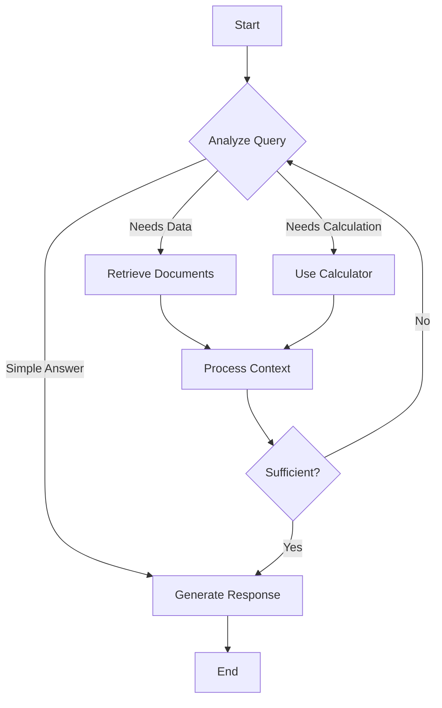

# LangGraph Architecture

## What You'll Learn

- LangGraph's state machine architecture for building cyclic agent workflows
- Node and edge patterns for complex decision flows
- Checkpointing and persistence for stateful applications
- Human-in-the-loop patterns for controlled agent execution
- Parallel execution and sub-graphs for modular agent design
- Production deployment patterns for LangGraph applications

## Why This Matters

While LangChain excels at linear chains, real-world AI agents require cyclic workflows, conditional branching, and state management. LangGraph extends LangChain with a graph-based execution model that enables sophisticated agent architectures. In production systems, you need agents that can loop, branch based on conditions, recover from errors, and maintain state across interactions—all capabilities LangGraph provides through its state machine abstraction.

## Core Concepts

LangGraph models agent workflows as directed graphs where nodes represent computations and edges define transitions. The framework manages state propagation, execution flow, and persistence automatically.

### Graph Architecture



## State Management

State in LangGraph is a typed dictionary that flows through nodes, with each node reading and updating specific keys.

### Basic State Definition

```python
from typing import TypedDict, Annotated, Sequence
from langchain_core.messages import BaseMessage
from langgraph.graph import StateGraph, END
import operator

# Define state schema
class AgentState(TypedDict):
    messages: Annotated[Sequence[BaseMessage], operator.add]
    next_step: str
    iterations: int
    final_answer: str

# State flows through nodes, each can read/write
def process_node(state: AgentState) -> AgentState:
    return {
        "iterations": state["iterations"] + 1,
        "next_step": "analyze"
    }
```

### Advanced State with Reducers

```python
from typing import List, Dict, Any
import operator

class ResearchState(TypedDict):
    # Simple overwrite
    query: str
    
    # Append to list
    documents: Annotated[List[str], operator.add]
    
    # Merge dictionaries
    metadata: Annotated[Dict[str, Any], operator.or_]
    
    # Custom reducer
    scores: Annotated[List[float], lambda x, y: sorted(x + y, reverse=True)[:5]]

# Multiple nodes can contribute to same state keys
def retrieval_node(state: ResearchState) -> ResearchState:
    return {
        "documents": ["doc1", "doc2"],  # Will be appended
        "metadata": {"source": "vectordb"},  # Will be merged
        "scores": [0.9, 0.8]  # Will be sorted and limited
    }

def web_search_node(state: ResearchState) -> ResearchState:
    return {
        "documents": ["web_doc1"],  # Appended to existing
        "metadata": {"web_results": 1},  # Merged with existing
        "scores": [0.85]  # Added to sorted list
    }
```

## Building Graphs

### Simple Sequential Graph

```python
from langgraph.graph import StateGraph, END
from langchain_openai import ChatOpenAI

# Initialize graph
workflow = StateGraph(AgentState)

# Define nodes
def input_node(state: AgentState) -> AgentState:
    """Process initial input."""
    return {
        "next_step": "analyze",
        "iterations": 0
    }

def analyze_node(state: AgentState) -> AgentState:
    """Analyze the query."""
    model = ChatOpenAI(model="gpt-4")
    result = model.invoke(state["messages"])
    
    return {
        "messages": [result],
        "next_step": "respond"
    }

def respond_node(state: AgentState) -> AgentState:
    """Generate final response."""
    return {
        "final_answer": state["messages"][-1].content,
        "next_step": "end"
    }

# Add nodes to graph
workflow.add_node("input", input_node)
workflow.add_node("analyze", analyze_node)
workflow.add_node("respond", respond_node)

# Define edges
workflow.add_edge("input", "analyze")
workflow.add_edge("analyze", "respond")
workflow.add_edge("respond", END)

# Set entry point
workflow.set_entry_point("input")

# Compile graph
app = workflow.compile()
```

### Conditional Branching Graph

```python
from langchain_core.messages import HumanMessage
from typing import Literal

class RouterState(TypedDict):
    messages: Sequence[BaseMessage]
    route: str

def classify_query(state: RouterState) -> RouterState:
    """Classify the type of query."""
    query = state["messages"][-1].content
    
    # Simple classification logic
    if "calculate" in query.lower() or "compute" in query.lower():
        route = "calculator"
    elif "search" in query.lower() or "find" in query.lower():
        route = "search"
    else:
        route = "direct"
    
    return {"route": route}

def calculator_node(state: RouterState) -> RouterState:
    """Handle calculation queries."""
    # Use calculator tool
    result = perform_calculation(state["messages"][-1].content)
    return {"messages": [result]}

def search_node(state: RouterState) -> RouterState:
    """Handle search queries."""
    # Use search tool
    results = perform_search(state["messages"][-1].content)
    return {"messages": [results]}

def direct_node(state: RouterState) -> RouterState:
    """Handle direct LLM queries."""
    model = ChatOpenAI(model="gpt-4")
    result = model.invoke(state["messages"])
    return {"messages": [result]}

# Build graph with conditional edges
workflow = StateGraph(RouterState)

workflow.add_node("classifier", classify_query)
workflow.add_node("calculator", calculator_node)
workflow.add_node("search", search_node)
workflow.add_node("direct", direct_node)

# Conditional routing function
def route_query(state: RouterState) -> Literal["calculator", "search", "direct"]:
    """Route based on classification."""
    return state["route"]

# Add conditional edges
workflow.add_conditional_edges(
    "classifier",
    route_query,
    {
        "calculator": "calculator",
        "search": "search",
        "direct": "direct"
    }
)

# All paths end
workflow.add_edge("calculator", END)
workflow.add_edge("search", END)
workflow.add_edge("direct", END)

workflow.set_entry_point("classifier")
app = workflow.compile()

# Execute
result = app.invoke({
    "messages": [HumanMessage(content="Calculate 125 * 47")]
})
```

## Cycles and Loops

LangGraph's killer feature is support for cycles, enabling agents to iterate until conditions are met.

### Iterative Research Agent

```python
class ResearchAgentState(TypedDict):
    question: str
    context: Annotated[List[str], operator.add]
    iterations: int
    max_iterations: int
    answer: str
    sufficient: bool

def research_node(state: ResearchAgentState) -> ResearchAgentState:
    """Gather information."""
    # Simulate research
    new_context = search_documents(state["question"], state["context"])
    
    return {
        "context": [new_context],
        "iterations": state["iterations"] + 1
    }

def evaluate_node(state: ResearchAgentState) -> ResearchAgentState:
    """Evaluate if we have sufficient information."""
    model = ChatOpenAI(model="gpt-4")
    
    prompt = f"""
    Question: {state["question"]}
    Context gathered: {state["context"]}
    
    Do we have sufficient information to answer? Reply YES or NO.
    """
    
    result = model.invoke([HumanMessage(content=prompt)])
    sufficient = "yes" in result.content.lower()
    
    return {"sufficient": sufficient}

def answer_node(state: ResearchAgentState) -> ResearchAgentState:
    """Generate final answer."""
    model = ChatOpenAI(model="gpt-4")
    
    prompt = f"""
    Question: {state["question"]}
    Context: {state["context"]}
    
    Provide a comprehensive answer.
    """
    
    result = model.invoke([HumanMessage(content=prompt)])
    return {"answer": result.content}

# Build cyclic graph
workflow = StateGraph(ResearchAgentState)

workflow.add_node("research", research_node)
workflow.add_node("evaluate", evaluate_node)
workflow.add_node("answer", answer_node)

# Conditional routing for cycles
def should_continue(state: ResearchAgentState) -> Literal["research", "answer"]:
    """Decide whether to continue researching."""
    if state["sufficient"]:
        return "answer"
    elif state["iterations"] >= state["max_iterations"]:
        return "answer"
    else:
        return "research"

workflow.add_edge("research", "evaluate")
workflow.add_conditional_edges(
    "evaluate",
    should_continue,
    {
        "research": "research",  # Loop back
        "answer": "answer"
    }
)
workflow.add_edge("answer", END)

workflow.set_entry_point("research")
app = workflow.compile()

# Execute with loop limit
result = app.invoke({
    "question": "Explain quantum computing",
    "context": [],
    "iterations": 0,
    "max_iterations": 3,
    "sufficient": False
})
```

## Checkpointing and Persistence

Checkpointing enables state persistence, allowing agents to pause, resume, and recover from failures.

### Memory Checkpointing

```python
from langgraph.checkpoint.memory import MemorySaver
from langgraph.graph import StateGraph

# Create checkpointer
checkpointer = MemorySaver()

# Compile with checkpointing
app = workflow.compile(checkpointer=checkpointer)

# Execute with thread ID for persistence
config = {"configurable": {"thread_id": "conversation-123"}}

# First interaction
result1 = app.invoke(
    {"messages": [HumanMessage(content="Hello")]},
    config=config
)

# Second interaction - state is preserved
result2 = app.invoke(
    {"messages": [HumanMessage(content="What did I just say?")]},
    config=config
)
# Agent remembers the previous "Hello" message
```

### SQLite Checkpointing

```python
from langgraph.checkpoint.sqlite import SqliteSaver

# Persistent checkpointing
checkpointer = SqliteSaver.from_conn_string("checkpoints.db")

app = workflow.compile(checkpointer=checkpointer)

# State persists across application restarts
config = {"configurable": {"thread_id": "user-456"}}

result = app.invoke(
    {"messages": [HumanMessage(content="Continue our conversation")]},
    config=config
)
```

### Checkpoint Inspection and Time Travel

```python
from langgraph.checkpoint.memory import MemorySaver

checkpointer = MemorySaver()
app = workflow.compile(checkpointer=checkpointer)

config = {"configurable": {"thread_id": "debug-session"}}

# Execute workflow
app.invoke({"messages": [HumanMessage(content="Start")]}, config=config)

# Get checkpoint history
history = checkpointer.list(config)

for checkpoint in history:
    print(f"Step: {checkpoint.metadata.get('step')}")
    print(f"State: {checkpoint.values}")
    print("---")

# Resume from specific checkpoint
specific_checkpoint = history[2]  # Get third checkpoint
config["configurable"]["checkpoint_id"] = specific_checkpoint.id

# Continue from that point
result = app.invoke(
    {"messages": [HumanMessage(content="Continue from here")]},
    config=config
)
```

## Human-in-the-Loop

Enable human oversight and intervention in agent workflows.

### Approval Gates

```python
from typing import Literal
from langgraph.checkpoint.memory import MemorySaver
from langgraph.graph import StateGraph, END

class ApprovalState(TypedDict):
    query: str
    draft_response: str
    approved: bool
    final_response: str

def draft_node(state: ApprovalState) -> ApprovalState:
    """Generate draft response."""
    model = ChatOpenAI(model="gpt-4")
    draft = model.invoke([HumanMessage(content=state["query"])])
    
    return {"draft_response": draft.content}

def human_review_node(state: ApprovalState) -> ApprovalState:
    """Human reviews and approves."""
    # This is where human intervention occurs
    # In practice, this would be an interrupt point
    return state  # State unchanged, waiting for approval

def finalize_node(state: ApprovalState) -> ApprovalState:
    """Finalize approved response."""
    return {"final_response": state["draft_response"]}

workflow = StateGraph(ApprovalState)
workflow.add_node("draft", draft_node)
workflow.add_node("human_review", human_review_node)
workflow.add_node("finalize", finalize_node)

workflow.add_edge("draft", "human_review")
workflow.add_edge("human_review", "finalize")
workflow.add_edge("finalize", END)

workflow.set_entry_point("draft")

# Compile with interrupt
app = workflow.compile(
    checkpointer=MemorySaver(),
    interrupt_before=["human_review"]  # Pause here
)

config = {"configurable": {"thread_id": "approval-flow"}}

# Start workflow - will stop at human_review
result = app.invoke(
    {"query": "Draft a product announcement", "approved": False},
    config=config
)

print(f"Draft: {result['draft_response']}")
print("Waiting for human approval...")

# Human approves (in practice, this would be a separate interaction)
# Resume workflow with approval
app.invoke(
    {"approved": True},
    config=config
)
```

### Interactive Editing

```python
class EditableState(TypedDict):
    content: str
    iterations: int
    human_edits: List[str]

def generate_node(state: EditableState) -> EditableState:
    """Generate content."""
    model = ChatOpenAI(model="gpt-4")
    content = model.invoke([HumanMessage(content="Write a blog post")])
    
    return {
        "content": content.content,
        "iterations": state.get("iterations", 0) + 1
    }

def human_edit_node(state: EditableState) -> EditableState:
    """Human can edit content."""
    # Interrupt point for human editing
    return state

def should_continue_editing(state: EditableState) -> Literal["generate", "end"]:
    """Check if more iterations needed."""
    if state.get("iterations", 0) >= 3:
        return "end"
    return "generate"

workflow = StateGraph(EditableState)
workflow.add_node("generate", generate_node)
workflow.add_node("human_edit", human_edit_node)

workflow.add_edge("generate", "human_edit")
workflow.add_conditional_edges(
    "human_edit",
    should_continue_editing,
    {
        "generate": "generate",
        "end": END
    }
)

workflow.set_entry_point("generate")

app = workflow.compile(
    checkpointer=MemorySaver(),
    interrupt_after=["human_edit"]  # Pause after human reviews
)
```

## Parallel Execution

Execute multiple nodes concurrently for better performance.

### Parallel Research Branches

```python
from typing import List
from langgraph.graph import StateGraph, END

class ParallelState(TypedDict):
    query: str
    web_results: List[str]
    db_results: List[str]
    api_results: List[str]
    combined: str

def web_search(state: ParallelState) -> ParallelState:
    """Search the web."""
    results = search_web(state["query"])
    return {"web_results": results}

def database_search(state: ParallelState) -> ParallelState:
    """Search internal database."""
    results = search_database(state["query"])
    return {"db_results": results}

def api_search(state: ParallelState) -> ParallelState:
    """Query external API."""
    results = query_api(state["query"])
    return {"api_results": results}

def combine_results(state: ParallelState) -> ParallelState:
    """Combine all results."""
    all_results = (
        state["web_results"] +
        state["db_results"] +
        state["api_results"]
    )
    
    model = ChatOpenAI(model="gpt-4")
    combined = model.invoke([
        HumanMessage(content=f"Synthesize: {all_results}")
    ])
    
    return {"combined": combined.content}

workflow = StateGraph(ParallelState)

# Add parallel nodes
workflow.add_node("web", web_search)
workflow.add_node("database", database_search)
workflow.add_node("api", api_search)
workflow.add_node("combine", combine_results)

# All three execute in parallel from start
workflow.add_edge("web", "combine")
workflow.add_edge("database", "combine")
workflow.add_edge("api", "combine")
workflow.add_edge("combine", END)

# Set multiple entry points for parallel execution
workflow.set_entry_point("web")
workflow.set_entry_point("database")
workflow.set_entry_point("api")

app = workflow.compile()

# All three branches execute concurrently
result = app.invoke({"query": "latest AI developments"})
```

## Sub-Graphs

Compose complex agents from reusable sub-graphs.

### Modular Agent Design

```python
from langgraph.graph import StateGraph, END

# Define sub-graph for document processing
class DocProcessingState(TypedDict):
    document: str
    summary: str
    keywords: List[str]

def create_doc_processor() -> StateGraph:
    """Reusable document processing sub-graph."""
    workflow = StateGraph(DocProcessingState)
    
    def summarize(state: DocProcessingState) -> DocProcessingState:
        # Summarization logic
        return {"summary": "..."}
    
    def extract_keywords(state: DocProcessingState) -> DocProcessingState:
        # Keyword extraction logic
        return {"keywords": ["..."]}
    
    workflow.add_node("summarize", summarize)
    workflow.add_node("keywords", extract_keywords)
    workflow.add_edge("summarize", "keywords")
    workflow.add_edge("keywords", END)
    workflow.set_entry_point("summarize")
    
    return workflow

# Main agent that uses sub-graph
class MainAgentState(TypedDict):
    input: str
    processed_docs: List[DocProcessingState]
    final_output: str

def main_agent() -> StateGraph:
    workflow = StateGraph(MainAgentState)
    
    # Use doc processor as sub-graph
    doc_processor = create_doc_processor().compile()
    
    def process_documents(state: MainAgentState) -> MainAgentState:
        """Process multiple documents using sub-graph."""
        documents = retrieve_documents(state["input"])
        processed = []
        
        for doc in documents:
            # Invoke sub-graph for each document
            result = doc_processor.invoke({"document": doc})
            processed.append(result)
        
        return {"processed_docs": processed}
    
    def generate_output(state: MainAgentState) -> MainAgentState:
        """Generate final output from processed documents."""
        summaries = [doc["summary"] for doc in state["processed_docs"]]
        # Generate final output
        return {"final_output": "..."}
    
    workflow.add_node("process", process_documents)
    workflow.add_node("generate", generate_output)
    workflow.add_edge("process", "generate")
    workflow.add_edge("generate", END)
    workflow.set_entry_point("process")
    
    return workflow

app = main_agent().compile()
```

## Real-World Scenario: Customer Support Agent

A production-ready customer support agent with routing, escalation, and human oversight.

```python
from enum import Enum
from typing import List, Optional
from langchain_openai import ChatOpenAI
from langchain_core.messages import HumanMessage, AIMessage
from langgraph.graph import StateGraph, END
from langgraph.checkpoint.sqlite import SqliteSaver

class TicketStatus(str, Enum):
    NEW = "new"
    IN_PROGRESS = "in_progress"
    ESCALATED = "escalated"
    RESOLVED = "resolved"

class SupportState(TypedDict):
    ticket_id: str
    customer_query: str
    conversation_history: Annotated[List[BaseMessage], operator.add]
    status: TicketStatus
    category: str
    complexity_score: int
    resolution: Optional[str]
    requires_human: bool

class SupportAgent:
    def __init__(self):
        self.model = ChatOpenAI(model="gpt-4", temperature=0)
        self.workflow = self._build_workflow()
        self.app = self.workflow.compile(
            checkpointer=SqliteSaver.from_conn_string("support.db"),
            interrupt_before=["human_escalation"]
        )
    
    def _classify_query(self, state: SupportState) -> SupportState:
        """Classify customer query."""
        prompt = f"""
        Classify this support query:
        {state['customer_query']}
        
        Categories: technical, billing, general
        Complexity (1-10):
        """
        
        result = self.model.invoke([HumanMessage(content=prompt)])
        content = result.content.lower()
        
        # Parse classification
        if "technical" in content:
            category = "technical"
        elif "billing" in content:
            category = "billing"
        else:
            category = "general"
        
        # Extract complexity
        complexity = 5  # Default
        try:
            complexity = int([w for w in content.split() if w.isdigit()][0])
        except:
            pass
        
        return {
            "category": category,
            "complexity_score": complexity,
            "status": TicketStatus.IN_PROGRESS
        }
    
    def _handle_simple_query(self, state: SupportState) -> SupportState:
        """Handle straightforward queries."""
        prompt = f"""
        You are a customer support agent.
        Customer query: {state['customer_query']}
        Category: {state['category']}
        
        Provide a helpful response.
        """
        
        result = self.model.invoke([
            HumanMessage(content=prompt)
        ])
        
        return {
            "conversation_history": [result],
            "resolution": result.content,
            "status": TicketStatus.RESOLVED
        }
    
    def _handle_complex_query(self, state: SupportState) -> SupportState:
        """Handle complex queries with research."""
        # Retrieve relevant documentation
        docs = self._retrieve_docs(state["customer_query"], state["category"])
        
        prompt = f"""
        Customer query: {state['customer_query']}
        Category: {state['category']}
        
        Knowledge base:
        {docs}
        
        Provide detailed assistance.
        """
        
        result = self.model.invoke([HumanMessage(content=prompt)])
        
        return {
            "conversation_history": [result],
            "resolution": result.content,
            "status": TicketStatus.RESOLVED
        }
    
    def _should_escalate(self, state: SupportState) -> SupportState:
        """Determine if human escalation needed."""
        # Escalate if very complex or sensitive category
        requires_human = (
            state["complexity_score"] > 7 or
            state["category"] == "billing"
        )
        
        return {
            "requires_human": requires_human,
            "status": TicketStatus.ESCALATED if requires_human else state["status"]
        }
    
    def _human_escalation(self, state: SupportState) -> SupportState:
        """Escalate to human agent."""
        # This is an interrupt point
        return {
            "status": TicketStatus.ESCALATED,
            "conversation_history": [
                AIMessage(content="Escalating to human agent...")
            ]
        }
    
    def _retrieve_docs(self, query: str, category: str) -> str:
        """Retrieve relevant documentation."""
        # Implement vector search or database lookup
        return "Relevant documentation..."
    
    def _build_workflow(self) -> StateGraph:
        """Construct the support agent workflow."""
        workflow = StateGraph(SupportState)
        
        # Add nodes
        workflow.add_node("classify", self._classify_query)
        workflow.add_node("check_escalation", self._should_escalate)
        workflow.add_node("simple_handler", self._handle_simple_query)
        workflow.add_node("complex_handler", self._handle_complex_query)
        workflow.add_node("human_escalation", self._human_escalation)
        
        # Define routing logic
        def route_by_complexity(state: SupportState) -> str:
            if state["complexity_score"] <= 5:
                return "simple"
            else:
                return "complex"
        
        def route_by_escalation(state: SupportState) -> str:
            if state["requires_human"]:
                return "escalate"
            else:
                return "end"
        
        # Build graph
        workflow.add_edge("classify", "check_escalation")
        
        workflow.add_conditional_edges(
            "check_escalation",
            route_by_escalation,
            {
                "escalate": "human_escalation",
                "end": "classify"  # Continue to handler
            }
        )
        
        workflow.add_conditional_edges(
            "classify",
            route_by_complexity,
            {
                "simple": "simple_handler",
                "complex": "complex_handler"
            }
        )
        
        workflow.add_edge("simple_handler", END)
        workflow.add_edge("complex_handler", END)
        workflow.add_edge("human_escalation", END)
        
        workflow.set_entry_point("classify")
        
        return workflow
    
    def handle_ticket(self, ticket_id: str, query: str) -> SupportState:
        """Process a support ticket."""
        config = {"configurable": {"thread_id": ticket_id}}
        
        result = self.app.invoke(
            {
                "ticket_id": ticket_id,
                "customer_query": query,
                "conversation_history": [],
                "status": TicketStatus.NEW,
                "complexity_score": 0,
                "requires_human": False
            },
            config=config
        )
        
        return result
    
    def continue_after_human(self, ticket_id: str, human_response: str) -> SupportState:
        """Continue workflow after human intervention."""
        config = {"configurable": {"thread_id": ticket_id}}
        
        result = self.app.invoke(
            {
                "conversation_history": [
                    AIMessage(content=human_response)
                ],
                "status": TicketStatus.RESOLVED
            },
            config=config
        )
        
        return result

# Usage
agent = SupportAgent()

# Handle simple ticket
result = agent.handle_ticket(
    "TICKET-001",
    "How do I reset my password?"
)
print(f"Status: {result['status']}")
print(f"Resolution: {result['resolution']}")

# Handle complex ticket (will pause for human)
result = agent.handle_ticket(
    "TICKET-002",
    "I was charged twice for my subscription"
)
# Pauses at human_escalation node

# Human agent handles it
final_result = agent.continue_after_human(
    "TICKET-002",
    "Refund processed, credited to your account."
)
```

## Streaming and Real-Time Updates

Stream intermediate steps and state updates for responsive UIs.

```python
async def stream_agent_progress():
    """Stream agent execution progress."""
    app = workflow.compile()
    
    async for event in app.astream({
        "messages": [HumanMessage(content="Process this")]
    }):
        # Event contains node name and updated state
        node_name = event.get("node")
        state = event.get("state")
        
        print(f"Node: {node_name}")
        print(f"State: {state}")
        print("---")

# Stream with checkpointing
async def stream_with_persistence():
    app = workflow.compile(checkpointer=MemorySaver())
    config = {"configurable": {"thread_id": "stream-123"}}
    
    async for chunk in app.astream(
        {"messages": [HumanMessage(content="Hello")]},
        config=config
    ):
        # Process streaming updates
        yield chunk
```

## Best Practices

**Design State Schema Carefully**: Well-designed state makes workflows easier to understand and maintain.

```python
# ✅ Clear, typed state
class AgentState(TypedDict):
    query: str  # Input query
    context: List[str]  # Retrieved context
    answer: str  # Final answer
    confidence: float  # Confidence score

# ❌ Vague state
class AgentState(TypedDict):
    data: dict  # What data?
    result: Any  # What type?
```

**Use Checkpointing for Long-Running Workflows**: Enable recovery and debugging.

```python
# ✅ Persistent checkpointing
checkpointer = SqliteSaver.from_conn_string("workflow.db")
app = workflow.compile(checkpointer=checkpointer)

# ❌ No checkpointing for complex workflows
app = workflow.compile()  # State lost on crash
```

**Implement Proper Cycle Guards**: Prevent infinite loops.

```python
# ✅ Cycle with max iterations
def should_continue(state):
    if state["iterations"] >= MAX_ITERATIONS:
        return "end"
    if state["goal_reached"]:
        return "end"
    return "continue"

# ❌ No guard condition
def should_continue(state):
    return "continue" if not state["goal_reached"] else "end"
    # Could loop forever if goal never reached
```

**Use Human-in-the-Loop for High-Stakes Decisions**: Add oversight for critical operations.

```python
# ✅ Interrupt before critical action
app = workflow.compile(interrupt_before=["execute_trade"])

# ❌ No human oversight for irreversible actions
app = workflow.compile()  # Executes automatically
```

## Anti-Patterns

❌ **Putting Business Logic in Routing Functions**: Routing should be simple conditionals.

```python
# ❌ Complex logic in router
def route(state):
    # Don't do complex processing here
    data = expensive_computation(state)
    if complex_condition(data):
        return "path_a"
    return "path_b"

# ✅ Logic in nodes, simple routing
def process_node(state):
    return {"processed": expensive_computation(state)}

def route(state):
    return "path_a" if state["processed"] else "path_b"
```

❌ **Shared Mutable State**: State mutations can cause race conditions.

```python
# ❌ Mutating shared objects
class BadState(TypedDict):
    shared_list: List[str]  # No reducer

def node1(state):
    state["shared_list"].append("item")  # Mutation!
    return state

# ✅ Use reducers for accumulation
class GoodState(TypedDict):
    items: Annotated[List[str], operator.add]

def node1(state):
    return {"items": ["item"]}  # New list, reducer handles merging
```

❌ **No Error Handling in Nodes**: Unhandled errors crash the entire workflow.

```python
# ❌ No error handling
def risky_node(state):
    result = external_api_call()  # Might fail
    return {"result": result}

# ✅ Proper error handling
def safe_node(state):
    try:
        result = external_api_call()
        return {"result": result, "error": None}
    except Exception as e:
        return {"result": None, "error": str(e)}
```

## Comparison: LangGraph vs Traditional Workflows

| Aspect | Traditional | LangGraph |
|--------|------------|-----------|
| **Cycles** | Complex to implement | Native support |
| **State** | Manual management | Automatic propagation |
| **Checkpointing** | Custom implementation | Built-in |
| **Branching** | Nested if/else | Declarative edges |
| **Parallelism** | Thread management | Automatic |
| **Resumability** | Custom serialization | Native |
| **Visualization** | Manual diagrams | Auto-generated graphs |
| **Human-in-Loop** | Custom interrupt logic | Built-in interrupts |

## Related Topics

- [LangChain Fundamentals](01-langchain-fundamentals.md) - Core LangChain concepts
- [Agents and Tools](03-agents-and-tools.md) - Building autonomous agents
- [Memory and State Management](04-memory-state-management.md) - Advanced state patterns
- [Production Deployment](06-production-deployment.md) - Deploying LangGraph applications
