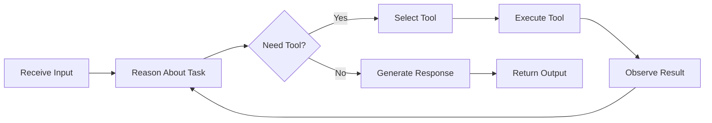

# Agents and Tools

## What You'll Learn

- Agent architectures and decision-making patterns
- Tool creation and integration for extending agent capabilities
- ReAct (Reasoning and Acting) pattern implementation
- Function calling and structured tool use
- Multi-agent systems and collaboration patterns
- Error handling and tool execution safety
- Agent evaluation and observability

## Why This Matters

Agents are the bridge between LLMs and the real world. While LLMs excel at language understanding and generation, they lack the ability to retrieve real-time data, perform calculations, or interact with external systems. Tools give agents these capabilities, transforming them from conversational interfaces into action-taking systems. In production, you need agents that can safely use tools, handle failures gracefully, and coordinate complex multi-step tasks—all while remaining observable and controllable.

## Agent Architecture

Agents follow a perception-decision-action loop, where they observe their environment, reason about what to do, and execute actions through tools.

### The Agent Loop



## Tool Definition

Tools are functions that agents can invoke to perform specific actions. LangChain provides a standardized interface for tool creation.

### Basic Tool Creation

```python
from langchain.tools import Tool
from langchain_core.tools import tool
from typing import Optional

# Using decorator (recommended)
@tool
def calculate(expression: str) -> str:
    """Evaluate a mathematical expression.
    
    Args:
        expression: A valid Python mathematical expression (e.g., "2 + 2", "sqrt(16)")
    
    Returns:
        The result of the calculation as a string.
    """
    try:
        # Safe evaluation (in production, use a proper math parser)
        result = eval(expression, {"__builtins__": {}}, {
            "sqrt": lambda x: x ** 0.5,
            "pow": pow,
            "abs": abs
        })
        return str(result)
    except Exception as e:
        return f"Error: {str(e)}"

# Using Tool class
def search_web(query: str) -> str:
    """Search the web for information."""
    # Implement web search
    return f"Search results for: {query}"

web_search_tool = Tool(
    name="WebSearch",
    func=search_web,
    description="Search the web for current information. Input should be a search query."
)

# Tool with complex inputs
@tool
def query_database(
    table: str,
    columns: Optional[str] = "*",
    where: Optional[str] = None
) -> str:
    """Query a database table.
    
    Args:
        table: The table name to query
        columns: Comma-separated column names (default: "*")
        where: SQL WHERE clause condition (optional)
    
    Returns:
        Query results as formatted string.
    """
    query = f"SELECT {columns} FROM {table}"
    if where:
        query += f" WHERE {where}"
    
    # Execute query (implement actual DB logic)
    return f"Results for: {query}"
```

### Structured Tool with Pydantic

```python
from langchain_core.tools import BaseTool
from pydantic import BaseModel, Field
from typing import Type

class EmailInput(BaseModel):
    """Input schema for sending email."""
    recipient: str = Field(description="Email address of recipient")
    subject: str = Field(description="Email subject line")
    body: str = Field(description="Email body content")
    priority: str = Field(
        default="normal",
        description="Priority level: low, normal, or high"
    )

class SendEmailTool(BaseTool):
    name: str = "send_email"
    description: str = "Send an email to a recipient"
    args_schema: Type[BaseModel] = EmailInput
    
    def _run(self, recipient: str, subject: str, body: str, priority: str = "normal") -> str:
        """Execute the tool."""
        # Implement email sending logic
        print(f"Sending email to {recipient}")
        print(f"Subject: {subject}")
        print(f"Body: {body}")
        print(f"Priority: {priority}")
        return f"Email sent successfully to {recipient}"
    
    async def _arun(self, recipient: str, subject: str, body: str, priority: str = "normal") -> str:
        """Async execution."""
        # Implement async email sending
        return await self._run(recipient, subject, body, priority)

# Usage
email_tool = SendEmailTool()
result = email_tool.invoke({
    "recipient": "user@example.com",
    "subject": "Meeting Update",
    "body": "The meeting has been rescheduled.",
    "priority": "high"
})
```

## ReAct Agents

ReAct (Reasoning and Acting) agents interleave thinking and acting, producing reasoning traces that explain their decisions.

### Implementing ReAct Pattern

```python
from langchain_openai import ChatOpenAI
from langchain.agents import AgentExecutor, create_react_agent
from langchain_core.prompts import PromptTemplate
from langchain.tools import Tool

# Define tools
@tool
def get_weather(location: str) -> str:
    """Get current weather for a location."""
    # Mock implementation
    return f"Weather in {location}: Sunny, 72°F"

@tool
def get_time(timezone: str = "UTC") -> str:
    """Get current time in a timezone."""
    from datetime import datetime
    return f"Current time ({timezone}): {datetime.now().isoformat()}"

@tool
def calculator(expression: str) -> str:
    """Perform mathematical calculations."""
    try:
        result = eval(expression, {"__builtins__": {}})
        return str(result)
    except Exception as e:
        return f"Error: {str(e)}"

tools = [get_weather, get_time, calculator]

# ReAct prompt template
react_prompt = PromptTemplate.from_template("""
Answer the following questions as best you can. You have access to the following tools:

{tools}

Use the following format:

Question: the input question you must answer
Thought: you should always think about what to do
Action: the action to take, should be one of [{tool_names}]
Action Input: the input to the action
Observation: the result of the action
... (this Thought/Action/Action Input/Observation can repeat N times)
Thought: I now know the final answer
Final Answer: the final answer to the original input question

Begin!

Question: {input}
Thought: {agent_scratchpad}
""")

# Create ReAct agent
llm = ChatOpenAI(model="gpt-4", temperature=0)
agent = create_react_agent(llm, tools, react_prompt)

# Create executor
agent_executor = AgentExecutor(
    agent=agent,
    tools=tools,
    verbose=True,
    max_iterations=5,
    handle_parsing_errors=True
)

# Execute
result = agent_executor.invoke({
    "input": "What's the weather in Paris and what time is it there?"
})

print(result["output"])
```

### Custom ReAct Implementation with LangGraph

```python
from typing import TypedDict, Annotated, Sequence
from langchain_core.messages import BaseMessage, FunctionMessage, AIMessage
from langgraph.graph import StateGraph, END
from langgraph.prebuilt import ToolNode
import json

class ReActState(TypedDict):
    messages: Annotated[Sequence[BaseMessage], operator.add]
    iterations: int

def create_react_agent(tools, llm, max_iterations=5):
    # Bind tools to LLM
    llm_with_tools = llm.bind_tools(tools)
    
    def should_continue(state: ReActState):
        messages = state["messages"]
        last_message = messages[-1]
        
        # Check if we're done
        if state["iterations"] >= max_iterations:
            return "end"
        
        # If LLM called a tool, continue
        if hasattr(last_message, "tool_calls") and last_message.tool_calls:
            return "continue"
        
        return "end"
    
    def call_model(state: ReActState):
        messages = state["messages"]
        response = llm_with_tools.invoke(messages)
        
        return {
            "messages": [response],
            "iterations": state["iterations"] + 1
        }
    
    # Build graph
    workflow = StateGraph(ReActState)
    
    # Add nodes
    workflow.add_node("agent", call_model)
    workflow.add_node("tools", ToolNode(tools))
    
    # Add edges
    workflow.add_edge("tools", "agent")
    workflow.add_conditional_edges(
        "agent",
        should_continue,
        {
            "continue": "tools",
            "end": END
        }
    )
    
    workflow.set_entry_point("agent")
    
    return workflow.compile()

# Usage
tools = [get_weather, get_time, calculator]
agent = create_react_agent(tools, ChatOpenAI(model="gpt-4"))

result = agent.invoke({
    "messages": [("user", "What's 25 * 48 and is it sunny in Tokyo?")],
    "iterations": 0
})
```

## Function Calling

Modern LLMs support structured function calling, enabling more reliable tool use.

### OpenAI Function Calling

```python
from langchain_openai import ChatOpenAI
from langchain_core.utils.function_calling import convert_to_openai_tool

# Define tools
@tool
def get_stock_price(symbol: str) -> float:
    """Get current stock price for a symbol."""
    # Mock implementation
    prices = {"AAPL": 178.50, "GOOGL": 142.30, "MSFT": 380.75}
    return prices.get(symbol.upper(), 0.0)

@tool
def get_company_info(symbol: str) -> dict:
    """Get company information."""
    companies = {
        "AAPL": {"name": "Apple Inc.", "sector": "Technology"},
        "GOOGL": {"name": "Alphabet Inc.", "sector": "Technology"}
    }
    return companies.get(symbol.upper(), {})

tools = [get_stock_price, get_company_info]

# Create LLM with function calling
llm = ChatOpenAI(model="gpt-4")
llm_with_tools = llm.bind_tools(tools)

# Invoke with automatic function calling
from langchain_core.messages import HumanMessage

response = llm_with_tools.invoke([
    HumanMessage(content="What's Apple's stock price and what sector are they in?")
])

# Check if tool was called
if response.tool_calls:
    for tool_call in response.tool_calls:
        print(f"Tool: {tool_call['name']}")
        print(f"Args: {tool_call['args']}")
        
        # Execute tool
        if tool_call['name'] == 'get_stock_price':
            result = get_stock_price.invoke(tool_call['args'])
            print(f"Result: {result}")
```

### Structured Output with Tools

```python
from langchain_core.pydantic_v1 import BaseModel, Field
from typing import List

class StockAnalysis(BaseModel):
    """Structured stock analysis."""
    symbol: str = Field(description="Stock ticker symbol")
    current_price: float = Field(description="Current stock price")
    recommendation: str = Field(description="Buy, Hold, or Sell recommendation")
    reasoning: str = Field(description="Reasoning for recommendation")

# Force structured output
llm_with_structure = llm.with_structured_output(StockAnalysis)

result: StockAnalysis = llm_with_structure.invoke([
    HumanMessage(content="Analyze AAPL stock (currently $178.50)")
])

print(f"Symbol: {result.symbol}")
print(f"Price: {result.current_price}")
print(f"Recommendation: {result.recommendation}")
print(f"Reasoning: {result.reasoning}")
```

## Tool Execution Safety

Implementing safety measures for tool execution is critical in production.

### Input Validation

```python
from pydantic import BaseModel, Field, validator

class FileOperationInput(BaseModel):
    """Validated input for file operations."""
    path: str = Field(description="File path")
    
    @validator('path')
    def validate_path(cls, v):
        """Ensure path is safe."""
        import os
        
        # Prevent path traversal
        if ".." in v:
            raise ValueError("Path traversal not allowed")
        
        # Restrict to specific directories
        allowed_dirs = ["/safe/directory"]
        abs_path = os.path.abspath(v)
        
        if not any(abs_path.startswith(d) for d in allowed_dirs):
            raise ValueError(f"Path must be in allowed directories: {allowed_dirs}")
        
        return v

@tool(args_schema=FileOperationInput)
def read_file(path: str) -> str:
    """Read a file safely."""
    # Input is validated by Pydantic
    with open(path, 'r') as f:
        return f.read()
```

### Sandboxed Execution

```python
import asyncio
from concurrent.futures import TimeoutError

@tool
def execute_code(code: str, timeout: int = 5) -> str:
    """Execute Python code in a sandboxed environment.
    
    Args:
        code: Python code to execute
        timeout: Maximum execution time in seconds
    
    Returns:
        Output of the code execution
    """
    import subprocess
    import tempfile
    import os
    
    # Create temporary file
    with tempfile.NamedTemporaryFile(mode='w', suffix='.py', delete=False) as f:
        f.write(code)
        temp_file = f.name
    
    try:
        # Run in restricted environment
        result = subprocess.run(
            ['python', temp_file],
            capture_output=True,
            text=True,
            timeout=timeout,
            # Restrict resources
            env={'PYTHONDONTWRITEBYTECODE': '1'}
        )
        
        return result.stdout if result.returncode == 0 else f"Error: {result.stderr}"
    
    except subprocess.TimeoutExpired:
        return f"Error: Execution timed out after {timeout} seconds"
    
    except Exception as e:
        return f"Error: {str(e)}"
    
    finally:
        # Clean up
        os.unlink(temp_file)
```

### Permission Management

```python
from enum import Enum
from typing import Set

class Permission(str, Enum):
    READ_FILES = "read_files"
    WRITE_FILES = "write_files"
    NETWORK_ACCESS = "network_access"
    EXECUTE_CODE = "execute_code"

class PermissionedTool(BaseTool):
    """Tool with permission requirements."""
    required_permissions: Set[Permission] = set()
    
    def check_permissions(self, user_permissions: Set[Permission]) -> bool:
        """Check if user has required permissions."""
        return self.required_permissions.issubset(user_permissions)
    
    def _run(self, *args, **kwargs):
        # Permission check handled by agent executor
        return self._execute(*args, **kwargs)
    
    def _execute(self, *args, **kwargs):
        """Override this method with actual tool logic."""
        raise NotImplementedError

class WriteFileTool(PermissionedTool):
    name: str = "write_file"
    description: str = "Write content to a file"
    required_permissions: Set[Permission] = {Permission.WRITE_FILES}
    
    def _execute(self, path: str, content: str) -> str:
        with open(path, 'w') as f:
            f.write(content)
        return f"Wrote to {path}"

# Agent with permission checking
class PermissionedAgentExecutor(AgentExecutor):
    user_permissions: Set[Permission]
    
    def _call(self, inputs):
        # Check tool permissions before execution
        for tool in self.tools:
            if isinstance(tool, PermissionedTool):
                if not tool.check_permissions(self.user_permissions):
                    raise PermissionError(
                        f"Tool {tool.name} requires {tool.required_permissions}"
                    )
        
        return super()._call(inputs)
```

## Multi-Agent Systems

Coordinating multiple specialized agents for complex tasks.

### Agent Collaboration Pattern

```python
from typing import List, Dict
from langgraph.graph import StateGraph, END

class MultiAgentState(TypedDict):
    task: str
    research_results: List[str]
    analysis: str
    code_generated: str
    review_feedback: str
    final_output: str

class MultiAgentSystem:
    def __init__(self):
        self.research_agent = self._create_research_agent()
        self.analyst_agent = self._create_analyst_agent()
        self.coder_agent = self._create_coder_agent()
        self.reviewer_agent = self._create_reviewer_agent()
        self.workflow = self._build_workflow()
    
    def _create_research_agent(self):
        """Agent specialized in research."""
        tools = [web_search_tool, database_query_tool]
        llm = ChatOpenAI(model="gpt-4")
        return create_react_agent(tools, llm)
    
    def _create_analyst_agent(self):
        """Agent specialized in analysis."""
        llm = ChatOpenAI(model="gpt-4", temperature=0.3)
        return llm
    
    def _create_coder_agent(self):
        """Agent specialized in coding."""
        tools = [execute_code_tool, linter_tool]
        llm = ChatOpenAI(model="gpt-4")
        return create_react_agent(tools, llm)
    
    def _create_reviewer_agent(self):
        """Agent specialized in code review."""
        llm = ChatOpenAI(model="gpt-4", temperature=0.1)
        return llm
    
    def _research_node(self, state: MultiAgentState) -> MultiAgentState:
        """Research phase."""
        result = self.research_agent.invoke({
            "messages": [("user", f"Research: {state['task']}")]
        })
        
        return {
            "research_results": [msg.content for msg in result["messages"]]
        }
    
    def _analyze_node(self, state: MultiAgentState) -> MultiAgentState:
        """Analysis phase."""
        prompt = f"""
        Task: {state['task']}
        Research: {state['research_results']}
        
        Provide technical analysis and approach.
        """
        
        result = self.analyst_agent.invoke([HumanMessage(content=prompt)])
        
        return {"analysis": result.content}
    
    def _code_node(self, state: MultiAgentState) -> MultiAgentState:
        """Coding phase."""
        result = self.coder_agent.invoke({
            "messages": [(
                "user",
                f"Implement: {state['task']}\nAnalysis: {state['analysis']}"
            )]
        })
        
        return {"code_generated": result["messages"][-1].content}
    
    def _review_node(self, state: MultiAgentState) -> MultiAgentState:
        """Review phase."""
        prompt = f"""
        Review this code:
        {state['code_generated']}
        
        Task requirements: {state['task']}
        Analysis: {state['analysis']}
        
        Provide feedback.
        """
        
        result = self.reviewer_agent.invoke([HumanMessage(content=prompt)])
        
        return {"review_feedback": result.content}
    
    def _should_revise(self, state: MultiAgentState) -> str:
        """Determine if revision needed."""
        if "needs revision" in state["review_feedback"].lower():
            return "revise"
        return "finalize"
    
    def _finalize_node(self, state: MultiAgentState) -> MultiAgentState:
        """Finalize output."""
        return {
            "final_output": f"""
            Code:
            {state['code_generated']}
            
            Review:
            {state['review_feedback']}
            
            Analysis:
            {state['analysis']}
            """
        }
    
    def _build_workflow(self) -> StateGraph:
        """Build multi-agent workflow."""
        workflow = StateGraph(MultiAgentState)
        
        workflow.add_node("research", self._research_node)
        workflow.add_node("analyze", self._analyze_node)
        workflow.add_node("code", self._code_node)
        workflow.add_node("review", self._review_node)
        workflow.add_node("finalize", self._finalize_node)
        
        # Sequential flow with potential loop
        workflow.add_edge("research", "analyze")
        workflow.add_edge("analyze", "code")
        workflow.add_edge("code", "review")
        
        workflow.add_conditional_edges(
            "review",
            self._should_revise,
            {
                "revise": "code",  # Loop back
                "finalize": "finalize"
            }
        )
        
        workflow.add_edge("finalize", END)
        workflow.set_entry_point("research")
        
        return workflow.compile()
    
    def execute(self, task: str) -> str:
        """Execute multi-agent workflow."""
        result = self.workflow.invoke({
            "task": task,
            "research_results": [],
            "analysis": "",
            "code_generated": "",
            "review_feedback": "",
            "final_output": ""
        })
        
        return result["final_output"]

# Usage
system = MultiAgentSystem()
output = system.execute("Create a REST API endpoint for user authentication")
```

### Hierarchical Agent Architecture

```python
class HierarchicalAgentSystem:
    """Manager agent delegates to specialist agents."""
    
    def __init__(self):
        self.manager = self._create_manager()
        self.specialists = {
            "data_engineer": self._create_data_specialist(),
            "ml_engineer": self._create_ml_specialist(),
            "backend_engineer": self._create_backend_specialist()
        }
    
    def _create_manager(self):
        """Manager decides which specialist to use."""
        llm = ChatOpenAI(model="gpt-4")
        
        @tool
        def delegate_to_specialist(specialist: str, task: str) -> str:
            """Delegate task to a specialist.
            
            Args:
                specialist: One of data_engineer, ml_engineer, backend_engineer
                task: The specific task for the specialist
            """
            if specialist in self.specialists:
                result = self.specialists[specialist].invoke(task)
                return result
            return f"Unknown specialist: {specialist}"
        
        return create_react_agent([delegate_to_specialist], llm)
    
    def _create_data_specialist(self):
        """Data engineering specialist."""
        tools = [query_database, transform_data]
        return create_react_agent(tools, ChatOpenAI(model="gpt-4"))
    
    def _create_ml_specialist(self):
        """ML engineering specialist."""
        tools = [train_model, evaluate_model]
        return create_react_agent(tools, ChatOpenAI(model="gpt-4"))
    
    def _create_backend_specialist(self):
        """Backend engineering specialist."""
        tools = [deploy_service, test_api]
        return create_react_agent(tools, ChatOpenAI(model="gpt-4"))
    
    def execute(self, task: str) -> str:
        """Manager delegates to appropriate specialists."""
        result = self.manager.invoke({
            "messages": [("user", task)]
        })
        return result["messages"][-1].content
```

## Real-World Scenario: DevOps Agent

A production DevOps agent that can diagnose and fix infrastructure issues.

```python
from typing import List, Dict, Optional
from datetime import datetime
import json

class DevOpsAgent:
    """Autonomous DevOps agent for infrastructure management."""
    
    def __init__(self):
        self.tools = self._create_tools()
        self.llm = ChatOpenAI(model="gpt-4", temperature=0)
        self.agent = self._create_agent()
    
    def _create_tools(self) -> List[Tool]:
        """Create DevOps tools."""
        
        @tool
        def check_service_health(service_name: str) -> Dict:
            """Check health of a service.
            
            Args:
                service_name: Name of the service to check
            
            Returns:
                Health status including uptime, errors, and resource usage
            """
            # Mock implementation - in reality, query monitoring system
            return {
                "service": service_name,
                "status": "degraded",
                "uptime": "99.9%",
                "error_rate": "5%",
                "cpu_usage": "85%",
                "memory_usage": "70%",
                "last_deployment": "2 hours ago"
            }
        
        @tool
        def view_logs(service_name: str, lines: int = 100, level: str = "ERROR") -> str:
            """View service logs.
            
            Args:
                service_name: Service to get logs from
                lines: Number of log lines to retrieve
                level: Log level (DEBUG, INFO, WARNING, ERROR)
            
            Returns:
                Recent log entries
            """
            # Mock logs
            return f"""
            [ERROR] Connection timeout to database
            [ERROR] High memory usage detected
            [WARNING] Slow query execution
            [ERROR] Failed to connect to cache
            """
        
        @tool
        def check_database_connections(db_name: str) -> Dict:
            """Check database connection pool status."""
            return {
                "database": db_name,
                "active_connections": 95,
                "max_connections": 100,
                "idle_connections": 3,
                "connection_errors": 12
            }
        
        @tool
        def scale_service(service_name: str, replicas: int) -> str:
            """Scale a service to specified number of replicas.
            
            Args:
                service_name: Service to scale
                replicas: Target number of replicas
            
            Returns:
                Scaling operation result
            """
            return f"Scaling {service_name} to {replicas} replicas..."
        
        @tool
        def restart_service(service_name: str) -> str:
            """Restart a service."""
            return f"Restarting {service_name}..."
        
        @tool
        def increase_connection_pool(db_name: str, new_max: int) -> str:
            """Increase database connection pool size."""
            return f"Increased {db_name} connection pool to {new_max}"
        
        @tool
        def clear_cache(cache_name: str) -> str:
            """Clear application cache."""
            return f"Cleared cache: {cache_name}"
        
        @tool
        def create_incident(title: str, severity: str, description: str) -> str:
            """Create incident ticket.
            
            Args:
                title: Incident title
                severity: One of: low, medium, high, critical
                description: Detailed description
            """
            ticket_id = f"INC-{datetime.now().strftime('%Y%m%d%H%M%S')}"
            return f"Created incident {ticket_id}: {title} [Severity: {severity}]"
        
        return [
            check_service_health,
            view_logs,
            check_database_connections,
            scale_service,
            restart_service,
            increase_connection_pool,
            clear_cache,
            create_incident
        ]
    
    def _create_agent(self):
        """Create ReAct agent with DevOps tools."""
        return create_react_agent(self.tools, self.llm)
    
    def diagnose_and_fix(self, issue: str) -> Dict:
        """Diagnose and attempt to fix an issue.
        
        Args:
            issue: Description of the problem
        
        Returns:
            Diagnosis, actions taken, and results
        """
        prompt = f"""
        Production issue reported: {issue}
        
        Your task:
        1. Diagnose the root cause using available tools
        2. Take appropriate remediation actions
        3. Create incident ticket if manual intervention needed
        4. Summarize what you found and did
        
        Be methodical and explain your reasoning.
        """
        
        result = self.agent.invoke({
            "messages": [("user", prompt)]
        })
        
        return {
            "timestamp": datetime.now().isoformat(),
            "issue": issue,
            "agent_response": result["messages"][-1].content,
            "actions_taken": self._extract_actions(result["messages"])
        }
    
    def _extract_actions(self, messages: List) -> List[str]:
        """Extract tool calls from agent messages."""
        actions = []
        for msg in messages:
            if hasattr(msg, 'tool_calls') and msg.tool_calls:
                for call in msg.tool_calls:
                    actions.append(f"{call['name']}({call['args']})")
        return actions

# Usage
agent = DevOpsAgent()

# Report an issue
result = agent.diagnose_and_fix(
    "API service is responding slowly and showing increased error rates"
)

print(json.dumps(result, indent=2))

# Expected agent behavior:
# 1. check_service_health("api-service") - diagnose
# 2. view_logs("api-service", level="ERROR") - investigate errors
# 3. check_database_connections("main-db") - check dependencies
# 4. increase_connection_pool("main-db", 150) - fix connection exhaustion
# 5. scale_service("api-service", 5) - handle load
# 6. create_incident("Database connection pool exhausted", "high", "...")
```

## Agent Observability

Monitoring and debugging agent behavior in production.

### Logging and Tracing

```python
from langchain.callbacks import StdOutCallbackHandler
from langchain.callbacks.base import BaseCallbackHandler
from typing import Any

class CustomAgentLogger(BaseCallbackHandler):
    """Custom callback for agent logging."""
    
    def __init__(self):
        self.logs = []
    
    def on_llm_start(self, serialized: Dict[str, Any], prompts: List[str], **kwargs):
        """Log LLM invocation."""
        self.logs.append({
            "event": "llm_start",
            "timestamp": datetime.now().isoformat(),
            "prompts": prompts
        })
    
    def on_llm_end(self, response, **kwargs):
        """Log LLM response."""
        self.logs.append({
            "event": "llm_end",
            "timestamp": datetime.now().isoformat(),
            "response": str(response)
        })
    
    def on_tool_start(self, serialized: Dict[str, Any], input_str: str, **kwargs):
        """Log tool invocation."""
        self.logs.append({
            "event": "tool_start",
            "timestamp": datetime.now().isoformat(),
            "tool": serialized.get("name"),
            "input": input_str
        })
    
    def on_tool_end(self, output: str, **kwargs):
        """Log tool result."""
        self.logs.append({
            "event": "tool_end",
            "timestamp": datetime.now().isoformat(),
            "output": output
        })
    
    def on_agent_action(self, action, **kwargs):
        """Log agent action decision."""
        self.logs.append({
            "event": "agent_action",
            "timestamp": datetime.now().isoformat(),
            "tool": action.tool,
            "input": action.tool_input,
            "log": action.log
        })
    
    def on_agent_finish(self, finish, **kwargs):
        """Log agent completion."""
        self.logs.append({
            "event": "agent_finish",
            "timestamp": datetime.now().isoformat(),
            "output": finish.return_values
        })
    
    def get_logs(self) -> List[Dict]:
        """Retrieve all logs."""
        return self.logs

# Usage with agent
logger = CustomAgentLogger()

agent_executor = AgentExecutor(
    agent=agent,
    tools=tools,
    callbacks=[logger],
    verbose=True
)

result = agent_executor.invoke({"input": "What's the weather?"})

# Review logs
for log in logger.get_logs():
    print(json.dumps(log, indent=2))
```

### LangSmith Integration

```python
from langsmith import Client
from langchain.callbacks.tracers import LangChainTracer

# Configure LangSmith
client = Client()
tracer = LangChainTracer(project_name="production-agents")

# Agent with tracing
agent_executor = AgentExecutor(
    agent=agent,
    tools=tools,
    callbacks=[tracer]
)

# Execution is automatically traced
result = agent_executor.invoke({"input": "Process this task"})

# View traces in LangSmith dashboard
```

## Best Practices

**Design Tools with Clear Descriptions**: LLMs rely on tool descriptions to decide when to use them.

```python
# ✅ Clear, specific description
@tool
def search_customer_by_email(email: str) -> dict:
    """Search for a customer record using their email address.
    Use this when you need customer information and have their email.
    Returns customer ID, name, and account status."""
    pass

# ❌ Vague description
@tool
def search(query: str) -> dict:
    """Search for stuff."""  # LLM won't know when to use this
    pass
```

**Implement Idempotent Tools**: Tools should be safe to retry without side effects.

```python
# ✅ Idempotent operation
@tool
def get_user_data(user_id: str) -> dict:
    """Read-only operation, safe to retry."""
    return database.get(user_id)

# ❌ Non-idempotent without safeguards
@tool
def create_user(email: str) -> dict:
    """Creates duplicate if retried."""
    return database.insert({"email": email})

# ✅ Idempotent with safeguards
@tool
def create_user(email: str) -> dict:
    """Idempotent user creation."""
    existing = database.find_by_email(email)
    if existing:
        return existing
    return database.insert({"email": email})
```

**Set Maximum Iterations**: Prevent infinite loops in agent reasoning.

```python
# ✅ Bounded execution
agent_executor = AgentExecutor(
    agent=agent,
    tools=tools,
    max_iterations=5,  # Limit reasoning steps
    max_execution_time=30  # Timeout after 30 seconds
)

# ❌ Unbounded execution
agent_executor = AgentExecutor(agent=agent, tools=tools)  # Could loop forever
```

**Validate Tool Outputs**: Ensure tool results are in expected format.

```python
# ✅ Validated tool output
@tool
def fetch_data(query: str) -> str:
    """Fetch data with validation."""
    try:
        result = api_call(query)
        # Validate result structure
        if not isinstance(result, dict) or 'data' not in result:
            return "Error: Invalid response format"
        return json.dumps(result['data'])
    except Exception as e:
        return f"Error: {str(e)}"

# ❌ Unvalidated output
@tool
def fetch_data(query: str):
    return api_call(query)  # Might return None, raise exception, etc.
```

## Anti-Patterns

❌ **Tools That Do Too Much**: Keep tools focused on single responsibilities.

```python
# ❌ Swiss army knife tool
@tool
def manage_user(action: str, user_id: str, data: dict) -> str:
    """Create, update, delete, or read user. Too many responsibilities!"""
    if action == "create":
        # ...
    elif action == "update":
        # ...
    # Hard for LLM to use correctly

# ✅ Focused tools
@tool
def create_user(email: str, name: str) -> str:
    """Create a new user."""
    pass

@tool
def update_user(user_id: str, name: str) -> str:
    """Update existing user."""
    pass
```

❌ **No Error Handling in Tools**: Unhandled errors crash the agent.

```python
# ❌ No error handling
@tool
def divide_numbers(a: float, b: float) -> float:
    return a / b  # Crashes on division by zero

# ✅ Graceful error handling
@tool
def divide_numbers(a: float, b: float) -> str:
    try:
        result = a / b
        return str(result)
    except ZeroDivisionError:
        return "Error: Cannot divide by zero"
    except Exception as e:
        return f"Error: {str(e)}"
```

❌ **Blocking I/O in Tools**: Synchronous operations block the agent.

```python
# ❌ Blocking operation
@tool
def fetch_url(url: str) -> str:
    import requests
    response = requests.get(url)  # Blocks for entire request
    return response.text

# ✅ Async operation
@tool
async def fetch_url(url: str) -> str:
    import aiohttp
    async with aiohttp.ClientSession() as session:
        async with session.get(url) as response:
            return await response.text()
```

## Related Topics

- [LangChain Fundamentals](01-langchain-fundamentals.md) - Core LangChain concepts
- [LangGraph Architecture](02-langgraph-architecture.md) - State machines and workflows
- [Memory and State Management](04-memory-state-management.md) - Context persistence
- [Production Deployment](06-production-deployment.md) - Deploying agents
