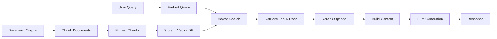

# RAG Patterns and Vector Stores

## What You'll Learn

- Retrieval-Augmented Generation (RAG) architecture and patterns
- Vector database selection and optimization
- Chunking strategies for different document types
- Embedding models and semantic search techniques
- Advanced RAG patterns: HyDE, Self-Query, Multi-Query
- Reranking and hybrid search approaches
- Production RAG system design and evaluation

## Why This Matters

RAG has become the foundational pattern for building LLM applications that need to reference specific knowledge bases. Pure LLMs hallucinate and lack access to proprietary data. RAG solves this by retrieving relevant context before generation, grounding responses in actual documents. In production, RAG systems must handle millions of documents, sub-second query latency, and maintain high retrieval accuracy—requiring careful design of chunking, embedding, indexing, and retrieval strategies.

## RAG Architecture

RAG separates the knowledge retrieval phase from the generation phase, allowing LLMs to answer questions based on retrieved context rather than relying solely on training data.

### The RAG Pipeline



The system has two phases: indexing (offline) and retrieval (online). Indexing processes documents into searchable chunks. Retrieval finds relevant chunks for queries and generates responses.

## Document Processing and Chunking

Chunking strategy significantly impacts retrieval quality. Poor chunking leads to context fragmentation or irrelevant retrievals.

### Basic Chunking Strategies

```python
from langchain.text_splitter import (
    RecursiveCharacterTextSplitter,
    CharacterTextSplitter,
    TokenTextSplitter
)
from langchain_community.document_loaders import TextLoader

# Load documents
loader = TextLoader("document.txt")
documents = loader.load()

# Character-based chunking (simple)
char_splitter = CharacterTextSplitter(
    separator="\n\n",  # Split on double newline
    chunk_size=1000,
    chunk_overlap=200,  # Overlap prevents context loss at boundaries
    length_function=len
)

# Recursive chunking (better for code/structure)
recursive_splitter = RecursiveCharacterTextSplitter(
    separators=["\n\n", "\n", " ", ""],  # Try these in order
    chunk_size=1000,
    chunk_overlap=200,
    length_function=len
)

# Token-based chunking (precise for LLM context windows)
token_splitter = TokenTextSplitter(
    chunk_size=512,  # Number of tokens
    chunk_overlap=50
)

# Apply splitting
chunks = recursive_splitter.split_documents(documents)

print(f"Created {len(chunks)} chunks")
for i, chunk in enumerate(chunks[:3]):
    print(f"\nChunk {i}:")
    print(chunk.page_content[:200])
```

### Semantic Chunking

```python
from langchain_experimental.text_splitter import SemanticChunker
from langchain_openai import OpenAIEmbeddings

# Split based on semantic similarity
semantic_chunker = SemanticChunker(
    OpenAIEmbeddings(),
    breakpoint_threshold_type="percentile",  # or "standard_deviation", "interquartile"
    breakpoint_threshold_amount=90  # Percentile threshold
)

semantic_chunks = semantic_chunker.split_documents(documents)

# Chunks are created at natural semantic boundaries
# More intelligent than fixed-size splitting
```

### Domain-Specific Chunking

```python
from langchain.text_splitter import Language
from langchain_text_splitters import RecursiveCharacterTextSplitter

# Code-aware chunking
python_splitter = RecursiveCharacterTextSplitter.from_language(
    language=Language.PYTHON,
    chunk_size=1000,
    chunk_overlap=100
)

# Respects Python syntax structure
python_code = """
def calculate_total(items):
    total = 0
    for item in items:
        total += item.price
    return total

class ShoppingCart:
    def __init__(self):
        self.items = []
"""

code_chunks = python_splitter.split_text(python_code)

# Markdown-aware chunking
markdown_splitter = RecursiveCharacterTextSplitter.from_language(
    language=Language.MARKDOWN,
    chunk_size=500,
    chunk_overlap=50
)

# Preserves headers and structure
```

### Metadata-Enhanced Chunking

```python
from langchain.schema import Document
from typing import List

def chunk_with_metadata(
    documents: List[Document],
    chunk_size: int = 1000
) -> List[Document]:
    """Chunk documents while preserving and enhancing metadata."""
    
    splitter = RecursiveCharacterTextSplitter(
        chunk_size=chunk_size,
        chunk_overlap=200
    )
    
    chunks = []
    for doc in documents:
        doc_chunks = splitter.split_documents([doc])
        
        # Enhance each chunk with additional metadata
        for i, chunk in enumerate(doc_chunks):
            chunk.metadata.update({
                "chunk_index": i,
                "total_chunks": len(doc_chunks),
                "source_doc_id": doc.metadata.get("source", "unknown"),
                "chunk_size": len(chunk.page_content)
            })
            chunks.append(chunk)
    
    return chunks

# Usage
enriched_chunks = chunk_with_metadata(documents, chunk_size=800)

# Metadata available during retrieval
for chunk in enriched_chunks[:2]:
    print(f"Chunk {chunk.metadata['chunk_index']} of {chunk.metadata['total_chunks']}")
    print(f"Source: {chunk.metadata['source_doc_id']}")
```

## Embedding Models

Embedding models transform text into dense vector representations that capture semantic meaning.

### Embedding Model Selection

```python
from langchain_openai import OpenAIEmbeddings
from langchain_community.embeddings import HuggingFaceEmbeddings
from langchain_cohere import CohereEmbeddings

# OpenAI embeddings (high quality, commercial)
openai_embeddings = OpenAIEmbeddings(
    model="text-embedding-3-large",  # 3072 dimensions
    # or "text-embedding-3-small" for 1536 dimensions (faster, cheaper)
)

# Cohere embeddings (good for search)
cohere_embeddings = CohereEmbeddings(
    model="embed-english-v3.0",
    input_type="search_document"  # or "search_query"
)

# Open-source embeddings (free, self-hosted)
hf_embeddings = HuggingFaceEmbeddings(
    model_name="sentence-transformers/all-MiniLM-L6-v2",  # 384 dims
    model_kwargs={'device': 'cpu'},
    encode_kwargs={'normalize_embeddings': True}
)

# Embed text
text = "What is machine learning?"
vector = openai_embeddings.embed_query(text)
print(f"Embedding dimension: {len(vector)}")
print(f"First 5 values: {vector[:5]}")
```

### Custom Embedding Pipeline

```python
from typing import List
import numpy as np

class CachedEmbeddings:
    """Embedding model with caching for efficiency."""
    
    def __init__(self, base_embeddings, cache_size: int = 10000):
        self.base_embeddings = base_embeddings
        self.cache = {}
        self.cache_size = cache_size
    
    def embed_query(self, text: str) -> List[float]:
        """Embed with cache lookup."""
        if text in self.cache:
            return self.cache[text]
        
        embedding = self.base_embeddings.embed_query(text)
        
        # Maintain cache size
        if len(self.cache) >= self.cache_size:
            # Remove oldest entry
            self.cache.pop(next(iter(self.cache)))
        
        self.cache[text] = embedding
        return embedding
    
    def embed_documents(self, texts: List[str]) -> List[List[float]]:
        """Batch embedding with caching."""
        embeddings = []
        uncached = []
        uncached_indices = []
        
        for i, text in enumerate(texts):
            if text in self.cache:
                embeddings.append(self.cache[text])
            else:
                uncached.append(text)
                uncached_indices.append(i)
                embeddings.append(None)
        
        # Batch embed uncached texts
        if uncached:
            new_embeddings = self.base_embeddings.embed_documents(uncached)
            
            for idx, embedding in zip(uncached_indices, new_embeddings):
                embeddings[idx] = embedding
                self.cache[uncached[uncached_indices.index(idx)]] = embedding
        
        return embeddings

# Usage
base = OpenAIEmbeddings()
cached_embeddings = CachedEmbeddings(base)
```

## Vector Stores

Vector databases store embeddings and enable efficient similarity search.

### Chroma (Local Development)

```python
from langchain_community.vectorstores import Chroma
from langchain_openai import OpenAIEmbeddings
from langchain_community.document_loaders import DirectoryLoader

# Load and chunk documents
loader = DirectoryLoader("./docs", glob="**/*.md")
documents = loader.load()

splitter = RecursiveCharacterTextSplitter(chunk_size=1000, chunk_overlap=200)
chunks = splitter.split_documents(documents)

# Create vector store
embeddings = OpenAIEmbeddings()
vectorstore = Chroma.from_documents(
    documents=chunks,
    embedding=embeddings,
    persist_directory="./chroma_db",  # Persist to disk
    collection_name="docs_collection"
)

# Query
query = "How to implement authentication?"
results = vectorstore.similarity_search(query, k=4)

for i, doc in enumerate(results):
    print(f"\n--- Result {i+1} ---")
    print(doc.page_content[:200])
    print(f"Metadata: {doc.metadata}")
```

### Pinecone (Production Scale)

```python
from langchain_pinecone import PineconeVectorStore
from pinecone import Pinecone, ServerlessSpec
from langchain_openai import OpenAIEmbeddings

# Initialize Pinecone
pc = Pinecone(api_key="your-api-key")

# Create index if not exists
index_name = "langchain-docs"
if index_name not in pc.list_indexes().names():
    pc.create_index(
        name=index_name,
        dimension=1536,  # Match embedding dimension
        metric="cosine",
        spec=ServerlessSpec(
            cloud="aws",
            region="us-east-1"
        )
    )

# Create vector store
embeddings = OpenAIEmbeddings()
vectorstore = PineconeVectorStore(
    index_name=index_name,
    embedding=embeddings,
    namespace="documentation"  # Logical partition
)

# Add documents
vectorstore.add_documents(chunks)

# Query with filters
results = vectorstore.similarity_search(
    query="microservices patterns",
    k=4,
    filter={"category": "architecture"}  # Metadata filter
)
```

### Weaviate (Hybrid Search)

```python
from langchain_weaviate import WeaviateVectorStore
import weaviate

# Connect to Weaviate
client = weaviate.Client(
    url="http://localhost:8080",
    additional_headers={"X-OpenAI-Api-Key": "your-key"}
)

# Create vector store with hybrid search
vectorstore = WeaviateVectorStore(
    client=client,
    index_name="DocumentsIndex",
    text_key="content",
    embedding=OpenAIEmbeddings()
)

# Add documents
vectorstore.add_documents(chunks)

# Hybrid search (combines vector + keyword search)
results = vectorstore.similarity_search(
    query="REST API best practices",
    k=5,
    search_type="hybrid",  # or "similarity", "mmr"
    alpha=0.5  # Balance between vector (1.0) and keyword (0.0)
)
```

## Retrieval Strategies

### Similarity Search with Score

```python
# Get similarity scores
results_with_scores = vectorstore.similarity_search_with_score(
    query="What is Docker?",
    k=4
)

for doc, score in results_with_scores:
    print(f"Score: {score:.3f}")
    print(f"Content: {doc.page_content[:100]}...")
    print("---")

# Filter by score threshold
threshold = 0.7
filtered_results = [
    doc for doc, score in results_with_scores
    if score >= threshold
]
```

### Maximum Marginal Relevance (MMR)

MMR balances relevance with diversity, avoiding redundant results.

```python
# MMR search - diverse results
mmr_results = vectorstore.max_marginal_relevance_search(
    query="microservices deployment",
    k=5,
    fetch_k=20,  # Fetch 20, return 5 most diverse
    lambda_mult=0.5  # Balance relevance (1.0) vs diversity (0.0)
)

# Results are relevant but cover different aspects
for doc in mmr_results:
    print(f"Topic: {doc.metadata.get('topic', 'N/A')}")
    print(f"Content: {doc.page_content[:150]}...")
    print("---")
```

### Self-Query Retriever

Automatically extracts filters from natural language queries.

```python
from langchain.retrievers.self_query.base import SelfQueryRetriever
from langchain.chains.query_constructor.base import AttributeInfo
from langchain_openai import ChatOpenAI

# Define metadata schema
metadata_field_info = [
    AttributeInfo(
        name="category",
        description="The category of the document (e.g., architecture, security, performance)",
        type="string"
    ),
    AttributeInfo(
        name="author",
        description="The author of the document",
        type="string"
    ),
    AttributeInfo(
        name="date",
        description="The publication date",
        type="string"
    ),
]

document_content_description = "Technical documentation about software engineering"

# Create self-query retriever
llm = ChatOpenAI(model="gpt-4", temperature=0)
retriever = SelfQueryRetriever.from_llm(
    llm=llm,
    vectorstore=vectorstore,
    document_contents=document_content_description,
    metadata_field_info=metadata_field_info,
    verbose=True
)

# Natural language query with implicit filters
results = retriever.get_relevant_documents(
    "Show me security documents written by Alice after 2023"
)
# Automatically extracts: category="security", author="Alice", date>"2023"
```

### Multi-Query Retrieval

Generate multiple query variations to improve recall.

```python
from langchain.retrievers.multi_query import MultiQueryRetriever

llm = ChatOpenAI(model="gpt-4", temperature=0)

# Create multi-query retriever
multi_query_retriever = MultiQueryRetriever.from_llm(
    retriever=vectorstore.as_retriever(search_kwargs={"k": 3}),
    llm=llm
)

# Single user query generates multiple search queries
results = multi_query_retriever.get_relevant_documents(
    "How do I scale a microservices application?"
)
# Internally generates queries like:
# - "Microservices horizontal scaling strategies"
# - "Auto-scaling microservices architecture"  
# - "Handling load in distributed microservices"
# Then deduplicates and combines results
```

### Parent Document Retriever

Store small chunks for search, but return larger parent documents for context.

```python
from langchain.retrievers import ParentDocumentRetriever
from langchain.storage import InMemoryStore

# Small chunks for precise retrieval
child_splitter = RecursiveCharacterTextSplitter(chunk_size=200)

# Larger parent documents for context
parent_splitter = RecursiveCharacterTextSplitter(chunk_size=1000)

# Storage for parent documents
store = InMemoryStore()

# Create retriever
retriever = ParentDocumentRetriever(
    vectorstore=vectorstore,
    docstore=store,
    child_splitter=child_splitter,
    parent_splitter=parent_splitter,
)

# Add documents
retriever.add_documents(documents)

# Search with small chunks, get large parents
results = retriever.get_relevant_documents("What is Kubernetes?")
# Returns parent documents for better context
```

## Advanced RAG Patterns

### HyDE (Hypothetical Document Embeddings)

Generate a hypothetical answer, then search using that answer's embedding.

```python
from langchain.chains import HypotheticalDocumentEmbedder
from langchain_openai import OpenAI, OpenAIEmbeddings

# Create HyDE embedder
llm = OpenAI(model="gpt-3.5-turbo-instruct")
embeddings = OpenAIEmbeddings()

hyde_embedder = HypotheticalDocumentEmbedder.from_llm(
    llm=llm,
    base_embeddings=embeddings,
    prompt_key="web_search"  # Prompt template for generation
)

# Create vector store with HyDE embeddings
hyde_vectorstore = Chroma.from_documents(
    documents=chunks,
    embedding=hyde_embedder
)

# Query: generates hypothetical answer, embeds it, searches
results = hyde_vectorstore.similarity_search(
    "Explain the CAP theorem in distributed systems"
)
# More likely to find relevant content vs direct query embedding
```

### Contextual Compression

Compress retrieved documents to only relevant parts.

```python
from langchain.retrievers import ContextualCompressionRetriever
from langchain.retrievers.document_compressors import LLMChainExtractor
from langchain_openai import ChatOpenAI

# Base retriever
base_retriever = vectorstore.as_retriever(search_kwargs={"k": 5})

# Compressor extracts relevant parts
llm = ChatOpenAI(model="gpt-4", temperature=0)
compressor = LLMChainExtractor.from_llm(llm)

# Compression retriever
compression_retriever = ContextualCompressionRetriever(
    base_compressor=compressor,
    base_retriever=base_retriever
)

# Query
query = "How does JWT authentication work?"
compressed_docs = compression_retriever.get_relevant_documents(query)

# Returned documents contain only relevant excerpts
for doc in compressed_docs:
    print(f"Compressed content: {doc.page_content}")
    print(f"Original length: {len(doc.metadata.get('original_content', ''))}")
    print("---")
```

### Ensemble Retriever

Combine multiple retrieval methods for better results.

```python
from langchain.retrievers import EnsembleRetriever, BM25Retriever
from langchain_community.vectorstores import FAISS

# Vector retriever
vector_retriever = vectorstore.as_retriever(search_kwargs={"k": 5})

# BM25 keyword retriever
bm25_retriever = BM25Retriever.from_documents(chunks)
bm25_retriever.k = 5

# Ensemble combines both
ensemble_retriever = EnsembleRetriever(
    retrievers=[vector_retriever, bm25_retriever],
    weights=[0.6, 0.4]  # Vector gets 60%, BM25 gets 40%
)

# Query uses both methods
results = ensemble_retriever.get_relevant_documents(
    "microservices communication patterns"
)
# Combines semantic understanding with keyword matching
```

## Reranking

Reranking refines initial retrieval results using a more powerful model.

### Cross-Encoder Reranking

```python
from langchain.retrievers.document_compressors import CohereRerank
from langchain.retrievers import ContextualCompressionRetriever

# Base retriever gets more documents
base_retriever = vectorstore.as_retriever(search_kwargs={"k": 20})

# Reranker narrows down to best results
reranker = CohereRerank(
    model="rerank-english-v3.0",
    top_n=5  # Return top 5 after reranking
)

# Compression retriever with reranker
rerank_retriever = ContextualCompressionRetriever(
    base_compressor=reranker,
    base_retriever=base_retriever
)

# Two-stage retrieval
results = rerank_retriever.get_relevant_documents(
    "Best practices for API versioning"
)
# First gets 20 candidates, then reranks to best 5
```

### Custom Reranking Logic

```python
from typing import List
from langchain.schema import Document

class CustomReranker:
    """Custom reranking based on multiple signals."""
    
    def __init__(self, llm):
        self.llm = llm
    
    def rerank(self, query: str, documents: List[Document], top_k: int = 5) -> List[Document]:
        """Rerank documents based on query relevance."""
        
        # Score each document
        scored_docs = []
        for doc in documents:
            score = self._score_document(query, doc)
            scored_docs.append((doc, score))
        
        # Sort by score
        scored_docs.sort(key=lambda x: x[1], reverse=True)
        
        # Return top k
        return [doc for doc, score in scored_docs[:top_k]]
    
    def _score_document(self, query: str, doc: Document) -> float:
        """Score document relevance."""
        score = 0.0
        
        # Boost by recency
        if 'date' in doc.metadata:
            # More recent = higher score
            score += self._recency_score(doc.metadata['date'])
        
        # Boost by document type
        if doc.metadata.get('type') == 'official_docs':
            score += 0.2
        
        # Boost by length (not too short, not too long)
        length = len(doc.page_content)
        if 200 <= length <= 1000:
            score += 0.1
        
        # Use LLM for semantic relevance (expensive, use sparingly)
        if score > 0.5:  # Only for promising candidates
            semantic_score = self._llm_relevance(query, doc)
            score += semantic_score * 0.5
        
        return score
    
    def _recency_score(self, date_str: str) -> float:
        """Calculate recency score."""
        from datetime import datetime
        try:
            doc_date = datetime.fromisoformat(date_str)
            days_old = (datetime.now() - doc_date).days
            return max(0, 1 - (days_old / 365))  # Decay over a year
        except:
            return 0.0
    
    def _llm_relevance(self, query: str, doc: Document) -> float:
        """Use LLM to score relevance."""
        prompt = f"""
        Query: {query}
        Document: {doc.page_content[:500]}
        
        Rate relevance 0.0 to 1.0:
        """
        response = self.llm.invoke(prompt)
        try:
            return float(response.content.strip())
        except:
            return 0.5
```

## Production RAG System

A complete RAG system with all components integrated.

```python
from typing import List, Dict, Optional
from langchain_openai import ChatOpenAI, OpenAIEmbeddings
from langchain_community.vectorstores import Pinecone
from langchain.chains import RetrievalQA
from langchain.prompts import PromptTemplate
from langchain.callbacks import StreamingStdOutCallbackHandler
import logging

class ProductionRAGSystem:
    """Production-ready RAG system with monitoring and optimization."""
    
    def __init__(
        self,
        index_name: str,
        model: str = "gpt-4",
        embedding_model: str = "text-embedding-3-large"
    ):
        self.embeddings = OpenAIEmbeddings(model=embedding_model)
        self.llm = ChatOpenAI(
            model=model,
            temperature=0,
            streaming=True,
            callbacks=[StreamingStdOutCallbackHandler()]
        )
        
        self.vectorstore = self._setup_vectorstore(index_name)
        self.retriever = self._setup_retriever()
        self.qa_chain = self._setup_qa_chain()
        
        self.logger = logging.getLogger(__name__)
    
    def _setup_vectorstore(self, index_name: str):
        """Initialize vector store."""
        from langchain_pinecone import PineconeVectorStore
        
        return PineconeVectorStore(
            index_name=index_name,
            embedding=self.embeddings
        )
    
    def _setup_retriever(self):
        """Configure retriever with ensemble and reranking."""
        from langchain.retrievers import ContextualCompressionRetriever
        from langchain.retrievers.document_compressors import CohereRerank
        
        # Base retriever with MMR
        base_retriever = self.vectorstore.as_retriever(
            search_type="mmr",
            search_kwargs={
                "k": 10,
                "fetch_k": 30,
                "lambda_mult": 0.7
            }
        )
        
        # Add reranking
        reranker = CohereRerank(model="rerank-english-v3.0", top_n=5)
        
        compression_retriever = ContextualCompressionRetriever(
            base_compressor=reranker,
            base_retriever=base_retriever
        )
        
        return compression_retriever
    
    def _setup_qa_chain(self):
        """Configure QA chain with custom prompt."""
        
        prompt_template = """You are a technical assistant answering questions based on documentation.

Context:
{context}

Question: {question}

Instructions:
- Answer based on the provided context
- If context doesn't contain the answer, say "I don't have enough information"
- Include relevant code examples if present in context
- Cite sources when possible

Answer:"""

        prompt = PromptTemplate(
            template=prompt_template,
            input_variables=["context", "question"]
        )
        
        qa_chain = RetrievalQA.from_chain_type(
            llm=self.llm,
            chain_type="stuff",
            retriever=self.retriever,
            return_source_documents=True,
            chain_type_kwargs={"prompt": prompt}
        )
        
        return qa_chain
    
    def query(
        self,
        question: str,
        filters: Optional[Dict] = None
    ) -> Dict:
        """Execute RAG query with monitoring."""
        
        import time
        start_time = time.time()
        
        try:
            # Log query
            self.logger.info(f"Query: {question}")
            
            # Execute
            result = self.qa_chain({"query": question})
            
            # Calculate metrics
            latency = time.time() - start_time
            num_sources = len(result.get("source_documents", []))
            
            self.logger.info(f"Latency: {latency:.2f}s, Sources: {num_sources}")
            
            return {
                "answer": result["result"],
                "sources": [
                    {
                        "content": doc.page_content[:200],
                        "metadata": doc.metadata
                    }
                    for doc in result.get("source_documents", [])
                ],
                "latency": latency,
                "num_sources": num_sources
            }
        
        except Exception as e:
            self.logger.error(f"Query failed: {str(e)}")
            return {
                "answer": "An error occurred processing your query.",
                "error": str(e)
            }
    
    def add_documents(
        self,
        documents: List[Document],
        batch_size: int = 100
    ):
        """Add documents with batching."""
        
        from langchain.text_splitter import RecursiveCharacterTextSplitter
        
        # Chunk documents
        splitter = RecursiveCharacterTextSplitter(
            chunk_size=1000,
            chunk_overlap=200
        )
        chunks = splitter.split_documents(documents)
        
        self.logger.info(f"Adding {len(chunks)} chunks")
        
        # Batch insert
        for i in range(0, len(chunks), batch_size):
            batch = chunks[i:i + batch_size]
            self.vectorstore.add_documents(batch)
            self.logger.info(f"Added batch {i//batch_size + 1}")
    
    async def aquery(self, question: str) -> Dict:
        """Async query for concurrent requests."""
        # Implement async version
        pass

# Usage
rag_system = ProductionRAGSystem(index_name="company-docs")

# Query
result = rag_system.query("How do I implement OAuth2?")

print(f"Answer: {result['answer']}")
print(f"\nSources ({result['num_sources']}):")
for i, source in enumerate(result['sources'], 1):
    print(f"{i}. {source['metadata'].get('source', 'Unknown')}")
    print(f"   {source['content']}...")
```

## RAG Evaluation

Measuring RAG system quality.

### Retrieval Metrics

```python
from typing import List, Set

def calculate_retrieval_metrics(
    retrieved_docs: List[str],
    relevant_docs: List[str],
    k: int = 5
) -> Dict[str, float]:
    """Calculate retrieval quality metrics."""
    
    retrieved_set = set(retrieved_docs[:k])
    relevant_set = set(relevant_docs)
    
    # Precision: What fraction of retrieved docs are relevant?
    precision = len(retrieved_set & relevant_set) / len(retrieved_set) if retrieved_set else 0
    
    # Recall: What fraction of relevant docs were retrieved?
    recall = len(retrieved_set & relevant_set) / len(relevant_set) if relevant_set else 0
    
    # F1 Score
    f1 = 2 * (precision * recall) / (precision + recall) if (precision + recall) > 0 else 0
    
    # Mean Reciprocal Rank
    mrr = 0
    for i, doc in enumerate(retrieved_docs[:k], 1):
        if doc in relevant_set:
            mrr = 1 / i
            break
    
    return {
        "precision@k": precision,
        "recall@k": recall,
        "f1@k": f1,
        "mrr": mrr
    }

# Example
retrieved = ["doc1", "doc2", "doc3", "doc4", "doc5"]
relevant = ["doc2", "doc4", "doc7"]

metrics = calculate_retrieval_metrics(retrieved, relevant, k=5)
print(f"Precision@5: {metrics['precision@k']:.2f}")
print(f"Recall@5: {metrics['recall@k']:.2f}")
```

### Answer Quality Evaluation

```python
from langchain.evaluation import load_evaluator
from langchain_openai import ChatOpenAI

# Create evaluator
llm = ChatOpenAI(model="gpt-4", temperature=0)
evaluator = load_evaluator("qa", llm=llm)

# Evaluate answer quality
evaluation = evaluator.evaluate_strings(
    prediction="Microservices are...",  # RAG system answer
    input="What are microservices?",  # Question
    reference="Microservices architecture is..."  # Ground truth (optional)
)

print(f"Score: {evaluation['score']}")
print(f"Reasoning: {evaluation['reasoning']}")
```

## Best Practices

**Choose Appropriate Chunk Size**: Balance between context and precision.

```python
# ✅ Domain-appropriate chunking
# Code: smaller chunks (200-500 tokens)
code_splitter = RecursiveCharacterTextSplitter(chunk_size=500)

# Documentation: medium chunks (500-1000 tokens)
doc_splitter = RecursiveCharacterTextSplitter(chunk_size=1000)

# Books: larger chunks (1000-2000 tokens)
book_splitter = RecursiveCharacterTextSplitter(chunk_size=1500)

# ❌ One size fits all
splitter = RecursiveCharacterTextSplitter(chunk_size=1000)  # May not be optimal
```

**Enrich Metadata for Filtering**: Add searchable metadata to chunks.

```python
# ✅ Rich metadata
chunk.metadata = {
    "source": "api-docs.md",
    "category": "authentication",
    "date": "2024-01-15",
    "author": "Alice",
    "tags": ["security", "oauth", "jwt"],
    "version": "v2.0"
}

# ❌ Minimal metadata
chunk.metadata = {"source": "doc.md"}
```

**Use Hybrid Search for Better Recall**: Combine vector and keyword search.

```python
# ✅ Hybrid search
ensemble_retriever = EnsembleRetriever(
    retrievers=[vector_retriever, bm25_retriever],
    weights=[0.6, 0.4]
)

# ❌ Vector-only search
retriever = vectorstore.as_retriever()  # May miss exact keyword matches
```

**Implement Reranking for Precision**: Refine top results.

```python
# ✅ Two-stage retrieval
base_retriever = vectorstore.as_retriever(search_kwargs={"k": 20})
reranked = ContextualCompressionRetriever(
    base_compressor=CohereRerank(top_n=5),
    base_retriever=base_retriever
)

# ❌ Single-stage only
retriever = vectorstore.as_retriever(search_kwargs={"k": 5})
```

## Anti-Patterns

❌ **Ignoring Chunk Overlap**: Leads to context loss at boundaries.

```python
# ❌ No overlap
splitter = RecursiveCharacterTextSplitter(
    chunk_size=1000,
    chunk_overlap=0  # Information lost at chunk boundaries
)

# ✅ Appropriate overlap
splitter = RecursiveCharacterTextSplitter(
    chunk_size=1000,
    chunk_overlap=200  # 20% overlap
)
```

❌ **Not Handling Empty Retrievals**: Crashes when no results found.

```python
# ❌ No fallback
results = vectorstore.similarity_search(query, k=5)
answer = generate_answer(results[0])  # Crashes if no results

# ✅ Graceful handling
results = vectorstore.similarity_search(query, k=5)
if not results:
    return "I couldn't find relevant information to answer your question."
```

❌ **Storing Entire Documents as Single Chunks**: Reduces retrieval precision.

```python
# ❌ Whole document as one chunk
vectorstore.add_documents([Document(page_content=entire_book)])

# ✅ Proper chunking
chunks = splitter.split_documents([Document(page_content=entire_book)])
vectorstore.add_documents(chunks)
```

## Related Topics

- [LangChain Fundamentals](01-langchain-fundamentals.md) - Core concepts
- [Agents and Tools](03-agents-and-tools.md) - Agentic RAG patterns
- [Production Deployment](05-production-deployment.md) - Scaling RAG systems
