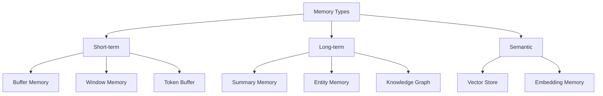

# Memory and State Management

## What You'll Learn

- Advanced memory architectures for conversational AI
- State persistence patterns across sessions
- Context window management and optimization
- Memory compression and summarization strategies
- Multi-user state isolation and security
- Long-term memory with vector stores and knowledge graphs
- Performance optimization for stateful applications

## Why This Matters

Memory transforms stateless LLMs into conversational systems that maintain context across interactions. Production applications need to remember user preferences, conversation history, and task state—often across multiple sessions and users. Poor memory management leads to context loss, excessive token usage, and degraded user experience. Effective state management requires balancing context retention with token limits, implementing efficient storage strategies, and ensuring data isolation in multi-tenant systems.

## Memory Types Overview



## Conversation Buffer Memory

Stores complete conversation history in memory.

### Basic Buffer Memory

```python
from langchain.memory import ConversationBufferMemory
from langchain_openai import ChatOpenAI
from langchain.chains import ConversationChain

# Create memory instance
memory = ConversationBufferMemory(
    return_messages=True,
    memory_key="chat_history"
)

# Create conversation chain
llm = ChatOpenAI(model="gpt-4", temperature=0.7)
conversation = ConversationChain(
    llm=llm,
    memory=memory,
    verbose=True
)

# First interaction
response1 = conversation.predict(input="Hi, I'm working on a Python project")
# "Hello! I'd be happy to help you with your Python project..."

# Second interaction - remembers context
response2 = conversation.predict(input="Can you suggest some testing frameworks?")
# "For your Python project, I'd recommend pytest..."

# Access memory
history = memory.load_memory_variables({})
print(f"Messages in memory: {len(history['chat_history'])}")
```

### Custom Buffer with Persistence

```python
from typing import List, Dict
import json
from pathlib import Path

class PersistentBufferMemory:
    """Buffer memory with file persistence."""
    
    def __init__(self, session_id: str, storage_path: str = "./memory"):
        self.session_id = session_id
        self.storage_path = Path(storage_path)
        self.storage_path.mkdir(exist_ok=True)
        self.messages: List[Dict] = []
        self._load()
    
    def _get_file_path(self) -> Path:
        return self.storage_path / f"{self.session_id}.json"
    
    def _load(self):
        """Load conversation from disk."""
        file_path = self._get_file_path()
        if file_path.exists():
            with open(file_path, 'r') as f:
                self.messages = json.load(f)
    
    def _save(self):
        """Save conversation to disk."""
        with open(self._get_file_path(), 'w') as f:
            json.dump(self.messages, f, indent=2)
    
    def add_message(self, role: str, content: str):
        """Add message to memory."""
        self.messages.append({
            "role": role,
            "content": content,
            "timestamp": datetime.now().isoformat()
        })
        self._save()
    
    def get_messages(self, last_n: int = None) -> List[Dict]:
        """Retrieve messages."""
        if last_n:
            return self.messages[-last_n:]
        return self.messages
    
    def clear(self):
        """Clear conversation history."""
        self.messages = []
        self._save()
    
    def get_token_count(self) -> int:
        """Estimate token count."""
        import tiktoken
        encoding = tiktoken.encoding_for_model("gpt-4")
        total_tokens = sum(
            len(encoding.encode(msg["content"]))
            for msg in self.messages
        )
        return total_tokens

# Usage
memory = PersistentBufferMemory(session_id="user_123")
memory.add_message("user", "Hello")
memory.add_message("assistant", "Hi! How can I help?")

print(f"Token count: {memory.get_token_count()}")
```

## Window Memory

Maintains only the most recent N messages to manage context window.

### Sliding Window Implementation

```python
from langchain.memory import ConversationBufferWindowMemory
from collections import deque

# Fixed window size
window_memory = ConversationBufferWindowMemory(
    k=5,  # Keep last 5 message pairs (10 messages total)
    return_messages=True,
    memory_key="chat_history"
)

# Use with conversation
conversation = ConversationChain(
    llm=ChatOpenAI(model="gpt-4"),
    memory=window_memory,
    verbose=True
)

# After many interactions, only last 5 pairs are retained
for i in range(10):
    conversation.predict(input=f"Message {i}")

# Only messages 5-9 are in memory
```

### Token-Based Window

```python
from langchain.memory import ConversationTokenBufferMemory
from langchain_openai import ChatOpenAI

# Window based on token count instead of message count
token_memory = ConversationTokenBufferMemory(
    llm=ChatOpenAI(),
    max_token_limit=500,  # Keep up to 500 tokens
    return_messages=True
)

# Automatically drops oldest messages when limit exceeded
conversation = ConversationChain(
    llm=ChatOpenAI(model="gpt-4"),
    memory=token_memory
)
```

## Summary Memory

Summarizes conversation history to maintain context while reducing tokens.

### Basic Summary Memory

```python
from langchain.memory import ConversationSummaryMemory
from langchain_openai import ChatOpenAI

# Create LLM for summarization
llm = ChatOpenAI(model="gpt-4", temperature=0)

summary_memory = ConversationSummaryMemory(
    llm=llm,
    return_messages=True,
    memory_key="chat_history"
)

# Save context
summary_memory.save_context(
    {"input": "I'm building a microservices architecture"},
    {"output": "That's great! Microservices offer scalability..."}
)

summary_memory.save_context(
    {"input": "What communication patterns should I use?"},
    {"output": "For microservices, consider REST, gRPC, or message queues..."}
)

# Memory contains summary instead of full messages
print(summary_memory.load_memory_variables({}))
# "The user is building a microservices architecture and asked about communication patterns..."
```

### Progressive Summary Memory

```python
from typing import List
from langchain.schema import BaseMessage, HumanMessage, AIMessage

class ProgressiveSummaryMemory:
    """Summarizes conversation in chunks as it grows."""
    
    def __init__(self, llm, summary_threshold: int = 10):
        self.llm = llm
        self.summary_threshold = summary_threshold
        self.current_messages: List[BaseMessage] = []
        self.summary = ""
    
    def add_message(self, message: BaseMessage):
        """Add message and summarize if threshold reached."""
        self.current_messages.append(message)
        
        if len(self.current_messages) >= self.summary_threshold:
            self._create_summary()
    
    def _create_summary(self):
        """Summarize current messages."""
        messages_text = "\n".join([
            f"{msg.type}: {msg.content}"
            for msg in self.current_messages
        ])
        
        prompt = f"""
        Previous summary: {self.summary if self.summary else "None"}
        
        Recent conversation:
        {messages_text}
        
        Create a concise summary that preserves key information:
        """
        
        result = self.llm.invoke([HumanMessage(content=prompt)])
        self.summary = result.content
        
        # Keep only recent messages
        self.current_messages = self.current_messages[-3:]
    
    def get_context(self) -> str:
        """Get full context (summary + recent messages)."""
        context = []
        
        if self.summary:
            context.append(f"Summary of earlier conversation:\n{self.summary}\n")
        
        if self.current_messages:
            context.append("Recent messages:")
            for msg in self.current_messages:
                context.append(f"{msg.type}: {msg.content}")
        
        return "\n".join(context)
    
    def get_token_estimate(self) -> int:
        """Estimate token count."""
        import tiktoken
        encoding = tiktoken.encoding_for_model("gpt-4")
        return len(encoding.encode(self.get_context()))

# Usage
llm = ChatOpenAI(model="gpt-4", temperature=0)
memory = ProgressiveSummaryMemory(llm, summary_threshold=10)

# Add many messages
for i in range(20):
    memory.add_message(HumanMessage(content=f"Question {i}"))
    memory.add_message(AIMessage(content=f"Answer {i}"))

print(f"Context tokens: {memory.get_token_estimate()}")
print(f"Context:\n{memory.get_context()}")
```

## Entity Memory

Tracks specific entities mentioned in conversation.

### Entity-Based Memory

```python
from langchain.memory import ConversationEntityMemory
from langchain_openai import ChatOpenAI

# Entity memory extracts and tracks entities
entity_memory = ConversationEntityMemory(
    llm=ChatOpenAI(model="gpt-4", temperature=0),
    return_messages=True
)

# Save conversation
entity_memory.save_context(
    {"input": "My name is Alice and I work at TechCorp"},
    {"output": "Nice to meet you, Alice! Tell me about your role at TechCorp."}
)

entity_memory.save_context(
    {"input": "I'm a senior engineer focusing on distributed systems"},
    {"output": "That's impressive! Distributed systems are complex..."}
)

# Access entity information
entities = entity_memory.load_memory_variables({"input": "What do you know about me?"})
print(entities)
# Contains structured information about Alice, TechCorp, role, etc.
```

### Custom Entity Tracker

```python
from typing import Dict, List, Any
import re

class EntityTracker:
    """Track and update entities across conversation."""
    
    def __init__(self, llm):
        self.llm = llm
        self.entities: Dict[str, Dict[str, Any]] = {}
    
    def extract_entities(self, text: str) -> List[Dict]:
        """Extract entities using LLM."""
        prompt = f"""
        Extract entities from this text. For each entity, provide:
        - name: entity name
        - type: person, organization, location, concept, etc.
        - attributes: key information about the entity
        
        Text: {text}
        
        Return as JSON list.
        """
        
        response = self.llm.invoke(prompt)
        # Parse JSON response
        try:
            import json
            return json.loads(response.content)
        except:
            return []
    
    def update_entities(self, message: str):
        """Update entity knowledge base."""
        new_entities = self.extract_entities(message)
        
        for entity in new_entities:
            name = entity.get('name', '').lower()
            entity_type = entity.get('type', 'unknown')
            attributes = entity.get('attributes', {})
            
            if name in self.entities:
                # Update existing entity
                self.entities[name]['attributes'].update(attributes)
                if 'mentioned_count' in self.entities[name]:
                    self.entities[name]['mentioned_count'] += 1
            else:
                # Add new entity
                self.entities[name] = {
                    'type': entity_type,
                    'attributes': attributes,
                    'mentioned_count': 1,
                    'first_mentioned': datetime.now().isoformat()
                }
    
    def get_entity_context(self, query: str) -> str:
        """Get relevant entity information for query."""
        # Find mentioned entities in query
        query_lower = query.lower()
        relevant_entities = [
            (name, info) for name, info in self.entities.items()
            if name in query_lower
        ]
        
        if not relevant_entities:
            return ""
        
        context_parts = ["Known entities:\n"]
        for name, info in relevant_entities:
            context_parts.append(f"- {name.title()} ({info['type']})")
            for key, value in info['attributes'].items():
                context_parts.append(f"  {key}: {value}")
        
        return "\n".join(context_parts)
    
    def get_all_entities(self) -> Dict:
        """Get all tracked entities."""
        return self.entities

# Usage
llm = ChatOpenAI(model="gpt-4", temperature=0)
tracker = EntityTracker(llm)

# Track entities across conversation
tracker.update_entities("I'm Alice, a Python developer at Microsoft")
tracker.update_entities("Alice loves working on cloud infrastructure")

# Get context for query
context = tracker.get_entity_context("Tell me about Alice")
print(context)
```

## Vector Store Memory

Use semantic search over conversation history.

### Semantic Memory Retrieval

```python
from langchain.memory import VectorStoreRetrieverMemory
from langchain_openai import OpenAIEmbeddings
from langchain_community.vectorstores import Chroma

# Create vector store for memory
embeddings = OpenAIEmbeddings()
vectorstore = Chroma(
    embedding_function=embeddings,
    collection_name="conversation_memory"
)

# Create memory
vector_memory = VectorStoreRetrieverMemory(
    retriever=vectorstore.as_retriever(search_kwargs={"k": 3}),
    return_docs=True
)

# Save interactions
vector_memory.save_context(
    {"input": "I prefer Python for backend development"},
    {"output": "Python is excellent for backends, especially with FastAPI..."}
)

vector_memory.save_context(
    {"input": "I'm interested in learning Rust"},
    {"output": "Rust is great for systems programming..."}
)

# Retrieve relevant memories
relevant = vector_memory.load_memory_variables(
    {"input": "What programming languages have we discussed?"}
)

# Returns semantically similar past interactions
print(relevant)
```

### Hybrid Memory System

```python
from typing import List, Dict
from langchain.memory import ConversationBufferWindowMemory

class HybridMemory:
    """Combines short-term buffer with long-term vector memory."""
    
    def __init__(
        self,
        vectorstore,
        embeddings,
        window_size: int = 5,
        long_term_k: int = 3
    ):
        # Short-term: recent messages
        self.short_term = ConversationBufferWindowMemory(
            k=window_size,
            return_messages=True
        )
        
        # Long-term: vector store
        self.vectorstore = vectorstore
        self.embeddings = embeddings
        self.long_term_k = long_term_k
    
    def save_interaction(self, user_input: str, assistant_output: str):
        """Save to both short and long-term memory."""
        # Short-term buffer
        self.short_term.save_context(
            {"input": user_input},
            {"output": assistant_output}
        )
        
        # Long-term vector store
        from langchain.schema import Document
        doc = Document(
            page_content=f"User: {user_input}\nAssistant: {assistant_output}",
            metadata={
                "timestamp": datetime.now().isoformat(),
                "user_input": user_input
            }
        )
        self.vectorstore.add_documents([doc])
    
    def get_context(self, current_input: str) -> Dict:
        """Get combined context from both memory types."""
        # Recent messages from short-term
        short_term_vars = self.short_term.load_memory_variables({})
        recent_messages = short_term_vars.get('chat_history', [])
        
        # Relevant past context from long-term
        relevant_docs = self.vectorstore.similarity_search(
            current_input,
            k=self.long_term_k
        )
        
        return {
            "recent_conversation": recent_messages,
            "relevant_history": [doc.page_content for doc in relevant_docs]
        }
    
    def format_context(self, current_input: str) -> str:
        """Format all context for prompt."""
        context = self.get_context(current_input)
        
        parts = []
        
        # Add relevant history
        if context['relevant_history']:
            parts.append("Relevant past conversation:")
            for hist in context['relevant_history']:
                parts.append(f"  {hist}")
            parts.append("")
        
        # Add recent messages
        if context['recent_conversation']:
            parts.append("Recent conversation:")
            for msg in context['recent_conversation']:
                parts.append(f"  {msg.type}: {msg.content}")
        
        return "\n".join(parts)

# Usage
vectorstore = Chroma(embedding_function=OpenAIEmbeddings())
memory = HybridMemory(vectorstore, OpenAIEmbeddings())

# Save interactions
memory.save_interaction(
    "I'm building a microservices app",
    "Great! What tech stack are you using?"
)
memory.save_interaction(
    "Using Python and PostgreSQL",
    "Excellent choices! For Python microservices..."
)

# Get context combines recent + relevant past
context = memory.format_context("What database should I use for caching?")
print(context)
```

## State Persistence

### Database-Backed State

```python
from typing import Dict, Any, Optional
import sqlite3
import json

class DatabaseStateManager:
    """Manage conversation state in SQLite."""
    
    def __init__(self, db_path: str = "conversation_state.db"):
        self.db_path = db_path
        self._init_db()
    
    def _init_db(self):
        """Initialize database schema."""
        conn = sqlite3.connect(self.db_path)
        cursor = conn.cursor()
        
        cursor.execute("""
            CREATE TABLE IF NOT EXISTS sessions (
                session_id TEXT PRIMARY KEY,
                user_id TEXT,
                created_at TIMESTAMP DEFAULT CURRENT_TIMESTAMP,
                updated_at TIMESTAMP DEFAULT CURRENT_TIMESTAMP,
                state_data TEXT,
                metadata TEXT
            )
        """)
        
        cursor.execute("""
            CREATE TABLE IF NOT EXISTS messages (
                id INTEGER PRIMARY KEY AUTOINCREMENT,
                session_id TEXT,
                role TEXT,
                content TEXT,
                timestamp TIMESTAMP DEFAULT CURRENT_TIMESTAMP,
                FOREIGN KEY (session_id) REFERENCES sessions(session_id)
            )
        """)
        
        conn.commit()
        conn.close()
    
    def create_session(
        self,
        session_id: str,
        user_id: str,
        initial_state: Dict[str, Any] = None
    ):
        """Create new conversation session."""
        conn = sqlite3.connect(self.db_path)
        cursor = conn.cursor()
        
        cursor.execute("""
            INSERT INTO sessions (session_id, user_id, state_data, metadata)
            VALUES (?, ?, ?, ?)
        """, (
            session_id,
            user_id,
            json.dumps(initial_state or {}),
            json.dumps({})
        ))
        
        conn.commit()
        conn.close()
    
    def save_message(
        self,
        session_id: str,
        role: str,
        content: str
    ):
        """Save message to session."""
        conn = sqlite3.connect(self.db_path)
        cursor = conn.cursor()
        
        cursor.execute("""
            INSERT INTO messages (session_id, role, content)
            VALUES (?, ?, ?)
        """, (session_id, role, content))
        
        # Update session timestamp
        cursor.execute("""
            UPDATE sessions
            SET updated_at = CURRENT_TIMESTAMP
            WHERE session_id = ?
        """, (session_id,))
        
        conn.commit()
        conn.close()
    
    def get_messages(
        self,
        session_id: str,
        limit: Optional[int] = None
    ) -> List[Dict]:
        """Retrieve messages for session."""
        conn = sqlite3.connect(self.db_path)
        cursor = conn.cursor()
        
        query = """
            SELECT role, content, timestamp
            FROM messages
            WHERE session_id = ?
            ORDER BY timestamp DESC
        """
        
        if limit:
            query += f" LIMIT {limit}"
        
        cursor.execute(query, (session_id,))
        rows = cursor.fetchall()
        conn.close()
        
        return [
            {
                "role": row[0],
                "content": row[1],
                "timestamp": row[2]
            }
            for row in reversed(rows)
        ]
    
    def update_state(
        self,
        session_id: str,
        state_updates: Dict[str, Any]
    ):
        """Update session state."""
        conn = sqlite3.connect(self.db_path)
        cursor = conn.cursor()
        
        # Get current state
        cursor.execute(
            "SELECT state_data FROM sessions WHERE session_id = ?",
            (session_id,)
        )
        row = cursor.fetchone()
        
        if row:
            current_state = json.loads(row[0])
            current_state.update(state_updates)
            
            cursor.execute("""
                UPDATE sessions
                SET state_data = ?, updated_at = CURRENT_TIMESTAMP
                WHERE session_id = ?
            """, (json.dumps(current_state), session_id))
            
            conn.commit()
        
        conn.close()
    
    def get_state(self, session_id: str) -> Dict[str, Any]:
        """Get current session state."""
        conn = sqlite3.connect(self.db_path)
        cursor = conn.cursor()
        
        cursor.execute(
            "SELECT state_data FROM sessions WHERE session_id = ?",
            (session_id,)
        )
        row = cursor.fetchone()
        conn.close()
        
        if row:
            return json.loads(row[0])
        return {}
    
    def delete_session(self, session_id: str):
        """Delete session and all messages."""
        conn = sqlite3.connect(self.db_path)
        cursor = conn.cursor()
        
        cursor.execute("DELETE FROM messages WHERE session_id = ?", (session_id,))
        cursor.execute("DELETE FROM sessions WHERE session_id = ?", (session_id,))
        
        conn.commit()
        conn.close()

# Usage
state_manager = DatabaseStateManager()

# Create session
state_manager.create_session(
    session_id="session_123",
    user_id="user_456",
    initial_state={"language": "en", "context": "technical_support"}
)

# Save messages
state_manager.save_message("session_123", "user", "Hello")
state_manager.save_message("session_123", "assistant", "Hi! How can I help?")

# Update state
state_manager.update_state("session_123", {"issue_type": "authentication"})

# Retrieve
messages = state_manager.get_messages("session_123")
state = state_manager.get_state("session_123")
```

### Redis-Based State (Fast Access)

```python
import redis
import json
from typing import Dict, Any, List

class RedisStateManager:
    """Fast state management using Redis."""
    
    def __init__(self, host='localhost', port=6379, db=0, ttl=3600):
        self.redis_client = redis.Redis(
            host=host,
            port=port,
            db=db,
            decode_responses=True
        )
        self.ttl = ttl  # Time to live in seconds
    
    def save_message(
        self,
        session_id: str,
        role: str,
        content: str
    ):
        """Save message to session."""
        key = f"session:{session_id}:messages"
        
        message = {
            "role": role,
            "content": content,
            "timestamp": datetime.now().isoformat()
        }
        
        # Append to list
        self.redis_client.rpush(key, json.dumps(message))
        
        # Set expiration
        self.redis_client.expire(key, self.ttl)
    
    def get_messages(
        self,
        session_id: str,
        limit: int = None
    ) -> List[Dict]:
        """Get messages from session."""
        key = f"session:{session_id}:messages"
        
        if limit:
            messages = self.redis_client.lrange(key, -limit, -1)
        else:
            messages = self.redis_client.lrange(key, 0, -1)
        
        return [json.loads(msg) for msg in messages]
    
    def save_state(
        self,
        session_id: str,
        state: Dict[str, Any]
    ):
        """Save session state."""
        key = f"session:{session_id}:state"
        self.redis_client.set(key, json.dumps(state), ex=self.ttl)
    
    def get_state(self, session_id: str) -> Dict[str, Any]:
        """Get session state."""
        key = f"session:{session_id}:state"
        state_json = self.redis_client.get(key)
        
        if state_json:
            return json.loads(state_json)
        return {}
    
    def update_state(
        self,
        session_id: str,
        updates: Dict[str, Any]
    ):
        """Update specific state fields."""
        current = self.get_state(session_id)
        current.update(updates)
        self.save_state(session_id, current)
    
    def clear_session(self, session_id: str):
        """Clear all session data."""
        keys = [
            f"session:{session_id}:messages",
            f"session:{session_id}:state"
        ]
        self.redis_client.delete(*keys)
    
    def extend_ttl(self, session_id: str):
        """Extend session TTL."""
        keys = [
            f"session:{session_id}:messages",
            f"session:{session_id}:state"
        ]
        for key in keys:
            self.redis_client.expire(key, self.ttl)

# Usage
redis_state = RedisStateManager(ttl=7200)  # 2 hour TTL

# Save conversation
redis_state.save_message("session_789", "user", "Hello")
redis_state.save_message("session_789", "assistant", "Hi there!")

# Save state
redis_state.save_state("session_789", {
    "user_id": "user_123",
    "preferences": {"theme": "dark"},
    "context": "customer_support"
})

# Retrieve
messages = redis_state.get_messages("session_789")
state = redis_state.get_state("session_789")
```

## Multi-Tenant State Isolation

### Secure Multi-User Memory

```python
from typing import Dict, Optional
import hashlib

class SecureMultiTenantMemory:
    """Isolated memory for multi-tenant applications."""
    
    def __init__(self, storage_backend):
        self.storage = storage_backend
        self._user_namespaces: Dict[str, str] = {}
    
    def _get_namespace(self, user_id: str, session_id: str) -> str:
        """Generate secure namespace for user session."""
        # Hash to prevent enumeration
        namespace_key = f"{user_id}:{session_id}"
        return hashlib.sha256(namespace_key.encode()).hexdigest()[:16]
    
    def _check_access(self, user_id: str, session_id: str, namespace: str) -> bool:
        """Verify user has access to namespace."""
        expected_namespace = self._get_namespace(user_id, session_id)
        return namespace == expected_namespace
    
    def save_message(
        self,
        user_id: str,
        session_id: str,
        role: str,
        content: str
    ):
        """Save message with user isolation."""
        namespace = self._get_namespace(user_id, session_id)
        key = f"{namespace}:messages"
        
        self.storage.save(key, {
            "role": role,
            "content": content,
            "user_id": user_id,  # For audit
            "timestamp": datetime.now().isoformat()
        })
    
    def get_messages(
        self,
        user_id: str,
        session_id: str,
        limit: int = None
    ) -> List[Dict]:
        """Get messages with access control."""
        namespace = self._get_namespace(user_id, session_id)
        key = f"{namespace}:messages"
        
        messages = self.storage.get(key, limit=limit)
        
        # Verify all messages belong to user
        return [
            msg for msg in messages
            if msg.get('user_id') == user_id
        ]
    
    def get_state(
        self,
        user_id: str,
        session_id: str
    ) -> Dict:
        """Get state with access control."""
        namespace = self._get_namespace(user_id, session_id)
        key = f"{namespace}:state"
        
        state = self.storage.get(key)
        
        # Verify ownership
        if state and state.get('user_id') == user_id:
            return state
        return {}
    
    def list_user_sessions(self, user_id: str) -> List[str]:
        """List all sessions for a user."""
        # Implementation depends on storage backend
        pass
    
    def delete_user_data(self, user_id: str):
        """Delete all data for a user (GDPR compliance)."""
        sessions = self.list_user_sessions(user_id)
        
        for session_id in sessions:
            namespace = self._get_namespace(user_id, session_id)
            self.storage.delete_namespace(namespace)
```

## Context Window Optimization

### Token Management

```python
import tiktoken
from typing import List
from langchain.schema import BaseMessage

class TokenAwareMemory:
    """Memory that respects token limits."""
    
    def __init__(
        self,
        model: str = "gpt-4",
        max_tokens: int = 4000,
        reserve_tokens: int = 1000
    ):
        self.model = model
        self.max_tokens = max_tokens
        self.reserve_tokens = reserve_tokens
        self.encoding = tiktoken.encoding_for_model(model)
        self.messages: List[BaseMessage] = []
    
    def count_tokens(self, text: str) -> int:
        """Count tokens in text."""
        return len(self.encoding.encode(text))
    
    def count_message_tokens(self, messages: List[BaseMessage]) -> int:
        """Count total tokens in messages."""
        total = 0
        for msg in messages:
            # Account for message formatting tokens
            total += 4  # Message wrapper tokens
            total += self.count_tokens(msg.content)
        return total
    
    def add_message(self, message: BaseMessage):
        """Add message and manage token limit."""
        self.messages.append(message)
        self._enforce_token_limit()
    
    def _enforce_token_limit(self):
        """Remove oldest messages to stay under limit."""
        available_tokens = self.max_tokens - self.reserve_tokens
        
        while self.messages:
            current_tokens = self.count_message_tokens(self.messages)
            
            if current_tokens <= available_tokens:
                break
            
            # Remove oldest message
            self.messages.pop(0)
    
    def get_messages_for_context(self) -> List[BaseMessage]:
        """Get messages that fit in context."""
        return self.messages.copy()
    
    def get_available_tokens(self) -> int:
        """Get tokens available for new content."""
        used = self.count_message_tokens(self.messages)
        return self.max_tokens - used - self.reserve_tokens

# Usage
memory = TokenAwareMemory(model="gpt-4", max_tokens=8000)

# Add messages
from langchain.schema import HumanMessage, AIMessage
memory.add_message(HumanMessage(content="Long question..."))
memory.add_message(AIMessage(content="Long answer..."))

print(f"Available tokens: {memory.get_available_tokens()}")
```

## Best Practices

**Choose Memory Type Based on Use Case**: Different applications need different memory strategies.

```python
# ✅ Short conversations - Buffer memory
short_memory = ConversationBufferMemory()

# ✅ Long conversations - Summary or Window memory
long_memory = ConversationSummaryMemory(llm=llm)

# ✅ Need to reference past topics - Vector memory
semantic_memory = VectorStoreRetrieverMemory(retriever=retriever)

# ❌ Using buffer for long conversations
# Will exceed context window and cost too much
```

**Implement Session Management**: Isolate conversations by session.

```python
# ✅ Per-session memory
def get_memory(session_id: str):
    return PersistentBufferMemory(session_id=session_id)

# ❌ Shared memory across users
global_memory = ConversationBufferMemory()  # Security issue!
```

**Monitor Token Usage**: Track and optimize token consumption.

```python
# ✅ Token-aware memory
memory = TokenAwareMemory(max_tokens=4000)

# ❌ No token management
memory = ConversationBufferMemory()  # Can exceed limits
```

## Anti-Patterns

❌ **No Memory Persistence**: State lost on restart.

```python
# ❌ In-memory only
memory = ConversationBufferMemory()  # Lost on restart

# ✅ Persistent storage
memory = DatabaseStateManager()
```

❌ **Ignoring Context Window Limits**: Crashes when exceeded.

```python
# ❌ Unbounded memory
for i in range(1000):
    memory.save_context(...)  # Will exceed limit

# ✅ Bounded memory
memory = ConversationBufferWindowMemory(k=10)
```

❌ **No User Isolation**: Security vulnerability in multi-tenant apps.

```python
# ❌ Shared state
memory = ConversationBufferMemory()  # All users share

# ✅ Isolated per user
memory = SecureMultiTenantMemory(storage)
```

## Related Topics

- [LangChain Fundamentals](01-langchain-fundamentals.md) - Core concepts
- [LangGraph Architecture](02-langgraph-architecture.md) - State machines
- [Agents and Tools](03-agents-and-tools.md) - Stateful agents
- [Production Deployment](06-production-deployment.md) - Production state management
