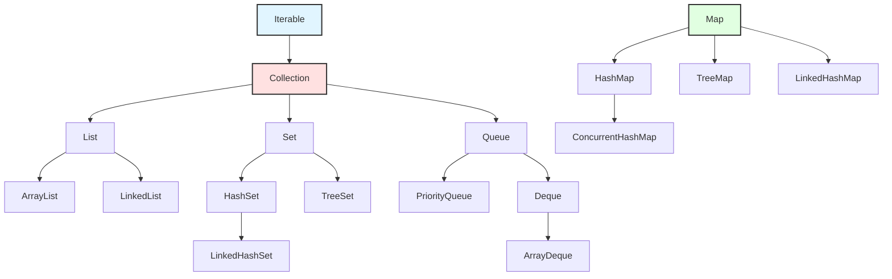

# Java Collections Framework

## Concept Overview

The Java Collections Framework provides unified architecture for storing, manipulating, and retrieving groups of objects. Understanding collection implementations, their performance characteristics, and appropriate use cases is essential for writing efficient Java code.

## Core Collections & Implementation

### Collection Hierarchy



### List Implementations

```java
// ArrayList - dynamic array, fast random access
List<String> arrayList = new ArrayList<>();
arrayList.add("item");           // O(1) amortized
arrayList.get(0);                // O(1)
arrayList.remove(0);             // O(n) - shifts elements
arrayList.contains("item");      // O(n)

// LinkedList - doubly linked, fast insert/remove at ends
List<String> linkedList = new LinkedList<>();
linkedList.add("item");          // O(1)
linkedList.get(0);               // O(n) - must traverse
linkedList.addFirst("first");    // O(1)
linkedList.removeLast();         // O(1)

// When to use which:
// ArrayList: random access, iteration, most common choice
// LinkedList: frequent insertions/removals at ends, queue operations
```

### Set Implementations

```java
// HashSet - unordered, O(1) operations
Set<String> hashSet = new HashSet<>();
hashSet.add("item");             // O(1)
hashSet.contains("item");        // O(1)
hashSet.remove("item");          // O(1)

// TreeSet - sorted, O(log n) operations
Set<String> treeSet = new TreeSet<>();
treeSet.add("item");             // O(log n)
treeSet.first();                 // O(log n) - smallest element
treeSet.last();                  // O(log n) - largest element
treeSet.subSet("a", "m");        // Range view

// LinkedHashSet - insertion order preserved
Set<String> linkedHashSet = new LinkedHashSet<>();
linkedHashSet.add("first");
linkedHashSet.add("second");
// Iteration order: first, second

// EnumSet - specialized for enums, very efficient
Set<Day> weekend = EnumSet.of(Day.SATURDAY, Day.SUNDAY);
```

### Map Implementations

```java
// HashMap - unordered, O(1) operations
Map<String, Integer> hashMap = new HashMap<>();
hashMap.put("key", 1);           // O(1)
hashMap.get("key");              // O(1)
hashMap.containsKey("key");      // O(1)

// TreeMap - sorted by keys
Map<String, Integer> treeMap = new TreeMap<>();
treeMap.put("key", 1);           // O(log n)
treeMap.firstKey();              // Smallest key
treeMap.subMap("a", "m");        // Range view

// LinkedHashMap - insertion or access order
Map<String, Integer> lru = new LinkedHashMap<>(16, 0.75f, true) {
    @Override
    protected boolean removeEldestEntry(Map.Entry eldest) {
        return size() > 100;  // LRU cache with max 100 entries
    }
};

// Compute methods (Java 8+)
map.computeIfAbsent("key", k -> expensiveComputation(k));
map.computeIfPresent("key", (k, v) -> v + 1);
map.merge("key", 1, Integer::sum);  // Increment or set to 1
```

### Queue and Deque

```java
// PriorityQueue - heap-based, elements in priority order
Queue<Task> taskQueue = new PriorityQueue<>(Comparator.comparing(Task::getPriority));
taskQueue.offer(task);           // O(log n)
Task highest = taskQueue.poll(); // O(log n) - removes highest priority

// ArrayDeque - double-ended queue, faster than LinkedList
Deque<String> deque = new ArrayDeque<>();
deque.addFirst("first");         // O(1)
deque.addLast("last");           // O(1)
deque.pollFirst();               // O(1)
deque.pollLast();                // O(1)

// Stack operations (prefer ArrayDeque over Stack class)
Deque<String> stack = new ArrayDeque<>();
stack.push("item");              // O(1)
stack.pop();                     // O(1)
stack.peek();                    // O(1)
```

### Concurrent Collections

```java
// ConcurrentHashMap - thread-safe, high concurrency
ConcurrentMap<String, Integer> concurrentMap = new ConcurrentHashMap<>();
concurrentMap.putIfAbsent("key", 1);
concurrentMap.compute("key", (k, v) -> v == null ? 1 : v + 1);

// CopyOnWriteArrayList - thread-safe, optimized for reads
List<String> cowList = new CopyOnWriteArrayList<>();
// Iteration never throws ConcurrentModificationException

// BlockingQueue - producer-consumer
BlockingQueue<Task> queue = new ArrayBlockingQueue<>(100);
queue.put(task);    // Blocks if full
queue.take();       // Blocks if empty
```

### Utility Methods

```java
// Collections utilities
Collections.sort(list);
Collections.reverse(list);
Collections.shuffle(list);
Collections.binarySearch(sortedList, key);
Collections.unmodifiableList(list);
Collections.synchronizedList(list);

// Stream operations
list.stream()
    .filter(s -> s.startsWith("A"))
    .map(String::toLowerCase)
    .sorted()
    .collect(Collectors.toList());

// Factory methods (Java 9+)
List<String> immutableList = List.of("a", "b", "c");
Set<String> immutableSet = Set.of("x", "y");
Map<String, Integer> immutableMap = Map.of("one", 1, "two", 2);
```

## Performance Comparison

| Operation | ArrayList | LinkedList | HashSet | TreeSet | HashMap |
|-----------|-----------|------------|---------|---------|---------|
| Access    | O(1)      | O(n)       | -       | -       | O(1)    |
| Search    | O(n)      | O(n)       | O(1)    | O(log n)| O(1)    |
| Insert    | O(1)*     | O(1)       | O(1)    | O(log n)| O(1)    |
| Delete    | O(n)      | O(1)**     | O(1)    | O(log n)| O(1)    |

*amortized, **with iterator

## Interview Questions

**Q1: When to use ArrayList vs LinkedList?**

ArrayList for most cases: O(1) random access, better cache locality, less memory overhead. LinkedList only when: frequent add/remove at both ends, using as queue/deque, don't need random access.

**Q2: How does HashMap work internally?**

Array of buckets, each bucket is linked list (tree if >8 elements in Java 8+). Hash code determines bucket index. On collision, chain elements in bucket. Load factor (0.75) triggers resize. O(1) average, O(n) worst case without tree optimization.

**Q3: What is the difference between HashMap and TreeMap?**

HashMap: unordered, O(1) operations, allows one null key. TreeMap: sorted by keys (natural order or Comparator), O(log n) operations, no null keys (unless Comparator handles), provides navigation methods (firstKey, floorKey).

**Q4: How to implement LRU cache with collections?**

Use LinkedHashMap with access-order (third constructor parameter true) and override removeEldestEntry() to limit size. Or use Caffeine/Guava cache libraries for production.

**Q5: Explain equals() and hashCode() contract.**

If equals() returns true, hashCode() must be equal. If hashCode() differs, equals() must return false. Used by hash-based collections. Override both together using same fields. Mutable fields in hashCode() cause problems in HashSet/HashMap.

**Q6: What are fail-fast and fail-safe iterators?**

Fail-fast: throw ConcurrentModificationException if collection modified during iteration (ArrayList, HashMap). Fail-safe: work on copy, no exception, may not reflect modifications (CopyOnWriteArrayList, ConcurrentHashMap).

**Q7: How to make a collection thread-safe?**

Use concurrent collections (ConcurrentHashMap, CopyOnWriteArrayList). Or Collections.synchronizedXxx() wrappers (less efficient). Avoid iterating synchronized collections without external sync.

**Q8: What is the time complexity of PriorityQueue operations?**

offer/add: O(log n), poll/remove: O(log n), peek: O(1), remove(Object): O(n), contains: O(n). Backed by binary heap. Use for priority-based processing, not for general sorted storage.
