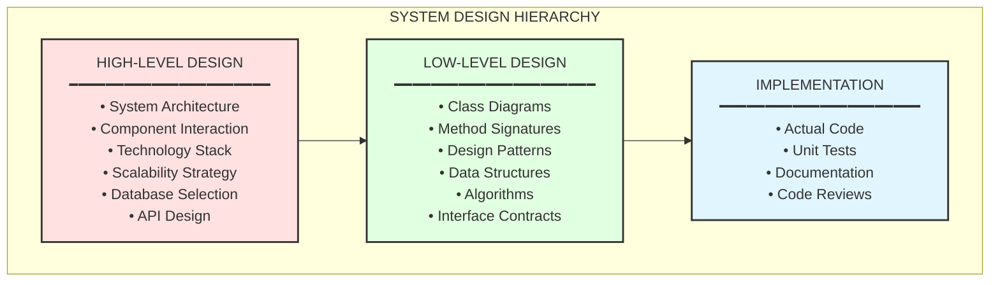

# Low-Level Design Fundamentals

## Overview
Low-Level Design (LLD) is the process of designing the internal structure of a software system. It focuses on class design, method signatures, data structures, and the interactions between components. LLD bridges the gap between high-level architecture and actual code implementation.

---

## LLD vs HLD

### High-Level Design (HLD)
- System architecture and components
- Technology choices
- Data flow between systems
- Non-functional requirements (scalability, availability)
- Infrastructure decisions

### Low-Level Design (LLD)
- Class diagrams and relationships
- Method signatures and algorithms
- Data structures and schemas
- Design patterns application
- Interface contracts
- Error handling strategies



---

## SOLID Principles

### Single Responsibility Principle (SRP)
A class should have only one reason to change.

```java
// ❌ Bad: Multiple responsibilities
public class User {
    private String name;
    private String email;
    
    public void save() { /* database logic */ }
    public void sendEmail() { /* email logic */ }
    public String generateReport() { /* reporting logic */ }
}

// ✅ Good: Single responsibility per class
public class User {
    private String name;
    private String email;
    // Only user data and behavior
}

public class UserRepository {
    public void save(User user) { /* database logic */ }
    public User findById(Long id) { /* query logic */ }
}

public class EmailService {
    public void sendWelcomeEmail(User user) { /* email logic */ }
}

public class UserReportGenerator {
    public String generate(User user) { /* reporting logic */ }
}
```

### Open/Closed Principle (OCP)
Software entities should be open for extension but closed for modification.

```java
// ❌ Bad: Modifying existing code for new payment types
public class PaymentProcessor {
    public void process(String type, double amount) {
        if (type.equals("CREDIT_CARD")) {
            // credit card logic
        } else if (type.equals("PAYPAL")) {
            // paypal logic
        }
        // Adding new payment type requires modifying this class
    }
}

// ✅ Good: Extend without modification
public interface PaymentStrategy {
    void process(double amount);
}

public class CreditCardPayment implements PaymentStrategy {
    @Override
    public void process(double amount) { /* credit card logic */ }
}

public class PayPalPayment implements PaymentStrategy {
    @Override
    public void process(double amount) { /* paypal logic */ }
}

// New payment types can be added without modifying existing code
public class CryptoPayment implements PaymentStrategy {
    @Override
    public void process(double amount) { /* crypto logic */ }
}

public class PaymentProcessor {
    public void process(PaymentStrategy strategy, double amount) {
        strategy.process(amount);
    }
}
```

### Liskov Substitution Principle (LSP)
Subtypes must be substitutable for their base types without altering program correctness.

```java
// ❌ Bad: Square violates LSP when substituted for Rectangle
public class Rectangle {
    protected int width;
    protected int height;
    
    public void setWidth(int width) { this.width = width; }
    public void setHeight(int height) { this.height = height; }
    public int getArea() { return width * height; }
}

public class Square extends Rectangle {
    @Override
    public void setWidth(int width) {
        this.width = width;
        this.height = width; // Breaks LSP - unexpected behavior
    }
    
    @Override
    public void setHeight(int height) {
        this.width = height;
        this.height = height;
    }
}

// ✅ Good: Use composition or separate hierarchy
public interface Shape {
    int getArea();
}

public class Rectangle implements Shape {
    private final int width;
    private final int height;
    
    public Rectangle(int width, int height) {
        this.width = width;
        this.height = height;
    }
    
    @Override
    public int getArea() { return width * height; }
}

public class Square implements Shape {
    private final int side;
    
    public Square(int side) { this.side = side; }
    
    @Override
    public int getArea() { return side * side; }
}
```

### Interface Segregation Principle (ISP)
Clients should not be forced to depend on interfaces they don't use.

```java
// ❌ Bad: Fat interface forces unnecessary implementations
public interface Worker {
    void work();
    void eat();
    void sleep();
}

public class Robot implements Worker {
    public void work() { /* works */ }
    public void eat() { /* robots don't eat! */ }
    public void sleep() { /* robots don't sleep! */ }
}

// ✅ Good: Segregated interfaces
public interface Workable {
    void work();
}

public interface Eatable {
    void eat();
}

public interface Sleepable {
    void sleep();
}

public class Human implements Workable, Eatable, Sleepable {
    public void work() { /* works */ }
    public void eat() { /* eats */ }
    public void sleep() { /* sleeps */ }
}

public class Robot implements Workable {
    public void work() { /* works */ }
}
```

### Dependency Inversion Principle (DIP)
High-level modules should not depend on low-level modules. Both should depend on abstractions.

```java
// ❌ Bad: High-level depends on low-level
public class MySQLDatabase {
    public void save(String data) { /* MySQL specific */ }
}

public class UserService {
    private MySQLDatabase database = new MySQLDatabase(); // Tight coupling
    
    public void createUser(String data) {
        database.save(data);
    }
}

// ✅ Good: Both depend on abstraction
public interface Database {
    void save(String data);
    String find(String id);
}

public class MySQLDatabase implements Database {
    @Override
    public void save(String data) { /* MySQL logic */ }
    @Override
    public String find(String id) { /* MySQL logic */ }
}

public class MongoDatabase implements Database {
    @Override
    public void save(String data) { /* MongoDB logic */ }
    @Override
    public String find(String id) { /* MongoDB logic */ }
}

public class UserService {
    private final Database database;
    
    public UserService(Database database) { // Dependency injection
        this.database = database;
    }
    
    public void createUser(String data) {
        database.save(data);
    }
}
```

---

## UML Class Diagrams

### Relationships

```
┌─────────────────────────────────────────────────────────────────┐
│                    UML RELATIONSHIPS                             │
├─────────────────────────────────────────────────────────────────┤
│                                                                  │
│  ASSOCIATION (uses)                                              │
│  ─────────────────>                                              │
│  Class A uses Class B                                            │
│                                                                  │
│  AGGREGATION (has-a, weak)                                       │
│  ────────────────◇                                               │
│  Department has Employees (employees can exist independently)    │
│                                                                  │
│  COMPOSITION (has-a, strong)                                     │
│  ────────────────◆                                               │
│  House has Rooms (rooms cannot exist without house)              │
│                                                                  │
│  INHERITANCE (is-a)                                              │
│  ────────────────▷                                               │
│  Dog is an Animal                                                │
│                                                                  │
│  IMPLEMENTATION (implements)                                     │
│  - - - - - - - -▷                                                │
│  ArrayList implements List                                       │
│                                                                  │
│  DEPENDENCY (temporary use)                                      │
│  - - - - - - - ->                                                │
│  Class A temporarily uses Class B (method parameter)             │
│                                                                  │
└─────────────────────────────────────────────────────────────────┘
```

### Class Diagram Example

```
┌─────────────────────────────────────────────────────────────────┐
│                        <<interface>>                             │
│                         Vehicle                                  │
├─────────────────────────────────────────────────────────────────┤
│ + start(): void                                                  │
│ + stop(): void                                                   │
│ + getSpeed(): int                                                │
└─────────────────────────────────────────────────────────────────┘
                              △
                              │ implements
              ┌───────────────┴───────────────┐
              │                               │
┌─────────────────────────┐     ┌─────────────────────────┐
│          Car            │     │       Motorcycle        │
├─────────────────────────┤     ├─────────────────────────┤
│ - brand: String         │     │ - brand: String         │
│ - model: String         │     │ - engineCC: int         │
│ - engine: Engine        │◆────│                         │
├─────────────────────────┤     ├─────────────────────────┤
│ + start(): void         │     │ + start(): void         │
│ + stop(): void          │     │ + stop(): void          │
│ + getSpeed(): int       │     │ + getSpeed(): int       │
│ + openTrunk(): void     │     │ + wheelie(): void       │
└─────────────────────────┘     └─────────────────────────┘
              │
              │ composition
              ▼
┌─────────────────────────┐
│         Engine          │
├─────────────────────────┤
│ - horsepower: int       │
│ - type: EngineType      │
├─────────────────────────┤
│ + ignite(): void        │
│ + shutdown(): void      │
└─────────────────────────┘
```

---

## Design Principles

### DRY (Don't Repeat Yourself)

```java
// ❌ Bad: Duplicated validation logic
public class UserValidator {
    public boolean validateEmail(String email) {
        return email != null && email.contains("@") && email.length() > 5;
    }
}

public class OrderValidator {
    public boolean validateCustomerEmail(String email) {
        return email != null && email.contains("@") && email.length() > 5;
    }
}

// ✅ Good: Centralized validation
public class EmailValidator {
    private static final Pattern EMAIL_PATTERN = 
        Pattern.compile("^[A-Za-z0-9+_.-]+@(.+)$");
    
    public static boolean isValid(String email) {
        return email != null && EMAIL_PATTERN.matcher(email).matches();
    }
}
```

### KISS (Keep It Simple, Stupid)

```java
// ❌ Bad: Over-engineered solution
public class StringReverser {
    public String reverse(String input) {
        return IntStream.range(0, input.length())
            .mapToObj(i -> input.charAt(input.length() - 1 - i))
            .collect(StringBuilder::new, StringBuilder::append, StringBuilder::append)
            .toString();
    }
}

// ✅ Good: Simple and readable
public class StringReverser {
    public String reverse(String input) {
        return new StringBuilder(input).reverse().toString();
    }
}
```

### YAGNI (You Aren't Gonna Need It)

```java
// ❌ Bad: Building features "just in case"
public class UserService {
    public User getUser(Long id) { /* ... */ }
    public User getUserWithCache(Long id) { /* ... */ }
    public User getUserAsync(Long id) { /* ... */ }
    public User getUserWithRetry(Long id) { /* ... */ }
    public User getUserWithFallback(Long id) { /* ... */ }
    // Building all variations before knowing requirements
}

// ✅ Good: Build what you need now
public class UserService {
    private final UserRepository repository;
    
    public User getUser(Long id) {
        return repository.findById(id)
            .orElseThrow(() -> new UserNotFoundException(id));
    }
    // Add caching/async when actually needed
}
```

### Composition Over Inheritance

```java
// ❌ Bad: Deep inheritance hierarchy
public class Animal { }
public class Mammal extends Animal { }
public class Dog extends Mammal { }
public class GermanShepherd extends Dog { }
public class PoliceGermanShepherd extends GermanShepherd { }

// ✅ Good: Composition with behaviors
public interface Behavior {
    void perform();
}

public class BarkBehavior implements Behavior {
    public void perform() { System.out.println("Bark!"); }
}

public class TrackBehavior implements Behavior {
    public void perform() { System.out.println("Tracking scent..."); }
}

public class Dog {
    private final List<Behavior> behaviors;
    
    public Dog(List<Behavior> behaviors) {
        this.behaviors = behaviors;
    }
    
    public void performBehaviors() {
        behaviors.forEach(Behavior::perform);
    }
}

// Create police dog with specific behaviors
Dog policeDog = new Dog(List.of(new BarkBehavior(), new TrackBehavior()));
```

---

## Common Design Smells

### Code Smells to Avoid

| Smell | Description | Solution |
|-------|-------------|----------|
| **Long Method** | Methods > 20 lines | Extract methods |
| **Large Class** | Class doing too much | Split into smaller classes |
| **Long Parameter List** | > 3-4 parameters | Use Parameter Object |
| **Primitive Obsession** | Overuse of primitives | Create domain types |
| **Feature Envy** | Method uses other class's data more | Move method to that class |
| **Data Clumps** | Same data groups appear together | Extract into class |
| **Switch Statements** | Long switch/if-else chains | Use polymorphism |
| **Parallel Inheritance** | Subclass in one hierarchy requires subclass in another | Use composition |

### Refactoring Example

```java
// ❌ Before: Multiple smells
public class OrderProcessor {
    public double process(String customerName, String customerEmail, 
                         String street, String city, String zipCode,
                         List<String> itemNames, List<Double> itemPrices,
                         List<Integer> itemQuantities, String paymentType) {
        // Long method with primitive obsession and data clumps
        double total = 0;
        for (int i = 0; i < itemNames.size(); i++) {
            total += itemPrices.get(i) * itemQuantities.get(i);
        }
        
        if (paymentType.equals("CREDIT")) {
            total *= 1.03; // 3% fee
        } else if (paymentType.equals("DEBIT")) {
            total *= 1.01;
        }
        
        // ... 100 more lines
        return total;
    }
}

// ✅ After: Clean design
public record Customer(String name, String email) {}
public record Address(String street, String city, String zipCode) {}
public record OrderItem(String name, Money price, int quantity) {
    public Money total() { return price.multiply(quantity); }
}
public record Order(Customer customer, Address address, List<OrderItem> items) {
    public Money subtotal() {
        return items.stream()
            .map(OrderItem::total)
            .reduce(Money.ZERO, Money::add);
    }
}

public interface PaymentStrategy {
    Money calculateTotal(Money subtotal);
}

public class OrderProcessor {
    public Money process(Order order, PaymentStrategy payment) {
        Money subtotal = order.subtotal();
        return payment.calculateTotal(subtotal);
    }
}
```

---

## Interview Tips

### LLD Interview Approach

1. **Clarify Requirements** (2-3 min)
   - Functional requirements
   - Non-functional requirements
   - Scope boundaries

2. **Identify Core Objects** (3-5 min)
   - Nouns from requirements → Classes
   - Verbs → Methods
   - Relationships between objects

3. **Design Class Hierarchy** (5-10 min)
   - Apply SOLID principles
   - Choose appropriate design patterns
   - Define interfaces

4. **Detail Key Components** (10-15 min)
   - Method signatures
   - Data structures
   - Algorithms for complex operations

5. **Handle Edge Cases** (5 min)
   - Error handling
   - Concurrency considerations
   - Extensibility points

### Common Questions

- "Design a parking lot system"
- "Design an elevator system"
- "Design a chess game"
- "Design a vending machine"
- "Design a library management system"
- "Design a hotel booking system"

---

## Quick Reference

| Principle | Key Idea |
|-----------|----------|
| **SRP** | One class, one responsibility |
| **OCP** | Extend, don't modify |
| **LSP** | Subtypes must be substitutable |
| **ISP** | Small, focused interfaces |
| **DIP** | Depend on abstractions |
| **DRY** | Don't repeat yourself |
| **KISS** | Keep it simple |
| **YAGNI** | Build only what's needed |

---

## Related Topics
- [[02-creational-patterns]] - Factory, Builder, Singleton patterns
- [[03-structural-patterns]] - Adapter, Decorator, Facade patterns
- [[04-behavioral-patterns]] - Strategy, Observer, Command patterns
