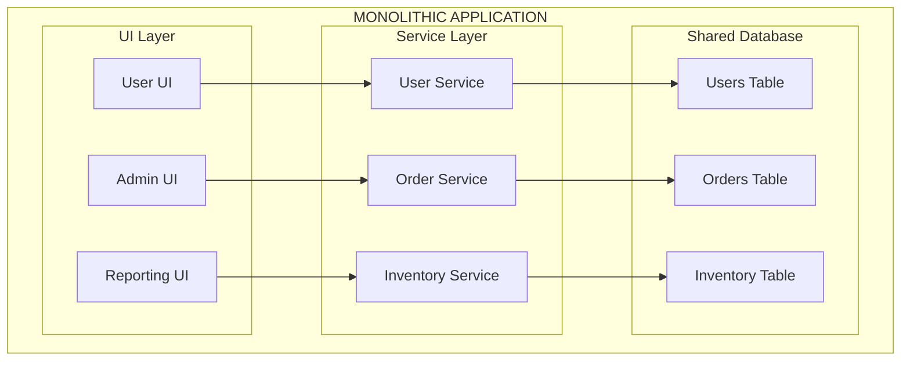
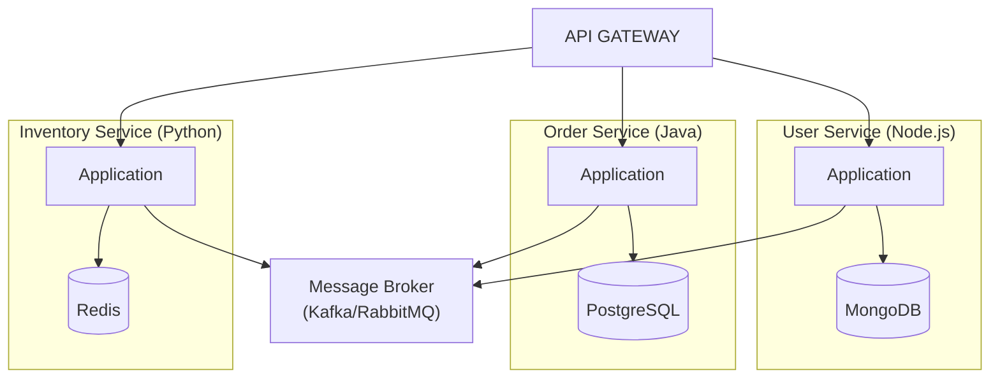
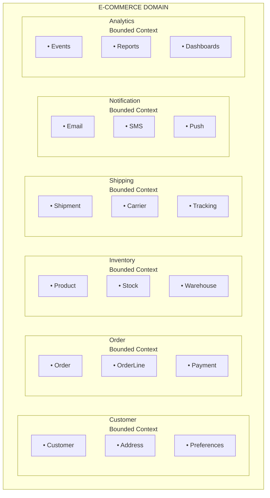

# Microservices Fundamentals

## Overview
Microservices architecture is a design approach where an application is built as a collection of loosely coupled, independently deployable services. Each service is self-contained, focuses on a specific business capability, and communicates with other services through well-defined APIs.

---

## Monolith vs Microservices

### Monolithic Architecture



**Characteristics:**
- Single deployable unit
- Shared codebase and database
- Tightly coupled components
- Single technology stack

**Pros:**
- Simple to develop initially
- Easy to test end-to-end
- Simple deployment (one artifact)
- No network latency between components
- ACID transactions across all data

**Cons:**
- Scaling requires scaling entire application
- Technology lock-in
- Large codebase becomes hard to understand
- Long build and deployment times
- Single point of failure
- Team coordination overhead

### Microservices Architecture



**Characteristics:**
- Multiple independently deployable services
- Each service owns its data
- Loosely coupled through APIs
- Polyglot technology stack

**Pros:**
- Independent scaling of services
- Technology flexibility per service
- Faster development cycles
- Fault isolation
- Team autonomy
- Easier to understand individual services

**Cons:**
- Distributed system complexity
- Network latency and reliability
- Data consistency challenges
- Operational overhead
- Testing complexity
- Debugging across services

---

## Comparison Table

| Aspect | Monolith | Microservices |
|--------|----------|---------------|
| **Deployment** | Single unit | Independent services |
| **Scaling** | Entire application | Individual services |
| **Technology** | Single stack | Polyglot |
| **Database** | Shared | Per service |
| **Team Structure** | Large teams | Small, autonomous teams |
| **Complexity** | Application complexity | Infrastructure complexity |
| **Failure Impact** | System-wide | Service-level isolation |
| **Development Speed** | Slower as app grows | Faster with clear boundaries |
| **Testing** | Simpler E2E | Complex integration |
| **Transactions** | ACID | Eventual consistency (Saga) |

---

## Service Boundaries

### What is a Service Boundary?
A service boundary defines the scope and responsibility of a microservice. It determines what functionality belongs to which service and how services interact.

### Domain-Driven Design (DDD) Approach



### Key DDD Concepts

**Bounded Context:**
- A boundary within which a domain model is defined and applicable
- Different contexts can have different models for the same concept
- Clear interfaces between contexts

**Ubiquitous Language:**
- Shared vocabulary between developers and domain experts
- Consistent within a bounded context
- May differ across contexts

**Aggregate:**
- A cluster of domain objects treated as a single unit
- Has a root entity that controls access
- Boundary for transactions

```java
// Order Aggregate Example
@Entity
public class Order {  // Aggregate Root
    @Id
    private OrderId id;
    private CustomerId customerId;
    
    @OneToMany(cascade = CascadeType.ALL)
    private List<OrderLine> orderLines;  // Part of aggregate
    
    private Money totalAmount;
    private OrderStatus status;
    
    // Business logic encapsulated in aggregate
    public void addItem(ProductId productId, int quantity, Money price) {
        OrderLine line = new OrderLine(productId, quantity, price);
        this.orderLines.add(line);
        recalculateTotal();
    }
    
    public void confirm() {
        if (orderLines.isEmpty()) {
            throw new InvalidOrderException("Cannot confirm empty order");
        }
        this.status = OrderStatus.CONFIRMED;
    }
    
    private void recalculateTotal() {
        this.totalAmount = orderLines.stream()
            .map(OrderLine::getSubtotal)
            .reduce(Money.ZERO, Money::add);
    }
}
```

### Identifying Service Boundaries

**1. Business Capability Decomposition:**
```
E-Commerce Platform
├── Customer Management
│   ├── Registration
│   ├── Authentication
│   └── Profile Management
├── Product Catalog
│   ├── Product Information
│   ├── Categories
│   └── Search
├── Order Management
│   ├── Shopping Cart
│   ├── Checkout
│   └── Order History
├── Payment Processing
│   ├── Payment Methods
│   ├── Transactions
│   └── Refunds
└── Fulfillment
    ├── Inventory
    ├── Shipping
    └── Returns
```

**2. Subdomain Analysis:**
- **Core Domain:** Primary competitive advantage (e.g., recommendation engine)
- **Supporting Domain:** Supports core but not differentiating (e.g., order management)
- **Generic Domain:** Common functionality (e.g., authentication, notifications)

---

## Decomposition Strategies

### 1. Decompose by Business Capability

```
┌─────────────────────────────────────────────────────────────┐
│                    BUSINESS CAPABILITIES                     │
├─────────────────────────────────────────────────────────────┤
│                                                              │
│   SALES              MARKETING           FULFILLMENT         │
│   ┌─────────────┐   ┌─────────────┐   ┌─────────────┐       │
│   │ Order Svc   │   │ Campaign Svc│   │ Shipping Svc│       │
│   │ Pricing Svc │   │ Promo Svc   │   │Warehouse Svc│       │
│   │ Quote Svc   │   │ Email Svc   │   │ Returns Svc │       │
│   └─────────────┘   └─────────────┘   └─────────────┘       │
│                                                              │
│   FINANCE            CUSTOMER            PRODUCT             │
│   ┌─────────────┐   ┌─────────────┐   ┌─────────────┐       │
│   │ Billing Svc │   │ Profile Svc │   │ Catalog Svc │       │
│   │ Invoice Svc │   │ Support Svc │   │ Search Svc  │       │
│   │ Payment Svc │   │ Review Svc  │   │ Inventory   │       │
│   └─────────────┘   └─────────────┘   └─────────────┘       │
│                                                              │
└─────────────────────────────────────────────────────────────┘
```

**Approach:**
1. Identify business capabilities
2. Map services to capabilities
3. One service per capability
4. Services are stable as capabilities rarely change

### 2. Decompose by Subdomain (DDD)

```java
// Context Map showing relationships between bounded contexts
/*
 ┌─────────────┐        ┌─────────────┐
 │   Order     │◄──────►│  Customer   │
 │   Context   │  U/D   │   Context   │
 └─────────────┘        └─────────────┘
        │
        │ Published
        │ Language
        ▼
 ┌─────────────┐        ┌─────────────┐
 │  Shipping   │◄──────►│  Inventory  │
 │   Context   │  ACL   │   Context   │
 └─────────────┘        └─────────────┘

 Relationships:
 - U/D: Upstream/Downstream
 - ACL: Anti-Corruption Layer
 - Published Language: Shared schema
*/
```

### 3. Strangler Fig Pattern (Migration Strategy)

```
                    Step 1: Add Facade
┌─────────────────────────────────────────────────────────────┐
│                        FACADE/PROXY                          │
└─────────────────────────────────┬───────────────────────────┘
                                  │
                                  ▼
┌─────────────────────────────────────────────────────────────┐
│                    EXISTING MONOLITH                         │
│  ┌─────────┐  ┌─────────┐  ┌─────────┐  ┌─────────────┐     │
│  │ Users   │  │ Orders  │  │Products │  │  Payments   │     │
│  └─────────┘  └─────────┘  └─────────┘  └─────────────┘     │
└─────────────────────────────────────────────────────────────┘

                    Step 2: Extract Services
┌─────────────────────────────────────────────────────────────┐
│                        FACADE/PROXY                          │
└──────────────────────────┬──────────────────────────────────┘
              ┌────────────┴────────────┐
              ▼                         ▼
┌─────────────────────┐    ┌──────────────────────────────────┐
│   User Service      │    │        EXISTING MONOLITH         │
│   (Extracted)       │    │  ┌─────────┐  ┌─────────────┐    │
└─────────────────────┘    │  │ Orders  │  │  Payments   │    │
                           │  └─────────┘  └─────────────┘    │
                           └──────────────────────────────────┘

                    Step 3: Continue Extraction
┌─────────────────────────────────────────────────────────────┐
│                        API GATEWAY                           │
└──────────────────────────┬──────────────────────────────────┘
     ┌─────────────────────┼─────────────────────┐
     ▼                     ▼                     ▼
┌──────────┐        ┌──────────┐          ┌──────────┐
│  Users   │        │  Orders  │          │ Payments │
│ Service  │        │ Service  │          │ Service  │
└──────────┘        └──────────┘          └──────────┘
```

```java
// Strangler Fig Implementation Example
@RestController
@RequestMapping("/api")
public class StranglerFigFacade {
    
    private final LegacyMonolithClient legacyClient;
    private final UserServiceClient userServiceClient;
    private final FeatureFlagService featureFlags;
    
    @GetMapping("/users/{id}")
    public ResponseEntity<UserDTO> getUser(@PathVariable String id) {
        // Route to new service if feature flag enabled
        if (featureFlags.isEnabled("use-new-user-service")) {
            return ResponseEntity.ok(userServiceClient.getUser(id));
        }
        // Fall back to legacy
        return ResponseEntity.ok(legacyClient.getUser(id));
    }
    
    @PostMapping("/orders")
    public ResponseEntity<OrderDTO> createOrder(@RequestBody OrderRequest request) {
        // Still using legacy for orders
        return ResponseEntity.ok(legacyClient.createOrder(request));
    }
}
```

### 4. Branch by Abstraction

```java
// Step 1: Create abstraction
public interface UserRepository {
    User findById(String id);
    void save(User user);
}

// Step 2: Existing implementation
@Repository
public class LegacyUserRepository implements UserRepository {
    private final JdbcTemplate jdbcTemplate;
    
    @Override
    public User findById(String id) {
        // Legacy database call
        return jdbcTemplate.queryForObject(
            "SELECT * FROM users WHERE id = ?",
            new UserRowMapper(),
            id
        );
    }
}

// Step 3: New implementation
@Repository
public class MicroserviceUserRepository implements UserRepository {
    private final UserServiceClient client;
    
    @Override
    public User findById(String id) {
        // Call to new microservice
        return client.getUser(id);
    }
}

// Step 4: Switch implementations
@Configuration
public class RepositoryConfig {
    
    @Bean
    @ConditionalOnProperty(name = "user.repository.type", havingValue = "legacy")
    public UserRepository legacyUserRepository(JdbcTemplate jdbcTemplate) {
        return new LegacyUserRepository(jdbcTemplate);
    }
    
    @Bean
    @ConditionalOnProperty(name = "user.repository.type", havingValue = "microservice")
    public UserRepository microserviceUserRepository(UserServiceClient client) {
        return new MicroserviceUserRepository(client);
    }
}
```

---

## Microservices Design Principles

### 1. Single Responsibility
Each service should do one thing and do it well.

```java
// Good: Focused service
@Service
public class PaymentService {
    public PaymentResult processPayment(PaymentRequest request) { }
    public RefundResult processRefund(RefundRequest request) { }
    public PaymentStatus getPaymentStatus(String paymentId) { }
}

// Bad: Service doing too much
@Service
public class OrderPaymentShippingService {
    public Order createOrder(OrderRequest request) { }
    public PaymentResult processPayment(PaymentRequest request) { }
    public Shipment createShipment(ShipmentRequest request) { }
    public void sendNotification(NotificationRequest request) { }
}
```

### 2. Loose Coupling

```java
// Tight Coupling (Bad)
@Service
public class OrderService {
    private final InventoryService inventoryService;  // Direct dependency
    private final PaymentService paymentService;
    
    public Order createOrder(OrderRequest request) {
        // Synchronous calls creating tight coupling
        inventoryService.reserveStock(request.getItems());
        paymentService.processPayment(request.getPayment());
        return new Order(request);
    }
}

// Loose Coupling (Good) - Event-Driven
@Service
public class OrderService {
    private final EventPublisher eventPublisher;
    
    public Order createOrder(OrderRequest request) {
        Order order = new Order(request);
        order.setStatus(OrderStatus.PENDING);
        
        // Publish event instead of direct calls
        eventPublisher.publish(new OrderCreatedEvent(order));
        
        return order;
    }
}

@Service
public class InventoryEventHandler {
    @EventListener
    public void handleOrderCreated(OrderCreatedEvent event) {
        reserveStock(event.getOrder().getItems());
    }
}
```

### 3. High Cohesion
Related functionality should be grouped together.

```java
// High Cohesion - All user-related functionality together
@RestController
@RequestMapping("/api/users")
public class UserController {
    
    private final UserService userService;
    
    @PostMapping
    public User createUser(@RequestBody CreateUserRequest request) { }
    
    @GetMapping("/{id}")
    public User getUser(@PathVariable String id) { }
    
    @PutMapping("/{id}")
    public User updateUser(@PathVariable String id, @RequestBody UpdateUserRequest request) { }
    
    @GetMapping("/{id}/preferences")
    public UserPreferences getPreferences(@PathVariable String id) { }
    
    @PutMapping("/{id}/preferences")
    public UserPreferences updatePreferences(@PathVariable String id, @RequestBody UserPreferences prefs) { }
}
```

### 4. Database per Service

```
┌─────────────────┐     ┌─────────────────┐     ┌─────────────────┐
│  User Service   │     │  Order Service  │     │ Product Service │
└────────┬────────┘     └────────┬────────┘     └────────┬────────┘
         │                       │                       │
         ▼                       ▼                       ▼
   ┌──────────┐            ┌──────────┐            ┌──────────┐
   │ User DB  │            │ Order DB │            │Product DB│
   │ (MySQL)  │            │(Postgres)│            │(MongoDB) │
   └──────────┘            └──────────┘            └──────────┘
```

```java
// Each service has its own data source configuration
@Configuration
@EnableJpaRepositories(basePackages = "com.example.order.repository")
public class OrderDatabaseConfig {
    
    @Bean
    @ConfigurationProperties("spring.datasource.order")
    public DataSource orderDataSource() {
        return DataSourceBuilder.create().build();
    }
}
```

### 5. API First Design

```yaml
# OpenAPI specification first
openapi: 3.0.0
info:
  title: Order Service API
  version: 1.0.0
paths:
  /orders:
    post:
      summary: Create a new order
      requestBody:
        required: true
        content:
          application/json:
            schema:
              $ref: '#/components/schemas/CreateOrderRequest'
      responses:
        '201':
          description: Order created
          content:
            application/json:
              schema:
                $ref: '#/components/schemas/Order'
        '400':
          description: Invalid request
          content:
            application/json:
              schema:
                $ref: '#/components/schemas/Error'
```

---

## Service Size Guidelines

### Too Small (Nano-services)
```
❌ Avoid excessive fragmentation:
   - UserNameService
   - UserEmailService
   - UserAddressService
   - UserPhoneService

✓ Combine into cohesive service:
   - UserService
```

### Too Large (Mini-monolith)
```
❌ Avoid services that are too broad:
   - CustomerManagementService (handles users, orders, payments, shipping)

✓ Split by business capability:
   - UserService
   - OrderService
   - PaymentService
   - ShippingService
```

### Right Size Guidelines

| Factor | Guideline |
|--------|-----------|
| **Team Size** | 2 pizza team (5-9 people) per service |
| **Codebase** | Rewritable in 2-4 weeks |
| **Scope** | Single bounded context |
| **Deployment** | Independently deployable |
| **Data** | Owns its data completely |

---

## Common Anti-Patterns

### 1. Distributed Monolith
```
Problem: Services are deployed separately but still tightly coupled

┌──────────┐ sync ┌──────────┐ sync ┌──────────┐
│Service A │─────►│Service B │─────►│Service C │
└──────────┘      └──────────┘      └──────────┘
     │                 │                 │
     └─────────────────┴─────────────────┘
              Shared Database
              
Solution: True service independence with async communication
```

### 2. Shared Database Anti-Pattern
```java
// Anti-pattern: Multiple services accessing same tables
// Service A
@Repository
public class OrderRepositoryA {
    @Query("SELECT o FROM Order o WHERE o.customerId = :customerId")
    List<Order> findByCustomerId(String customerId);
}

// Service B - Same database!
@Repository
public class OrderRepositoryB {
    @Query("SELECT o FROM Order o WHERE o.status = :status")
    List<Order> findByStatus(OrderStatus status);
}

// Solution: Service B should call Service A's API
@Service
public class ServiceBOrderClient {
    private final RestTemplate restTemplate;
    
    public List<Order> getOrdersByStatus(OrderStatus status) {
        return restTemplate.getForObject(
            "http://order-service/orders?status=" + status,
            OrderList.class
        ).getOrders();
    }
}
```

### 3. Synchronous Chain
```
Anti-pattern: Long synchronous call chains

Client → A → B → C → D → E
         │   │   │   │   │
         └───┴───┴───┴───┴── Total latency = sum of all

Solution: Use async communication or aggregate service
```

---

## Interview Questions

### Conceptual Questions
1. **What are microservices and how do they differ from monolithic architecture?**
2. **What is Domain-Driven Design and how does it help in microservices?**
3. **Explain bounded context and its importance in microservices.**
4. **What are the trade-offs of microservices architecture?**
5. **How do you determine the right size for a microservice?**

### Design Questions
1. **How would you decompose an e-commerce monolith into microservices?**
2. **What factors would you consider when defining service boundaries?**
3. **How do you handle data consistency across microservices?**
4. **Explain the Strangler Fig pattern and when to use it.**
5. **What is the database-per-service pattern and why is it important?**

### Practical Questions
1. **What are the challenges you've faced in microservices architecture?**
2. **How do you handle distributed transactions?**
3. **What strategies do you use for service-to-service communication?**
4. **How do you manage shared code across microservices?**
5. **What monitoring and observability practices do you follow?**

---

## Key Takeaways

1. **Microservices trade application complexity for infrastructure complexity**
2. **Start with a modular monolith, decompose when needed**
3. **Use DDD to identify natural service boundaries**
4. **Each service should own its data completely**
5. **Prefer asynchronous communication over synchronous**
6. **Design for failure - services will fail**
7. **The right service size balances team autonomy with operational overhead**
8. **Avoid distributed monolith anti-pattern**
9. **Migration from monolith should be incremental (Strangler Fig)**
10. **Microservices require mature DevOps practices**

---

*Next: [Service Discovery](02-service-discovery.md)*
