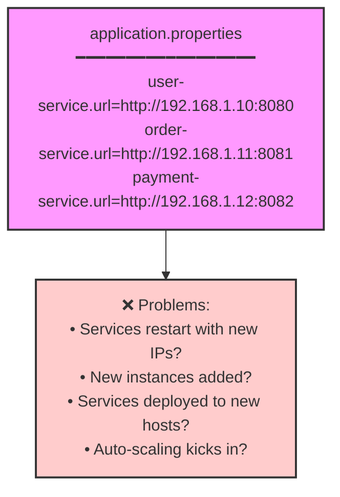
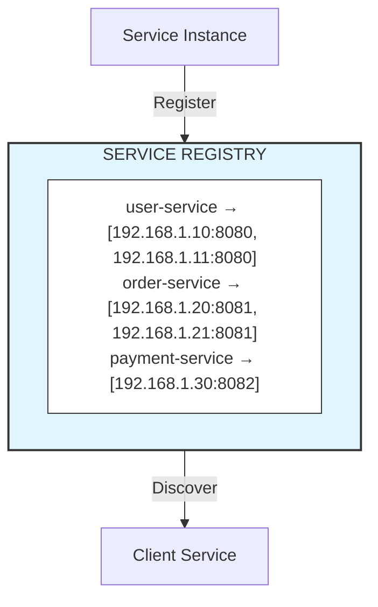
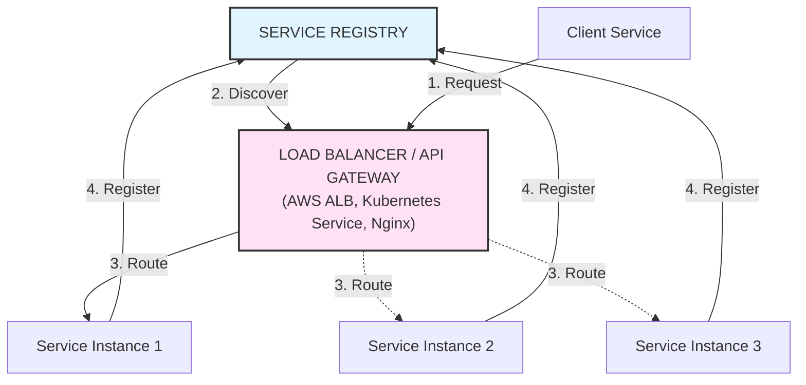

# Service Discovery

## Overview
Service Discovery is a mechanism that enables services to find and communicate with each other dynamically in a distributed system. Instead of hardcoding service locations, services register themselves and discover others through a service registry.

---

## Why Service Discovery?

### The Problem
In a microservices environment:
- Services are deployed across multiple hosts
- IP addresses change dynamically (containers, auto-scaling)
- Services can have multiple instances
- Manual configuration doesn't scale



### The Solution



---

## Service Registry Patterns

### Client-Side Discovery

```mermaid
flowchart TB
    Registry["SERVICE REGISTRY<br/>(Eureka, Consul, Zookeeper)"]
    
    Client["Client Service"]
    SI1["Service Instance 1"]
    SI2["Service Instance 2"]
    SI3["Service Instance 3"]
    
    SI1 -->|2. Register| Registry
    SI2 -->|2. Register| Registry
    SI3 -->|2. Register| Registry
    
    Registry -->|1. Query| Client
    Client -->|3. Direct Call<br/>(Load Balanced)| SI1
    Client -.->|3. Direct Call<br/>(Load Balanced)| SI2
    Client -.->|3. Direct Call<br/>(Load Balanced)| SI3
    
    style Registry fill:#e1f5ff,stroke:#333,stroke-width:2px
```

**How it works:**
1. Service instances register with the registry
2. Client queries registry for service locations
3. Client performs load balancing and calls service directly

**Pros:**
- No single point of failure (after initial discovery)
- Client controls load balancing logic
- Lower latency (direct connection)

**Cons:**
- Client needs discovery logic
- Language/framework specific implementations
- Client must handle service changes

```java
// Spring Cloud Netflix Eureka - Client-Side Discovery
@SpringBootApplication
@EnableDiscoveryClient
public class OrderServiceApplication {
    public static void main(String[] args) {
        SpringApplication.run(OrderServiceApplication.class, args);
    }
}

@Service
public class UserServiceClient {
    
    @Autowired
    private DiscoveryClient discoveryClient;
    
    @Autowired
    @LoadBalanced  // Client-side load balancing
    private RestTemplate restTemplate;
    
    // Manual discovery
    public String getUserServiceUrl() {
        List<ServiceInstance> instances = 
            discoveryClient.getInstances("user-service");
        if (instances.isEmpty()) {
            throw new ServiceNotFoundException("user-service not found");
        }
        // Simple round-robin or custom selection
        ServiceInstance instance = instances.get(0);
        return instance.getUri().toString();
    }
    
    // Using @LoadBalanced RestTemplate (recommended)
    public User getUser(String userId) {
        return restTemplate.getForObject(
            "http://user-service/users/" + userId,  // Logical name
            User.class
        );
    }
}

// Using OpenFeign (declarative approach)
@FeignClient(name = "user-service")
public interface UserServiceClient {
    
    @GetMapping("/users/{id}")
    User getUser(@PathVariable("id") String id);
    
    @PostMapping("/users")
    User createUser(@RequestBody CreateUserRequest request);
}
```

### Server-Side Discovery



**How it works:**
1. Client sends request to load balancer
2. Load balancer queries registry for instances
3. Load balancer routes request to appropriate instance
4. Service instances register with registry

**Pros:**
- Client is simpler (no discovery logic)
- Language agnostic
- Centralized load balancing

**Cons:**
- Load balancer becomes a potential bottleneck
- Additional network hop
- Requires high availability for load balancer

```yaml
# Kubernetes Service (Server-Side Discovery)
apiVersion: v1
kind: Service
metadata:
  name: user-service
spec:
  selector:
    app: user-service
  ports:
    - protocol: TCP
      port: 80
      targetPort: 8080
  type: ClusterIP
---
# Kubernetes automatically:
# 1. Watches for pods matching selector
# 2. Updates endpoints when pods change
# 3. Load balances requests across pods
```

### Comparison Table

| Aspect | Client-Side | Server-Side |
|--------|-------------|-------------|
| **Complexity** | Client needs discovery logic | Simpler clients |
| **Load Balancing** | Client performs | Server/LB performs |
| **Network Hops** | Direct connection | Extra hop through LB |
| **Language Support** | Framework specific | Language agnostic |
| **Failure Handling** | Client handles | LB handles |
| **Examples** | Eureka + Ribbon | Kubernetes, AWS ELB |

---

## Service Registry Implementations

### Netflix Eureka

```
┌─────────────────────────────────────────────────────────────────────┐
│                         EUREKA ARCHITECTURE                          │
│                                                                      │
│  ┌────────────────────┐      ┌────────────────────┐                 │
│  │   Eureka Server 1  │◄────►│   Eureka Server 2  │  Peer           │
│  │    (Zone: us-east) │      │    (Zone: us-west) │  Replication    │
│  └─────────┬──────────┘      └──────────┬─────────┘                 │
│            │                            │                            │
│    ┌───────┴───────┐            ┌───────┴───────┐                   │
│    ▼               ▼            ▼               ▼                   │
│ ┌─────────┐  ┌─────────┐  ┌─────────┐    ┌─────────┐               │
│ │Service A│  │Service B│  │Service C│    │Service D│               │
│ │(Client) │  │(Client) │  │(Client) │    │(Client) │               │
│ └─────────┘  └─────────┘  └─────────┘    └─────────┘               │
│                                                                      │
│  Features:                                                           │
│  • Self-preservation mode                                            │
│  • Peer-to-peer replication                                          │
│  • Zone awareness                                                    │
│  • Heartbeat-based health checks                                     │
└─────────────────────────────────────────────────────────────────────┘
```

**Eureka Server Configuration:**
```java
@SpringBootApplication
@EnableEurekaServer
public class EurekaServerApplication {
    public static void main(String[] args) {
        SpringApplication.run(EurekaServerApplication.class, args);
    }
}
```

```yaml
# application.yml - Eureka Server
server:
  port: 8761

eureka:
  instance:
    hostname: localhost
  client:
    registerWithEureka: false  # Server doesn't register itself
    fetchRegistry: false       # Server doesn't fetch from itself
    serviceUrl:
      defaultZone: http://${eureka.instance.hostname}:${server.port}/eureka/
  server:
    enableSelfPreservation: true
    renewalPercentThreshold: 0.85
```

**Eureka Client Configuration:**
```yaml
# application.yml - Eureka Client
spring:
  application:
    name: order-service

eureka:
  client:
    serviceUrl:
      defaultZone: http://localhost:8761/eureka/
    registryFetchIntervalSeconds: 30
    instanceInfoReplicationIntervalSeconds: 30
  instance:
    preferIpAddress: true
    leaseRenewalIntervalInSeconds: 30
    leaseExpirationDurationInSeconds: 90
    metadata-map:
      version: 1.0.0
      environment: production
```

### HashiCorp Consul

```
┌─────────────────────────────────────────────────────────────────────┐
│                        CONSUL ARCHITECTURE                           │
│                                                                      │
│   ┌─────────────────────────────────────────────────────────────┐   │
│   │                    CONSUL CLUSTER                            │   │
│   │   ┌──────────┐    ┌──────────┐    ┌──────────┐              │   │
│   │   │ Server 1 │◄──►│ Server 2 │◄──►│ Server 3 │  Raft        │   │
│   │   │ (Leader) │    │(Follower)│    │(Follower)│  Consensus   │   │
│   │   └──────────┘    └──────────┘    └──────────┘              │   │
│   └─────────────────────────────────────────────────────────────┘   │
│                                                                      │
│   ┌─────────────────────────────────────────────────────────────┐   │
│   │                    CONSUL AGENTS                             │   │
│   │                                                              │   │
│   │   ┌──────────────┐  ┌──────────────┐  ┌──────────────┐      │   │
│   │   │ Agent (Host1)│  │ Agent (Host2)│  │ Agent (Host3)│      │   │
│   │   │  • Service A │  │  • Service B │  │  • Service C │      │   │
│   │   │  • Service D │  │  • Service E │  │  • Service F │      │   │
│   │   └──────────────┘  └──────────────┘  └──────────────┘      │   │
│   └─────────────────────────────────────────────────────────────┘   │
│                                                                      │
│   Features:                                                          │
│   • Multi-datacenter support                                         │
│   • Key/Value store                                                  │
│   • Health checking (HTTP, TCP, Script, TTL)                        │
│   • DNS and HTTP interfaces                                          │
│   • Service mesh with Connect                                        │
└─────────────────────────────────────────────────────────────────────┘
```

```java
// Spring Cloud Consul Configuration
@SpringBootApplication
@EnableDiscoveryClient
public class OrderServiceApplication {
    public static void main(String[] args) {
        SpringApplication.run(OrderServiceApplication.class, args);
    }
}
```

```yaml
# application.yml - Consul Client
spring:
  application:
    name: order-service
  cloud:
    consul:
      host: localhost
      port: 8500
      discovery:
        service-name: ${spring.application.name}
        health-check-path: /actuator/health
        health-check-interval: 10s
        instance-id: ${spring.application.name}:${random.value}
        tags:
          - version=1.0.0
          - environment=production
        metadata:
          prometheus-port: 8080
          prometheus-path: /actuator/prometheus
```

```bash
# Consul CLI commands
# Register service manually
consul services register -name=web -port=8080 -address=192.168.1.10

# Query services via DNS
dig @127.0.0.1 -p 8600 order-service.service.consul

# Query services via HTTP
curl http://localhost:8500/v1/catalog/service/order-service

# Health check
curl http://localhost:8500/v1/health/service/order-service?passing
```

### Apache Zookeeper

```
┌─────────────────────────────────────────────────────────────────────┐
│                      ZOOKEEPER ARCHITECTURE                          │
│                                                                      │
│   ┌─────────────────────────────────────────────────────────────┐   │
│   │                   ZOOKEEPER ENSEMBLE                         │   │
│   │   ┌──────────┐    ┌──────────┐    ┌──────────┐              │   │
│   │   │  Node 1  │◄──►│  Node 2  │◄──►│  Node 3  │   ZAB        │   │
│   │   │ (Leader) │    │(Follower)│    │(Follower)│  Protocol    │   │
│   │   └──────────┘    └──────────┘    └──────────┘              │   │
│   └─────────────────────────────────────────────────────────────┘   │
│                                                                      │
│   ZNode Structure (Hierarchical Namespace):                          │
│   /                                                                  │
│   ├── services/                                                      │
│   │   ├── user-service/                                              │
│   │   │   ├── instance-001 → {"host":"192.168.1.10","port":8080}   │
│   │   │   └── instance-002 → {"host":"192.168.1.11","port":8080}   │
│   │   └── order-service/                                             │
│   │       └── instance-001 → {"host":"192.168.1.20","port":8081}   │
│   └── config/                                                        │
│       └── database → {"url":"jdbc:mysql://..."}                     │
│                                                                      │
│   Features:                                                          │
│   • Hierarchical key-value store                                     │
│   • Ephemeral nodes (auto-delete on disconnect)                     │
│   • Watches for change notifications                                 │
│   • Sequential nodes for ordering                                    │
│   • Strong consistency (CP in CAP)                                   │
└─────────────────────────────────────────────────────────────────────┘
```

```java
// Zookeeper Service Registration
public class ZookeeperServiceRegistry {
    
    private final CuratorFramework client;
    private final String basePath = "/services";
    
    public ZookeeperServiceRegistry(String connectionString) {
        this.client = CuratorFrameworkFactory.builder()
            .connectString(connectionString)
            .retryPolicy(new ExponentialBackoffRetry(1000, 3))
            .build();
        this.client.start();
    }
    
    public void register(String serviceName, String host, int port) throws Exception {
        String path = basePath + "/" + serviceName;
        String instancePath = path + "/instance-";
        
        // Create service node if not exists
        if (client.checkExists().forPath(path) == null) {
            client.create().creatingParentsIfNeeded().forPath(path);
        }
        
        // Create ephemeral sequential node for instance
        String instanceData = String.format("{\"host\":\"%s\",\"port\":%d}", host, port);
        client.create()
            .withMode(CreateMode.EPHEMERAL_SEQUENTIAL)
            .forPath(instancePath, instanceData.getBytes());
    }
    
    public List<ServiceInstance> discover(String serviceName) throws Exception {
        String path = basePath + "/" + serviceName;
        List<String> children = client.getChildren().forPath(path);
        
        return children.stream()
            .map(child -> {
                try {
                    byte[] data = client.getData().forPath(path + "/" + child);
                    return parseServiceInstance(new String(data));
                } catch (Exception e) {
                    throw new RuntimeException(e);
                }
            })
            .collect(Collectors.toList());
    }
    
    // Watch for changes
    public void watchService(String serviceName, Consumer<List<ServiceInstance>> callback) 
            throws Exception {
        String path = basePath + "/" + serviceName;
        
        PathChildrenCache cache = new PathChildrenCache(client, path, true);
        cache.getListenable().addListener((c, event) -> {
            callback.accept(discover(serviceName));
        });
        cache.start();
    }
}
```

### Kubernetes Service Discovery

```yaml
# Kubernetes native service discovery
apiVersion: v1
kind: Service
metadata:
  name: user-service
  namespace: production
spec:
  selector:
    app: user-service
  ports:
    - name: http
      port: 80
      targetPort: 8080
  type: ClusterIP
---
apiVersion: apps/v1
kind: Deployment
metadata:
  name: user-service
  namespace: production
spec:
  replicas: 3
  selector:
    matchLabels:
      app: user-service
  template:
    metadata:
      labels:
        app: user-service
    spec:
      containers:
        - name: user-service
          image: user-service:1.0.0
          ports:
            - containerPort: 8080
          readinessProbe:
            httpGet:
              path: /health
              port: 8080
            initialDelaySeconds: 10
            periodSeconds: 5
          livenessProbe:
            httpGet:
              path: /health
              port: 8080
            initialDelaySeconds: 30
            periodSeconds: 10
```

```java
// In Kubernetes, services are discovered via DNS
@Service
public class UserServiceClient {
    
    private final RestTemplate restTemplate;
    
    // DNS-based discovery: service-name.namespace.svc.cluster.local
    private final String userServiceUrl = "http://user-service.production.svc.cluster.local";
    
    public User getUser(String id) {
        return restTemplate.getForObject(
            userServiceUrl + "/users/" + id,
            User.class
        );
    }
}
```

---

## Health Checks

### Health Check Types

```
┌─────────────────────────────────────────────────────────────────────┐
│                        HEALTH CHECK TYPES                            │
├─────────────────────────────────────────────────────────────────────┤
│                                                                      │
│  HTTP Health Check                                                   │
│  ┌──────────────┐     GET /health      ┌──────────────┐            │
│  │   Registry   │ ──────────────────►  │   Service    │            │
│  └──────────────┘     200 OK           └──────────────┘            │
│                                                                      │
│  TCP Health Check                                                    │
│  ┌──────────────┐     TCP Connect      ┌──────────────┐            │
│  │   Registry   │ ──────────────────►  │   Service    │            │
│  └──────────────┘     Connection OK    └──────────────┘            │
│                                                                      │
│  TTL (Heartbeat) Health Check                                        │
│  ┌──────────────┐     Heartbeat        ┌──────────────┐            │
│  │   Registry   │ ◄──────────────────  │   Service    │            │
│  └──────────────┘     (Every N sec)    └──────────────┘            │
│                                                                      │
│  Script Health Check                                                 │
│  ┌──────────────┐     Execute Script   ┌──────────────┐            │
│  │    Agent     │ ──────────────────►  │   Script     │            │
│  └──────────────┘     Exit Code 0      └──────────────┘            │
│                                                                      │
└─────────────────────────────────────────────────────────────────────┘
```

### Spring Boot Actuator Health

```java
@Component
public class CustomHealthIndicator implements HealthIndicator {
    
    private final DataSource dataSource;
    private final RedisTemplate<String, String> redisTemplate;
    
    @Override
    public Health health() {
        try {
            // Check database
            dataSource.getConnection().isValid(5);
            
            // Check Redis
            redisTemplate.opsForValue().get("health-check");
            
            return Health.up()
                .withDetail("database", "connected")
                .withDetail("redis", "connected")
                .build();
        } catch (Exception e) {
            return Health.down()
                .withException(e)
                .build();
        }
    }
}

// Composite health check
@Component
public class ServiceHealthIndicator implements HealthIndicator {
    
    @Override
    public Health health() {
        Map<String, Object> details = new HashMap<>();
        boolean isHealthy = true;
        
        // Check various components
        if (!isDatabaseHealthy()) {
            details.put("database", "DOWN");
            isHealthy = false;
        } else {
            details.put("database", "UP");
        }
        
        if (!isMessageQueueHealthy()) {
            details.put("messageQueue", "DOWN");
            isHealthy = false;
        } else {
            details.put("messageQueue", "UP");
        }
        
        if (!isExternalServiceHealthy()) {
            details.put("externalService", "DEGRADED");
            // Don't mark unhealthy for external service
        } else {
            details.put("externalService", "UP");
        }
        
        if (isHealthy) {
            return Health.up().withDetails(details).build();
        } else {
            return Health.down().withDetails(details).build();
        }
    }
}
```

```yaml
# application.yml - Health endpoint configuration
management:
  endpoint:
    health:
      show-details: always
      probes:
        enabled: true
  health:
    livenessstate:
      enabled: true
    readinessstate:
      enabled: true
    diskspace:
      enabled: true
      threshold: 10MB
    db:
      enabled: true
    redis:
      enabled: true

# Kubernetes probes configuration
eureka:
  instance:
    health-check-url-path: /actuator/health
```

### Liveness vs Readiness

```
┌─────────────────────────────────────────────────────────────────────┐
│                  LIVENESS vs READINESS PROBES                        │
├─────────────────────────────────────────────────────────────────────┤
│                                                                      │
│  LIVENESS PROBE                        READINESS PROBE               │
│  "Is the container alive?"             "Can it handle requests?"     │
│                                                                      │
│  ┌─────────────────────────┐           ┌─────────────────────────┐  │
│  │                         │           │                         │  │
│  │  Failing → RESTART      │           │  Failing → REMOVE from  │  │
│  │           Container     │           │           Load Balancer │  │
│  │                         │           │                         │  │
│  └─────────────────────────┘           └─────────────────────────┘  │
│                                                                      │
│  Use Cases:                            Use Cases:                    │
│  • Deadlock detection                  • Startup completion          │
│  • Application frozen                  • Dependency availability     │
│  • Memory leak recovery                • Graceful degradation        │
│                                                                      │
└─────────────────────────────────────────────────────────────────────┘
```

```java
@Component
public class LivenessHealthIndicator implements HealthIndicator {
    
    private final AtomicBoolean alive = new AtomicBoolean(true);
    
    @Override
    public Health health() {
        if (alive.get()) {
            return Health.up().build();
        }
        return Health.down().withDetail("reason", "Application is not alive").build();
    }
    
    // Can be triggered to indicate liveness failure
    public void markUnhealthy() {
        alive.set(false);
    }
}

@Component
public class ReadinessHealthIndicator implements HealthIndicator {
    
    private final DataSource dataSource;
    private final KafkaTemplate<String, String> kafkaTemplate;
    
    @Override
    public Health health() {
        Health.Builder builder = new Health.Builder();
        boolean ready = true;
        
        // Check if database is reachable
        try {
            dataSource.getConnection().isValid(2);
            builder.withDetail("database", "ready");
        } catch (Exception e) {
            builder.withDetail("database", "not ready: " + e.getMessage());
            ready = false;
        }
        
        // Check if Kafka is reachable
        try {
            kafkaTemplate.send("health-check", "ping").get(5, TimeUnit.SECONDS);
            builder.withDetail("kafka", "ready");
        } catch (Exception e) {
            builder.withDetail("kafka", "not ready: " + e.getMessage());
            ready = false;
        }
        
        return ready ? builder.up().build() : builder.down().build();
    }
}
```

---

## Service Registration Lifecycle

```
┌─────────────────────────────────────────────────────────────────────┐
│                   SERVICE REGISTRATION LIFECYCLE                     │
│                                                                      │
│   1. STARTUP                                                         │
│   ┌─────────┐                        ┌──────────────┐               │
│   │ Service │ ────── Register ─────► │   Registry   │               │
│   │ Starts  │                        │              │               │
│   └─────────┘                        └──────────────┘               │
│                                                                      │
│   2. HEARTBEAT (Lease Renewal)                                       │
│   ┌─────────┐    Heartbeat (30s)     ┌──────────────┐               │
│   │ Service │ ◄────────────────────► │   Registry   │               │
│   │ Running │                        │              │               │
│   └─────────┘                        └──────────────┘               │
│                                                                      │
│   3. HEALTH CHECKS                                                   │
│   ┌─────────┐    Health Check (10s)  ┌──────────────┐               │
│   │ Service │ ◄────────────────────  │   Registry   │               │
│   │ Running │    200 OK / 503        │              │               │
│   └─────────┘                        └──────────────┘               │
│                                                                      │
│   4. DEREGISTRATION                                                  │
│   ┌─────────┐                        ┌──────────────┐               │
│   │ Service │ ────── Deregister ───► │   Registry   │               │
│   │ Stops   │                        │              │               │
│   └─────────┘                        └──────────────┘               │
│                                                                      │
│   5. EXPIRATION (No heartbeat)                                       │
│   ┌─────────┐    No heartbeat >90s   ┌──────────────┐               │
│   │ Service │ ✗                      │   Registry   │               │
│   │ Crashed │                        │ Auto-removes │               │
│   └─────────┘                        └──────────────┘               │
│                                                                      │
└─────────────────────────────────────────────────────────────────────┘
```

```java
// Graceful deregistration
@Component
public class ServiceLifecycleManager implements DisposableBean {
    
    @Autowired
    private EurekaClient eurekaClient;
    
    @Autowired
    private DiscoveryClient discoveryClient;
    
    // Called during graceful shutdown
    @Override
    public void destroy() throws Exception {
        // Deregister from Eureka
        eurekaClient.shutdown();
        
        // Wait for in-flight requests to complete
        Thread.sleep(5000);
    }
}

// Spring Boot graceful shutdown configuration
@SpringBootApplication
public class Application {
    public static void main(String[] args) {
        SpringApplication.run(Application.class, args);
    }
}
```

```yaml
# application.yml
server:
  shutdown: graceful

spring:
  lifecycle:
    timeout-per-shutdown-phase: 30s

eureka:
  instance:
    lease-renewal-interval-in-seconds: 30
    lease-expiration-duration-in-seconds: 90
```

---

## Load Balancing with Service Discovery

### Client-Side Load Balancing (Spring Cloud LoadBalancer)

```java
@Configuration
public class LoadBalancerConfig {
    
    @Bean
    @LoadBalanced
    public RestTemplate restTemplate() {
        return new RestTemplate();
    }
    
    @Bean
    @LoadBalanced
    public WebClient.Builder webClientBuilder() {
        return WebClient.builder();
    }
}

// Custom load balancer configuration
@Configuration
@LoadBalancerClient(name = "user-service", configuration = UserServiceLoadBalancerConfig.class)
public class UserServiceLoadBalancerConfig {
    
    @Bean
    public ServiceInstanceListSupplier serviceInstanceListSupplier(
            ConfigurableApplicationContext context) {
        return ServiceInstanceListSupplier.builder()
            .withDiscoveryClient()
            .withHealthChecks()
            .withCaching()
            .build(context);
    }
}

// Round-robin (default)
@Bean
public ReactorLoadBalancer<ServiceInstance> roundRobinLoadBalancer(
        ServiceInstanceListSupplier supplier) {
    return new RoundRobinLoadBalancer(supplier, "user-service");
}

// Random
@Bean
public ReactorLoadBalancer<ServiceInstance> randomLoadBalancer(
        ServiceInstanceListSupplier supplier) {
    return new RandomLoadBalancer(supplier, "user-service");
}
```

### Load Balancing Strategies

```
┌─────────────────────────────────────────────────────────────────────┐
│                    LOAD BALANCING STRATEGIES                         │
├─────────────────────────────────────────────────────────────────────┤
│                                                                      │
│  ROUND ROBIN                                                         │
│  Request 1 → Instance A                                              │
│  Request 2 → Instance B                                              │
│  Request 3 → Instance C                                              │
│  Request 4 → Instance A                                              │
│                                                                      │
│  WEIGHTED ROUND ROBIN                                                │
│  Instance A (Weight: 3) → Gets 3 out of 6 requests                  │
│  Instance B (Weight: 2) → Gets 2 out of 6 requests                  │
│  Instance C (Weight: 1) → Gets 1 out of 6 requests                  │
│                                                                      │
│  LEAST CONNECTIONS                                                   │
│  Instance A (5 connections) ✗                                       │
│  Instance B (2 connections) ← Request goes here                     │
│  Instance C (3 connections) ✗                                       │
│                                                                      │
│  RESPONSE TIME                                                       │
│  Instance A (100ms avg) ✗                                           │
│  Instance B (50ms avg)  ← Request goes here                         │
│  Instance C (75ms avg)  ✗                                           │
│                                                                      │
│  IP HASH (Sticky Sessions)                                           │
│  Client IP: 192.168.1.10 → Always routes to Instance B              │
│                                                                      │
└─────────────────────────────────────────────────────────────────────┘
```

```java
// Custom weighted load balancer
public class WeightedLoadBalancer implements ReactorServiceInstanceLoadBalancer {
    
    private final String serviceId;
    private final ObjectProvider<ServiceInstanceListSupplier> supplierProvider;
    private final AtomicInteger position = new AtomicInteger(0);
    
    @Override
    public Mono<Response<ServiceInstance>> choose(Request request) {
        ServiceInstanceListSupplier supplier = supplierProvider.getIfAvailable();
        return supplier.get(request)
            .next()
            .map(instances -> getInstanceByWeight(instances));
    }
    
    private Response<ServiceInstance> getInstanceByWeight(List<ServiceInstance> instances) {
        if (instances.isEmpty()) {
            return new EmptyResponse();
        }
        
        // Build weighted list
        List<ServiceInstance> weightedInstances = new ArrayList<>();
        for (ServiceInstance instance : instances) {
            int weight = getWeight(instance);
            for (int i = 0; i < weight; i++) {
                weightedInstances.add(instance);
            }
        }
        
        int pos = position.incrementAndGet() % weightedInstances.size();
        return new DefaultResponse(weightedInstances.get(pos));
    }
    
    private int getWeight(ServiceInstance instance) {
        String weight = instance.getMetadata().get("weight");
        return weight != null ? Integer.parseInt(weight) : 1;
    }
}
```

---

## Best Practices

### 1. Service Registration
```yaml
# Use meaningful service names
spring:
  application:
    name: order-service  # Not: service1, myapp

# Include metadata
eureka:
  instance:
    metadata-map:
      version: 2.1.0
      environment: production
      zone: us-east-1a
```

### 2. Health Checks
```java
// Implement comprehensive health checks
@Component
public class ComprehensiveHealthIndicator implements HealthIndicator {
    
    @Override
    public Health health() {
        // Check all critical dependencies
        // Database, cache, message queue, external services
    }
}
```

### 3. Graceful Shutdown
```java
@PreDestroy
public void onShutdown() {
    // 1. Deregister from service registry
    // 2. Stop accepting new requests
    // 3. Wait for in-flight requests
    // 4. Close connections
}
```

### 4. Caching Discovery Results
```java
// Cache service instances to reduce registry calls
@Bean
public ServiceInstanceListSupplier cachedServiceInstanceListSupplier(
        ConfigurableApplicationContext context) {
    return ServiceInstanceListSupplier.builder()
        .withDiscoveryClient()
        .withCaching()  // Enable caching
        .build(context);
}
```

---

## Interview Questions

### Conceptual Questions
1. **What is service discovery and why is it needed?**
2. **Explain client-side vs server-side service discovery.**
3. **What is the difference between Eureka, Consul, and Zookeeper?**
4. **How do health checks work in service discovery?**
5. **What is the difference between liveness and readiness probes?**

### Design Questions
1. **How would you implement service discovery for a large-scale system?**
2. **What happens if the service registry goes down?**
3. **How do you handle service discovery across multiple data centers?**
4. **Design a custom service discovery mechanism.**
5. **How would you migrate from one service registry to another?**

### Practical Questions
1. **How do you configure Eureka for high availability?**
2. **What is Eureka's self-preservation mode?**
3. **How do you implement custom health indicators?**
4. **How do you handle service instance failures?**
5. **What load balancing strategies are available in Spring Cloud?**

---

## Key Takeaways

1. **Service discovery enables dynamic service location** instead of hardcoded URLs
2. **Client-side discovery** gives more control but adds complexity to clients
3. **Server-side discovery** simplifies clients but adds a network hop
4. **Health checks** are critical for maintaining accurate service registry
5. **Implement both liveness and readiness probes** for Kubernetes
6. **Graceful shutdown** prevents traffic to terminating instances
7. **Cache discovery results** to reduce registry load
8. **Use metadata** for versioning and routing decisions
9. **Plan for registry failure** with caching and fallbacks
10. **Choose the right registry** based on consistency requirements (CP vs AP)

---

*Previous: [Microservices Fundamentals](01-microservices-fundamentals.md) | Next: [API Gateway](03-api-gateway.md)*
