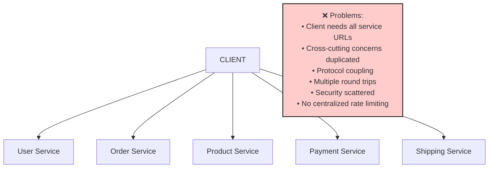
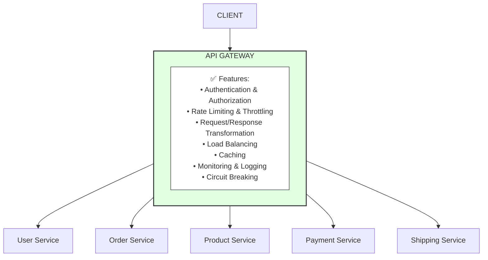
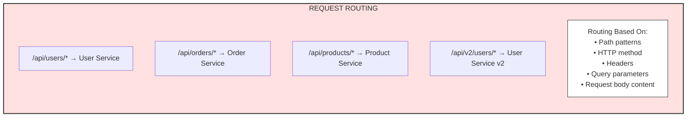

# API Gateway

## Overview
An API Gateway is a server that acts as a single entry point for all client requests in a microservices architecture. It handles request routing, composition, authentication, rate limiting, and other cross-cutting concerns.

---

## Why API Gateway?

### The Problem Without Gateway



### The Solution With Gateway



---

## Core Functions

### 1. Request Routing



```java
// Spring Cloud Gateway - Route Configuration
@Configuration
public class GatewayConfig {
    
    @Bean
    public RouteLocator customRouteLocator(RouteLocatorBuilder builder) {
        return builder.routes()
            // Simple path-based routing
            .route("user-service", r -> r
                .path("/api/users/**")
                .uri("lb://user-service"))
            
            // Path rewriting
            .route("order-service", r -> r
                .path("/api/orders/**")
                .filters(f -> f.rewritePath("/api/orders/(?<segment>.*)", 
                                           "/orders/${segment}"))
                .uri("lb://order-service"))
            
            // Header-based routing
            .route("product-service-v2", r -> r
                .path("/api/products/**")
                .and()
                .header("X-API-Version", "v2")
                .uri("lb://product-service-v2"))
            
            // Method-based routing
            .route("analytics-service", r -> r
                .path("/api/events/**")
                .and()
                .method(HttpMethod.POST)
                .uri("lb://analytics-service"))
            
            .build();
    }
}
```

```yaml
# YAML Configuration for Spring Cloud Gateway
spring:
  cloud:
    gateway:
      routes:
        - id: user-service
          uri: lb://user-service
          predicates:
            - Path=/api/users/**
          filters:
            - StripPrefix=1
            
        - id: order-service
          uri: lb://order-service
          predicates:
            - Path=/api/orders/**
            - Method=GET,POST,PUT,DELETE
          filters:
            - RewritePath=/api/orders/(?<segment>.*), /orders/${segment}
            - AddRequestHeader=X-Request-Source, api-gateway
            
        - id: product-service
          uri: lb://product-service
          predicates:
            - Path=/api/products/**
            - Header=X-Tenant-Id, .+
          filters:
            - name: CircuitBreaker
              args:
                name: productCircuitBreaker
                fallbackUri: forward:/fallback/products
```

### 2. Authentication & Authorization

```
┌─────────────────────────────────────────────────────────────────────┐
│                  AUTHENTICATION FLOW                                 │
│                                                                      │
│  Client                API Gateway              Auth Service         │
│    │                       │                         │               │
│    │  1. Request + JWT     │                         │               │
│    │──────────────────────►│                         │               │
│    │                       │  2. Validate Token      │               │
│    │                       │────────────────────────►│               │
│    │                       │  3. Token Valid + User  │               │
│    │                       │◄────────────────────────│               │
│    │                       │                         │               │
│    │                       │  4. Add User Context    │               │
│    │                       │  to Request Headers     │               │
│    │                       │                         │               │
│    │                       │  5. Forward to Service  │               │
│    │                       │──────────────────────►  │               │
│    │                       │                         │               │
│    │  6. Response          │                         │               │
│    │◄──────────────────────│                         │               │
│                                                                      │
└─────────────────────────────────────────────────────────────────────┘
```

```java
// Spring Cloud Gateway - JWT Authentication Filter
@Component
public class JwtAuthenticationFilter implements GatewayFilter {
    
    private final JwtTokenProvider jwtTokenProvider;
    
    @Override
    public Mono<Void> filter(ServerWebExchange exchange, GatewayFilterChain chain) {
        String token = extractToken(exchange.getRequest());
        
        if (token == null) {
            return onError(exchange, "No authorization token", HttpStatus.UNAUTHORIZED);
        }
        
        try {
            if (!jwtTokenProvider.validateToken(token)) {
                return onError(exchange, "Invalid token", HttpStatus.UNAUTHORIZED);
            }
            
            Claims claims = jwtTokenProvider.getClaims(token);
            
            // Add user info to request headers
            ServerHttpRequest modifiedRequest = exchange.getRequest().mutate()
                .header("X-User-Id", claims.getSubject())
                .header("X-User-Roles", claims.get("roles", String.class))
                .header("X-User-Email", claims.get("email", String.class))
                .build();
            
            return chain.filter(exchange.mutate().request(modifiedRequest).build());
            
        } catch (ExpiredJwtException e) {
            return onError(exchange, "Token expired", HttpStatus.UNAUTHORIZED);
        } catch (JwtException e) {
            return onError(exchange, "Invalid token", HttpStatus.UNAUTHORIZED);
        }
    }
    
    private String extractToken(ServerHttpRequest request) {
        String bearerToken = request.getHeaders().getFirst(HttpHeaders.AUTHORIZATION);
        if (StringUtils.hasText(bearerToken) && bearerToken.startsWith("Bearer ")) {
            return bearerToken.substring(7);
        }
        return null;
    }
    
    private Mono<Void> onError(ServerWebExchange exchange, String message, HttpStatus status) {
        exchange.getResponse().setStatusCode(status);
        exchange.getResponse().getHeaders().setContentType(MediaType.APPLICATION_JSON);
        
        ErrorResponse error = new ErrorResponse(status.value(), message);
        byte[] bytes = objectMapper.writeValueAsBytes(error);
        
        DataBuffer buffer = exchange.getResponse().bufferFactory().wrap(bytes);
        return exchange.getResponse().writeWith(Mono.just(buffer));
    }
}

// Global Filter for Authentication
@Component
public class GlobalAuthenticationFilter implements GlobalFilter, Ordered {
    
    private final List<String> openEndpoints = Arrays.asList(
        "/api/auth/login",
        "/api/auth/register",
        "/api/public/**",
        "/actuator/health"
    );
    
    @Override
    public Mono<Void> filter(ServerWebExchange exchange, GatewayFilterChain chain) {
        String path = exchange.getRequest().getPath().value();
        
        // Skip authentication for open endpoints
        if (isOpenEndpoint(path)) {
            return chain.filter(exchange);
        }
        
        // Apply authentication
        return jwtAuthenticationFilter.filter(exchange, chain);
    }
    
    @Override
    public int getOrder() {
        return -100;  // Execute early in filter chain
    }
}
```

### 3. Rate Limiting

```
┌─────────────────────────────────────────────────────────────────────┐
│                       RATE LIMITING                                  │
│                                                                      │
│   Token Bucket Algorithm                                             │
│   ┌─────────────────────────────────────────────────────────────┐   │
│   │  Bucket Capacity: 100 tokens                                │   │
│   │  Refill Rate: 10 tokens/second                              │   │
│   │                                                              │   │
│   │  ┌─────────────────────────────────────────────┐            │   │
│   │  │ ████████████████████████░░░░░░░░░░░░░░░░░░░│ 60 tokens  │   │
│   │  └─────────────────────────────────────────────┘            │   │
│   │                                                              │   │
│   │  Request 1: -1 token → Allowed                              │   │
│   │  Request 2: -1 token → Allowed                              │   │
│   │  ...                                                         │   │
│   │  Request 61: No tokens → 429 Too Many Requests              │   │
│   └─────────────────────────────────────────────────────────────┘   │
│                                                                      │
│   Rate Limit Types:                                                  │
│   • Per User (user-id based)                                        │
│   • Per IP Address                                                   │
│   • Per API Key                                                      │
│   • Per Endpoint                                                     │
│   • Global                                                           │
└─────────────────────────────────────────────────────────────────────┘
```

```java
// Spring Cloud Gateway - Rate Limiter Configuration
@Configuration
public class RateLimiterConfig {
    
    @Bean
    public RedisRateLimiter redisRateLimiter() {
        return new RedisRateLimiter(10, 20, 1);  // replenishRate, burstCapacity, requestedTokens
    }
    
    @Bean
    public KeyResolver userKeyResolver() {
        return exchange -> Mono.just(
            exchange.getRequest().getHeaders().getFirst("X-User-Id")
        );
    }
    
    @Bean
    public KeyResolver ipKeyResolver() {
        return exchange -> Mono.just(
            exchange.getRequest().getRemoteAddress().getAddress().getHostAddress()
        );
    }
    
    @Bean
    public KeyResolver apiKeyResolver() {
        return exchange -> Mono.just(
            exchange.getRequest().getHeaders().getFirst("X-API-Key")
        );
    }
}
```

```yaml
# Rate Limiter Configuration
spring:
  cloud:
    gateway:
      routes:
        - id: user-service
          uri: lb://user-service
          predicates:
            - Path=/api/users/**
          filters:
            - name: RequestRateLimiter
              args:
                redis-rate-limiter.replenishRate: 10      # Requests per second
                redis-rate-limiter.burstCapacity: 20      # Max burst
                redis-rate-limiter.requestedTokens: 1     # Tokens per request
                key-resolver: "#{@userKeyResolver}"
            - name: RequestRateLimiter
              args:
                redis-rate-limiter.replenishRate: 100
                redis-rate-limiter.burstCapacity: 200
                key-resolver: "#{@ipKeyResolver}"
                
  redis:
    host: localhost
    port: 6379
```

```java
// Custom Rate Limiter with Different Limits per Tier
@Component
public class TieredRateLimiter implements GatewayFilter {
    
    private final RedisTemplate<String, String> redisTemplate;
    
    private static final Map<String, RateLimit> TIER_LIMITS = Map.of(
        "FREE", new RateLimit(100, Duration.ofHours(1)),
        "BASIC", new RateLimit(1000, Duration.ofHours(1)),
        "PREMIUM", new RateLimit(10000, Duration.ofHours(1)),
        "ENTERPRISE", new RateLimit(100000, Duration.ofHours(1))
    );
    
    @Override
    public Mono<Void> filter(ServerWebExchange exchange, GatewayFilterChain chain) {
        String userId = exchange.getRequest().getHeaders().getFirst("X-User-Id");
        String tier = exchange.getRequest().getHeaders().getFirst("X-User-Tier");
        
        RateLimit limit = TIER_LIMITS.getOrDefault(tier, TIER_LIMITS.get("FREE"));
        String key = "rate_limit:" + userId;
        
        return checkRateLimit(key, limit)
            .flatMap(allowed -> {
                if (allowed) {
                    return chain.filter(exchange);
                } else {
                    return rateLimitExceeded(exchange, limit);
                }
            });
    }
    
    private Mono<Boolean> checkRateLimit(String key, RateLimit limit) {
        return Mono.fromCallable(() -> {
            Long count = redisTemplate.opsForValue().increment(key);
            if (count == 1) {
                redisTemplate.expire(key, limit.window());
            }
            return count <= limit.maxRequests();
        });
    }
    
    private Mono<Void> rateLimitExceeded(ServerWebExchange exchange, RateLimit limit) {
        exchange.getResponse().setStatusCode(HttpStatus.TOO_MANY_REQUESTS);
        exchange.getResponse().getHeaders().add("X-RateLimit-Limit", 
            String.valueOf(limit.maxRequests()));
        exchange.getResponse().getHeaders().add("Retry-After", "3600");
        return exchange.getResponse().setComplete();
    }
}
```

### 4. Request/Response Transformation

```java
// Request Transformation Filter
@Component
public class RequestTransformationFilter implements GatewayFilter {
    
    @Override
    public Mono<Void> filter(ServerWebExchange exchange, GatewayFilterChain chain) {
        // Add correlation ID
        String correlationId = exchange.getRequest().getHeaders()
            .getFirst("X-Correlation-Id");
        if (correlationId == null) {
            correlationId = UUID.randomUUID().toString();
        }
        
        ServerHttpRequest modifiedRequest = exchange.getRequest().mutate()
            .header("X-Correlation-Id", correlationId)
            .header("X-Request-Time", Instant.now().toString())
            .header("X-Gateway-Version", "1.0.0")
            .build();
        
        return chain.filter(exchange.mutate().request(modifiedRequest).build());
    }
}

// Response Transformation Filter
@Component
public class ResponseTransformationFilter implements GatewayFilter {
    
    @Override
    public Mono<Void> filter(ServerWebExchange exchange, GatewayFilterChain chain) {
        return chain.filter(exchange).then(Mono.fromRunnable(() -> {
            ServerHttpResponse response = exchange.getResponse();
            
            // Add response headers
            response.getHeaders().add("X-Response-Time", Instant.now().toString());
            response.getHeaders().add("X-Served-By", "api-gateway-1");
            
            // Remove internal headers
            response.getHeaders().remove("X-Internal-Service-Id");
        }));
    }
}

// Body Transformation (Modify JSON response)
@Component
public class ResponseBodyTransformationFilter implements GlobalFilter {
    
    @Override
    public Mono<Void> filter(ServerWebExchange exchange, GatewayFilterChain chain) {
        ServerHttpResponseDecorator decoratedResponse = new ServerHttpResponseDecorator(
            exchange.getResponse()) {
            
            @Override
            public Mono<Void> writeWith(Publisher<? extends DataBuffer> body) {
                if (body instanceof Flux) {
                    Flux<? extends DataBuffer> fluxBody = (Flux<? extends DataBuffer>) body;
                    return super.writeWith(fluxBody.buffer().map(dataBuffers -> {
                        // Combine all buffers
                        DataBuffer joinedBuffer = new DefaultDataBufferFactory()
                            .join(dataBuffers);
                        byte[] content = new byte[joinedBuffer.readableByteCount()];
                        joinedBuffer.read(content);
                        
                        // Transform response
                        String responseBody = new String(content, StandardCharsets.UTF_8);
                        String transformedBody = transformResponse(responseBody);
                        
                        return exchange.getResponse().bufferFactory()
                            .wrap(transformedBody.getBytes());
                    }));
                }
                return super.writeWith(body);
            }
        };
        
        return chain.filter(exchange.mutate().response(decoratedResponse).build());
    }
    
    private String transformResponse(String body) {
        // Add wrapper, transform fields, etc.
        JsonNode node = objectMapper.readTree(body);
        ObjectNode wrapper = objectMapper.createObjectNode();
        wrapper.put("status", "success");
        wrapper.put("timestamp", Instant.now().toString());
        wrapper.set("data", node);
        return objectMapper.writeValueAsString(wrapper);
    }
}
```

### 5. Load Balancing

```yaml
# Spring Cloud Gateway with Load Balancing
spring:
  cloud:
    gateway:
      routes:
        - id: user-service
          uri: lb://user-service  # lb:// prefix enables load balancing
          predicates:
            - Path=/api/users/**
            
    loadbalancer:
      ribbon:
        enabled: false  # Use Spring Cloud LoadBalancer
      configurations: default
      
# Custom Load Balancer Configuration
eureka:
  instance:
    metadata-map:
      zone: us-east-1a
      weight: 100

# Zone-aware load balancing
spring:
  cloud:
    loadbalancer:
      zone: us-east-1a
```

### 6. Caching

```java
// Response Caching Configuration
@Configuration
public class CachingConfig {
    
    @Bean
    public CacheManager cacheManager(RedisConnectionFactory connectionFactory) {
        RedisCacheConfiguration config = RedisCacheConfiguration.defaultCacheConfig()
            .entryTtl(Duration.ofMinutes(10))
            .serializeKeysWith(RedisSerializationContext.SerializationPair
                .fromSerializer(new StringRedisSerializer()))
            .serializeValuesWith(RedisSerializationContext.SerializationPair
                .fromSerializer(new GenericJackson2JsonRedisSerializer()));
        
        return RedisCacheManager.builder(connectionFactory)
            .cacheDefaults(config)
            .withCacheConfiguration("products", 
                config.entryTtl(Duration.ofHours(1)))
            .withCacheConfiguration("users", 
                config.entryTtl(Duration.ofMinutes(5)))
            .build();
    }
}

// Caching Filter
@Component
public class ResponseCachingFilter implements GatewayFilter {
    
    private final ReactiveRedisTemplate<String, String> redisTemplate;
    
    @Override
    public Mono<Void> filter(ServerWebExchange exchange, GatewayFilterChain chain) {
        // Only cache GET requests
        if (!HttpMethod.GET.equals(exchange.getRequest().getMethod())) {
            return chain.filter(exchange);
        }
        
        String cacheKey = generateCacheKey(exchange.getRequest());
        
        // Check cache first
        return redisTemplate.opsForValue().get(cacheKey)
            .flatMap(cachedResponse -> {
                // Return cached response
                exchange.getResponse().getHeaders()
                    .add("X-Cache-Status", "HIT");
                return writeResponse(exchange, cachedResponse);
            })
            .switchIfEmpty(Mono.defer(() -> {
                // Cache miss - proceed with request
                exchange.getResponse().getHeaders()
                    .add("X-Cache-Status", "MISS");
                return cacheAndReturn(exchange, chain, cacheKey);
            }));
    }
    
    private String generateCacheKey(ServerHttpRequest request) {
        return "cache:" + request.getPath().value() + ":" + 
               request.getQueryParams().toString();
    }
}
```

---

## Gateway Patterns

### 1. Backend for Frontend (BFF)

```
┌─────────────────────────────────────────────────────────────────────┐
│                    BACKEND FOR FRONTEND (BFF)                        │
│                                                                      │
│   ┌──────────┐    ┌──────────┐    ┌──────────┐                      │
│   │  Mobile  │    │   Web    │    │  Smart   │                      │
│   │   App    │    │   App    │    │    TV    │                      │
│   └────┬─────┘    └────┬─────┘    └────┬─────┘                      │
│        │               │               │                             │
│        ▼               ▼               ▼                             │
│   ┌──────────┐    ┌──────────┐    ┌──────────┐                      │
│   │ Mobile   │    │  Web     │    │   TV     │                      │
│   │   BFF    │    │   BFF    │    │   BFF    │                      │
│   └────┬─────┘    └────┬─────┘    └────┬─────┘                      │
│        │               │               │                             │
│        └───────────────┼───────────────┘                            │
│                        │                                             │
│        ┌───────────────┼───────────────┐                            │
│        ▼               ▼               ▼                             │
│   ┌──────────┐    ┌──────────┐    ┌──────────┐                      │
│   │  User    │    │  Order   │    │ Product  │                      │
│   │ Service  │    │ Service  │    │ Service  │                      │
│   └──────────┘    └──────────┘    └──────────┘                      │
│                                                                      │
│   Each BFF:                                                          │
│   • Optimized for specific client needs                             │
│   • Handles client-specific data transformation                     │
│   • Aggregates data from multiple services                          │
│   • Manages client-specific authentication                          │
└─────────────────────────────────────────────────────────────────────┘
```

```java
// Mobile BFF - Optimized for mobile clients
@RestController
@RequestMapping("/mobile/api")
public class MobileBffController {
    
    private final UserServiceClient userService;
    private final OrderServiceClient orderService;
    private final ProductServiceClient productService;
    
    @GetMapping("/home")
    public Mono<MobileHomeResponse> getHomeScreen(@RequestHeader("X-User-Id") String userId) {
        // Aggregate data optimized for mobile
        return Mono.zip(
            userService.getUser(userId),
            orderService.getRecentOrders(userId, 3),  // Only 3 for mobile
            productService.getRecommendations(userId, 5)  // Only 5 for mobile
        ).map(tuple -> MobileHomeResponse.builder()
            .user(toMobileUserDto(tuple.getT1()))
            .recentOrders(tuple.getT2().stream()
                .map(this::toMobileOrderDto)
                .collect(Collectors.toList()))
            .recommendations(tuple.getT3().stream()
                .map(this::toMobileProductDto)  // Smaller images, less data
                .collect(Collectors.toList()))
            .build());
    }
    
    private MobileUserDto toMobileUserDto(User user) {
        // Return minimal user data for mobile
        return MobileUserDto.builder()
            .id(user.getId())
            .name(user.getFirstName())
            .avatarUrl(user.getAvatarUrlSmall())  // Small avatar for mobile
            .build();
    }
}

// Web BFF - Richer data for web clients
@RestController
@RequestMapping("/web/api")
public class WebBffController {
    
    @GetMapping("/home")
    public Mono<WebHomeResponse> getHomeScreen(@RequestHeader("X-User-Id") String userId) {
        return Mono.zip(
            userService.getUser(userId),
            orderService.getRecentOrders(userId, 10),  // More orders for web
            productService.getRecommendations(userId, 20),  // More recommendations
            productService.getFeaturedProducts(10),
            notificationService.getUnreadNotifications(userId)
        ).map(tuple -> WebHomeResponse.builder()
            .user(toWebUserDto(tuple.getT1()))  // Full user data
            .recentOrders(tuple.getT2())
            .recommendations(tuple.getT3())
            .featuredProducts(tuple.getT4())
            .notifications(tuple.getT5())
            .build());
    }
}
```

### 2. API Composition (Aggregator)

```
┌─────────────────────────────────────────────────────────────────────┐
│                     API COMPOSITION                                  │
│                                                                      │
│   Single Request                                                     │
│   GET /api/order-details/{orderId}                                  │
│                                                                      │
│              ┌─────────────────────────────────────┐                │
│              │          API GATEWAY                 │                │
│              │      (API Composer)                  │                │
│              └─────────────────┬───────────────────┘                │
│                                │                                     │
│         ┌──────────────────────┼──────────────────────┐             │
│         │                      │                      │             │
│         ▼                      ▼                      ▼             │
│   ┌───────────┐          ┌───────────┐          ┌───────────┐      │
│   │  Order    │          │  User     │          │  Product  │      │
│   │  Service  │          │  Service  │          │  Service  │      │
│   └───────────┘          └───────────┘          └───────────┘      │
│         │                      │                      │             │
│         │   Order              │   User               │ Products    │
│         │   Data               │   Data               │  Data       │
│         │                      │                      │             │
│         └──────────────────────┼──────────────────────┘             │
│                                │                                     │
│                                ▼                                     │
│                    ┌───────────────────────┐                        │
│                    │   Composed Response   │                        │
│                    │   {                   │                        │
│                    │     order: {...},     │                        │
│                    │     user: {...},      │                        │
│                    │     products: [...]   │                        │
│                    │   }                   │                        │
│                    └───────────────────────┘                        │
│                                                                      │
└─────────────────────────────────────────────────────────────────────┘
```

```java
// API Composition Service
@Service
public class OrderCompositionService {
    
    private final OrderServiceClient orderService;
    private final UserServiceClient userService;
    private final ProductServiceClient productService;
    private final ShippingServiceClient shippingService;
    
    public Mono<OrderDetailsResponse> getOrderDetails(String orderId) {
        return orderService.getOrder(orderId)
            .flatMap(order -> {
                // Fetch related data in parallel
                Mono<User> userMono = userService.getUser(order.getUserId());
                Mono<List<Product>> productsMono = productService.getProducts(
                    order.getItems().stream()
                        .map(OrderItem::getProductId)
                        .collect(Collectors.toList())
                );
                Mono<ShippingInfo> shippingMono = shippingService
                    .getShippingInfo(order.getShippingId());
                
                return Mono.zip(userMono, productsMono, shippingMono)
                    .map(tuple -> OrderDetailsResponse.builder()
                        .order(order)
                        .user(tuple.getT1())
                        .products(tuple.getT2())
                        .shipping(tuple.getT3())
                        .build());
            });
    }
    
    // With error handling and fallbacks
    public Mono<OrderDetailsResponse> getOrderDetailsWithFallback(String orderId) {
        return orderService.getOrder(orderId)
            .flatMap(order -> {
                Mono<User> userMono = userService.getUser(order.getUserId())
                    .onErrorReturn(new User(order.getUserId(), "Unknown", null));
                
                Mono<List<Product>> productsMono = productService.getProducts(
                    order.getItems().stream()
                        .map(OrderItem::getProductId)
                        .collect(Collectors.toList()))
                    .onErrorReturn(Collections.emptyList());
                
                Mono<ShippingInfo> shippingMono = shippingService
                    .getShippingInfo(order.getShippingId())
                    .onErrorReturn(ShippingInfo.unknown());
                
                return Mono.zip(userMono, productsMono, shippingMono)
                    .map(tuple -> buildResponse(order, tuple));
            })
            .timeout(Duration.ofSeconds(5))
            .onErrorResume(e -> Mono.error(
                new ServiceUnavailableException("Unable to fetch order details")));
    }
}
```

### 3. Gateway Offloading

```
┌─────────────────────────────────────────────────────────────────────┐
│                      GATEWAY OFFLOADING                              │
│                                                                      │
│   Cross-Cutting Concerns handled at Gateway:                         │
│                                                                      │
│   ┌─────────────────────────────────────────────────────────────┐   │
│   │                      API GATEWAY                             │   │
│   │                                                              │   │
│   │  ┌──────────────┐  ┌──────────────┐  ┌──────────────┐       │   │
│   │  │ SSL/TLS      │  │ Compression  │  │ Caching      │       │   │
│   │  │ Termination  │  │ (gzip)       │  │              │       │   │
│   │  └──────────────┘  └──────────────┘  └──────────────┘       │   │
│   │                                                              │   │
│   │  ┌──────────────┐  ┌──────────────┐  ┌──────────────┐       │   │
│   │  │ Authentication│  │ Rate         │  │ Logging &    │       │   │
│   │  │              │  │ Limiting     │  │ Monitoring   │       │   │
│   │  └──────────────┘  └──────────────┘  └──────────────┘       │   │
│   │                                                              │   │
│   │  ┌──────────────┐  ┌──────────────┐  ┌──────────────┐       │   │
│   │  │ Request      │  │ IP           │  │ CORS         │       │   │
│   │  │ Validation   │  │ Whitelisting │  │              │       │   │
│   │  └──────────────┘  └──────────────┘  └──────────────┘       │   │
│   │                                                              │   │
│   └─────────────────────────────────────────────────────────────┘   │
│                                │                                     │
│                                │ Plain HTTP (internal)               │
│                                ▼                                     │
│   ┌─────────────────────────────────────────────────────────────┐   │
│   │                   BACKEND SERVICES                           │   │
│   │          (Focus on business logic only)                      │   │
│   └─────────────────────────────────────────────────────────────┘   │
│                                                                      │
└─────────────────────────────────────────────────────────────────────┘
```

---

## Popular API Gateway Solutions

### Spring Cloud Gateway

```java
@SpringBootApplication
@EnableDiscoveryClient
public class ApiGatewayApplication {
    public static void main(String[] args) {
        SpringApplication.run(ApiGatewayApplication.class, args);
    }
}
```

```yaml
# Complete Spring Cloud Gateway Configuration
server:
  port: 8080

spring:
  application:
    name: api-gateway
    
  cloud:
    gateway:
      default-filters:
        - DedupeResponseHeader=Access-Control-Allow-Credentials Access-Control-Allow-Origin
        - AddResponseHeader=X-Response-Time, %{T}
        
      globalcors:
        corsConfigurations:
          '[/**]':
            allowedOrigins: "*"
            allowedMethods:
              - GET
              - POST
              - PUT
              - DELETE
              - OPTIONS
            allowedHeaders: "*"
            
      routes:
        - id: user-service
          uri: lb://user-service
          predicates:
            - Path=/api/users/**
          filters:
            - name: CircuitBreaker
              args:
                name: userServiceCB
                fallbackUri: forward:/fallback/users
            - name: Retry
              args:
                retries: 3
                statuses: BAD_GATEWAY, SERVICE_UNAVAILABLE
                methods: GET
                backoff:
                  firstBackoff: 100ms
                  maxBackoff: 500ms
                  factor: 2
                  
        - id: order-service
          uri: lb://order-service
          predicates:
            - Path=/api/orders/**
          filters:
            - name: RequestRateLimiter
              args:
                redis-rate-limiter.replenishRate: 10
                redis-rate-limiter.burstCapacity: 20

management:
  endpoints:
    web:
      exposure:
        include: health, info, gateway
  endpoint:
    gateway:
      enabled: true
```

### Kong Gateway

```yaml
# Kong Configuration (declarative)
_format_version: "2.1"

services:
  - name: user-service
    url: http://user-service:8080
    routes:
      - name: user-route
        paths:
          - /api/users
        strip_path: false
    plugins:
      - name: rate-limiting
        config:
          minute: 100
          policy: local
          
      - name: jwt
        config:
          secret_is_base64: false
          
      - name: cors
        config:
          origins:
            - "*"
          methods:
            - GET
            - POST
            - PUT
            - DELETE
          headers:
            - Content-Type
            - Authorization
            
  - name: order-service
    url: http://order-service:8081
    routes:
      - name: order-route
        paths:
          - /api/orders
    plugins:
      - name: request-transformer
        config:
          add:
            headers:
              - X-Gateway: kong
              
      - name: response-transformer
        config:
          remove:
            headers:
              - X-Powered-By

consumers:
  - username: mobile-app
    plugins:
      - name: key-auth
        config:
          key_names:
            - X-API-Key
            
  - username: web-app
    plugins:
      - name: jwt
```

### NGINX as API Gateway

```nginx
# nginx.conf
upstream user_service {
    server user-service-1:8080 weight=3;
    server user-service-2:8080 weight=2;
    server user-service-3:8080 weight=1;
    keepalive 32;
}

upstream order_service {
    server order-service-1:8081;
    server order-service-2:8081;
    keepalive 32;
}

# Rate limiting
limit_req_zone $binary_remote_addr zone=api_limit:10m rate=10r/s;
limit_req_zone $http_x_api_key zone=key_limit:10m rate=100r/s;

server {
    listen 443 ssl http2;
    server_name api.example.com;
    
    ssl_certificate /etc/nginx/ssl/cert.pem;
    ssl_certificate_key /etc/nginx/ssl/key.pem;
    
    # CORS headers
    add_header 'Access-Control-Allow-Origin' '*' always;
    add_header 'Access-Control-Allow-Methods' 'GET, POST, PUT, DELETE, OPTIONS' always;
    
    # Security headers
    add_header X-Content-Type-Options nosniff;
    add_header X-Frame-Options DENY;
    add_header X-XSS-Protection "1; mode=block";
    
    # Gzip compression
    gzip on;
    gzip_types application/json application/javascript text/css;
    
    # User Service routes
    location /api/users {
        limit_req zone=api_limit burst=20 nodelay;
        
        proxy_pass http://user_service;
        proxy_http_version 1.1;
        proxy_set_header Connection "";
        proxy_set_header Host $host;
        proxy_set_header X-Real-IP $remote_addr;
        proxy_set_header X-Forwarded-For $proxy_add_x_forwarded_for;
        proxy_set_header X-Forwarded-Proto $scheme;
        
        # Timeout settings
        proxy_connect_timeout 5s;
        proxy_read_timeout 30s;
        proxy_send_timeout 30s;
        
        # Circuit breaker (passive health checks)
        proxy_next_upstream error timeout http_502 http_503 http_504;
        proxy_next_upstream_tries 3;
    }
    
    # Order Service routes
    location /api/orders {
        limit_req zone=key_limit burst=50 nodelay;
        
        # Authentication check
        auth_request /auth/validate;
        auth_request_set $user_id $upstream_http_x_user_id;
        proxy_set_header X-User-Id $user_id;
        
        proxy_pass http://order_service;
        proxy_http_version 1.1;
        proxy_set_header Connection "";
    }
    
    # Auth validation endpoint
    location = /auth/validate {
        internal;
        proxy_pass http://auth-service:8082/validate;
        proxy_pass_request_body off;
        proxy_set_header Content-Length "";
        proxy_set_header X-Original-URI $request_uri;
        proxy_set_header Authorization $http_authorization;
    }
    
    # Health check endpoint
    location /health {
        access_log off;
        return 200 '{"status":"healthy"}';
        add_header Content-Type application/json;
    }
}
```

### AWS API Gateway

```yaml
# AWS SAM template for API Gateway
AWSTemplateFormatVersion: '2010-09-09'
Transform: AWS::Serverless-2016-10-31

Resources:
  ApiGateway:
    Type: AWS::Serverless::Api
    Properties:
      StageName: prod
      Cors:
        AllowMethods: "'GET,POST,PUT,DELETE,OPTIONS'"
        AllowHeaders: "'Content-Type,Authorization'"
        AllowOrigin: "'*'"
      Auth:
        DefaultAuthorizer: JwtAuthorizer
        Authorizers:
          JwtAuthorizer:
            JwtConfiguration:
              issuer: "https://cognito-idp.us-east-1.amazonaws.com/us-east-1_xxxxx"
              audience:
                - "your-client-id"
                
  UserService:
    Type: AWS::Serverless::Function
    Properties:
      Handler: com.example.UserHandler::handleRequest
      Runtime: java11
      Events:
        GetUser:
          Type: Api
          Properties:
            RestApiId: !Ref ApiGateway
            Path: /users/{userId}
            Method: get
        CreateUser:
          Type: Api
          Properties:
            RestApiId: !Ref ApiGateway
            Path: /users
            Method: post
            
  # Usage Plan for Rate Limiting
  UsagePlan:
    Type: AWS::ApiGateway::UsagePlan
    Properties:
      UsagePlanName: BasicPlan
      Throttle:
        BurstLimit: 100
        RateLimit: 50
      Quota:
        Limit: 10000
        Period: MONTH
```

---

## Comparison Table

| Feature | Spring Cloud Gateway | Kong | NGINX | AWS API Gateway |
|---------|---------------------|------|-------|-----------------|
| **Type** | Library | Platform | Server | Managed Service |
| **Language** | Java | Lua/Go | C | N/A |
| **Configuration** | Java/YAML | YAML/DB | nginx.conf | Console/CloudFormation |
| **Service Discovery** | Native | Plugin | DNS/Consul | AWS native |
| **Rate Limiting** | Redis-based | Built-in | Built-in | Built-in |
| **Authentication** | Custom/OAuth | Plugins | Modules | Cognito/Lambda |
| **Monitoring** | Actuator | Kong Vitals | Logs | CloudWatch |
| **Cost** | Open Source | Open/Enterprise | Open Source | Pay per request |
| **Best For** | Spring ecosystem | Multi-language | High performance | AWS workloads |

---

## Best Practices

### 1. Security
```java
// Always validate and sanitize requests
@Component
public class RequestValidationFilter implements GatewayFilter {
    
    @Override
    public Mono<Void> filter(ServerWebExchange exchange, GatewayFilterChain chain) {
        ServerHttpRequest request = exchange.getRequest();
        
        // Validate content type
        MediaType contentType = request.getHeaders().getContentType();
        if (contentType != null && !isAllowedContentType(contentType)) {
            return onError(exchange, "Unsupported content type", HttpStatus.UNSUPPORTED_MEDIA_TYPE);
        }
        
        // Check request size
        if (request.getHeaders().getContentLength() > MAX_REQUEST_SIZE) {
            return onError(exchange, "Request too large", HttpStatus.PAYLOAD_TOO_LARGE);
        }
        
        // Validate required headers
        if (!hasRequiredHeaders(request)) {
            return onError(exchange, "Missing required headers", HttpStatus.BAD_REQUEST);
        }
        
        return chain.filter(exchange);
    }
}
```

### 2. Resilience
```yaml
# Configure circuit breakers and retries
spring:
  cloud:
    gateway:
      routes:
        - id: resilient-route
          uri: lb://service
          filters:
            - name: CircuitBreaker
              args:
                name: serviceCircuitBreaker
                fallbackUri: forward:/fallback
            - name: Retry
              args:
                retries: 3
                statuses: BAD_GATEWAY
                backoff:
                  firstBackoff: 100ms
                  maxBackoff: 1000ms
                  
resilience4j:
  circuitbreaker:
    instances:
      serviceCircuitBreaker:
        slidingWindowSize: 10
        failureRateThreshold: 50
        waitDurationInOpenState: 30000
```

### 3. Observability
```java
// Add tracing to all requests
@Component
public class TracingFilter implements GlobalFilter {
    
    private final Tracer tracer;
    
    @Override
    public Mono<Void> filter(ServerWebExchange exchange, GatewayFilterChain chain) {
        Span span = tracer.nextSpan().name("gateway-request").start();
        
        return chain.filter(exchange)
            .doFinally(signalType -> {
                span.tag("http.status", 
                    exchange.getResponse().getStatusCode().toString());
                span.end();
            });
    }
}
```

---

## Interview Questions

### Conceptual Questions
1. **What is an API Gateway and why is it needed?**
2. **Explain the difference between API Gateway and Load Balancer.**
3. **What is the BFF pattern and when would you use it?**
4. **How do you handle authentication at the gateway level?**
5. **What are the trade-offs of using an API Gateway?**

### Design Questions
1. **How would you design an API Gateway for high availability?**
2. **How do you prevent the gateway from becoming a single point of failure?**
3. **Design a rate limiting strategy for a multi-tenant system.**
4. **How would you implement API versioning at the gateway?**
5. **How do you handle service composition at the gateway?**

### Practical Questions
1. **How do you configure Spring Cloud Gateway for your use case?**
2. **What metrics would you monitor for an API Gateway?**
3. **How do you handle CORS at the gateway level?**
4. **How do you implement request/response transformation?**
5. **How do you test API Gateway configurations?**

---

## Key Takeaways

1. **API Gateway centralizes cross-cutting concerns** like auth, rate limiting, and logging
2. **Use BFF pattern** when different clients have different data needs
3. **Implement proper rate limiting** to protect backend services
4. **Add circuit breakers** to handle service failures gracefully
5. **Enable request tracing** for observability across services
6. **Cache responses** at the gateway when appropriate
7. **Validate and sanitize requests** before forwarding
8. **Plan for gateway high availability** - it's a critical component
9. **Don't put business logic in the gateway** - keep it focused on routing and cross-cutting concerns
10. **Monitor gateway performance** - it handles all traffic

---

*Previous: [Service Discovery](02-service-discovery.md) | Next: [Event-Driven Architecture](04-event-driven-architecture.md)*
