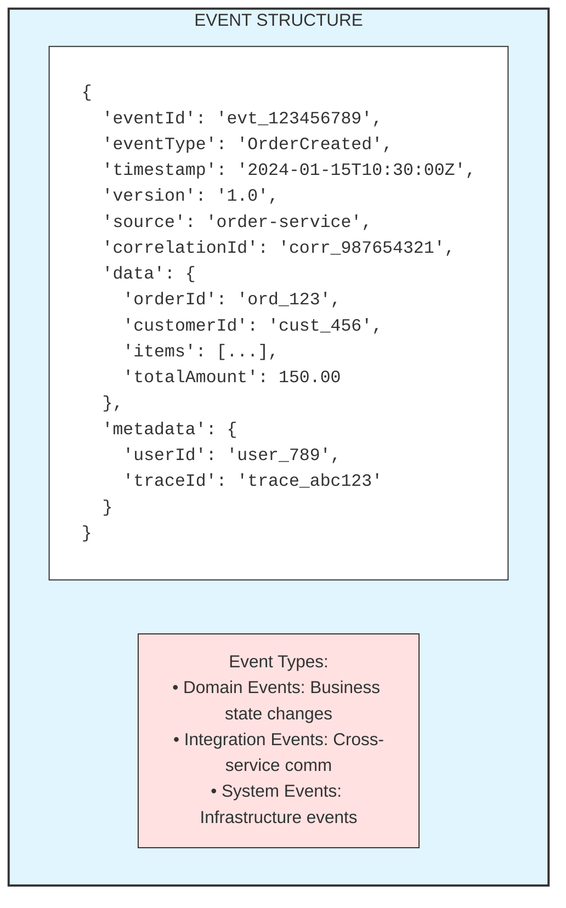
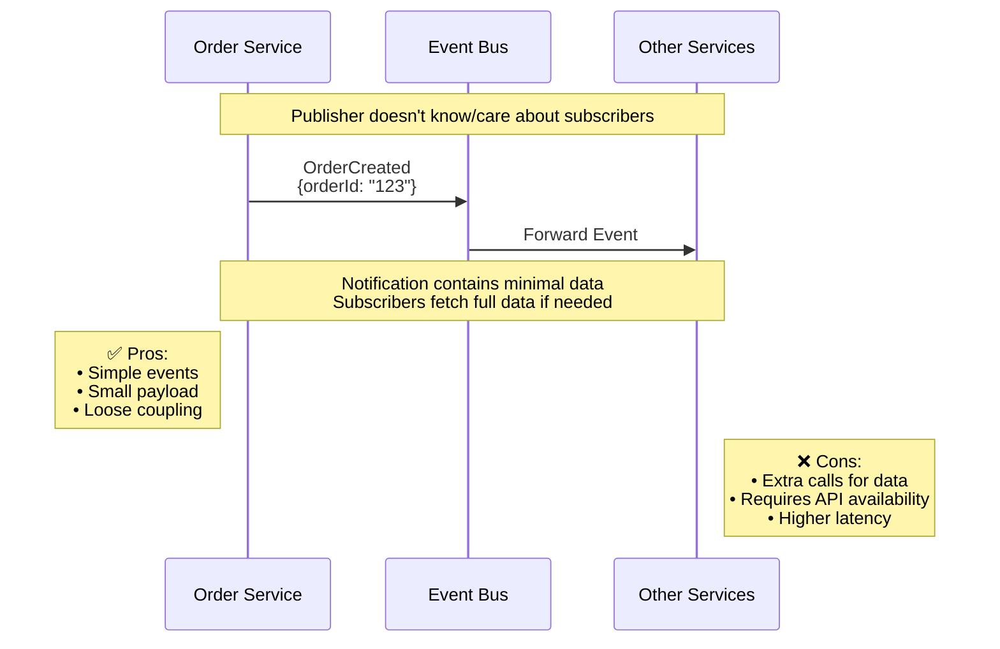
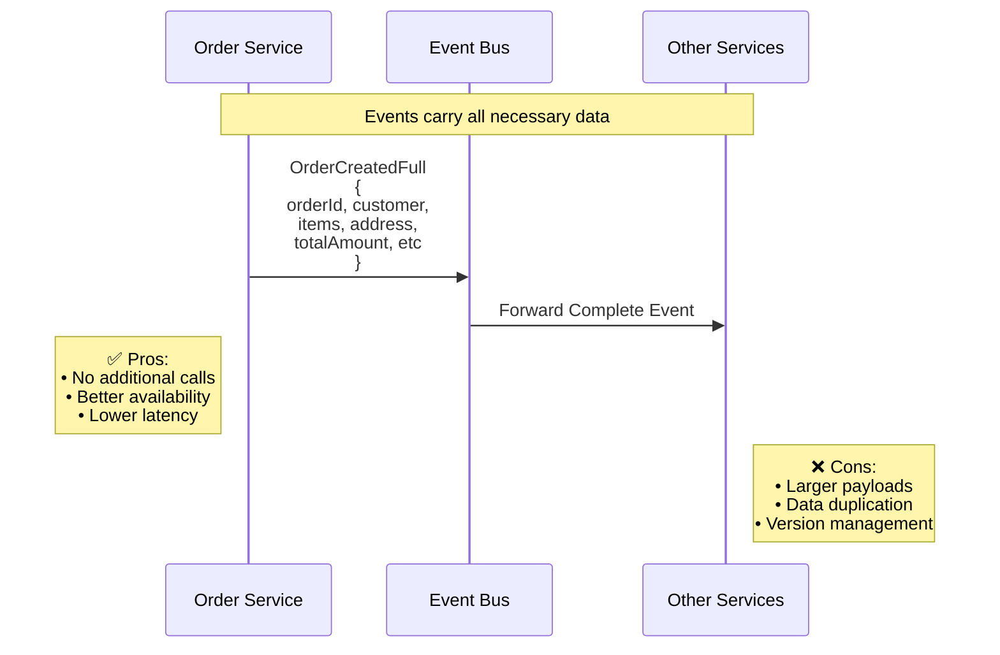
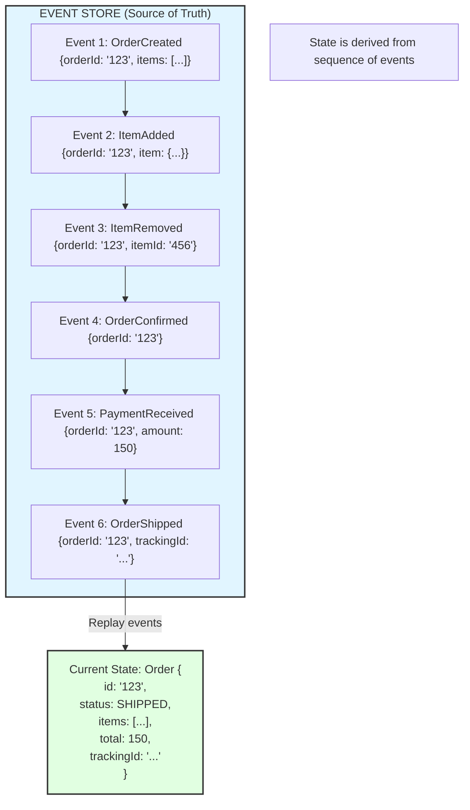

# Event-Driven Architecture

## Overview
Event-Driven Architecture (EDA) is a design paradigm where the flow of the program is determined by events—significant changes in state. In microservices, EDA enables loose coupling between services through asynchronous communication via events.

---

## Core Concepts

### What is an Event?



```java
// Event Base Class
public abstract class DomainEvent {
    private final String eventId;
    private final String eventType;
    private final Instant timestamp;
    private final String version;
    private final String source;
    private final String correlationId;
    private final Map<String, String> metadata;
    
    protected DomainEvent() {
        this.eventId = UUID.randomUUID().toString();
        this.eventType = this.getClass().getSimpleName();
        this.timestamp = Instant.now();
        this.version = "1.0";
        this.source = "unknown";
        this.correlationId = UUID.randomUUID().toString();
        this.metadata = new HashMap<>();
    }
}

// Concrete Event
@Value
public class OrderCreatedEvent extends DomainEvent {
    String orderId;
    String customerId;
    List<OrderItem> items;
    BigDecimal totalAmount;
    
    public static OrderCreatedEvent from(Order order) {
        return new OrderCreatedEvent(
            order.getId(),
            order.getCustomerId(),
            order.getItems(),
            order.getTotalAmount()
        );
    }
}

// Event with CloudEvents specification
@JsonPropertyOrder({"specversion", "type", "source", "id", "time", "data"})
public class CloudEvent<T> {
    private final String specversion = "1.0";
    private final String type;
    private final URI source;
    private final String id;
    private final Instant time;
    private final T data;
    private final String datacontenttype = "application/json";
    private final String subject;
    
    // Constructor, getters
}
```

### Event-Driven vs Request-Driven

```mermaid
sequenceDiagram
    participant SA as Service A
    participant SB as Service B
    
    Note over SA,SB: REQUEST-DRIVEN (Synchronous)
    SA->>+SB: Request (Blocked)
    SB-->>-SA: Response
    
    Note over SA,SB: • Tight coupling<br/>• Caller waits for response<br/>• Cascading failures<br/>• Simple to understand

---

sequenceDiagram
    participant SA as Service A
    participant EB as Event Bus
    participant SB as Service B
    
    Note over SA,SB: EVENT-DRIVEN (Asynchronous)
    SA->>EB: Event (Fire & Forget)
    EB->>SB: Event
    Note over SB: Process<br/>Asynchronously
    
    Note over SA,SB: • Loose coupling<br/>• Producer doesn't wait<br/>• Independent scaling<br/>• Eventual consistency
```

---

## Event-Driven Patterns

### 1. Event Notification



```java
// Event Notification - Minimal data
@Value
public class OrderCreatedNotification extends DomainEvent {
    String orderId;  // Just the ID, consumers fetch details
}

// Consumer fetches full data
@Service
public class ShippingEventHandler {
    
    private final OrderServiceClient orderService;
    
    @KafkaListener(topics = "order-events")
    public void handleOrderCreated(OrderCreatedNotification event) {
        // Fetch full order details
        Order order = orderService.getOrder(event.getOrderId());
        
        // Process with full data
        createShipment(order);
    }
}
```

### 2. Event-Carried State Transfer

```
┌─────────────────────────────────────────────────────────────────────┐
│                  EVENT-CARRIED STATE TRANSFER                        │
│                                                                      │
│   Events carry all necessary data                                    │
│                                                                      │
│   Order Service              Event Bus              Other Services   │
│        │                         │                        │          │
│        │  OrderCreatedFull       │                        │          │
│        │  {                      │                        │          │
│        │    orderId: "123",      │                        │          │
│        │    customer: {...},     │                        │          │
│        │    items: [...],        │                        │          │
│        │    total: 150.00        │                        │          │


```java
// Event with full state
@Value
public class OrderCreatedEvent extends DomainEvent {
    String orderId;
    CustomerInfo customer;
    List<OrderItem> items;
    ShippingAddress shippingAddress;
    BigDecimal totalAmount;
    String currency;
    Instant createdAt;
}

// Consumer processes without additional calls
@Service
public class ShippingEventHandler {
    
    @KafkaListener(topics = "order-events")
    public void handleOrderCreated(OrderCreatedEvent event) {
        // All data available in event
        Shipment shipment = Shipment.builder()
            .orderId(event.getOrderId())
            .address(event.getShippingAddress())
            .items(event.getItems())
            .build();
        
        shipmentRepository.save(shipment);
    }
}
```

### 3. Event Sourcing



```java
// Event-Sourced Aggregate
public class Order {
    private String id;
    private OrderStatus status;
    private List<OrderItem> items = new ArrayList<>();
    private BigDecimal totalAmount = BigDecimal.ZERO;
    private List<DomainEvent> uncommittedEvents = new ArrayList<>();
    
    // Create from events
    public static Order reconstitute(List<DomainEvent> events) {
        Order order = new Order();
        events.forEach(order::apply);
        return order;
    }
    
    // Command methods produce events
    public void create(String customerId, List<OrderItem> items) {
        if (status != null) {
            throw new IllegalStateException("Order already created");
        }
        apply(new OrderCreatedEvent(UUID.randomUUID().toString(), customerId, items));
    }
    
    public void addItem(OrderItem item) {
        if (status != OrderStatus.DRAFT) {
            throw new IllegalStateException("Cannot add items to confirmed order");
        }
        apply(new ItemAddedEvent(this.id, item));
    }
    
    public void confirm() {
        if (items.isEmpty()) {
            throw new IllegalStateException("Cannot confirm empty order");
        }
        apply(new OrderConfirmedEvent(this.id));
    }
    
    // Apply events to state
    private void apply(DomainEvent event) {
        when(event);  // Update state
        uncommittedEvents.add(event);  // Track for persistence
    }
    
    private void when(DomainEvent event) {
        if (event instanceof OrderCreatedEvent e) {
            this.id = e.getOrderId();
            this.status = OrderStatus.DRAFT;
            this.items.addAll(e.getItems());
            recalculateTotal();
        } else if (event instanceof ItemAddedEvent e) {
            this.items.add(e.getItem());
            recalculateTotal();
        } else if (event instanceof OrderConfirmedEvent e) {
            this.status = OrderStatus.CONFIRMED;
        }
    }
    
    public List<DomainEvent> getUncommittedEvents() {
        return Collections.unmodifiableList(uncommittedEvents);
    }
    
    public void markEventsAsCommitted() {
        uncommittedEvents.clear();
    }
}

// Event Store Repository
@Repository
public class EventStoreRepository {
    
    private final JdbcTemplate jdbcTemplate;
    private final ObjectMapper objectMapper;
    
    public void save(String aggregateId, List<DomainEvent> events, long expectedVersion) {
        long version = expectedVersion;
        
        for (DomainEvent event : events) {
            jdbcTemplate.update(
                "INSERT INTO event_store (aggregate_id, version, event_type, event_data, timestamp) " +
                "VALUES (?, ?, ?, ?::jsonb, ?)",
                aggregateId,
                ++version,
                event.getClass().getSimpleName(),
                objectMapper.writeValueAsString(event),
                event.getTimestamp()
            );
        }
    }
    
    public List<DomainEvent> getEvents(String aggregateId) {
        return jdbcTemplate.query(
            "SELECT event_type, event_data FROM event_store " +
            "WHERE aggregate_id = ? ORDER BY version ASC",
            (rs, rowNum) -> deserializeEvent(
                rs.getString("event_type"),
                rs.getString("event_data")
            ),
            aggregateId
        );
    }
    
    public List<DomainEvent> getEventsAfter(String aggregateId, long afterVersion) {
        return jdbcTemplate.query(
            "SELECT event_type, event_data FROM event_store " +
            "WHERE aggregate_id = ? AND version > ? ORDER BY version ASC",
            (rs, rowNum) -> deserializeEvent(
                rs.getString("event_type"),
                rs.getString("event_data")
            ),
            aggregateId,
            afterVersion
        );
    }
}
```

### 4. CQRS (Command Query Responsibility Segregation)

```
┌─────────────────────────────────────────────────────────────────────┐
│                            CQRS                                      │
│                                                                      │
│                        ┌───────────┐                                │
│                        │   Client  │                                │
│                        └─────┬─────┘                                │
│                   ┌──────────┴──────────┐                           │
│                   │                     │                           │
│            Commands                  Queries                        │
│                   │                     │                           │
│                   ▼                     ▼                           │
│         ┌─────────────────┐   ┌─────────────────┐                  │
│         │ Command Handler │   │  Query Handler  │                  │
│         └────────┬────────┘   └────────┬────────┘                  │
│                  │                     │                            │
│                  ▼                     ▼                            │
│         ┌─────────────────┐   ┌─────────────────┐                  │
│         │  Write Model    │   │   Read Model    │                  │
│         │  (Normalized)   │   │  (Denormalized) │                  │
│         └────────┬────────┘   └────────┬────────┘                  │
│                  │                     ▲                            │
│                  │      Events         │                            │
│                  └─────────────────────┘                            │
│                                                                      │
│   Write Model: Optimized for writes, business rules                 │
│   Read Model: Optimized for queries, denormalized views             │
│                                                                      │
└─────────────────────────────────────────────────────────────────────┘
```

```java
// Command Side
@Service
public class OrderCommandService {
    
    private final EventStoreRepository eventStore;
    private final EventPublisher eventPublisher;
    
    @Transactional
    public String createOrder(CreateOrderCommand command) {
        // Create aggregate
        Order order = new Order();
        order.create(command.getCustomerId(), command.getItems());
        
        // Save events
        List<DomainEvent> events = order.getUncommittedEvents();
        eventStore.save(order.getId(), events, 0);
        
        // Publish events
        events.forEach(eventPublisher::publish);
        
        order.markEventsAsCommitted();
        return order.getId();
    }
    
    @Transactional
    public void confirmOrder(ConfirmOrderCommand command) {
        // Load aggregate from events
        List<DomainEvent> events = eventStore.getEvents(command.getOrderId());
        Order order = Order.reconstitute(events);
        
        // Execute command
        order.confirm();
        
        // Save new events
        List<DomainEvent> newEvents = order.getUncommittedEvents();
        eventStore.save(order.getId(), newEvents, events.size());
        
        // Publish
        newEvents.forEach(eventPublisher::publish);
    }
}

// Query Side - Read Model
@Entity
@Table(name = "order_summary")
public class OrderSummaryView {
    @Id
    private String orderId;
    private String customerId;
    private String customerName;
    private int itemCount;
    private BigDecimal totalAmount;
    private String status;
    private Instant lastUpdated;
}

// Projection (Event Handler that builds read model)
@Service
public class OrderSummaryProjection {
    
    private final OrderSummaryViewRepository repository;
    private final CustomerServiceClient customerService;
    
    @KafkaListener(topics = "order-events", groupId = "order-summary-projection")
    public void handle(DomainEvent event) {
        if (event instanceof OrderCreatedEvent e) {
            handleOrderCreated(e);
        } else if (event instanceof ItemAddedEvent e) {
            handleItemAdded(e);
        } else if (event instanceof OrderConfirmedEvent e) {
            handleOrderConfirmed(e);
        }
    }
    
    private void handleOrderCreated(OrderCreatedEvent event) {
        Customer customer = customerService.getCustomer(event.getCustomerId());
        
        OrderSummaryView view = OrderSummaryView.builder()
            .orderId(event.getOrderId())
            .customerId(event.getCustomerId())
            .customerName(customer.getName())
            .itemCount(event.getItems().size())
            .totalAmount(calculateTotal(event.getItems()))
            .status("DRAFT")
            .lastUpdated(Instant.now())
            .build();
        
        repository.save(view);
    }
    
    private void handleOrderConfirmed(OrderConfirmedEvent event) {
        repository.findById(event.getOrderId())
            .ifPresent(view -> {
                view.setStatus("CONFIRMED");
                view.setLastUpdated(Instant.now());
                repository.save(view);
            });
    }
}

// Query Service
@Service
public class OrderQueryService {
    
    private final OrderSummaryViewRepository summaryRepository;
    private final OrderDetailsViewRepository detailsRepository;
    
    @Transactional(readOnly = true)
    public List<OrderSummaryView> getOrdersByCustomer(String customerId) {
        return summaryRepository.findByCustomerId(customerId);
    }
    
    @Transactional(readOnly = true)
    public OrderDetailsView getOrderDetails(String orderId) {
        return detailsRepository.findById(orderId)
            .orElseThrow(() -> new OrderNotFoundException(orderId));
    }
    
    @Transactional(readOnly = true)
    public Page<OrderSummaryView> searchOrders(OrderSearchCriteria criteria, Pageable pageable) {
        return summaryRepository.search(criteria, pageable);
    }
}
```

---

## Message Brokers

### Apache Kafka

```
┌─────────────────────────────────────────────────────────────────────┐
│                      KAFKA ARCHITECTURE                              │
│                                                                      │
│   ┌───────────────────────────────────────────────────────────────┐ │
│   │                     KAFKA CLUSTER                              │ │
│   │                                                                │ │
│   │  Topic: order-events                                          │ │
│   │  ┌───────────┐ ┌───────────┐ ┌───────────┐                   │ │
│   │  │Partition 0│ │Partition 1│ │Partition 2│                   │ │
│   │  │ [0][1][2] │ │ [0][1][2] │ │ [0][1][2] │                   │ │
│   │  │    ▲      │ │    ▲      │ │    ▲      │                   │ │
│   │  │    │      │ │    │      │ │    │      │                   │ │
│   │  │  Leader   │ │  Leader   │ │  Leader   │                   │ │
│   │  │(Broker 1) │ │(Broker 2) │ │(Broker 3) │                   │ │
│   │  └───────────┘ └───────────┘ └───────────┘                   │ │
│   │                                                                │ │
│   └───────────────────────────────────────────────────────────────┘ │
│                                                                      │
│   Producers ──────────────────────────────────► Consumer Groups     │
│                                                                      │
│   • Log-based messaging (append-only)                               │
│   • Partitions for parallelism                                      │
│   • Replication for fault tolerance                                 │
│   • Consumer groups for scaling                                     │
│                                                                      │
└─────────────────────────────────────────────────────────────────────┘
```

```java
// Kafka Producer Configuration
@Configuration
public class KafkaProducerConfig {
    
    @Bean
    public ProducerFactory<String, Object> producerFactory() {
        Map<String, Object> config = new HashMap<>();
        config.put(ProducerConfig.BOOTSTRAP_SERVERS_CONFIG, "localhost:9092");
        config.put(ProducerConfig.KEY_SERIALIZER_CLASS_CONFIG, StringSerializer.class);
        config.put(ProducerConfig.VALUE_SERIALIZER_CLASS_CONFIG, JsonSerializer.class);
        config.put(ProducerConfig.ACKS_CONFIG, "all");  // Wait for all replicas
        config.put(ProducerConfig.RETRIES_CONFIG, 3);
        config.put(ProducerConfig.ENABLE_IDEMPOTENCE_CONFIG, true);  // Exactly-once semantics
        return new DefaultKafkaProducerFactory<>(config);
    }
    
    @Bean
    public KafkaTemplate<String, Object> kafkaTemplate() {
        return new KafkaTemplate<>(producerFactory());
    }
}

// Event Publisher
@Service
@Slf4j
public class KafkaEventPublisher implements EventPublisher {
    
    private final KafkaTemplate<String, Object> kafkaTemplate;
    
    @Override
    public void publish(DomainEvent event) {
        String topic = determineTopicFor(event);
        String key = extractPartitionKey(event);  // For ordering
        
        kafkaTemplate.send(topic, key, event)
            .whenComplete((result, ex) -> {
                if (ex != null) {
                    log.error("Failed to publish event: {}", event.getEventId(), ex);
                } else {
                    log.info("Published event: {} to partition: {}", 
                        event.getEventId(),
                        result.getRecordMetadata().partition());
                }
            });
    }
    
    // Synchronous publish with guarantee
    public void publishSync(DomainEvent event) throws ExecutionException, InterruptedException {
        String topic = determineTopicFor(event);
        String key = extractPartitionKey(event);
        
        SendResult<String, Object> result = kafkaTemplate.send(topic, key, event).get();
        log.info("Event published to partition {} at offset {}", 
            result.getRecordMetadata().partition(),
            result.getRecordMetadata().offset());
    }
}

// Kafka Consumer
@Service
@Slf4j
public class OrderEventConsumer {
    
    private final OrderEventHandler orderEventHandler;
    
    @KafkaListener(
        topics = "order-events",
        groupId = "shipping-service",
        containerFactory = "kafkaListenerContainerFactory"
    )
    public void consume(
            @Payload DomainEvent event,
            @Header(KafkaHeaders.RECEIVED_PARTITION) int partition,
            @Header(KafkaHeaders.OFFSET) long offset) {
        
        log.info("Received event: {} from partition: {} at offset: {}", 
            event.getEventId(), partition, offset);
        
        try {
            orderEventHandler.handle(event);
        } catch (Exception e) {
            log.error("Error processing event: {}", event.getEventId(), e);
            throw e;  // Triggers retry or dead letter
        }
    }
}

// Consumer Configuration with Error Handling
@Configuration
@EnableKafka
public class KafkaConsumerConfig {
    
    @Bean
    public ConsumerFactory<String, Object> consumerFactory() {
        Map<String, Object> config = new HashMap<>();
        config.put(ConsumerConfig.BOOTSTRAP_SERVERS_CONFIG, "localhost:9092");
        config.put(ConsumerConfig.GROUP_ID_CONFIG, "shipping-service");
        config.put(ConsumerConfig.KEY_DESERIALIZER_CLASS_CONFIG, StringDeserializer.class);
        config.put(ConsumerConfig.VALUE_DESERIALIZER_CLASS_CONFIG, JsonDeserializer.class);
        config.put(ConsumerConfig.AUTO_OFFSET_RESET_CONFIG, "earliest");
        config.put(ConsumerConfig.ENABLE_AUTO_COMMIT_CONFIG, false);  // Manual commit
        config.put(JsonDeserializer.TRUSTED_PACKAGES, "com.example.events");
        return new DefaultKafkaConsumerFactory<>(config);
    }
    
    @Bean
    public ConcurrentKafkaListenerContainerFactory<String, Object> kafkaListenerContainerFactory() {
        ConcurrentKafkaListenerContainerFactory<String, Object> factory = 
            new ConcurrentKafkaListenerContainerFactory<>();
        factory.setConsumerFactory(consumerFactory());
        factory.setConcurrency(3);  // Number of consumer threads
        factory.setCommonErrorHandler(errorHandler());
        factory.getContainerProperties().setAckMode(ContainerProperties.AckMode.MANUAL);
        return factory;
    }
    
    @Bean
    public DefaultErrorHandler errorHandler() {
        // Retry 3 times, then send to dead letter topic
        DefaultErrorHandler handler = new DefaultErrorHandler(
            new DeadLetterPublishingRecoverer(kafkaTemplate),
            new FixedBackOff(1000L, 3L)  // 1 second, 3 retries
        );
        handler.addNotRetryableExceptions(ValidationException.class);
        return handler;
    }
}
```

### RabbitMQ

```
┌─────────────────────────────────────────────────────────────────────┐
│                    RABBITMQ ARCHITECTURE                             │
│                                                                      │
│   Producer         Exchange              Queues          Consumer    │
│      │                │                    │                │        │
│      │  ─── Message ──►│                    │                │        │
│      │                │                    │                │        │
│      │                │ ─── Routing ──────►│                │        │
│      │                │    (binding key)   │                │        │
│      │                │                    │ ─── Deliver ──►│        │
│                                                                      │
│   Exchange Types:                                                    │
│   • Direct: Exact routing key match                                 │
│   • Fanout: Broadcast to all bound queues                           │
│   • Topic: Pattern matching on routing key                          │
│   • Headers: Match on message headers                               │
│                                                                      │
└─────────────────────────────────────────────────────────────────────┘
```

```java
// RabbitMQ Configuration
@Configuration
public class RabbitMQConfig {
    
    // Topic Exchange for order events
    @Bean
    public TopicExchange orderExchange() {
        return new TopicExchange("order-exchange");
    }
    
    // Queue for shipping service
    @Bean
    public Queue shippingQueue() {
        return QueueBuilder.durable("shipping-queue")
            .withArgument("x-dead-letter-exchange", "dlx-exchange")
            .withArgument("x-dead-letter-routing-key", "shipping.dead")
            .build();
    }
    
    // Binding
    @Bean
    public Binding shippingBinding() {
        return BindingBuilder
            .bind(shippingQueue())
            .to(orderExchange())
            .with("order.created.#");  // Pattern matching
    }
    
    // Dead Letter Queue
    @Bean
    public Queue deadLetterQueue() {
        return QueueBuilder.durable("shipping-dead-letter-queue").build();
    }
    
    @Bean
    public DirectExchange deadLetterExchange() {
        return new DirectExchange("dlx-exchange");
    }
    
    @Bean
    public Binding deadLetterBinding() {
        return BindingBuilder
            .bind(deadLetterQueue())
            .to(deadLetterExchange())
            .with("shipping.dead");
    }
    
    // Message Converter
    @Bean
    public MessageConverter jsonMessageConverter() {
        return new Jackson2JsonMessageConverter();
    }
    
    @Bean
    public RabbitTemplate rabbitTemplate(ConnectionFactory connectionFactory) {
        RabbitTemplate template = new RabbitTemplate(connectionFactory);
        template.setMessageConverter(jsonMessageConverter());
        template.setConfirmCallback((correlationData, ack, cause) -> {
            if (!ack) {
                log.error("Message not confirmed: {}", cause);
            }
        });
        return template;
    }
}

// Publisher
@Service
public class RabbitMQEventPublisher {
    
    private final RabbitTemplate rabbitTemplate;
    
    public void publish(DomainEvent event) {
        String routingKey = "order." + event.getEventType().toLowerCase();
        
        rabbitTemplate.convertAndSend(
            "order-exchange",
            routingKey,
            event,
            message -> {
                message.getMessageProperties().setCorrelationId(event.getCorrelationId());
                message.getMessageProperties().setTimestamp(Date.from(event.getTimestamp()));
                return message;
            }
        );
    }
}

// Consumer
@Service
public class RabbitMQEventConsumer {
    
    @RabbitListener(queues = "shipping-queue")
    public void handleOrderEvent(DomainEvent event, Message message, Channel channel) 
            throws IOException {
        try {
            processEvent(event);
            // Manual acknowledgment
            channel.basicAck(message.getMessageProperties().getDeliveryTag(), false);
        } catch (Exception e) {
            // Reject and requeue (or send to DLQ)
            channel.basicNack(message.getMessageProperties().getDeliveryTag(), false, false);
        }
    }
}
```

---

## Saga Pattern

### What is a Saga?

```
┌─────────────────────────────────────────────────────────────────────┐
│                         SAGA PATTERN                                 │
│                                                                      │
│   A saga is a sequence of local transactions                        │
│   Each transaction publishes events that trigger the next            │
│   If a transaction fails, compensating transactions are executed     │
│                                                                      │
│   Order Saga Example:                                                │
│                                                                      │
│   T1: Create Order ────► T2: Reserve Stock ────► T3: Process Payment│
│          │                      │                      │            │
│          │                      │                      │            │
│          ▼                      ▼                      ▼            │
│   C1: Cancel Order ◄──── C2: Release Stock ◄──── C3: Refund Payment│
│   (Compensation)        (Compensation)          (Compensation)      │
│                                                                      │
│   If T3 fails:                                                       │
│   Execute C2 (Release Stock) → Execute C1 (Cancel Order)            │
│                                                                      │
└─────────────────────────────────────────────────────────────────────┘
```

### Choreography-Based Saga

```
┌─────────────────────────────────────────────────────────────────────┐
│                   CHOREOGRAPHY-BASED SAGA                            │
│                                                                      │
│   Services communicate through events, no central coordinator        │
│                                                                      │
│   Order         Inventory       Payment         Shipping             │
│   Service       Service         Service         Service              │
│      │              │               │               │                │
│      │ OrderCreated │               │               │                │
│      │─────────────►│               │               │                │
│      │              │ StockReserved │               │                │
│      │              │──────────────►│               │                │
│      │              │               │ PaymentDone   │                │
│      │              │               │──────────────►│                │
│      │              │               │               │ ShipmentCreated│
│      │◄─────────────────────────────────────────────│                │
│      │                                                               │
│                                                                      │
│   Failure Handling (if Payment fails):                               │
│      │              │               │               │                │
│      │              │ PaymentFailed │               │                │
│      │              │◄──────────────│               │                │
│      │ StockReleased│               │               │                │
│      │◄─────────────│               │               │                │
│      │ OrderCancelled                                                │
│                                                                      │
└─────────────────────────────────────────────────────────────────────┘
```

```java
// Order Service - Saga Participant
@Service
public class OrderSagaParticipant {
    
    private final OrderRepository orderRepository;
    private final EventPublisher eventPublisher;
    
    @Transactional
    public void createOrder(CreateOrderCommand command) {
        Order order = Order.create(command);
        order.setStatus(OrderStatus.PENDING);
        orderRepository.save(order);
        
        // Publish event to start saga
        eventPublisher.publish(new OrderCreatedEvent(order));
    }
    
    // Handle saga completion
    @KafkaListener(topics = "shipment-events")
    public void handleShipmentCreated(ShipmentCreatedEvent event) {
        orderRepository.findById(event.getOrderId())
            .ifPresent(order -> {
                order.setStatus(OrderStatus.COMPLETED);
                order.setShipmentId(event.getShipmentId());
                orderRepository.save(order);
            });
    }
    
    // Handle saga compensation
    @KafkaListener(topics = "payment-events")
    public void handlePaymentFailed(PaymentFailedEvent event) {
        orderRepository.findById(event.getOrderId())
            .ifPresent(order -> {
                order.setStatus(OrderStatus.CANCELLED);
                order.setCancellationReason(event.getReason());
                orderRepository.save(order);
                
                // Notify customer
                eventPublisher.publish(new OrderCancelledEvent(order));
            });
    }
}

// Inventory Service - Saga Participant
@Service
public class InventorySagaParticipant {
    
    @KafkaListener(topics = "order-events")
    public void handleOrderCreated(OrderCreatedEvent event) {
        try {
            reserveStock(event.getOrderId(), event.getItems());
            eventPublisher.publish(new StockReservedEvent(event.getOrderId()));
        } catch (InsufficientStockException e) {
            eventPublisher.publish(new StockReservationFailedEvent(
                event.getOrderId(), e.getMessage()));
        }
    }
    
    // Compensating transaction
    @KafkaListener(topics = "payment-events")
    public void handlePaymentFailed(PaymentFailedEvent event) {
        releaseStock(event.getOrderId());
        eventPublisher.publish(new StockReleasedEvent(event.getOrderId()));
    }
    
    private void reserveStock(String orderId, List<OrderItem> items) {
        // Reserve inventory
    }
    
    private void releaseStock(String orderId) {
        // Release reserved inventory
    }
}
```

### Orchestration-Based Saga

```
┌─────────────────────────────────────────────────────────────────────┐
│                   ORCHESTRATION-BASED SAGA                           │
│                                                                      │
│   Central Saga Orchestrator coordinates all steps                    │
│                                                                      │
│                    ┌───────────────────┐                            │
│                    │  Saga Orchestrator│                            │
│                    └─────────┬─────────┘                            │
│                              │                                       │
│       ┌──────────────────────┼──────────────────────┐               │
│       │                      │                      │               │
│       ▼                      ▼                      ▼               │
│   ┌────────┐            ┌────────┐            ┌────────┐           │
│   │ Order  │            │Inventory│            │Payment │           │
│   │Service │            │ Service │            │Service │           │
│   └────────┘            └────────┘            └────────┘           │
│                                                                      │
│   Step 1: Create Order                                               │
│   Step 2: Reserve Inventory                                          │
│   Step 3: Process Payment                                            │
│   Step 4: Create Shipment                                            │
│                                                                      │
│   If Step 3 fails:                                                   │
│   Compensate Step 2: Release Inventory                               │
│   Compensate Step 1: Cancel Order                                    │
│                                                                      │
└─────────────────────────────────────────────────────────────────────┘
```

```java
// Saga Definition
public class CreateOrderSaga {
    
    private final SagaDefinition<OrderSagaState> sagaDefinition;
    
    public CreateOrderSaga(
            OrderService orderService,
            InventoryService inventoryService,
            PaymentService paymentService,
            ShippingService shippingService) {
        
        this.sagaDefinition = SagaDefinition.<OrderSagaState>builder()
            .step()
                .invokeParticipant(orderService::createOrder)
                .withCompensation(orderService::cancelOrder)
            .step()
                .invokeParticipant(inventoryService::reserveStock)
                .withCompensation(inventoryService::releaseStock)
            .step()
                .invokeParticipant(paymentService::processPayment)
                .withCompensation(paymentService::refundPayment)
            .step()
                .invokeParticipant(shippingService::createShipment)
                // No compensation for final step
            .build();
    }
}

// Saga Orchestrator
@Service
public class SagaOrchestrator {
    
    private final SagaInstanceRepository sagaRepository;
    private final SagaDefinition<OrderSagaState> createOrderSaga;
    private final EventPublisher eventPublisher;
    
    @Transactional
    public void startSaga(CreateOrderCommand command) {
        // Create saga instance
        OrderSagaState state = new OrderSagaState(command);
        SagaInstance<OrderSagaState> saga = new SagaInstance<>(
            UUID.randomUUID().toString(),
            "CreateOrderSaga",
            state,
            0  // Current step
        );
        
        sagaRepository.save(saga);
        executeStep(saga);
    }
    
    private void executeStep(SagaInstance<OrderSagaState> saga) {
        SagaStep currentStep = createOrderSaga.getStep(saga.getCurrentStep());
        
        try {
            Object result = currentStep.invoke(saga.getState());
            saga.getState().updateWith(result);
            saga.setCurrentStep(saga.getCurrentStep() + 1);
            
            if (saga.getCurrentStep() < createOrderSaga.getStepCount()) {
                sagaRepository.save(saga);
                executeStep(saga);
            } else {
                saga.setStatus(SagaStatus.COMPLETED);
                sagaRepository.save(saga);
                eventPublisher.publish(new SagaCompletedEvent(saga.getId()));
            }
        } catch (Exception e) {
            saga.setStatus(SagaStatus.COMPENSATING);
            saga.setFailureReason(e.getMessage());
            sagaRepository.save(saga);
            compensate(saga);
        }
    }
    
    private void compensate(SagaInstance<OrderSagaState> saga) {
        for (int i = saga.getCurrentStep() - 1; i >= 0; i--) {
            SagaStep step = createOrderSaga.getStep(i);
            if (step.hasCompensation()) {
                try {
                    step.compensate(saga.getState());
                } catch (Exception e) {
                    // Log and continue with other compensations
                    log.error("Compensation failed for step {}", i, e);
                }
            }
        }
        saga.setStatus(SagaStatus.COMPENSATED);
        sagaRepository.save(saga);
        eventPublisher.publish(new SagaCompensatedEvent(saga.getId()));
    }
    
    // Handle async responses from participants
    @KafkaListener(topics = "saga-responses")
    public void handleSagaResponse(SagaResponse response) {
        SagaInstance<OrderSagaState> saga = sagaRepository.findById(response.getSagaId())
            .orElseThrow();
        
        if (response.isSuccess()) {
            saga.getState().updateWith(response.getData());
            saga.setCurrentStep(saga.getCurrentStep() + 1);
            sagaRepository.save(saga);
            
            if (saga.getCurrentStep() < createOrderSaga.getStepCount()) {
                executeStep(saga);
            } else {
                completeSaga(saga);
            }
        } else {
            saga.setFailureReason(response.getError());
            saga.setStatus(SagaStatus.COMPENSATING);
            sagaRepository.save(saga);
            compensate(saga);
        }
    }
}

// Saga State
@Data
public class OrderSagaState {
    private String orderId;
    private String customerId;
    private List<OrderItem> items;
    private String stockReservationId;
    private String paymentId;
    private String shipmentId;
    private BigDecimal totalAmount;
    
    public OrderSagaState(CreateOrderCommand command) {
        this.customerId = command.getCustomerId();
        this.items = command.getItems();
        this.totalAmount = command.getTotalAmount();
    }
}
```

### Choreography vs Orchestration

| Aspect | Choreography | Orchestration |
|--------|--------------|---------------|
| **Coupling** | Loose | Tighter (to orchestrator) |
| **Complexity** | Distributed | Centralized |
| **Single Point of Failure** | No | Yes (orchestrator) |
| **Visibility** | Hard to track | Easy to monitor |
| **Testing** | Complex | Easier |
| **Best For** | Simple sagas | Complex workflows |

---

## Event Processing Patterns

### Idempotency

```java
// Idempotent Event Handler
@Service
public class IdempotentEventHandler {
    
    private final ProcessedEventRepository processedEventRepo;
    private final OrderRepository orderRepository;
    
    @Transactional
    public void handle(OrderCreatedEvent event) {
        // Check if already processed
        if (processedEventRepo.existsByEventId(event.getEventId())) {
            log.info("Event {} already processed, skipping", event.getEventId());
            return;
        }
        
        // Process event
        processOrder(event);
        
        // Mark as processed
        processedEventRepo.save(new ProcessedEvent(
            event.getEventId(),
            event.getEventType(),
            Instant.now()
        ));
    }
    
    // Alternative: Using distributed lock
    @Transactional
    public void handleWithLock(OrderCreatedEvent event) {
        String lockKey = "event-lock:" + event.getEventId();
        
        boolean acquired = redisLock.tryLock(lockKey, 30, TimeUnit.SECONDS);
        if (!acquired) {
            throw new ConcurrentProcessingException("Event being processed by another instance");
        }
        
        try {
            if (!processedEventRepo.existsByEventId(event.getEventId())) {
                processOrder(event);
                processedEventRepo.save(new ProcessedEvent(event.getEventId()));
            }
        } finally {
            redisLock.unlock(lockKey);
        }
    }
}
```

### Event Ordering

```java
// Kafka partition key ensures ordering per entity
@Service
public class OrderedEventPublisher {
    
    public void publish(DomainEvent event) {
        // Use aggregate ID as partition key
        // All events for same order go to same partition
        String partitionKey = event.getAggregateId();
        
        kafkaTemplate.send("order-events", partitionKey, event);
    }
}

// Consumer processes in order per partition
@KafkaListener(
    topics = "order-events",
    concurrency = "3"  // 3 consumers for 3+ partitions
)
public void handleOrdered(DomainEvent event) {
    // Events for same order processed in order
    // (as long as they're in same partition)
}
```

### Dead Letter Queue

```java
// DLQ Configuration
@Configuration
public class DeadLetterQueueConfig {
    
    @Bean
    public NewTopic deadLetterTopic() {
        return TopicBuilder.name("order-events-dlq")
            .partitions(3)
            .replicas(3)
            .build();
    }
    
    @Bean
    public DefaultErrorHandler errorHandler(KafkaTemplate<String, Object> template) {
        DeadLetterPublishingRecoverer recoverer = new DeadLetterPublishingRecoverer(
            template,
            (record, ex) -> new TopicPartition(
                record.topic() + "-dlq",
                record.partition()
            )
        );
        
        return new DefaultErrorHandler(
            recoverer,
            new FixedBackOff(1000L, 3L)  // Retry 3 times before DLQ
        );
    }
}

// DLQ Processor
@Service
public class DeadLetterQueueProcessor {
    
    @KafkaListener(topics = "order-events-dlq", groupId = "dlq-processor")
    public void processDeadLetter(
            ConsumerRecord<String, DomainEvent> record,
            @Header(KafkaHeaders.EXCEPTION_FQCN) String exceptionClass,
            @Header(KafkaHeaders.EXCEPTION_MESSAGE) String exceptionMessage) {
        
        log.error("Processing dead letter: topic={}, key={}, exception={}: {}",
            record.topic(), record.key(), exceptionClass, exceptionMessage);
        
        // Store for manual review
        deadLetterRepository.save(new DeadLetter(
            record.key(),
            record.value(),
            exceptionClass,
            exceptionMessage,
            Instant.now()
        ));
        
        // Alert operations team
        alertService.sendAlert("Dead letter received", record);
    }
}
```

---

## Best Practices

### 1. Event Design
```java
// Good: Clear, versioned events
@Value
public class OrderCreatedEventV1 extends DomainEvent {
    String orderId;
    String customerId;
    List<OrderItem> items;
    BigDecimal totalAmount;
}

// Handle event evolution
public class OrderEventDeserializer {
    public DomainEvent deserialize(String json) {
        JsonNode node = objectMapper.readTree(json);
        String version = node.get("version").asText();
        
        return switch (version) {
            case "1.0" -> objectMapper.treeToValue(node, OrderCreatedEventV1.class);
            case "2.0" -> objectMapper.treeToValue(node, OrderCreatedEventV2.class);
            default -> throw new UnknownEventVersionException(version);
        };
    }
}
```

### 2. Guaranteed Delivery
```java
// Transactional Outbox Pattern
@Service
public class TransactionalOutboxPublisher {
    
    @Transactional
    public void createOrderWithEvent(CreateOrderCommand command) {
        // 1. Create order
        Order order = orderRepository.save(Order.create(command));
        
        // 2. Store event in outbox table (same transaction)
        OutboxEvent outboxEvent = new OutboxEvent(
            UUID.randomUUID().toString(),
            "OrderCreated",
            objectMapper.writeValueAsString(OrderCreatedEvent.from(order))
        );
        outboxRepository.save(outboxEvent);
    }
}

// Outbox Processor (separate process/thread)
@Scheduled(fixedDelay = 1000)
@Transactional
public void processOutbox() {
    List<OutboxEvent> events = outboxRepository.findUnpublished(100);
    
    for (OutboxEvent event : events) {
        try {
            kafkaTemplate.send("order-events", event.getPayload()).get();
            event.setPublished(true);
            outboxRepository.save(event);
        } catch (Exception e) {
            log.error("Failed to publish outbox event: {}", event.getId(), e);
        }
    }
}
```

### 3. Event Schema Registry
```java
// Using Confluent Schema Registry
@Configuration
public class SchemaRegistryConfig {
    
    @Bean
    public ProducerFactory<String, Object> producerFactory() {
        Map<String, Object> config = new HashMap<>();
        config.put(ProducerConfig.BOOTSTRAP_SERVERS_CONFIG, "localhost:9092");
        config.put(ProducerConfig.KEY_SERIALIZER_CLASS_CONFIG, StringSerializer.class);
        config.put(ProducerConfig.VALUE_SERIALIZER_CLASS_CONFIG, KafkaAvroSerializer.class);
        config.put("schema.registry.url", "http://localhost:8081");
        return new DefaultKafkaProducerFactory<>(config);
    }
}
```

---

## Interview Questions

### Conceptual Questions
1. **What is Event-Driven Architecture and when would you use it?**
2. **Explain the difference between Event Sourcing and traditional CRUD.**
3. **What is CQRS and why is it often used with Event Sourcing?**
4. **Compare choreography vs orchestration in Saga pattern.**
5. **How do you handle event versioning and schema evolution?**

### Design Questions
1. **Design an event-driven order processing system.**
2. **How would you implement exactly-once delivery in Kafka?**
3. **Design a saga for a travel booking system.**
4. **How do you handle event ordering in a distributed system?**
5. **Design an event store for an event-sourced system.**

### Practical Questions
1. **How do you ensure idempotency in event consumers?**
2. **What is the Transactional Outbox pattern and when do you use it?**
3. **How do you handle failed events (Dead Letter Queue)?**
4. **How do you test event-driven systems?**
5. **What monitoring do you set up for event-driven systems?**

---

## Key Takeaways

1. **Events represent facts that happened** - they are immutable
2. **Event-carried state transfer reduces coupling** but increases message size
3. **Event Sourcing provides complete audit trail** and enables temporal queries
4. **CQRS separates read and write models** for optimal performance
5. **Saga pattern manages distributed transactions** without 2PC
6. **Choreography is simpler but harder to track** - use for simple workflows
7. **Orchestration provides visibility** - use for complex workflows
8. **Idempotency is critical** for reliable event processing
9. **Use transactional outbox** for guaranteed event delivery
10. **Schema registry helps manage event evolution**

---

*Previous: [API Gateway](03-api-gateway.md) | Next: [Service Mesh](05-service-mesh.md)*
