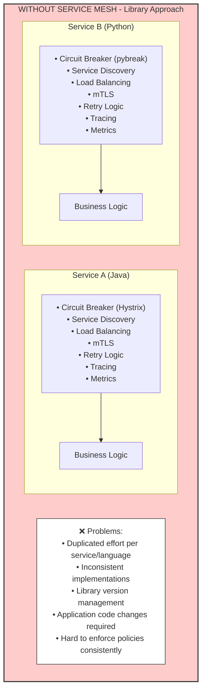
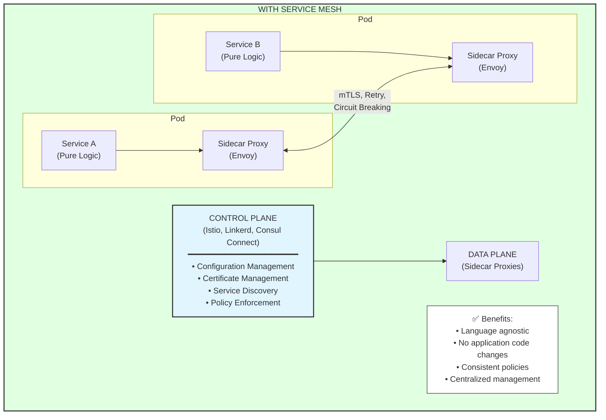

# Service Mesh

## Overview
A Service Mesh is a dedicated infrastructure layer that handles service-to-service communication in microservices architecture. It provides features like traffic management, security, and observability without requiring changes to application code.

---

## Why Service Mesh?

### The Problem



### The Solution



---

## Service Mesh Architecture

### Sidecar Pattern

```
┌─────────────────────────────────────────────────────────────────────┐
│                       SIDECAR PATTERN                                │
│                                                                      │
│   Pod/Container                                                      │
│   ┌─────────────────────────────────────────────────────────────┐   │
│   │                                                              │   │
│   │   ┌────────────────────┐    ┌────────────────────────┐      │   │
│   │   │                    │    │                        │      │   │
│   │   │   Application      │    │    Sidecar Proxy       │      │   │
│   │   │   Container        │───►│    (Envoy)             │      │   │
│   │   │                    │    │                        │      │   │
│   │   │   localhost:8080   │    │    localhost:15001     │      │   │
│   │   │                    │    │    (inbound)           │      │   │
│   │   │                    │◄───│                        │      │   │
│   │   │                    │    │    localhost:15006     │      │   │
│   │   │                    │    │    (outbound)          │      │   │
│   │   └────────────────────┘    └────────────────────────┘      │   │
│   │                                       │                      │   │
│   └───────────────────────────────────────┼──────────────────────┘   │
│                                           │                          │
│                                           ▼                          │
│                               External Network Traffic               │
│                                                                      │
│   Traffic Flow:                                                      │
│   1. App sends request to localhost (thinks it's direct)            │
│   2. iptables redirects to sidecar proxy                            │
│   3. Proxy applies policies (mTLS, retry, circuit breaker)          │
│   4. Proxy forwards to destination sidecar                          │
│   5. Destination sidecar forwards to destination app                │
│                                                                      │
└─────────────────────────────────────────────────────────────────────┘
```

### Control Plane vs Data Plane

```
┌─────────────────────────────────────────────────────────────────────┐
│                                                                      │
│   CONTROL PLANE                                                      │
│   ┌─────────────────────────────────────────────────────────────┐   │
│   │                                                              │   │
│   │   ┌─────────────┐  ┌─────────────┐  ┌─────────────────────┐ │   │
│   │   │   Pilot     │  │   Citadel   │  │       Galley        │ │   │
│   │   │ (Traffic)   │  │ (Security)  │  │   (Configuration)   │ │   │
│   │   └─────────────┘  └─────────────┘  └─────────────────────┘ │   │
│   │                                                              │   │
│   │   Responsibilities:                                          │   │
│   │   • Service discovery           • Certificate issuance      │   │
│   │   • Traffic management rules    • Policy distribution       │   │
│   │   • Configuration distribution  • Telemetry aggregation     │   │
│   │                                                              │   │
│   └─────────────────────────────────────────────────────────────┘   │
│                              │                                       │
│                              │ Configuration & Certificates          │
│                              ▼                                       │
│   DATA PLANE                                                         │
│   ┌─────────────────────────────────────────────────────────────┐   │
│   │                                                              │   │
│   │   ┌──────────┐    ┌──────────┐    ┌──────────┐             │   │
│   │   │  Envoy   │◄──►│  Envoy   │◄──►│  Envoy   │             │   │
│   │   │  Proxy   │    │  Proxy   │    │  Proxy   │             │   │
│   │   └──────────┘    └──────────┘    └──────────┘             │   │
│   │                                                              │   │
│   │   Responsibilities:                                          │   │
│   │   • Request routing            • Load balancing              │   │
│   │   • mTLS encryption            • Circuit breaking            │   │
│   │   • Retries/timeouts           • Metrics collection          │   │
│   │                                                              │   │
│   └─────────────────────────────────────────────────────────────┘   │
│                                                                      │
└─────────────────────────────────────────────────────────────────────┘
```

---

## Istio Service Mesh

### Installation

```bash
# Install Istio CLI
curl -L https://istio.io/downloadIstio | sh -
cd istio-1.x.x
export PATH=$PWD/bin:$PATH

# Install Istio on Kubernetes
istioctl install --set profile=demo -y

# Enable sidecar injection for namespace
kubectl label namespace default istio-injection=enabled

# Verify installation
kubectl get pods -n istio-system
```

### Traffic Management

```yaml
# VirtualService - Traffic routing rules
apiVersion: networking.istio.io/v1beta1
kind: VirtualService
metadata:
  name: order-service
spec:
  hosts:
    - order-service
  http:
    # Route based on headers
    - match:
        - headers:
            x-user-type:
              exact: premium
      route:
        - destination:
            host: order-service
            subset: v2
          weight: 100
    # A/B Testing - 90/10 split
    - route:
        - destination:
            host: order-service
            subset: v1
          weight: 90
        - destination:
            host: order-service
            subset: v2
          weight: 10
    # Timeout and retries
    timeout: 10s
    retries:
      attempts: 3
      perTryTimeout: 3s
      retryOn: 5xx,reset,connect-failure

---
# DestinationRule - Define subsets and load balancing
apiVersion: networking.istio.io/v1beta1
kind: DestinationRule
metadata:
  name: order-service
spec:
  host: order-service
  trafficPolicy:
    connectionPool:
      tcp:
        maxConnections: 100
      http:
        h2UpgradePolicy: UPGRADE
        http1MaxPendingRequests: 100
        http2MaxRequests: 1000
    loadBalancer:
      simple: ROUND_ROBIN
    outlierDetection:
      consecutive5xxErrors: 5
      interval: 30s
      baseEjectionTime: 30s
      maxEjectionPercent: 50
  subsets:
    - name: v1
      labels:
        version: v1
    - name: v2
      labels:
        version: v2
      trafficPolicy:
        loadBalancer:
          simple: LEAST_CONN
```

### Canary Deployment

```yaml
# Gradual traffic shift for canary deployment
apiVersion: networking.istio.io/v1beta1
kind: VirtualService
metadata:
  name: order-service
spec:
  hosts:
    - order-service
  http:
    - route:
        - destination:
            host: order-service
            subset: stable
          weight: 95
        - destination:
            host: order-service
            subset: canary
          weight: 5

---
# Progressive rollout script
# Step 1: 5% canary
kubectl apply -f virtualservice-5.yaml

# Step 2: Monitor metrics, if OK -> 25%
kubectl apply -f virtualservice-25.yaml

# Step 3: Monitor metrics, if OK -> 50%
kubectl apply -f virtualservice-50.yaml

# Step 4: Full rollout
kubectl apply -f virtualservice-100.yaml
```

### Circuit Breaker

```yaml
# Circuit breaker configuration
apiVersion: networking.istio.io/v1beta1
kind: DestinationRule
metadata:
  name: order-service
spec:
  host: order-service
  trafficPolicy:
    connectionPool:
      tcp:
        maxConnections: 100
      http:
        http1MaxPendingRequests: 100
        http2MaxRequests: 1000
        maxRequestsPerConnection: 10
    outlierDetection:
      # Eject hosts with errors
      consecutive5xxErrors: 5        # Errors before ejection
      consecutiveGatewayErrors: 5    # Gateway errors before ejection
      interval: 10s                  # Analysis interval
      baseEjectionTime: 30s          # Minimum ejection duration
      maxEjectionPercent: 50         # Max % of hosts to eject
      minHealthPercent: 30           # Min healthy hosts to enable ejection
```

### Security (mTLS)

```yaml
# Enable mTLS for entire mesh
apiVersion: security.istio.io/v1beta1
kind: PeerAuthentication
metadata:
  name: default
  namespace: istio-system
spec:
  mtls:
    mode: STRICT  # STRICT, PERMISSIVE, DISABLE

---
# Namespace-specific mTLS
apiVersion: security.istio.io/v1beta1
kind: PeerAuthentication
metadata:
  name: default
  namespace: production
spec:
  mtls:
    mode: STRICT

---
# Service-specific mTLS
apiVersion: security.istio.io/v1beta1
kind: PeerAuthentication
metadata:
  name: order-service
  namespace: production
spec:
  selector:
    matchLabels:
      app: order-service
  mtls:
    mode: STRICT
  portLevelMtls:
    8080:
      mode: PERMISSIVE  # Allow non-mTLS on specific port
```

### Authorization Policy

```yaml
# Allow only specific services to call order-service
apiVersion: security.istio.io/v1beta1
kind: AuthorizationPolicy
metadata:
  name: order-service-policy
  namespace: production
spec:
  selector:
    matchLabels:
      app: order-service
  action: ALLOW
  rules:
    - from:
        - source:
            principals:
              - "cluster.local/ns/production/sa/api-gateway"
              - "cluster.local/ns/production/sa/payment-service"
      to:
        - operation:
            methods: ["GET", "POST"]
            paths: ["/api/orders/*"]
    - from:
        - source:
            principals:
              - "cluster.local/ns/production/sa/admin-service"
      to:
        - operation:
            methods: ["DELETE"]
            paths: ["/api/orders/*"]

---
# Deny all by default, then allow specific
apiVersion: security.istio.io/v1beta1
kind: AuthorizationPolicy
metadata:
  name: deny-all
  namespace: production
spec:
  {}  # Empty spec denies all

---
# JWT validation
apiVersion: security.istio.io/v1beta1
kind: RequestAuthentication
metadata:
  name: jwt-auth
  namespace: production
spec:
  selector:
    matchLabels:
      app: order-service
  jwtRules:
    - issuer: "https://auth.example.com"
      jwksUri: "https://auth.example.com/.well-known/jwks.json"
      audiences:
        - "order-service"
      forwardOriginalToken: true

---
# Require JWT for specific paths
apiVersion: security.istio.io/v1beta1
kind: AuthorizationPolicy
metadata:
  name: require-jwt
  namespace: production
spec:
  selector:
    matchLabels:
      app: order-service
  action: ALLOW
  rules:
    - from:
        - source:
            requestPrincipals: ["*"]  # Any valid JWT
      to:
        - operation:
            paths: ["/api/orders/*"]
```

### Observability

```yaml
# Enable Kiali dashboard
kubectl apply -f https://raw.githubusercontent.com/istio/istio/release-1.x/samples/addons/kiali.yaml

# Enable Jaeger tracing
kubectl apply -f https://raw.githubusercontent.com/istio/istio/release-1.x/samples/addons/jaeger.yaml

# Enable Prometheus metrics
kubectl apply -f https://raw.githubusercontent.com/istio/istio/release-1.x/samples/addons/prometheus.yaml

# Enable Grafana dashboards
kubectl apply -f https://raw.githubusercontent.com/istio/istio/release-1.x/samples/addons/grafana.yaml

# Access dashboards
istioctl dashboard kiali
istioctl dashboard jaeger
istioctl dashboard grafana
```

```yaml
# Custom telemetry configuration
apiVersion: telemetry.istio.io/v1alpha1
kind: Telemetry
metadata:
  name: mesh-default
  namespace: istio-system
spec:
  accessLogging:
    - providers:
        - name: envoy
  tracing:
    - providers:
        - name: jaeger
      randomSamplingPercentage: 10  # Sample 10% of traces
  metrics:
    - providers:
        - name: prometheus
```

---

## Linkerd Service Mesh

### Installation

```bash
# Install Linkerd CLI
curl -sL https://run.linkerd.io/install | sh
export PATH=$PATH:$HOME/.linkerd2/bin

# Validate cluster
linkerd check --pre

# Install control plane
linkerd install | kubectl apply -f -

# Verify installation
linkerd check

# Install Viz extension (observability)
linkerd viz install | kubectl apply -f -
```

### Inject Sidecar

```bash
# Inject into deployment
kubectl get deploy order-service -o yaml | linkerd inject - | kubectl apply -f -

# Inject entire namespace
kubectl annotate namespace production linkerd.io/inject=enabled
```

### Traffic Management

```yaml
# Service Profile for retries and timeouts
apiVersion: linkerd.io/v1alpha2
kind: ServiceProfile
metadata:
  name: order-service.production.svc.cluster.local
  namespace: production
spec:
  routes:
    - name: POST /api/orders
      condition:
        method: POST
        pathRegex: /api/orders
      responseClasses:
        - condition:
            status:
              min: 500
              max: 599
          isFailure: true
      timeout: 10s
      retries:
        budget:
          retryRatio: 0.2  # 20% of requests can be retries
          minRetriesPerSecond: 10
          ttl: 10s
    - name: GET /api/orders/{id}
      condition:
        method: GET
        pathRegex: /api/orders/[^/]+
      timeout: 5s

---
# Traffic Split (canary deployment)
apiVersion: split.smi-spec.io/v1alpha1
kind: TrafficSplit
metadata:
  name: order-service-split
  namespace: production
spec:
  service: order-service
  backends:
    - service: order-service-v1
      weight: 900  # 90%
    - service: order-service-v2
      weight: 100  # 10%
```

### mTLS in Linkerd

```bash
# Linkerd automatically enables mTLS between meshed services
# Check mTLS status
linkerd viz edges deployment -n production

# Verify mTLS
linkerd viz tap deployment/order-service -n production
# Look for "tls=true" in output
```

---

## Consul Connect

### Installation

```bash
# Install Consul on Kubernetes via Helm
helm repo add hashicorp https://helm.releases.hashicorp.com
helm install consul hashicorp/consul --set global.name=consul

# Or with custom values
helm install consul hashicorp/consul -f consul-values.yaml
```

```yaml
# consul-values.yaml
global:
  name: consul
  datacenter: dc1
  
server:
  replicas: 3
  bootstrapExpect: 3
  
client:
  enabled: true
  grpc: true
  
connectInject:
  enabled: true
  default: true  # Auto-inject sidecars

controller:
  enabled: true

ui:
  enabled: true
```

### Service Configuration

```yaml
# Kubernetes service with Consul Connect
apiVersion: v1
kind: Service
metadata:
  name: order-service
  annotations:
    consul.hashicorp.com/connect-inject: "true"
spec:
  selector:
    app: order-service
  ports:
    - port: 8080
      targetPort: 8080

---
# Service intentions (authorization)
apiVersion: consul.hashicorp.com/v1alpha1
kind: ServiceIntentions
metadata:
  name: order-service
spec:
  destination:
    name: order-service
  sources:
    - name: api-gateway
      action: allow
    - name: payment-service
      action: allow
    - name: "*"
      action: deny  # Deny all others
```

---

## Comparison of Service Meshes

| Feature | Istio | Linkerd | Consul Connect |
|---------|-------|---------|----------------|
| **Proxy** | Envoy | Linkerd2-proxy (Rust) | Envoy |
| **Complexity** | High | Low | Medium |
| **Resource Usage** | Higher | Lower | Medium |
| **mTLS** | Yes | Yes (automatic) | Yes |
| **Traffic Management** | Advanced | Basic | Medium |
| **Multi-cluster** | Yes | Yes | Yes (native) |
| **Protocol Support** | HTTP/gRPC/TCP | HTTP/gRPC/TCP | HTTP/gRPC/TCP |
| **Learning Curve** | Steep | Gentle | Medium |
| **Best For** | Complex requirements | Simplicity | HashiCorp ecosystem |

---

## Service Mesh Patterns

### 1. Retry with Exponential Backoff

```yaml
# Istio retry configuration
apiVersion: networking.istio.io/v1beta1
kind: VirtualService
metadata:
  name: order-service
spec:
  hosts:
    - order-service
  http:
    - route:
        - destination:
            host: order-service
      retries:
        attempts: 3
        perTryTimeout: 2s
        retryOn: 5xx,reset,connect-failure,retriable-4xx
```

### 2. Fault Injection (Chaos Testing)

```yaml
# Inject delays and errors for testing
apiVersion: networking.istio.io/v1beta1
kind: VirtualService
metadata:
  name: order-service
spec:
  hosts:
    - order-service
  http:
    - fault:
        delay:
          percentage:
            value: 10  # 10% of requests
          fixedDelay: 5s
        abort:
          percentage:
            value: 5   # 5% of requests
          httpStatus: 500
      route:
        - destination:
            host: order-service
```

### 3. Rate Limiting

```yaml
# Istio rate limiting with Envoy
apiVersion: networking.istio.io/v1alpha3
kind: EnvoyFilter
metadata:
  name: rate-limit
  namespace: production
spec:
  workloadSelector:
    labels:
      app: order-service
  configPatches:
    - applyTo: HTTP_FILTER
      match:
        context: SIDECAR_INBOUND
        listener:
          filterChain:
            filter:
              name: "envoy.filters.network.http_connection_manager"
      patch:
        operation: INSERT_BEFORE
        value:
          name: envoy.filters.http.local_ratelimit
          typed_config:
            "@type": type.googleapis.com/udpa.type.v1.TypedStruct
            type_url: type.googleapis.com/envoy.extensions.filters.http.local_ratelimit.v3.LocalRateLimit
            value:
              stat_prefix: http_local_rate_limiter
              token_bucket:
                max_tokens: 100
                tokens_per_fill: 10
                fill_interval: 1s
```

### 4. Request Mirroring (Shadow Traffic)

```yaml
# Mirror traffic to new version for testing
apiVersion: networking.istio.io/v1beta1
kind: VirtualService
metadata:
  name: order-service
spec:
  hosts:
    - order-service
  http:
    - route:
        - destination:
            host: order-service
            subset: v1
          weight: 100
      mirror:
        host: order-service
        subset: v2
      mirrorPercentage:
        value: 100  # Mirror all traffic
```

---

## Best Practices

### 1. Gradual Adoption
```yaml
# Start with permissive mTLS
apiVersion: security.istio.io/v1beta1
kind: PeerAuthentication
metadata:
  name: default
  namespace: production
spec:
  mtls:
    mode: PERMISSIVE  # Accept both mTLS and plain text

# After all services are meshed, switch to STRICT
```

### 2. Resource Limits for Sidecars
```yaml
# Set resource limits for Envoy sidecars
apiVersion: install.istio.io/v1alpha1
kind: IstioOperator
spec:
  values:
    global:
      proxy:
        resources:
          requests:
            cpu: 100m
            memory: 128Mi
          limits:
            cpu: 500m
            memory: 256Mi
```

### 3. Exclude Non-Critical Paths
```yaml
# Exclude health checks from mesh
apiVersion: networking.istio.io/v1beta1
kind: Sidecar
metadata:
  name: default
  namespace: production
spec:
  workloadSelector:
    labels:
      app: order-service
  ingress:
    - port:
        number: 8080
        protocol: HTTP
        name: http
      defaultEndpoint: 127.0.0.1:8080
  outboundTrafficPolicy:
    mode: REGISTRY_ONLY  # Only allow registered services
```

### 4. Monitor Proxy Performance
```bash
# Check proxy resource usage
kubectl top pods -n production

# View Envoy stats
kubectl exec -it order-service-xxx -c istio-proxy -- pilot-agent request GET stats

# Check proxy sync status
istioctl proxy-status
```

---

## Interview Questions

### Conceptual Questions
1. **What is a service mesh and why would you use one?**
2. **Explain the sidecar pattern in service mesh.**
3. **What's the difference between control plane and data plane?**
4. **How does mTLS work in a service mesh?**
5. **Compare Istio, Linkerd, and Consul Connect.**

### Design Questions
1. **How would you implement canary deployments using a service mesh?**
2. **Design a zero-trust security model using service mesh.**
3. **How do you handle services that can't have sidecars?**
4. **How would you migrate from library-based resilience to service mesh?**
5. **Design a multi-cluster service mesh architecture.**

### Practical Questions
1. **How do you debug issues in a service mesh?**
2. **What metrics would you monitor for mesh health?**
3. **How do you handle service mesh upgrades?**
4. **How do you optimize sidecar resource usage?**
5. **How do you test service mesh configurations?**

---

## Key Takeaways

1. **Service mesh moves networking concerns to infrastructure** - application code stays clean
2. **Sidecar proxies handle all service-to-service traffic** transparently
3. **mTLS provides encryption and identity** without code changes
4. **Traffic management enables canary, A/B testing, and blue-green** deployments
5. **Circuit breakers and retries are configured declaratively** instead of in code
6. **Observability comes built-in** with distributed tracing and metrics
7. **Start with permissive mode** and gradually tighten security
8. **Monitor sidecar resource usage** - they add overhead
9. **Choose the right mesh** based on complexity needs and ecosystem
10. **Service mesh adds operational complexity** - ensure team is ready

---

*Previous: [Event-Driven Architecture](04-event-driven-architecture.md) | Next: [Distributed Tracing](06-distributed-tracing.md)*
