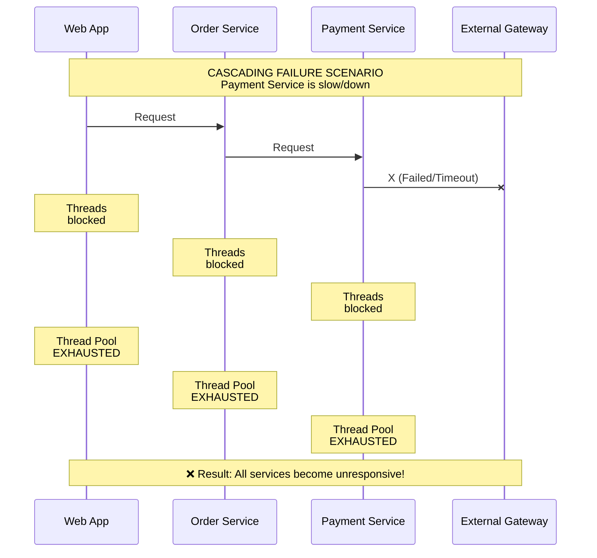
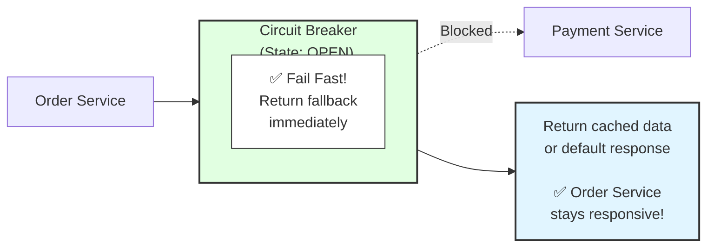
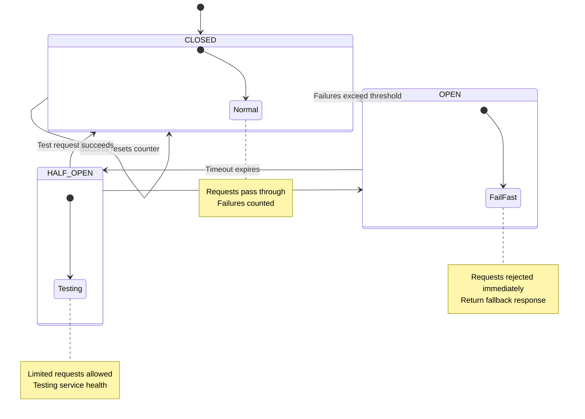

# Circuit Breaker Pattern

## Overview
The Circuit Breaker pattern is a fault tolerance mechanism that prevents cascading failures in distributed systems. It wraps calls to external services and monitors for failures, "breaking" the circuit to prevent further calls when failures exceed a threshold.

---

## Why Circuit Breaker?

### The Problem: Cascading Failures



### The Solution: Circuit Breaker



---

## Circuit Breaker States



**States:**
│   • CLOSED: Normal operation, requests pass through                 │
│   • OPEN: Circuit broken, requests fail immediately                 │
│   • HALF-OPEN: Testing if service recovered                         │
│                                                                      │
└─────────────────────────────────────────────────────────────────────┘
```

---

## Resilience4j Implementation

### Setup

```xml
<!-- Maven dependencies -->
<dependencies>
    <dependency>
        <groupId>io.github.resilience4j</groupId>
        <artifactId>resilience4j-spring-boot3</artifactId>
        <version>2.1.0</version>
    </dependency>
    <dependency>
        <groupId>io.github.resilience4j</groupId>
        <artifactId>resilience4j-circuitbreaker</artifactId>
        <version>2.1.0</version>
    </dependency>
    <dependency>
        <groupId>org.springframework.boot</groupId>
        <artifactId>spring-boot-starter-aop</artifactId>
    </dependency>
</dependencies>
```

### Configuration

```yaml
# application.yml
resilience4j:
  circuitbreaker:
    instances:
      paymentService:
        # Sliding window configuration
        slidingWindowType: COUNT_BASED
        slidingWindowSize: 10                    # Last 10 calls
        minimumNumberOfCalls: 5                  # Min calls before calculating failure rate
        
        # Failure thresholds
        failureRateThreshold: 50                 # Open circuit if 50% fail
        slowCallRateThreshold: 80                # Open if 80% are slow
        slowCallDurationThreshold: 2s            # Calls > 2s are "slow"
        
        # Wait duration in OPEN state
        waitDurationInOpenState: 30s
        
        # HALF-OPEN state configuration
        permittedNumberOfCallsInHalfOpenState: 3
        
        # Automatically transition to HALF-OPEN
        automaticTransitionFromOpenToHalfOpenEnabled: true
        
        # Exceptions to record as failures
        recordExceptions:
          - java.io.IOException
          - java.net.ConnectException
          - java.util.concurrent.TimeoutException
          - org.springframework.web.client.HttpServerErrorException
        
        # Exceptions to ignore
        ignoreExceptions:
          - com.example.BusinessException
```

### Annotation-Based Usage

```java
@Service
@Slf4j
public class PaymentService {
    
    private final PaymentGatewayClient paymentGateway;
    
    @CircuitBreaker(name = "paymentService", fallbackMethod = "processPaymentFallback")
    public PaymentResult processPayment(PaymentRequest request) {
        log.info("Processing payment for order: {}", request.getOrderId());
        return paymentGateway.charge(request);
    }
    
    // Fallback method - must have same return type
    private PaymentResult processPaymentFallback(PaymentRequest request, Exception e) {
        log.warn("Circuit breaker fallback triggered for order: {}, error: {}", 
            request.getOrderId(), e.getMessage());
        
        // Return a pending status for later retry
        return PaymentResult.builder()
            .orderId(request.getOrderId())
            .status(PaymentStatus.PENDING)
            .message("Payment service temporarily unavailable. Will retry.")
            .build();
    }
    
    // Fallback with specific exception type
    private PaymentResult processPaymentFallback(PaymentRequest request, 
            CallNotPermittedException e) {
        log.warn("Circuit is OPEN for order: {}", request.getOrderId());
        return PaymentResult.builder()
            .orderId(request.getOrderId())
            .status(PaymentStatus.CIRCUIT_OPEN)
            .message("Payment service is currently unavailable")
            .build();
    }
}
```

### Programmatic Usage

```java
@Service
@Slf4j
public class PaymentService {
    
    private final CircuitBreakerRegistry circuitBreakerRegistry;
    private final PaymentGatewayClient paymentGateway;
    
    public PaymentResult processPayment(PaymentRequest request) {
        CircuitBreaker circuitBreaker = circuitBreakerRegistry.circuitBreaker("paymentService");
        
        // Decorate the call with circuit breaker
        Supplier<PaymentResult> decoratedSupplier = CircuitBreaker
            .decorateSupplier(circuitBreaker, () -> paymentGateway.charge(request));
        
        // Execute with fallback
        return Try.ofSupplier(decoratedSupplier)
            .recover(throwable -> {
                log.warn("Payment failed: {}", throwable.getMessage());
                return PaymentResult.pending(request.getOrderId());
            })
            .get();
    }
    
    // Functional style with multiple decorators
    public PaymentResult processPaymentWithRetry(PaymentRequest request) {
        CircuitBreaker circuitBreaker = circuitBreakerRegistry.circuitBreaker("paymentService");
        Retry retry = retryRegistry.retry("paymentRetry");
        
        Supplier<PaymentResult> decoratedSupplier = Decorators
            .ofSupplier(() -> paymentGateway.charge(request))
            .withCircuitBreaker(circuitBreaker)
            .withRetry(retry)
            .decorate();
        
        return Try.ofSupplier(decoratedSupplier)
            .recover(CallNotPermittedException.class, e -> PaymentResult.circuitOpen())
            .recover(Exception.class, e -> PaymentResult.failed(e.getMessage()))
            .get();
    }
}
```

### Event Listeners and Monitoring

```java
@Component
@Slf4j
public class CircuitBreakerEventListener {
    
    public CircuitBreakerEventListener(CircuitBreakerRegistry registry) {
        registry.circuitBreaker("paymentService")
            .getEventPublisher()
            .onStateTransition(this::onStateTransition)
            .onError(this::onError)
            .onSuccess(this::onSuccess)
            .onCallNotPermitted(this::onCallNotPermitted);
    }
    
    private void onStateTransition(CircuitBreakerOnStateTransitionEvent event) {
        log.info("Circuit Breaker {} state changed from {} to {}", 
            event.getCircuitBreakerName(),
            event.getStateTransition().getFromState(),
            event.getStateTransition().getToState());
        
        // Send alert if circuit opens
        if (event.getStateTransition().getToState() == CircuitBreaker.State.OPEN) {
            alertService.sendCircuitBreakerAlert(
                event.getCircuitBreakerName(),
                "Circuit breaker OPENED"
            );
        }
    }
    
    private void onError(CircuitBreakerOnErrorEvent event) {
        log.error("Circuit Breaker {} recorded error: {}", 
            event.getCircuitBreakerName(),
            event.getThrowable().getMessage());
    }
    
    private void onSuccess(CircuitBreakerOnSuccessEvent event) {
        log.debug("Circuit Breaker {} call succeeded in {}ms", 
            event.getCircuitBreakerName(),
            event.getElapsedDuration().toMillis());
    }
    
    private void onCallNotPermitted(CircuitBreakerOnCallNotPermittedEvent event) {
        log.warn("Circuit Breaker {} rejected call - circuit is OPEN", 
            event.getCircuitBreakerName());
    }
}
```

### Metrics and Actuator

```yaml
# Enable actuator endpoints
management:
  endpoints:
    web:
      exposure:
        include: health,circuitbreakers,metrics
  endpoint:
    health:
      show-details: always
  health:
    circuitbreakers:
      enabled: true
```

```java
// Custom metrics
@Component
public class CircuitBreakerMetrics {
    
    private final MeterRegistry meterRegistry;
    private final CircuitBreakerRegistry registry;
    
    @PostConstruct
    public void registerMetrics() {
        registry.getAllCircuitBreakers().forEach(cb -> {
            // Gauge for state
            Gauge.builder("circuit_breaker_state", cb, 
                    circuitBreaker -> circuitBreaker.getState().getOrder())
                .tag("name", cb.getName())
                .register(meterRegistry);
            
            // Gauge for failure rate
            Gauge.builder("circuit_breaker_failure_rate", cb,
                    circuitBreaker -> circuitBreaker.getMetrics().getFailureRate())
                .tag("name", cb.getName())
                .register(meterRegistry);
            
            // Gauge for slow call rate
            Gauge.builder("circuit_breaker_slow_call_rate", cb,
                    circuitBreaker -> circuitBreaker.getMetrics().getSlowCallRate())
                .tag("name", cb.getName())
                .register(meterRegistry);
        });
    }
}
```

---

## Combining Resilience Patterns

### Circuit Breaker + Retry + Timeout

```yaml
# application.yml
resilience4j:
  circuitbreaker:
    instances:
      paymentService:
        slidingWindowSize: 10
        failureRateThreshold: 50
        waitDurationInOpenState: 30s
        
  retry:
    instances:
      paymentService:
        maxAttempts: 3
        waitDuration: 500ms
        enableExponentialBackoff: true
        exponentialBackoffMultiplier: 2
        retryExceptions:
          - java.io.IOException
          - java.net.ConnectException
        ignoreExceptions:
          - com.example.BusinessException
          
  timelimiter:
    instances:
      paymentService:
        timeoutDuration: 3s
        cancelRunningFuture: true
```

```java
@Service
public class PaymentService {
    
    @CircuitBreaker(name = "paymentService", fallbackMethod = "fallback")
    @Retry(name = "paymentService")
    @TimeLimiter(name = "paymentService")
    public CompletableFuture<PaymentResult> processPayment(PaymentRequest request) {
        return CompletableFuture.supplyAsync(() -> {
            return paymentGateway.charge(request);
        });
    }
    
    private CompletableFuture<PaymentResult> fallback(
            PaymentRequest request, Exception e) {
        return CompletableFuture.completedFuture(
            PaymentResult.failed(e.getMessage()));
    }
}
```

### Bulkhead Pattern (Thread Isolation)

```yaml
# Bulkhead configuration
resilience4j:
  bulkhead:
    instances:
      paymentService:
        maxConcurrentCalls: 10        # Max concurrent calls
        maxWaitDuration: 500ms        # Max wait time for permit
        
  thread-pool-bulkhead:
    instances:
      paymentService:
        maxThreadPoolSize: 10
        coreThreadPoolSize: 5
        queueCapacity: 50
        keepAliveDuration: 20ms
```

```java
@Service
public class PaymentService {
    
    // Semaphore-based bulkhead
    @Bulkhead(name = "paymentService", fallbackMethod = "bulkheadFallback")
    @CircuitBreaker(name = "paymentService", fallbackMethod = "circuitBreakerFallback")
    public PaymentResult processPayment(PaymentRequest request) {
        return paymentGateway.charge(request);
    }
    
    // Thread pool bulkhead (async)
    @Bulkhead(name = "paymentService", type = Bulkhead.Type.THREADPOOL)
    public CompletableFuture<PaymentResult> processPaymentAsync(PaymentRequest request) {
        return CompletableFuture.supplyAsync(() -> paymentGateway.charge(request));
    }
    
    private PaymentResult bulkheadFallback(PaymentRequest request, 
            BulkheadFullException e) {
        log.warn("Bulkhead full for order: {}", request.getOrderId());
        return PaymentResult.builder()
            .status(PaymentStatus.THROTTLED)
            .message("Too many concurrent requests")
            .build();
    }
}
```

### Rate Limiter

```yaml
resilience4j:
  ratelimiter:
    instances:
      paymentService:
        limitForPeriod: 100           # 100 requests
        limitRefreshPeriod: 1s        # Per second
        timeoutDuration: 500ms        # Wait time for permit
```

```java
@Service
public class PaymentService {
    
    @RateLimiter(name = "paymentService", fallbackMethod = "rateLimitFallback")
    @CircuitBreaker(name = "paymentService", fallbackMethod = "circuitBreakerFallback")
    public PaymentResult processPayment(PaymentRequest request) {
        return paymentGateway.charge(request);
    }
    
    private PaymentResult rateLimitFallback(PaymentRequest request, 
            RequestNotPermitted e) {
        log.warn("Rate limit exceeded for order: {}", request.getOrderId());
        return PaymentResult.builder()
            .status(PaymentStatus.RATE_LIMITED)
            .retryAfter(1)
            .build();
    }
}
```

---

## Order of Pattern Execution

```
┌─────────────────────────────────────────────────────────────────────┐
│                    RESILIENCE PATTERN ORDER                          │
│                                                                      │
│   Request                                                            │
│      │                                                               │
│      ▼                                                               │
│   ┌─────────────┐                                                   │
│   │ Rate Limiter │  ← First: Control request rate                   │
│   └──────┬──────┘                                                   │
│          │                                                           │
│          ▼                                                           │
│   ┌─────────────┐                                                   │
│   │   Bulkhead  │  ← Second: Limit concurrent calls                 │
│   └──────┬──────┘                                                   │
│          │                                                           │
│          ▼                                                           │
│   ┌─────────────┐                                                   │
│   │   Timeout   │  ← Third: Set time limit                          │
│   └──────┬──────┘                                                   │
│          │                                                           │
│          ▼                                                           │
│   ┌─────────────────┐                                               │
│   │ Circuit Breaker │  ← Fourth: Check circuit state                │
│   └──────┬──────────┘                                               │
│          │                                                           │
│          ▼                                                           │
│   ┌─────────────┐                                                   │
│   │    Retry    │  ← Fifth: Retry on failure                        │
│   └──────┬──────┘                                                   │
│          │                                                           │
│          ▼                                                           │
│   Actual Service Call                                                │
│                                                                      │
│   Annotations order (left to right = outer to inner):               │
│   @Retry → @CircuitBreaker → @RateLimiter → @Bulkhead → @TimeLimiter│
│                                                                      │
└─────────────────────────────────────────────────────────────────────┘
```

```java
// Proper annotation ordering
@Service
public class PaymentService {
    
    // Order: Retry wraps CircuitBreaker wraps Bulkhead wraps TimeLimiter
    @Retry(name = "paymentService")
    @CircuitBreaker(name = "paymentService")
    @Bulkhead(name = "paymentService")
    @TimeLimiter(name = "paymentService")
    public CompletableFuture<PaymentResult> processPayment(PaymentRequest request) {
        return CompletableFuture.supplyAsync(() -> paymentGateway.charge(request));
    }
}

// Or configure order explicitly
resilience4j:
  circuitbreaker:
    circuitBreakerAspectOrder: 1
  retry:
    retryAspectOrder: 2
  bulkhead:
    bulkheadAspectOrder: 0
```

---

## Fallback Strategies

### 1. Cached Response

```java
@Service
public class ProductService {
    
    private final ProductCache productCache;
    private final ProductClient productClient;
    
    @CircuitBreaker(name = "productService", fallbackMethod = "getCachedProduct")
    public Product getProduct(String productId) {
        Product product = productClient.getProduct(productId);
        productCache.put(productId, product);  // Update cache on success
        return product;
    }
    
    private Product getCachedProduct(String productId, Exception e) {
        log.warn("Using cached product for {}: {}", productId, e.getMessage());
        return productCache.get(productId)
            .orElseThrow(() -> new ProductNotFoundException(productId));
    }
}
```

### 2. Default Response

```java
@Service
public class RecommendationService {
    
    @CircuitBreaker(name = "recommendations", fallbackMethod = "getDefaultRecommendations")
    public List<Product> getRecommendations(String userId) {
        return recommendationClient.getPersonalized(userId);
    }
    
    private List<Product> getDefaultRecommendations(String userId, Exception e) {
        log.warn("Using default recommendations for {}: {}", userId, e.getMessage());
        return defaultRecommendations.getPopularProducts();
    }
}
```

### 3. Alternate Service

```java
@Service
public class PaymentService {
    
    private final PrimaryPaymentGateway primaryGateway;
    private final BackupPaymentGateway backupGateway;
    
    @CircuitBreaker(name = "primaryPayment", fallbackMethod = "processWithBackup")
    public PaymentResult processPayment(PaymentRequest request) {
        return primaryGateway.charge(request);
    }
    
    @CircuitBreaker(name = "backupPayment", fallbackMethod = "paymentUnavailable")
    private PaymentResult processWithBackup(PaymentRequest request, Exception e) {
        log.warn("Primary payment failed, trying backup: {}", e.getMessage());
        return backupGateway.charge(request);
    }
    
    private PaymentResult paymentUnavailable(PaymentRequest request, Exception e) {
        log.error("All payment gateways unavailable: {}", e.getMessage());
        return PaymentResult.builder()
            .status(PaymentStatus.UNAVAILABLE)
            .message("Payment services temporarily unavailable")
            .build();
    }
}
```

### 4. Queue for Later Processing

```java
@Service
public class OrderService {
    
    private final PaymentService paymentService;
    private final PendingPaymentQueue paymentQueue;
    
    @CircuitBreaker(name = "payment", fallbackMethod = "queueForLater")
    public OrderResult processOrder(Order order) {
        PaymentResult payment = paymentService.processPayment(order.getPayment());
        return OrderResult.success(order.getId(), payment);
    }
    
    private OrderResult queueForLater(Order order, Exception e) {
        log.warn("Payment failed, queueing for retry: {}", e.getMessage());
        
        // Queue order for later processing
        paymentQueue.enqueue(order);
        
        return OrderResult.builder()
            .orderId(order.getId())
            .status(OrderStatus.PENDING_PAYMENT)
            .message("Order received. Payment will be processed shortly.")
            .build();
    }
}

// Background processor
@Scheduled(fixedDelay = 60000)
public void processQueuedPayments() {
    paymentQueue.getItems().forEach(order -> {
        try {
            paymentService.processPayment(order.getPayment());
            paymentQueue.remove(order);
        } catch (Exception e) {
            log.error("Queued payment still failing for order: {}", order.getId());
        }
    });
}
```

---

## Health Monitoring

```java
@Component
public class CircuitBreakerHealthIndicator implements HealthIndicator {
    
    private final CircuitBreakerRegistry registry;
    
    @Override
    public Health health() {
        Map<String, Object> details = new HashMap<>();
        boolean healthy = true;
        
        for (CircuitBreaker cb : registry.getAllCircuitBreakers()) {
            CircuitBreaker.State state = cb.getState();
            CircuitBreaker.Metrics metrics = cb.getMetrics();
            
            Map<String, Object> cbDetails = Map.of(
                "state", state.name(),
                "failureRate", metrics.getFailureRate() + "%",
                "slowCallRate", metrics.getSlowCallRate() + "%",
                "bufferedCalls", metrics.getNumberOfBufferedCalls(),
                "failedCalls", metrics.getNumberOfFailedCalls()
            );
            
            details.put(cb.getName(), cbDetails);
            
            if (state == CircuitBreaker.State.OPEN) {
                healthy = false;
            }
        }
        
        return healthy 
            ? Health.up().withDetails(details).build()
            : Health.down().withDetails(details).build();
    }
}
```

---

## Testing Circuit Breakers

```java
@SpringBootTest
class PaymentServiceTest {
    
    @Autowired
    private PaymentService paymentService;
    
    @Autowired
    private CircuitBreakerRegistry circuitBreakerRegistry;
    
    @MockBean
    private PaymentGatewayClient paymentGateway;
    
    @BeforeEach
    void setUp() {
        // Reset circuit breaker before each test
        circuitBreakerRegistry.circuitBreaker("paymentService").reset();
    }
    
    @Test
    void shouldOpenCircuitAfterFailures() {
        // Arrange
        when(paymentGateway.charge(any()))
            .thenThrow(new RuntimeException("Service unavailable"));
        
        CircuitBreaker cb = circuitBreakerRegistry.circuitBreaker("paymentService");
        
        // Act - trigger enough failures to open circuit
        for (int i = 0; i < 10; i++) {
            try {
                paymentService.processPayment(new PaymentRequest());
            } catch (Exception ignored) {}
        }
        
        // Assert
        assertThat(cb.getState()).isEqualTo(CircuitBreaker.State.OPEN);
    }
    
    @Test
    void shouldReturnFallbackWhenCircuitOpen() {
        // Arrange
        CircuitBreaker cb = circuitBreakerRegistry.circuitBreaker("paymentService");
        cb.transitionToOpenState();  // Force open
        
        // Act
        PaymentResult result = paymentService.processPayment(new PaymentRequest());
        
        // Assert
        assertThat(result.getStatus()).isEqualTo(PaymentStatus.CIRCUIT_OPEN);
        verify(paymentGateway, never()).charge(any());  // Should not call gateway
    }
    
    @Test
    void shouldTransitionToHalfOpenAfterWait() throws InterruptedException {
        // Arrange
        CircuitBreaker cb = circuitBreakerRegistry.circuitBreaker("paymentService");
        cb.transitionToOpenState();
        
        // Act - wait for the configured wait duration
        Thread.sleep(31000);  // waitDurationInOpenState + 1s
        
        // Assert
        assertThat(cb.getState()).isEqualTo(CircuitBreaker.State.HALF_OPEN);
    }
    
    @Test
    void shouldCloseCircuitAfterSuccessfulCallsInHalfOpen() {
        // Arrange
        CircuitBreaker cb = circuitBreakerRegistry.circuitBreaker("paymentService");
        cb.transitionToOpenState();
        cb.transitionToHalfOpenState();
        
        when(paymentGateway.charge(any()))
            .thenReturn(PaymentResult.success());
        
        // Act - make successful calls in half-open state
        for (int i = 0; i < 3; i++) {
            paymentService.processPayment(new PaymentRequest());
        }
        
        // Assert
        assertThat(cb.getState()).isEqualTo(CircuitBreaker.State.CLOSED);
    }
}
```

---

## Best Practices

### 1. Configure Per-Service

```yaml
resilience4j:
  circuitbreaker:
    instances:
      # Fast service - lower thresholds
      userService:
        slidingWindowSize: 10
        failureRateThreshold: 30
        slowCallDurationThreshold: 500ms
        waitDurationInOpenState: 10s
        
      # Slow external service - higher tolerance
      paymentGateway:
        slidingWindowSize: 20
        failureRateThreshold: 60
        slowCallDurationThreshold: 5s
        waitDurationInOpenState: 60s
        
      # Critical service - aggressive protection
      inventoryService:
        slidingWindowSize: 5
        failureRateThreshold: 20
        waitDurationInOpenState: 5s
```

### 2. Meaningful Fallbacks

```java
// Bad: Generic fallback
private PaymentResult fallback(PaymentRequest request, Exception e) {
    return null;  // Client gets NPE
}

// Good: Meaningful fallback
private PaymentResult fallback(PaymentRequest request, Exception e) {
    log.warn("Payment fallback for order {}: {}", request.getOrderId(), e.getMessage());
    
    // Store for retry
    pendingPaymentQueue.add(request);
    
    // Return actionable response
    return PaymentResult.builder()
        .orderId(request.getOrderId())
        .status(PaymentStatus.PENDING)
        .message("Payment will be processed when service recovers")
        .retryable(true)
        .build();
}
```

### 3. Monitor and Alert

```java
@EventListener
public void onCircuitOpen(CircuitBreakerOnStateTransitionEvent event) {
    if (event.getStateTransition().getToState() == State.OPEN) {
        // Page on-call engineer
        pagerDuty.alert(
            "Circuit Breaker OPEN",
            "Service: " + event.getCircuitBreakerName(),
            Severity.HIGH
        );
    }
}
```

---

## Interview Questions

### Conceptual Questions
1. **What is the Circuit Breaker pattern and why is it needed?**
2. **Explain the three states of a circuit breaker.**
3. **How does a circuit breaker prevent cascading failures?**
4. **What's the difference between Circuit Breaker and Retry?**
5. **When would you use a Bulkhead with a Circuit Breaker?**

### Design Questions
1. **How would you configure circuit breakers for a payment system?**
2. **Design a fallback strategy for a product catalog service.**
3. **How do you decide threshold values for circuit breakers?**
4. **How would you implement circuit breakers across multiple services?**
5. **Design a monitoring system for circuit breaker states.**

### Practical Questions
1. **How do you test circuit breaker behavior?**
2. **What metrics would you monitor for circuit breakers?**
3. **How do you handle circuit breaker state in a clustered environment?**
4. **How do you decide between time-based vs count-based sliding window?**
5. **How do you tune circuit breaker settings in production?**

---

## Key Takeaways

1. **Circuit breakers prevent cascading failures** by failing fast
2. **Three states: CLOSED, OPEN, HALF-OPEN** with automatic transitions
3. **Configure thresholds based on service characteristics** - no one-size-fits-all
4. **Always provide meaningful fallbacks** - don't return null or generic errors
5. **Combine with other patterns** - retry, timeout, bulkhead, rate limiter
6. **Order matters** - rate limiter → bulkhead → timeout → circuit breaker → retry
7. **Monitor circuit breaker state** and alert on OPEN transitions
8. **Test failure scenarios** - verify fallbacks work as expected
9. **Use per-service configuration** - different services need different settings
10. **Fallbacks should be fast** - cached data, defaults, or queuing

---

*Previous: [Distributed Tracing](06-distributed-tracing.md) | Next: [Inter-Service Communication](08-inter-service-communication.md)*
