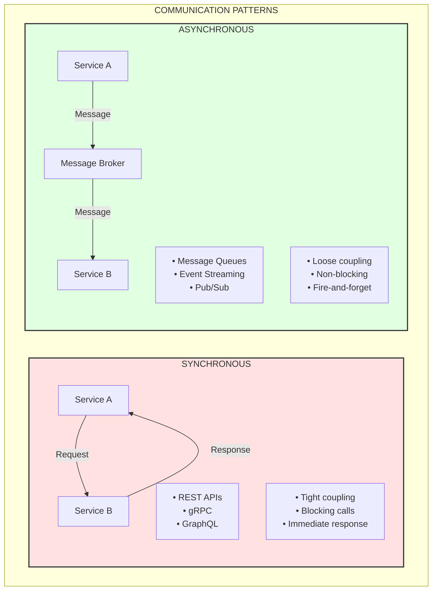

# Inter-Service Communication

## Overview
Inter-service communication is the backbone of microservices architecture. Choosing the right communication pattern—synchronous or asynchronous—directly impacts system performance, coupling, and reliability.

---

## Communication Patterns Overview



---

## Synchronous Communication

### REST APIs

```java
// RestTemplate (Legacy)
@Service
public class OrderService {
    
    private final RestTemplate restTemplate;
    
    public Product getProduct(String productId) {
        return restTemplate.getForObject(
            "http://product-service/products/{id}",
            Product.class,
            productId
        );
    }
    
    public Order createOrder(OrderRequest request) {
        // Validate inventory
        InventoryResponse inventory = restTemplate.postForObject(
            "http://inventory-service/check",
            new InventoryRequest(request.getItems()),
            InventoryResponse.class
        );
        
        if (!inventory.isAvailable()) {
            throw new InsufficientInventoryException();
        }
        
        // Process payment
        PaymentResponse payment = restTemplate.postForObject(
            "http://payment-service/process",
            new PaymentRequest(request.getPaymentInfo()),
            PaymentResponse.class
        );
        
        return Order.create(request, payment);
    }
}
```

```java
// WebClient (Modern Reactive)
@Service
public class OrderService {
    
    private final WebClient.Builder webClientBuilder;
    
    public Mono<Product> getProduct(String productId) {
        return webClientBuilder.build()
            .get()
            .uri("http://product-service/products/{id}", productId)
            .retrieve()
            .bodyToMono(Product.class);
    }
    
    public Mono<Order> createOrder(OrderRequest request) {
        WebClient webClient = webClientBuilder.build();
        
        // Parallel calls for independent services
        Mono<InventoryResponse> inventoryMono = webClient
            .post()
            .uri("http://inventory-service/check")
            .bodyValue(new InventoryRequest(request.getItems()))
            .retrieve()
            .bodyToMono(InventoryResponse.class);
            
        Mono<CustomerResponse> customerMono = webClient
            .get()
            .uri("http://customer-service/customers/{id}", request.getCustomerId())
            .retrieve()
            .bodyToMono(CustomerResponse.class);
        
        return Mono.zip(inventoryMono, customerMono)
            .flatMap(tuple -> {
                if (!tuple.getT1().isAvailable()) {
                    return Mono.error(new InsufficientInventoryException());
                }
                return processPayment(request, tuple.getT2());
            });
    }
}
```

### OpenFeign Client

```java
// Feign client definition
@FeignClient(
    name = "product-service",
    fallbackFactory = ProductClientFallbackFactory.class,
    configuration = ProductClientConfig.class
)
public interface ProductClient {
    
    @GetMapping("/products/{id}")
    Product getProduct(@PathVariable String id);
    
    @GetMapping("/products")
    List<Product> getProducts(@RequestParam List<String> ids);
    
    @PostMapping("/products")
    Product createProduct(@RequestBody ProductRequest request);
    
    @PutMapping("/products/{id}")
    Product updateProduct(@PathVariable String id, @RequestBody ProductRequest request);
}

// Fallback factory
@Component
public class ProductClientFallbackFactory implements FallbackFactory<ProductClient> {
    
    @Override
    public ProductClient create(Throwable cause) {
        return new ProductClient() {
            @Override
            public Product getProduct(String id) {
                log.warn("Fallback for getProduct: {}", cause.getMessage());
                return Product.empty(id);
            }
            
            @Override
            public List<Product> getProducts(List<String> ids) {
                return Collections.emptyList();
            }
            
            // ... other fallbacks
        };
    }
}

// Feign configuration
@Configuration
public class ProductClientConfig {
    
    @Bean
    public ErrorDecoder errorDecoder() {
        return new CustomErrorDecoder();
    }
    
    @Bean
    public Request.Options options() {
        return new Request.Options(
            5, TimeUnit.SECONDS,     // Connect timeout
            10, TimeUnit.SECONDS,    // Read timeout
            true                      // Follow redirects
        );
    }
    
    @Bean
    public Retryer retryer() {
        return new Retryer.Default(100, 1000, 3);
    }
}
```

### gRPC Communication

```protobuf
// product.proto
syntax = "proto3";

package com.example.product;

option java_multiple_files = true;
option java_package = "com.example.product.grpc";

service ProductService {
    rpc GetProduct(GetProductRequest) returns (Product) {}
    rpc ListProducts(ListProductsRequest) returns (stream Product) {}
    rpc CreateProduct(CreateProductRequest) returns (Product) {}
}

message GetProductRequest {
    string product_id = 1;
}

message Product {
    string id = 1;
    string name = 2;
    string description = 3;
    double price = 4;
    int32 quantity = 5;
}

message ListProductsRequest {
    repeated string product_ids = 1;
    int32 page_size = 2;
    string page_token = 3;
}

message CreateProductRequest {
    string name = 1;
    string description = 2;
    double price = 3;
    int32 quantity = 4;
}
```

```java
// gRPC Server
@GrpcService
public class ProductGrpcService extends ProductServiceGrpc.ProductServiceImplBase {
    
    private final ProductRepository productRepository;
    
    @Override
    public void getProduct(GetProductRequest request, 
                          StreamObserver<Product> responseObserver) {
        try {
            ProductEntity entity = productRepository.findById(request.getProductId())
                .orElseThrow(() -> new NotFoundException("Product not found"));
            
            Product response = Product.newBuilder()
                .setId(entity.getId())
                .setName(entity.getName())
                .setDescription(entity.getDescription())
                .setPrice(entity.getPrice())
                .setQuantity(entity.getQuantity())
                .build();
            
            responseObserver.onNext(response);
            responseObserver.onCompleted();
        } catch (Exception e) {
            responseObserver.onError(Status.INTERNAL
                .withDescription(e.getMessage())
                .asRuntimeException());
        }
    }
    
    @Override
    public void listProducts(ListProductsRequest request,
                            StreamObserver<Product> responseObserver) {
        // Server streaming
        productRepository.findAllByIdIn(request.getProductIdsList())
            .forEach(entity -> {
                Product product = toProto(entity);
                responseObserver.onNext(product);
            });
        responseObserver.onCompleted();
    }
}
```

```java
// gRPC Client
@Service
public class ProductGrpcClient {
    
    private final ProductServiceGrpc.ProductServiceBlockingStub blockingStub;
    private final ProductServiceGrpc.ProductServiceStub asyncStub;
    
    public ProductGrpcClient(@GrpcClient("product-service") Channel channel) {
        this.blockingStub = ProductServiceGrpc.newBlockingStub(channel);
        this.asyncStub = ProductServiceGrpc.newStub(channel);
    }
    
    // Synchronous call
    public Product getProduct(String productId) {
        GetProductRequest request = GetProductRequest.newBuilder()
            .setProductId(productId)
            .build();
        
        try {
            return blockingStub.getProduct(request);
        } catch (StatusRuntimeException e) {
            log.error("gRPC call failed: {}", e.getStatus());
            throw new ServiceException("Failed to get product", e);
        }
    }
    
    // Async streaming
    public void listProductsAsync(List<String> productIds, Consumer<Product> consumer) {
        ListProductsRequest request = ListProductsRequest.newBuilder()
            .addAllProductIds(productIds)
            .build();
        
        asyncStub.listProducts(request, new StreamObserver<Product>() {
            @Override
            public void onNext(Product product) {
                consumer.accept(product);
            }
            
            @Override
            public void onError(Throwable t) {
                log.error("Stream error: {}", t.getMessage());
            }
            
            @Override
            public void onCompleted() {
                log.info("Stream completed");
            }
        });
    }
}
```

### REST vs gRPC Comparison

```
┌─────────────────────────────────────────────────────────────────────┐
│                    REST vs gRPC COMPARISON                           │
│                                                                      │
│   Feature              │  REST             │  gRPC                   │
│   ─────────────────────┼───────────────────┼─────────────────────── │
│   Protocol             │  HTTP/1.1, 2      │  HTTP/2                 │
│   Data Format          │  JSON/XML         │  Protocol Buffers       │
│   Serialization        │  Text-based       │  Binary                 │
│   Performance          │  Moderate         │  High                   │
│   Streaming            │  Limited          │  Bi-directional         │
│   Browser Support      │  Native           │  Requires grpc-web      │
│   Learning Curve       │  Low              │  Moderate               │
│   Debugging            │  Easy (cURL)      │  Needs tools            │
│   Schema/Contract      │  OpenAPI (opt)    │  Proto files (req)      │
│   Code Generation      │  Optional         │  Built-in               │
│                                                                      │
│   Use REST when:                                                    │
│   • Public APIs                                                     │
│   • Browser clients                                                 │
│   • Simple CRUD operations                                          │
│   • Human-readable debugging                                        │
│                                                                      │
│   Use gRPC when:                                                    │
│   • Internal microservice communication                             │
│   • High-performance requirements                                   │
│   • Bi-directional streaming                                        │
│   • Polyglot environments                                           │
│                                                                      │
└─────────────────────────────────────────────────────────────────────┘
```

---

## Asynchronous Communication

### Message Queues (RabbitMQ)

```java
// RabbitMQ Configuration
@Configuration
public class RabbitMQConfig {
    
    public static final String ORDER_QUEUE = "order.queue";
    public static final String ORDER_EXCHANGE = "order.exchange";
    public static final String ORDER_ROUTING_KEY = "order.routing.key";
    
    public static final String DLQ_QUEUE = "order.dlq";
    public static final String DLQ_EXCHANGE = "order.dlx";
    
    @Bean
    public Queue orderQueue() {
        return QueueBuilder.durable(ORDER_QUEUE)
            .withArgument("x-dead-letter-exchange", DLQ_EXCHANGE)
            .withArgument("x-dead-letter-routing-key", DLQ_QUEUE)
            .withArgument("x-message-ttl", 300000) // 5 min TTL
            .build();
    }
    
    @Bean
    public DirectExchange orderExchange() {
        return new DirectExchange(ORDER_EXCHANGE);
    }
    
    @Bean
    public Binding orderBinding() {
        return BindingBuilder
            .bind(orderQueue())
            .to(orderExchange())
            .with(ORDER_ROUTING_KEY);
    }
    
    // Dead Letter Queue
    @Bean
    public Queue dlqQueue() {
        return QueueBuilder.durable(DLQ_QUEUE).build();
    }
    
    @Bean
    public DirectExchange dlqExchange() {
        return new DirectExchange(DLQ_EXCHANGE);
    }
    
    @Bean
    public Binding dlqBinding() {
        return BindingBuilder
            .bind(dlqQueue())
            .to(dlqExchange())
            .with(DLQ_QUEUE);
    }
    
    @Bean
    public MessageConverter messageConverter() {
        return new Jackson2JsonMessageConverter();
    }
}
```

```java
// Producer
@Service
@Slf4j
public class OrderProducer {
    
    private final RabbitTemplate rabbitTemplate;
    
    public void sendOrderCreatedEvent(OrderCreatedEvent event) {
        log.info("Sending order created event: {}", event.getOrderId());
        
        rabbitTemplate.convertAndSend(
            RabbitMQConfig.ORDER_EXCHANGE,
            RabbitMQConfig.ORDER_ROUTING_KEY,
            event,
            message -> {
                message.getMessageProperties().setContentType("application/json");
                message.getMessageProperties().setCorrelationId(event.getCorrelationId());
                message.getMessageProperties().setHeader("event-type", "ORDER_CREATED");
                return message;
            }
        );
    }
    
    // With confirmation
    public CompletableFuture<Void> sendWithConfirmation(OrderCreatedEvent event) {
        return rabbitTemplate.invoke(operations -> {
            operations.convertAndSend(
                RabbitMQConfig.ORDER_EXCHANGE,
                RabbitMQConfig.ORDER_ROUTING_KEY,
                event
            );
            return operations.waitForConfirms(5000)
                ? CompletableFuture.completedFuture(null)
                : CompletableFuture.failedFuture(new MessageDeliveryException("Nack received"));
        });
    }
}
```

```java
// Consumer
@Service
@Slf4j
public class OrderConsumer {
    
    private final InventoryService inventoryService;
    private final NotificationService notificationService;
    
    @RabbitListener(queues = RabbitMQConfig.ORDER_QUEUE)
    public void handleOrderCreated(
            @Payload OrderCreatedEvent event,
            @Headers Map<String, Object> headers,
            Channel channel,
            @Header(AmqpHeaders.DELIVERY_TAG) long deliveryTag) {
        
        log.info("Received order created event: {}", event.getOrderId());
        
        try {
            // Process the order
            inventoryService.reserveInventory(event.getItems());
            notificationService.sendOrderConfirmation(event);
            
            // Acknowledge message
            channel.basicAck(deliveryTag, false);
            
        } catch (RetryableException e) {
            log.warn("Retryable error, requeuing: {}", e.getMessage());
            channel.basicNack(deliveryTag, false, true);  // Requeue
            
        } catch (Exception e) {
            log.error("Failed to process order: {}", e.getMessage());
            channel.basicNack(deliveryTag, false, false);  // Send to DLQ
        }
    }
    
    // DLQ Consumer
    @RabbitListener(queues = RabbitMQConfig.DLQ_QUEUE)
    public void handleDeadLetter(OrderCreatedEvent event) {
        log.error("Dead letter received for order: {}", event.getOrderId());
        alertService.sendFailureAlert(event);
    }
}
```

### Event Streaming (Kafka)

```java
// Kafka Configuration
@Configuration
@EnableKafka
public class KafkaConfig {
    
    @Bean
    public NewTopic orderTopic() {
        return TopicBuilder.name("orders")
            .partitions(6)
            .replicas(3)
            .config(TopicConfig.RETENTION_MS_CONFIG, "604800000")  // 7 days
            .build();
    }
    
    @Bean
    public ProducerFactory<String, Object> producerFactory() {
        Map<String, Object> config = new HashMap<>();
        config.put(ProducerConfig.BOOTSTRAP_SERVERS_CONFIG, "localhost:9092");
        config.put(ProducerConfig.KEY_SERIALIZER_CLASS_CONFIG, StringSerializer.class);
        config.put(ProducerConfig.VALUE_SERIALIZER_CLASS_CONFIG, JsonSerializer.class);
        config.put(ProducerConfig.ACKS_CONFIG, "all");
        config.put(ProducerConfig.ENABLE_IDEMPOTENCE_CONFIG, true);
        config.put(ProducerConfig.RETRIES_CONFIG, 3);
        return new DefaultKafkaProducerFactory<>(config);
    }
    
    @Bean
    public KafkaTemplate<String, Object> kafkaTemplate() {
        return new KafkaTemplate<>(producerFactory());
    }
    
    @Bean
    public ConsumerFactory<String, Object> consumerFactory() {
        Map<String, Object> config = new HashMap<>();
        config.put(ConsumerConfig.BOOTSTRAP_SERVERS_CONFIG, "localhost:9092");
        config.put(ConsumerConfig.KEY_DESERIALIZER_CLASS_CONFIG, StringDeserializer.class);
        config.put(ConsumerConfig.VALUE_DESERIALIZER_CLASS_CONFIG, JsonDeserializer.class);
        config.put(ConsumerConfig.GROUP_ID_CONFIG, "order-processing-group");
        config.put(ConsumerConfig.AUTO_OFFSET_RESET_CONFIG, "earliest");
        config.put(ConsumerConfig.ENABLE_AUTO_COMMIT_CONFIG, false);
        config.put(JsonDeserializer.TRUSTED_PACKAGES, "*");
        return new DefaultKafkaConsumerFactory<>(config);
    }
    
    @Bean
    public ConcurrentKafkaListenerContainerFactory<String, Object> kafkaListenerContainerFactory() {
        ConcurrentKafkaListenerContainerFactory<String, Object> factory =
            new ConcurrentKafkaListenerContainerFactory<>();
        factory.setConsumerFactory(consumerFactory());
        factory.setConcurrency(3);
        factory.getContainerProperties().setAckMode(AckMode.MANUAL);
        factory.setCommonErrorHandler(errorHandler());
        return factory;
    }
    
    @Bean
    public CommonErrorHandler errorHandler() {
        DefaultErrorHandler handler = new DefaultErrorHandler(
            new DeadLetterPublishingRecoverer(kafkaTemplate()),
            new FixedBackOff(1000L, 3)  // 1 sec, 3 retries
        );
        handler.addNotRetryableExceptions(ValidationException.class);
        return handler;
    }
}
```

```java
// Producer
@Service
@Slf4j
public class OrderEventProducer {
    
    private final KafkaTemplate<String, Object> kafkaTemplate;
    
    public CompletableFuture<SendResult<String, Object>> publishOrderEvent(
            OrderEvent event) {
        
        log.info("Publishing order event: {}", event.getOrderId());
        
        // Use order ID as key for partitioning
        return kafkaTemplate.send("orders", event.getOrderId(), event)
            .whenComplete((result, ex) -> {
                if (ex == null) {
                    log.info("Order event sent to partition {} at offset {}",
                        result.getRecordMetadata().partition(),
                        result.getRecordMetadata().offset());
                } else {
                    log.error("Failed to send order event: {}", ex.getMessage());
                }
            });
    }
    
    // With headers
    public void publishWithHeaders(OrderEvent event) {
        ProducerRecord<String, Object> record = new ProducerRecord<>("orders", event.getOrderId(), event);
        record.headers().add("event-type", event.getType().name().getBytes());
        record.headers().add("correlation-id", event.getCorrelationId().getBytes());
        record.headers().add("timestamp", Long.toString(System.currentTimeMillis()).getBytes());
        
        kafkaTemplate.send(record);
    }
    
    // Transactional
    @Transactional
    public void publishTransactional(List<OrderEvent> events) {
        events.forEach(event -> 
            kafkaTemplate.send("orders", event.getOrderId(), event));
    }
}
```

```java
// Consumer
@Service
@Slf4j
public class OrderEventConsumer {
    
    @KafkaListener(
        topics = "orders",
        groupId = "inventory-service",
        containerFactory = "kafkaListenerContainerFactory"
    )
    public void consume(
            @Payload OrderEvent event,
            @Header(KafkaHeaders.RECEIVED_PARTITION) int partition,
            @Header(KafkaHeaders.OFFSET) long offset,
            Acknowledgment ack) {
        
        log.info("Received event from partition {} at offset {}: {}",
            partition, offset, event);
        
        try {
            processEvent(event);
            ack.acknowledge();
        } catch (Exception e) {
            log.error("Error processing event: {}", e.getMessage());
            // Don't ack - message will be redelivered
            throw e;
        }
    }
    
    // Batch consumer
    @KafkaListener(
        topics = "orders",
        groupId = "analytics-service",
        containerFactory = "batchKafkaListenerContainerFactory"
    )
    public void consumeBatch(List<OrderEvent> events, Acknowledgment ack) {
        log.info("Received batch of {} events", events.size());
        
        try {
            analyticsService.processBatch(events);
            ack.acknowledge();
        } catch (Exception e) {
            log.error("Batch processing failed", e);
        }
    }
    
    // Filter by header
    @KafkaListener(
        topics = "orders",
        groupId = "payment-service",
        filter = "orderCreatedFilter"
    )
    public void consumeCreatedOrders(OrderEvent event) {
        // Only receives ORDER_CREATED events
        paymentService.processPayment(event);
    }
}
```

---

## Communication Patterns

### Request-Reply Pattern

```java
// Request-Reply with Kafka
@Configuration
public class ReplyingKafkaConfig {
    
    @Bean
    public ReplyingKafkaTemplate<String, OrderRequest, OrderResponse> replyingKafkaTemplate(
            ProducerFactory<String, OrderRequest> pf,
            ConcurrentMessageListenerContainer<String, OrderResponse> repliesContainer) {
        
        ReplyingKafkaTemplate<String, OrderRequest, OrderResponse> template =
            new ReplyingKafkaTemplate<>(pf, repliesContainer);
        template.setDefaultReplyTimeout(Duration.ofSeconds(10));
        return template;
    }
    
    @Bean
    public ConcurrentMessageListenerContainer<String, OrderResponse> repliesContainer(
            ConcurrentKafkaListenerContainerFactory<String, OrderResponse> factory) {
        
        ConcurrentMessageListenerContainer<String, OrderResponse> container =
            factory.createContainer("replies");
        container.getContainerProperties().setGroupId("order-replies");
        container.setAutoStartup(false);
        return container;
    }
}

// Client
@Service
public class OrderClient {
    
    private final ReplyingKafkaTemplate<String, OrderRequest, OrderResponse> replyingTemplate;
    
    public OrderResponse createOrder(OrderRequest request) throws Exception {
        ProducerRecord<String, OrderRequest> record =
            new ProducerRecord<>("order-requests", request.getOrderId(), request);
        
        RequestReplyFuture<String, OrderRequest, OrderResponse> future =
            replyingTemplate.sendAndReceive(record);
        
        ConsumerRecord<String, OrderResponse> response = future.get(10, TimeUnit.SECONDS);
        return response.value();
    }
}

// Server
@KafkaListener(topics = "order-requests", groupId = "order-service")
@SendTo
public OrderResponse processOrderRequest(OrderRequest request) {
    return orderService.createOrder(request);
}
```

### Saga Pattern (Choreography)

```java
// Event-driven saga using Kafka
@Service
@Slf4j
public class OrderSagaOrchestrator {
    
    // Step 1: Order Created → Reserve Inventory
    @KafkaListener(topics = "order.created", groupId = "saga-group")
    public void onOrderCreated(OrderCreatedEvent event) {
        log.info("Saga: Order created, reserving inventory");
        kafkaTemplate.send("inventory.reserve", event.toInventoryRequest());
    }
    
    // Step 2: Inventory Reserved → Process Payment
    @KafkaListener(topics = "inventory.reserved", groupId = "saga-group")
    public void onInventoryReserved(InventoryReservedEvent event) {
        log.info("Saga: Inventory reserved, processing payment");
        kafkaTemplate.send("payment.process", event.toPaymentRequest());
    }
    
    // Step 3: Payment Success → Complete Order
    @KafkaListener(topics = "payment.success", groupId = "saga-group")
    public void onPaymentSuccess(PaymentSuccessEvent event) {
        log.info("Saga: Payment successful, completing order");
        kafkaTemplate.send("order.complete", event.getOrderId());
    }
    
    // Compensation: Payment Failed → Release Inventory
    @KafkaListener(topics = "payment.failed", groupId = "saga-group")
    public void onPaymentFailed(PaymentFailedEvent event) {
        log.warn("Saga: Payment failed, releasing inventory");
        kafkaTemplate.send("inventory.release", event.toReleaseRequest());
        kafkaTemplate.send("order.failed", event.getOrderId());
    }
    
    // Compensation: Inventory Reservation Failed → Cancel Order
    @KafkaListener(topics = "inventory.failed", groupId = "saga-group")
    public void onInventoryFailed(InventoryFailedEvent event) {
        log.warn("Saga: Inventory reservation failed, canceling order");
        kafkaTemplate.send("order.failed", event.getOrderId());
    }
}
```

### API Composition Pattern

```java
// Aggregator service that composes data from multiple services
@Service
public class OrderDetailsService {
    
    private final WebClient webClient;
    
    public Mono<OrderDetails> getOrderDetails(String orderId) {
        // Fetch from multiple services in parallel
        Mono<Order> orderMono = webClient.get()
            .uri("http://order-service/orders/{id}", orderId)
            .retrieve()
            .bodyToMono(Order.class);
        
        Mono<Customer> customerMono = orderMono.flatMap(order ->
            webClient.get()
                .uri("http://customer-service/customers/{id}", order.getCustomerId())
                .retrieve()
                .bodyToMono(Customer.class)
        );
        
        Mono<List<Product>> productsMono = orderMono.flatMap(order ->
            webClient.post()
                .uri("http://product-service/products/batch")
                .bodyValue(order.getProductIds())
                .retrieve()
                .bodyToFlux(Product.class)
                .collectList()
        );
        
        Mono<ShippingInfo> shippingMono = webClient.get()
            .uri("http://shipping-service/shipments/order/{id}", orderId)
            .retrieve()
            .bodyToMono(ShippingInfo.class)
            .onErrorReturn(ShippingInfo.pending());
        
        return Mono.zip(orderMono, customerMono, productsMono, shippingMono)
            .map(tuple -> OrderDetails.builder()
                .order(tuple.getT1())
                .customer(tuple.getT2())
                .products(tuple.getT3())
                .shipping(tuple.getT4())
                .build());
    }
}
```

---

## Service Discovery Integration

```java
// Load-balanced WebClient
@Configuration
public class WebClientConfig {
    
    @Bean
    @LoadBalanced
    public WebClient.Builder loadBalancedWebClientBuilder() {
        return WebClient.builder();
    }
}

// Usage with service discovery
@Service
public class ProductService {
    
    private final WebClient.Builder webClientBuilder;
    
    public Product getProduct(String productId) {
        return webClientBuilder.build()
            .get()
            .uri("http://product-service/products/{id}", productId)  // Service name
            .retrieve()
            .bodyToMono(Product.class)
            .block();
    }
}
```

---

## Error Handling

### Retry with Exponential Backoff

```java
@Service
public class ResilientOrderClient {
    
    private final WebClient webClient;
    
    public Mono<Order> getOrder(String orderId) {
        return webClient.get()
            .uri("/orders/{id}", orderId)
            .retrieve()
            .bodyToMono(Order.class)
            .retryWhen(Retry.backoff(3, Duration.ofMillis(100))
                .maxBackoff(Duration.ofSeconds(2))
                .filter(this::isRetryable)
                .doBeforeRetry(signal -> 
                    log.warn("Retrying... attempt: {}", signal.totalRetries()))
            )
            .timeout(Duration.ofSeconds(5))
            .onErrorMap(TimeoutException.class, 
                ex -> new ServiceUnavailableException("Order service timeout"));
    }
    
    private boolean isRetryable(Throwable throwable) {
        if (throwable instanceof WebClientResponseException ex) {
            return ex.getStatusCode().is5xxServerError();
        }
        return throwable instanceof ConnectException;
    }
}
```

### Dead Letter Queue Pattern

```java
// Kafka DLQ Configuration
@Bean
public DeadLetterPublishingRecoverer deadLetterPublishingRecoverer(
        KafkaTemplate<String, Object> template) {
    
    return new DeadLetterPublishingRecoverer(template, 
        (record, ex) -> new TopicPartition(record.topic() + ".DLT", record.partition()));
}

// DLQ Consumer for manual inspection/retry
@KafkaListener(topics = "orders.DLT", groupId = "dlq-handler")
public void handleDeadLetter(
        @Payload ConsumerRecord<String, OrderEvent> record,
        @Header(KafkaHeaders.DLT_ORIGINAL_TOPIC) String originalTopic,
        @Header(KafkaHeaders.DLT_EXCEPTION_MESSAGE) String error) {
    
    log.error("DLQ: Failed message from {} - Error: {}", originalTopic, error);
    
    // Log for investigation
    alertService.sendDlqAlert(record.value(), error);
    
    // Optionally retry after fix
    // kafkaTemplate.send(originalTopic, record.key(), record.value());
}
```

---

## Idempotency

```java
@Service
public class IdempotentOrderService {
    
    private final IdempotencyKeyStore idempotencyStore;
    private final OrderRepository orderRepository;
    
    public Order createOrder(String idempotencyKey, OrderRequest request) {
        // Check if already processed
        Optional<Order> existing = idempotencyStore.get(idempotencyKey, Order.class);
        if (existing.isPresent()) {
            log.info("Returning cached order for idempotency key: {}", idempotencyKey);
            return existing.get();
        }
        
        // Process order
        Order order = processOrder(request);
        
        // Store result
        idempotencyStore.put(idempotencyKey, order, Duration.ofHours(24));
        
        return order;
    }
}

// Kafka idempotent consumer
@Service
public class IdempotentKafkaConsumer {
    
    private final ProcessedMessageStore processedStore;
    
    @KafkaListener(topics = "orders")
    public void consume(
            @Payload OrderEvent event,
            @Header(KafkaHeaders.RECEIVED_KEY) String key,
            Acknowledgment ack) {
        
        String messageId = key + "-" + event.getEventId();
        
        if (processedStore.isProcessed(messageId)) {
            log.info("Skipping duplicate message: {}", messageId);
            ack.acknowledge();
            return;
        }
        
        try {
            processEvent(event);
            processedStore.markProcessed(messageId);
            ack.acknowledge();
        } catch (Exception e) {
            // Don't mark as processed - allow retry
            throw e;
        }
    }
}
```

---

## Best Practices

### 1. Choose the Right Communication Style

```
┌─────────────────────────────────────────────────────────────────────┐
│                    WHEN TO USE WHAT                                  │
│                                                                      │
│   Use Synchronous (REST/gRPC) when:                                 │
│   ├── Immediate response is required                                │
│   ├── Simple request-response interactions                          │
│   ├── Real-time user-facing operations                              │
│   └── Low latency is critical                                       │
│                                                                      │
│   Use Asynchronous (Messaging) when:                                │
│   ├── Long-running operations                                       │
│   ├── Fire-and-forget scenarios                                     │
│   ├── Event-driven workflows                                        │
│   ├── Decoupling services                                           │
│   ├── Load leveling / spike handling                                │
│   └── Cross-service data consistency (saga)                         │
│                                                                      │
└─────────────────────────────────────────────────────────────────────┘
```

### 2. Always Plan for Failure

```java
// Bad: No error handling
public Order getOrder(String id) {
    return orderClient.getOrder(id);
}

// Good: Comprehensive error handling
public Order getOrder(String id) {
    return orderClient.getOrder(id)
        .timeout(Duration.ofSeconds(5))
        .retry(3)
        .onErrorResume(TimeoutException.class, e -> {
            log.warn("Order service timeout, using cache");
            return orderCache.get(id);
        })
        .onErrorMap(WebClientResponseException.NotFound.class,
            e -> new OrderNotFoundException(id))
        .block();
}
```

---

## Interview Questions

### Conceptual Questions
1. **When would you choose synchronous vs asynchronous communication?**
2. **Compare REST and gRPC for microservice communication.**
3. **How do you ensure message delivery in asynchronous systems?**
4. **Explain the Saga pattern and its compensation mechanism.**
5. **What is the difference between message queues and event streaming?**

### Design Questions
1. **Design communication for an e-commerce order processing system.**
2. **How would you implement request-reply pattern with Kafka?**
3. **Design an idempotent message consumer.**
4. **How do you handle service discovery in inter-service communication?**
5. **Design a system that combines sync and async communication.**

### Practical Questions
1. **How do you handle message ordering in distributed systems?**
2. **What strategies do you use for handling poison messages?**
3. **How do you ensure exactly-once processing with Kafka?**
4. **How do you debug communication issues between microservices?**
5. **How do you handle schema evolution in message contracts?**

---

## Key Takeaways

1. **Choose sync for real-time, async for decoupling** - no one-size-fits-all
2. **gRPC for internal, REST for external** - leverage binary protocols internally
3. **Message queues for task distribution, event streaming for event sourcing**
4. **Always implement idempotency** - assume messages can be delivered multiple times
5. **Use circuit breakers with sync calls** - protect against cascading failures
6. **Dead letter queues are essential** - capture and analyze failed messages
7. **Correlation IDs enable tracing** - propagate across all communication
8. **Plan for schema evolution** - use backward-compatible message formats
9. **Test failure scenarios** - simulate network issues, timeouts, service failures
10. **Monitor communication health** - latency, error rates, queue depths

---

*Previous: [Circuit Breaker Pattern](07-circuit-breaker-pattern.md) | Next: [Microservices Deployment](09-microservices-deployment.md)*
