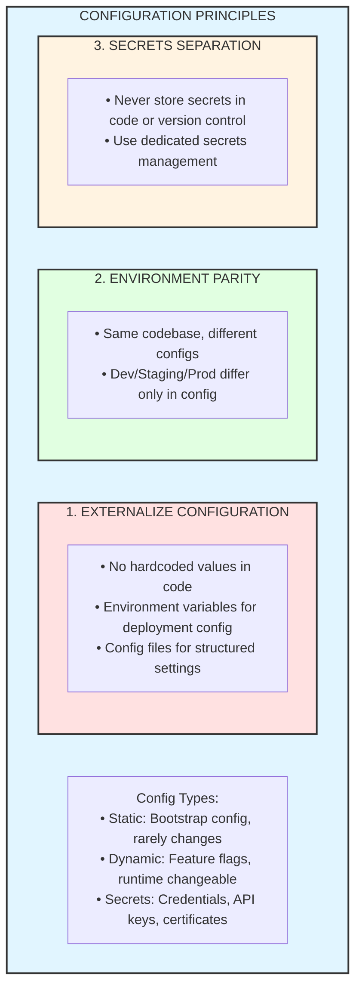

# Configuration Management

## Overview
Configuration management in microservices involves externalizing application settings, managing environment-specific configurations, handling secrets securely, and enabling runtime configuration changes without redeployment.

---

## The Twelve-Factor App Configuration Principle



---

## Spring Cloud Config Server

### Config Server Setup

```java
@SpringBootApplication
@EnableConfigServer
public class ConfigServerApplication {
    public static void main(String[] args) {
        SpringApplication.run(ConfigServerApplication.class, args);
    }
}
```

```yaml
# Config Server - application.yml
server:
  port: 8888

spring:
  cloud:
    config:
      server:
        git:
          uri: https://github.com/company/config-repo
          default-label: main
          clone-on-start: true
          search-paths: '{application}'
          username: ${GIT_USERNAME}
          password: ${GIT_PASSWORD}
          # Multiple repos
          repos:
            production:
              pattern: '*/production'
              uri: https://github.com/company/config-repo-prod
            development:
              pattern: '*/development,*/dev'
              uri: https://github.com/company/config-repo-dev
              
        # Native file system (for local development)
        native:
          search-locations: file:///config-repo

# Encryption for secrets
encrypt:
  key-store:
    location: classpath:/keystore.jks
    password: ${KEYSTORE_PASSWORD}
    alias: config-server-key
```

### Config Repository Structure

```
config-repo/
├── application.yml                    # Shared by all services
├── application-production.yml         # Shared production config
├── order-service/
│   ├── order-service.yml             # Default profile
│   ├── order-service-dev.yml         # Dev profile
│   ├── order-service-staging.yml     # Staging profile
│   └── order-service-production.yml  # Production profile
├── payment-service/
│   ├── payment-service.yml
│   └── payment-service-production.yml
└── product-service/
    └── product-service.yml
```

```yaml
# order-service.yml (base configuration)
spring:
  datasource:
    driver-class-name: org.postgresql.Driver
    hikari:
      maximum-pool-size: 10
      minimum-idle: 5

order:
  processing:
    max-retries: 3
    retry-delay: 1000
  notification:
    enabled: true

---
# order-service-production.yml
spring:
  datasource:
    url: jdbc:postgresql://prod-db.internal:5432/orders
    username: order_user
    password: '{cipher}AQBxxxEncryptedxxx'
    hikari:
      maximum-pool-size: 50
      minimum-idle: 10

order:
  processing:
    max-retries: 5
    retry-delay: 2000

logging:
  level:
    root: WARN
    com.example: INFO
```

### Config Client Setup

```yaml
# bootstrap.yml (loaded before application.yml)
spring:
  application:
    name: order-service
  profiles:
    active: ${SPRING_PROFILES_ACTIVE:dev}
  cloud:
    config:
      uri: http://config-server:8888
      fail-fast: true
      retry:
        initial-interval: 1000
        max-attempts: 6
        max-interval: 2000
        multiplier: 1.5
      # Label for config version
      label: ${CONFIG_LABEL:main}

# For Spring Boot 2.4+, use spring.config.import
spring:
  config:
    import: "configserver:http://config-server:8888"
```

```java
// Using configuration
@Configuration
@ConfigurationProperties(prefix = "order.processing")
@Validated
public class OrderProcessingConfig {
    
    @Min(1) @Max(10)
    private int maxRetries = 3;
    
    @Min(100) @Max(10000)
    private long retryDelay = 1000;
    
    // Getters and setters
}

@Service
public class OrderService {
    
    private final OrderProcessingConfig config;
    
    public void processOrder(Order order) {
        for (int i = 0; i < config.getMaxRetries(); i++) {
            try {
                // Process order
                break;
            } catch (Exception e) {
                Thread.sleep(config.getRetryDelay());
            }
        }
    }
}
```

### Dynamic Configuration Refresh

```java
// Enable refresh scope
@RefreshScope
@RestController
public class OrderController {
    
    @Value("${order.notification.enabled}")
    private boolean notificationEnabled;
    
    @GetMapping("/orders")
    public List<Order> getOrders() {
        // Uses latest config value
        if (notificationEnabled) {
            // Send notifications
        }
        return orderRepository.findAll();
    }
}

// Refresh endpoint
// POST /actuator/refresh triggers @RefreshScope beans reload
```

```yaml
# Enable refresh endpoint
management:
  endpoints:
    web:
      exposure:
        include: refresh,health,bus-refresh
```

### Spring Cloud Bus (Cluster-wide Refresh)

```yaml
# Config client with bus support
spring:
  cloud:
    bus:
      enabled: true
  rabbitmq:
    host: rabbitmq
    port: 5672

# Or with Kafka
spring:
  cloud:
    bus:
      enabled: true
  kafka:
    bootstrap-servers: kafka:9092
```

```
┌─────────────────────────────────────────────────────────────────────┐
│                    SPRING CLOUD BUS REFRESH                          │
│                                                                      │
│   1. Config change in Git                                           │
│                                                                      │
│   2. Webhook triggers: POST /actuator/bus-refresh                   │
│                                                                      │
│   ┌─────────────┐     ┌─────────────┐     ┌─────────────┐          │
│   │ Config      │────►│ RabbitMQ/   │────►│ Service A   │          │
│   │ Server      │     │ Kafka       │     │ Instance 1  │          │
│   └─────────────┘     └─────────────┘     └─────────────┘          │
│                             │                                       │
│                             │             ┌─────────────┐          │
│                             └────────────►│ Service A   │          │
│                             │             │ Instance 2  │          │
│                             │             └─────────────┘          │
│                             │                                       │
│                             │             ┌─────────────┐          │
│                             └────────────►│ Service B   │          │
│                                           │ Instance 1  │          │
│                                           └─────────────┘          │
│                                                                      │
│   All services receive refresh event and reload config              │
│                                                                      │
└─────────────────────────────────────────────────────────────────────┘
```

---

## HashiCorp Consul KV

### Consul Configuration

```yaml
# application.yml
spring:
  cloud:
    consul:
      host: consul-server
      port: 8500
      config:
        enabled: true
        prefix: config
        default-context: application
        profile-separator: '::'
        format: YAML
        data-key: data
        watch:
          enabled: true
          delay: 1000
```

```java
// Using Consul KV for config
@Configuration
public class ConsulConfig {
    
    @Bean
    public ConsulClient consulClient() {
        return new ConsulClient("consul-server", 8500);
    }
    
    @Bean
    public KeyValueClient keyValueClient(ConsulClient consulClient) {
        return consulClient.keyValueClient();
    }
}

// Dynamic config from Consul
@Service
public class FeatureFlagService {
    
    private final KeyValueClient kvClient;
    
    public boolean isFeatureEnabled(String featureName) {
        Optional<Value> value = kvClient.getValue("features/" + featureName);
        return value
            .map(Value::getValueAsString)
            .map(Optional::get)
            .map(Boolean::parseBoolean)
            .orElse(false);
    }
    
    public void setFeature(String featureName, boolean enabled) {
        kvClient.putValue("features/" + featureName, String.valueOf(enabled));
    }
}
```

### Consul KV Structure

```
config/
├── application/
│   └── data           # Shared config (YAML)
├── order-service/
│   ├── data           # Service default config
│   └── production/
│       └── data       # Production profile
└── features/
    ├── new-checkout   # Feature flags
    └── dark-mode
```

---

## HashiCorp Vault for Secrets

### Vault Integration

```yaml
# application.yml
spring:
  cloud:
    vault:
      uri: https://vault.internal:8200
      authentication: KUBERNETES
      kubernetes:
        role: order-service
        kubernetes-path: kubernetes
        service-account-token-file: /var/run/secrets/kubernetes.io/serviceaccount/token
      kv:
        enabled: true
        backend: secret
        profile-separator: '/'
        default-context: application
        application-name: order-service
      config:
        lifecycle:
          enabled: true
          min-renewal: 10s
          expiry-threshold: 1m
```

```java
// Vault configuration
@Configuration
public class VaultConfig {
    
    @Bean
    public VaultTemplate vaultTemplate(VaultEndpoint endpoint,
                                       ClientAuthentication auth) {
        return new VaultTemplate(endpoint, auth);
    }
}

// Reading secrets
@Service
public class SecretService {
    
    private final VaultTemplate vaultTemplate;
    
    public DatabaseCredentials getDatabaseCredentials() {
        VaultResponseSupport<DatabaseCredentials> response = 
            vaultTemplate.read("secret/data/order-service/database", 
                              DatabaseCredentials.class);
        return response.getData();
    }
    
    // Dynamic secrets with leases
    public DatabaseCredentials getDynamicDbCredentials() {
        VaultResponse response = vaultTemplate.read("database/creds/order-service-role");
        return new DatabaseCredentials(
            response.getData().get("username").toString(),
            response.getData().get("password").toString()
        );
    }
}
```

### Vault Secret Structure

```
# Static secrets
secret/
└── data/
    ├── application/           # Shared secrets
    │   └── encryption-key
    └── order-service/
        ├── database          # DB credentials
        │   ├── username
        │   └── password
        └── api-keys
            ├── payment-gateway
            └── notification-service

# Dynamic secrets (database)
database/
└── roles/
    └── order-service-role    # Generates temp credentials
```

```java
// Auto-rotation with property source
@Configuration
@PropertySource(
    factory = VaultPropertySourceLocatorSupport.class,
    value = "vault:secret/order-service"
)
public class VaultPropertyConfig {
}

@Component
public class DatabaseConfig {
    
    @Value("${database.username}")
    private String username;
    
    @Value("${database.password}")
    private String password;
    
    // Automatically refreshed when Vault lease renews
}
```

---

## Kubernetes ConfigMaps and Secrets

### ConfigMap Usage

```yaml
# configmap.yaml
apiVersion: v1
kind: ConfigMap
metadata:
  name: order-service-config
  namespace: production
data:
  # Key-value pairs
  SPRING_PROFILES_ACTIVE: production
  LOG_LEVEL: INFO
  
  # File-based config
  application.yml: |
    spring:
      datasource:
        hikari:
          maximum-pool-size: 50
    order:
      processing:
        max-retries: 5
```

```yaml
# deployment.yaml - Using ConfigMap
spec:
  containers:
    - name: order-service
      # As environment variables
      envFrom:
        - configMapRef:
            name: order-service-config
      
      # Or specific keys
      env:
        - name: SPRING_PROFILES_ACTIVE
          valueFrom:
            configMapKeyRef:
              name: order-service-config
              key: SPRING_PROFILES_ACTIVE
      
      # As mounted files
      volumeMounts:
        - name: config-volume
          mountPath: /config
          readOnly: true
  
  volumes:
    - name: config-volume
      configMap:
        name: order-service-config
        items:
          - key: application.yml
            path: application.yml
```

### Kubernetes Secrets

```yaml
# secret.yaml
apiVersion: v1
kind: Secret
metadata:
  name: order-db-secret
  namespace: production
type: Opaque
stringData:  # Plain text (will be base64 encoded)
  username: order_user
  password: super-secret-password

---
# Or with base64
apiVersion: v1
kind: Secret
metadata:
  name: order-db-secret
data:
  username: b3JkZXJfdXNlcg==
  password: c3VwZXItc2VjcmV0LXBhc3N3b3Jk
```

```yaml
# Using secrets in deployment
spec:
  containers:
    - name: order-service
      env:
        - name: SPRING_DATASOURCE_USERNAME
          valueFrom:
            secretKeyRef:
              name: order-db-secret
              key: username
        - name: SPRING_DATASOURCE_PASSWORD
          valueFrom:
            secretKeyRef:
              name: order-db-secret
              key: password
```

### External Secrets Operator

```yaml
# ExternalSecret syncs from Vault/AWS to K8s Secret
apiVersion: external-secrets.io/v1beta1
kind: ExternalSecret
metadata:
  name: order-db-external-secret
  namespace: production
spec:
  refreshInterval: 1h
  secretStoreRef:
    name: vault-backend
    kind: ClusterSecretStore
  target:
    name: order-db-secret
    creationPolicy: Owner
  data:
    - secretKey: username
      remoteRef:
        key: secret/data/order-service/database
        property: username
    - secretKey: password
      remoteRef:
        key: secret/data/order-service/database
        property: password
```

---

## Feature Flags

### Feature Flag Implementation

```java
@Configuration
@ConfigurationProperties(prefix = "features")
public class FeatureFlags {
    
    private boolean newCheckoutEnabled = false;
    private boolean darkModeEnabled = false;
    private Map<String, Boolean> experiments = new HashMap<>();
    
    // Getters and setters
}

@Service
@RefreshScope  // Allows runtime updates
public class FeatureService {
    
    private final FeatureFlags featureFlags;
    
    public boolean isEnabled(String feature) {
        return switch (feature) {
            case "new-checkout" -> featureFlags.isNewCheckoutEnabled();
            case "dark-mode" -> featureFlags.isDarkModeEnabled();
            default -> featureFlags.getExperiments().getOrDefault(feature, false);
        };
    }
}

// Usage in controller
@RestController
public class CheckoutController {
    
    private final FeatureService featureService;
    private final CheckoutService legacyCheckout;
    private final NewCheckoutService newCheckout;
    
    @PostMapping("/checkout")
    public CheckoutResponse checkout(@RequestBody CheckoutRequest request) {
        if (featureService.isEnabled("new-checkout")) {
            return newCheckout.process(request);
        }
        return legacyCheckout.process(request);
    }
}
```

### Gradual Rollout

```java
@Service
public class GradualRolloutService {
    
    private final FeatureFlags flags;
    
    public boolean shouldEnableFeature(String feature, String userId) {
        FeatureRollout rollout = flags.getRollouts().get(feature);
        
        if (rollout == null || !rollout.isEnabled()) {
            return false;
        }
        
        // Check percentage rollout
        if (rollout.getPercentage() > 0) {
            int hash = Math.abs(userId.hashCode() % 100);
            return hash < rollout.getPercentage();
        }
        
        // Check user whitelist
        if (rollout.getWhitelistedUsers().contains(userId)) {
            return true;
        }
        
        // Check user group
        UserGroup group = userService.getUserGroup(userId);
        return rollout.getEnabledGroups().contains(group);
    }
}

@ConfigurationProperties(prefix = "features.rollouts")
public class FeatureRollout {
    private boolean enabled;
    private int percentage;  // 0-100
    private List<String> whitelistedUsers = new ArrayList<>();
    private List<UserGroup> enabledGroups = new ArrayList<>();
}
```

---

## Environment-Specific Configuration

### Profile-Based Configuration

```yaml
# application.yml - Common config
spring:
  application:
    name: order-service

server:
  port: 8080

---
# application-dev.yml
spring:
  config:
    activate:
      on-profile: dev
  datasource:
    url: jdbc:h2:mem:testdb
    driver-class-name: org.h2.Driver
  h2:
    console:
      enabled: true

logging:
  level:
    root: DEBUG
    org.hibernate.SQL: DEBUG

---
# application-staging.yml
spring:
  config:
    activate:
      on-profile: staging
  datasource:
    url: jdbc:postgresql://staging-db:5432/orders

logging:
  level:
    root: INFO

---
# application-production.yml
spring:
  config:
    activate:
      on-profile: production
  datasource:
    url: jdbc:postgresql://prod-db-cluster:5432/orders
    hikari:
      maximum-pool-size: 50

logging:
  level:
    root: WARN
```

### Configuration Hierarchy

```
┌─────────────────────────────────────────────────────────────────────┐
│                    CONFIGURATION PRIORITY (Highest to Lowest)        │
│                                                                      │
│   1. Command line arguments                                         │
│      java -jar app.jar --server.port=9000                          │
│                                                                      │
│   2. SPRING_APPLICATION_JSON environment variable                   │
│      {"server.port": 9000}                                         │
│                                                                      │
│   3. System properties                                              │
│      -Dserver.port=9000                                            │
│                                                                      │
│   4. Environment variables                                          │
│      SERVER_PORT=9000                                              │
│                                                                      │
│   5. Config Server (profile-specific)                               │
│      order-service-production.yml                                   │
│                                                                      │
│   6. Config Server (default)                                        │
│      order-service.yml                                             │
│                                                                      │
│   7. Application properties (profile-specific)                      │
│      application-production.yml                                     │
│                                                                      │
│   8. Application properties (default)                               │
│      application.yml                                               │
│                                                                      │
│   9. @PropertySource annotations                                    │
│                                                                      │
│   10. Default properties                                            │
│       SpringApplication.setDefaultProperties()                      │
│                                                                      │
└─────────────────────────────────────────────────────────────────────┘
```

---

## Configuration Validation

```java
@Configuration
@ConfigurationProperties(prefix = "order.processing")
@Validated
public class OrderProcessingConfig {
    
    @NotNull
    @Min(1)
    @Max(10)
    private Integer maxRetries;
    
    @NotNull
    @Min(100)
    @Max(60000)
    private Long retryDelayMs;
    
    @NotBlank
    @Pattern(regexp = "^(SYNC|ASYNC)$")
    private String processingMode;
    
    @Valid
    private NotificationConfig notification = new NotificationConfig();
    
    public static class NotificationConfig {
        @Email
        private String adminEmail;
        
        @URL
        private String webhookUrl;
    }
    
    // Validation at startup
    @PostConstruct
    public void validate() {
        if (processingMode.equals("ASYNC") && notification.getWebhookUrl() == null) {
            throw new IllegalStateException(
                "Webhook URL required for async processing mode");
        }
    }
}
```

### Fail-Fast Configuration

```java
@SpringBootApplication
public class OrderServiceApplication {
    
    public static void main(String[] args) {
        SpringApplication app = new SpringApplication(OrderServiceApplication.class);
        
        // Fail fast if config is invalid
        app.setDefaultProperties(Map.of(
            "spring.cloud.config.fail-fast", "true",
            "spring.config.import-check.enabled", "true"
        ));
        
        app.run(args);
    }
    
    @Bean
    public ConfigurationPropertiesBindingPostProcessor bindingPostProcessor() {
        ConfigurationPropertiesBindingPostProcessor processor = 
            new ConfigurationPropertiesBindingPostProcessor();
        // Validate on binding
        return processor;
    }
}
```

---

## Best Practices

### 1. Secrets Management

```java
// DON'T: Hardcode secrets
private static final String API_KEY = "sk_live_abc123";

// DO: Use environment variables or secrets manager
@Value("${payment.api-key}")
private String apiKey;
```

### 2. Configuration Defaults

```java
// Always provide sensible defaults
@Configuration
@ConfigurationProperties(prefix = "order")
public class OrderConfig {
    
    private int pageSize = 20;  // Default value
    private Duration timeout = Duration.ofSeconds(30);
    
    @DefaultValue("true")  // Bean validation default
    private boolean cacheEnabled;
}
```

### 3. Immutable Configuration

```java
// Use records for immutable config (Java 17+)
@ConfigurationProperties(prefix = "database")
public record DatabaseConfig(
    @NotBlank String url,
    @NotBlank String username,
    @NotBlank String password,
    @Min(1) @Max(100) int poolSize
) {}
```

---

## Interview Questions

### Conceptual Questions
1. **What are the benefits of externalizing configuration?**
2. **Explain the difference between ConfigMaps and Secrets in Kubernetes.**
3. **How does Spring Cloud Config Server work?**
4. **What is the purpose of @RefreshScope?**
5. **How do you handle secrets in a microservices environment?**

### Design Questions
1. **Design a configuration management strategy for 50+ microservices.**
2. **How would you implement feature flags with gradual rollout?**
3. **Design a system for configuration versioning and rollback.**
4. **How do you ensure configuration consistency across environments?**
5. **Design a secrets rotation strategy with zero downtime.**

### Practical Questions
1. **How do you validate configuration at application startup?**
2. **How do you refresh configuration without restarting services?**
3. **What's your strategy for managing environment-specific configurations?**
4. **How do you troubleshoot configuration issues in production?**
5. **How do you audit configuration changes?**

---

## Key Takeaways

1. **Externalize all configuration** - never hardcode values in application code
2. **Use Spring Cloud Config** for centralized configuration management
3. **Separate secrets from config** - use Vault or Kubernetes Secrets
4. **Enable dynamic refresh** with @RefreshScope and Spring Cloud Bus
5. **Validate configuration at startup** - fail fast on invalid config
6. **Use profiles for environment-specific settings** - same code, different configs
7. **Implement feature flags** for safe deployments and A/B testing
8. **Version your configuration** - treat config as code
9. **Encrypt sensitive values** - use Vault or encrypted properties
10. **Monitor configuration changes** - audit trail for compliance

---

*Previous: [Microservices Deployment](09-microservices-deployment.md) | Next: [Microservices Testing](11-microservices-testing.md)*
