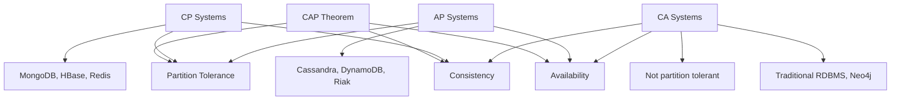
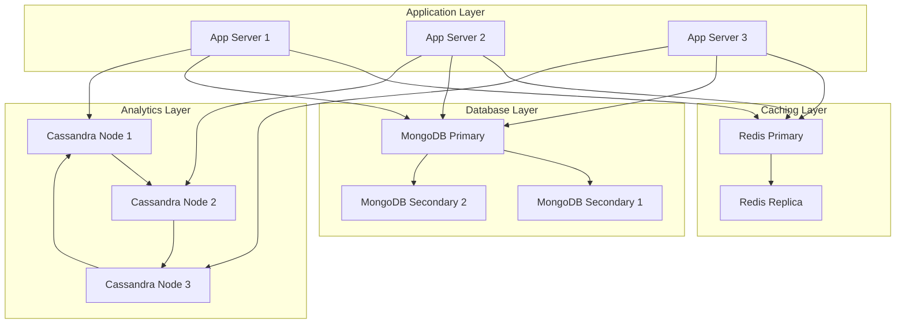

# NoSQL Fundamentals

## What You'll Learn

- Understanding NoSQL database types and their characteristics
- CAP theorem and its implications on database design
- When to choose NoSQL over relational databases
- Trade-offs between consistency, availability, and partition tolerance
- Data modeling strategies for NoSQL databases

## Why This Matters

Modern applications demand horizontal scalability, high availability, and flexible schemas that traditional relational databases struggle to provide. NoSQL databases power critical systems at companies like Netflix, Amazon, Facebook, and Twitter, handling billions of operations per second across distributed clusters. Understanding NoSQL is essential for building systems that scale globally while maintaining performance under massive load.

## NoSQL Categories

NoSQL databases fall into four primary categories, each optimized for specific access patterns and data structures.

### Document Stores

Document stores organize data as JSON-like documents with flexible schemas. Each document can have different fields, enabling schema evolution without migrations.

**Examples**: MongoDB, CouchDB, Couchbase

**Use Cases**: Content management, user profiles, product catalogs, event logging

```javascript
// MongoDB document example
{
  "_id": "507f1f77bcf86cd799439011",
  "user_id": 12345,
  "name": "John Doe",
  "email": "john@example.com",
  "addresses": [
    {
      "type": "home",
      "street": "123 Main St",
      "city": "San Francisco",
      "state": "CA",
      "zip": "94102"
    }
  ],
  "preferences": {
    "newsletter": true,
    "notifications": {
      "email": true,
      "sms": false
    }
  },
  "created_at": ISODate("2023-01-15T10:30:00Z"),
  "last_login": ISODate("2024-01-10T14:22:00Z")
}
```

### Key-Value Stores

Key-value stores provide the simplest data model: a dictionary or hash table where each key maps to a single value. They offer extremely fast lookups and are often used for caching and session management.

**Examples**: Redis, DynamoDB, Riak, Memcached

**Use Cases**: Session storage, caching, real-time analytics, leaderboards

```python
# Redis key-value operations
import redis

r = redis.Redis(host='localhost', port=6379, db=0)

# Simple key-value
r.set('user:1000:name', 'John Doe')
r.set('user:1000:email', 'john@example.com')

# With expiration (cache)
r.setex('session:abc123', 3600, '{"user_id": 1000, "role": "admin"}')

# Increment counters
r.incr('page:home:views')

# Hash operations
r.hset('user:1000', mapping={
    'name': 'John Doe',
    'email': 'john@example.com',
    'age': 30
})

# List operations (for queues)
r.lpush('task:queue', 'process_payment')
r.lpush('task:queue', 'send_email')
task = r.rpop('task:queue')  # FIFO queue
```

### Column-Family Stores

Column-family stores organize data in columns rather than rows, optimizing for queries that access many rows but few columns. They're designed for massive scale and high write throughput.

**Examples**: Cassandra, HBase, ScyllaDB

**Use Cases**: Time-series data, IoT sensor data, analytics, recommendation engines

```java
// Cassandra Java example
import com.datastax.driver.core.*;

public class CassandraExample {
    public static void main(String[] args) {
        Cluster cluster = Cluster.builder()
            .addContactPoint("127.0.0.1")
            .build();
        
        Session session = cluster.connect("keyspace_name");
        
        // Insert time-series data
        PreparedStatement prepared = session.prepare(
            "INSERT INTO sensor_data (sensor_id, timestamp, temperature, humidity) " +
            "VALUES (?, ?, ?, ?)"
        );
        
        BoundStatement bound = prepared.bind(
            UUID.fromString("550e8400-e29b-41d4-a716-446655440000"),
            new Date(),
            23.5,
            65.0
        );
        
        session.execute(bound);
        
        // Query time-series data
        ResultSet results = session.execute(
            "SELECT * FROM sensor_data " +
            "WHERE sensor_id = ? AND timestamp > ? AND timestamp < ?",
            sensorId,
            startTime,
            endTime
        );
        
        for (Row row : results) {
            System.out.printf("Temp: %.2f, Humidity: %.2f at %s%n",
                row.getDouble("temperature"),
                row.getDouble("humidity"),
                row.getTimestamp("timestamp")
            );
        }
        
        session.close();
        cluster.close();
    }
}
```

### Graph Databases

Graph databases store entities (nodes) and relationships (edges) as first-class citizens, optimizing for traversing connections between data points.

**Examples**: Neo4j, Amazon Neptune, ArangoDB

**Use Cases**: Social networks, fraud detection, recommendation engines, knowledge graphs

```cypher
// Neo4j Cypher query examples

// Create nodes and relationships
CREATE (john:Person {name: 'John Doe', age: 30})
CREATE (jane:Person {name: 'Jane Smith', age: 28})
CREATE (acme:Company {name: 'Acme Corp'})
CREATE (john)-[:WORKS_AT {since: 2020}]->(acme)
CREATE (jane)-[:WORKS_AT {since: 2019}]->(acme)
CREATE (john)-[:KNOWS {since: 2018}]->(jane)

// Find friends of friends
MATCH (person:Person {name: 'John Doe'})-[:KNOWS]-(friend)-[:KNOWS]-(fof)
WHERE NOT (person)-[:KNOWS]-(fof) AND person <> fof
RETURN DISTINCT fof.name, fof.age

// Find shortest path
MATCH path = shortestPath(
  (start:Person {name: 'John Doe'})-[*]-(end:Person {name: 'Alice Johnson'})
)
RETURN path

// Recommendation: People who work at same company
MATCH (me:Person {name: 'John Doe'})-[:WORKS_AT]->(company)<-[:WORKS_AT]-(colleague)
WHERE NOT (me)-[:KNOWS]-(colleague)
RETURN colleague.name, company.name
```

## CAP Theorem

The CAP theorem states that a distributed system can provide at most two of the following three guarantees simultaneously:

- **Consistency (C)**: All nodes see the same data at the same time
- **Availability (A)**: Every request receives a response (success or failure)
- **Partition Tolerance (P)**: The system continues operating despite network partitions

Since network partitions are inevitable in distributed systems, you must choose between consistency and availability.

### CAP Trade-offs

| Database | Type | CAP Choice | Trade-off |
|----------|------|------------|-----------|
| MongoDB | Document | CP | Sacrifices availability during partitions; provides strong consistency |
| Cassandra | Column-Family | AP | Sacrifices immediate consistency; provides eventual consistency |
| Redis | Key-Value | CP (with replication) | Can be configured for different consistency levels |
| DynamoDB | Key-Value | AP (configurable) | Offers eventual or strong consistency per request |
| Neo4j | Graph | CA | Not designed for multi-datacenter partitioning |
| HBase | Column-Family | CP | Uses Zookeeper for coordination; sacrifices availability |



## PACELC Theorem

PACELC extends CAP by considering behavior during normal operation (no partitions):

**If Partition (P)**: Choose between Availability (A) and Consistency (C)  
**Else (E)**: Choose between Latency (L) and Consistency (C)

| Database | P scenario | E scenario | Classification |
|----------|------------|------------|----------------|
| Cassandra | A (available) | L (low latency) | PA/EL |
| MongoDB | C (consistent) | C (consistent) | PC/EC |
| DynamoDB | A (available) | L (low latency) | PA/EL |
| HBase | C (consistent) | C (consistent) | PC/EC |

## Consistency Models

NoSQL databases offer various consistency models, each with different trade-offs between performance and correctness.

### Strong Consistency

All reads return the most recent write. Clients never see stale data.

```python
# DynamoDB with strong consistency
import boto3

dynamodb = boto3.resource('dynamodb')
table = dynamodb.Table('users')

# Write
table.put_item(
    Item={
        'user_id': '12345',
        'name': 'John Doe',
        'balance': 1000
    }
)

# Strong consistent read - always returns latest value
response = table.get_item(
    Key={'user_id': '12345'},
    ConsistentRead=True  # Strong consistency
)
# Guaranteed to see balance=1000
```

### Eventual Consistency

Replicas eventually converge to the same value. Reads may return stale data temporarily but will eventually be consistent if no new updates occur.

```python
# DynamoDB with eventual consistency (default)
response = table.get_item(
    Key={'user_id': '12345'},
    ConsistentRead=False  # Eventual consistency (faster, cheaper)
)
# Might see old value temporarily
```

### Causal Consistency

If operation B is causally dependent on operation A, all processes observe A before B.

```javascript
// MongoDB causal consistency session
const session = client.startSession({
  causalConsistency: true
});

const orders = client.db('shop').collection('orders');
const inventory = client.db('shop').collection('inventory');

// Operation A: Create order
await orders.insertOne(
  { orderId: 1, item: 'laptop', quantity: 1 },
  { session }
);

// Operation B: Update inventory (causally dependent on A)
await inventory.updateOne(
  { item: 'laptop' },
  { $inc: { quantity: -1 } },
  { session }
);

// Any read in this session will see both operations or neither
await session.commitTransaction();
```

### Read Your Writes Consistency

A process always reads its own writes. Prevents seeing stale data from your own updates.

```java
// MongoDB read concern for read-your-own-writes
MongoCollection<Document> collection = database.getCollection("users");

// Write with majority write concern
collection.updateOne(
    eq("user_id", 12345),
    set("status", "active"),
    new UpdateOptions().writeConcern(WriteConcern.MAJORITY)
);

// Read with majority read concern
Document user = collection.find(eq("user_id", 12345))
    .readConcern(ReadConcern.MAJORITY)
    .first();
// Guaranteed to see status="active"
```

## When to Choose NoSQL

### ✅ Choose NoSQL When:

**Massive Scale**: Need to handle billions of operations per second across thousands of nodes. Example: Netflix serves 200+ million subscribers with Cassandra clusters storing petabytes of viewing history.

**Flexible Schema**: Data model evolves rapidly or varies significantly between entities. Example: E-commerce product catalogs where each product category has different attributes.

**High Availability**: Cannot afford downtime; system must remain operational during network partitions. Example: Shopping cart services that must always accept writes even if some nodes are unreachable.

**Horizontal Scaling**: Need to scale by adding commodity hardware rather than upgrading expensive servers. Example: IoT platforms ingesting sensor data from millions of devices.

**Specific Access Patterns**: Your queries follow predictable patterns that NoSQL excels at. Example: Time-series queries for metrics (Cassandra), document retrieval by ID (MongoDB), graph traversals (Neo4j).

### ❌ Avoid NoSQL When:

**Complex Transactions**: Need ACID guarantees across multiple operations. Example: Banking transfers requiring atomic updates to multiple accounts.

**Complex Joins**: Queries require frequent joins across many tables. Example: Reporting dashboards with complex aggregations across normalized data.

**Ad-hoc Queries**: Need to run unpredictable analytical queries. Example: Business intelligence tools that allow users to query any field combination.

**Small Scale**: Data fits on a single server with room to grow. NoSQL's complexity isn't justified for small datasets.

**Strong Consistency Required**: Application cannot tolerate eventual consistency. Example: Inventory systems where overselling is unacceptable.

## Data Modeling Strategies

### Denormalization

NoSQL databases favor denormalization over normalization. Embed related data together to optimize read performance.

```javascript
// ❌ Anti-pattern: Normalized approach (like SQL)
// Users collection
{
  "_id": 12345,
  "name": "John Doe"
}

// Orders collection (requires join)
{
  "_id": 98765,
  "user_id": 12345,
  "items": [...]
}

// ✅ Best practice: Denormalized approach
{
  "_id": 98765,
  "user": {
    "id": 12345,
    "name": "John Doe",
    "email": "john@example.com"
  },
  "items": [
    {
      "product_id": "ABC123",
      "name": "Laptop",
      "price": 999.99,
      "quantity": 1
    }
  ],
  "total": 999.99,
  "status": "completed"
}
```

### Query-Driven Design

Design your schema based on your query patterns, not your domain model.

```python
# Cassandra table design for time-series queries
"""
Query: Get all sensor readings for a sensor in a time range
"""

# ✅ Optimized table design
CREATE TABLE sensor_data (
    sensor_id UUID,
    date text,           -- Partition key for distribution
    timestamp timestamp, -- Clustering key for sorting
    temperature double,
    humidity double,
    PRIMARY KEY ((sensor_id, date), timestamp)
) WITH CLUSTERING ORDER BY (timestamp DESC);

# Query efficiently uses partition key
SELECT * FROM sensor_data
WHERE sensor_id = ? AND date = '2024-01-10'
  AND timestamp > '2024-01-10 00:00:00'
  AND timestamp < '2024-01-10 23:59:59';
```

### Aggregation Pre-computation

Pre-compute aggregations instead of calculating at query time.

```javascript
// ✅ Pre-computed aggregation
{
  "_id": "analytics:2024-01-10",
  "page_views": 1500000,
  "unique_visitors": 450000,
  "avg_session_duration": 180,
  "top_pages": [
    { "url": "/products", "views": 250000 },
    { "url": "/checkout", "views": 180000 }
  ]
}

// Update incrementally
db.analytics.updateOne(
  { "_id": "analytics:2024-01-10" },
  { 
    $inc: { "page_views": 1, "unique_visitors": 1 },
    $push: { "events": eventData }
  }
);
```

## Comparison: NoSQL vs SQL

| Aspect | SQL (RDBMS) | NoSQL |
|--------|-------------|-------|
| **Schema** | Fixed, requires migrations | Flexible, schema-less |
| **Scalability** | Vertical (scale-up) | Horizontal (scale-out) |
| **Transactions** | ACID across tables | Limited (document/row level) |
| **Joins** | Efficient, normalized data | Expensive, denormalized data |
| **Consistency** | Strong consistency | Eventual or tunable consistency |
| **Query Language** | Standardized SQL | Database-specific APIs |
| **Use Cases** | Complex transactions, analytics | High throughput, flexible schema |
| **Data Integrity** | Foreign keys, constraints | Application-level validation |

## Best Practices

**Design for Failure**: Assume nodes will fail. Configure replication factor ≥ 3 for production systems. Test failover scenarios regularly.

**Monitor Cluster Health**: Track metrics like read/write latency, compaction rates, disk usage, and network throughput. Set up alerts for degraded nodes.

**Understand Consistency Levels**: Choose appropriate consistency level for each operation. Use eventual consistency for high-throughput writes, strong consistency for critical reads.

**Optimize Data Model**: Model data based on access patterns. Denormalize to minimize queries. Pre-aggregate data for analytics.

**Use Time-To-Live (TTL)**: Automatically expire old data to manage storage. Essential for time-series data and caching.

```javascript
// MongoDB TTL index (auto-delete after 30 days)
db.sessions.createIndex(
  { "createdAt": 1 },
  { expireAfterSeconds: 2592000 }
);

// Cassandra TTL on insert
INSERT INTO sessions (session_id, data, created_at)
VALUES (?, ?, ?)
USING TTL 2592000;
```

**Batch Operations**: Group related operations to reduce network overhead and improve throughput.

**Connection Pooling**: Reuse database connections. Creating connections is expensive.

```java
// Connection pooling configuration
MongoClientSettings settings = MongoClientSettings.builder()
    .applyConnectionString(new ConnectionString("mongodb://localhost:27017"))
    .applyToConnectionPoolSettings(builder -> 
        builder.maxSize(100)
               .minSize(10)
               .maxWaitTime(2, TimeUnit.SECONDS)
    )
    .build();
```

## Anti-Patterns

❌ **Using NoSQL Like SQL**: Avoid normalizing data and performing application-level joins. Design denormalized documents.

❌ **Ignoring Network Latency**: Don't make multiple sequential queries when you could fetch all data in one query.

❌ **Hot Partitions**: Avoid partition keys that concentrate data on few nodes. Use composite keys for better distribution.

❌ **Large Documents**: Don't store unbounded arrays or massive documents. MongoDB has 16MB document limit. Use references for large collections.

❌ **Ignoring Indexes**: Create indexes for query patterns. But avoid over-indexing; each index slows writes.

❌ **Reading Before Writing**: NoSQL databases excel at idempotent writes. Don't read-then-write if you can write directly.

```javascript
// ❌ Anti-pattern: Read-then-write
const user = await db.users.findOne({ _id: userId });
user.login_count += 1;
await db.users.updateOne({ _id: userId }, { $set: { login_count: user.login_count }});

// ✅ Best practice: Atomic update
await db.users.updateOne(
  { _id: userId },
  { $inc: { login_count: 1 }}
);
```

## Real-World Architecture Example



**Architecture**: E-commerce platform serving 50M users

- **Redis**: Session management, product catalog cache, shopping cart (sub-millisecond latency)
- **MongoDB**: User profiles, product catalog, order history (flexible schema, strong consistency for orders)
- **Cassandra**: Analytics events, user activity logs, recommendation data (massive write throughput, time-series queries)

This architecture handles 100K+ requests/second with 99.99% availability across three AWS regions.

---

**Related Notes**:
- [Cassandra Deep Dive](02-cassandra.md)
- [MongoDB Deep Dive](03-mongodb.md)
- [Distributed Systems](../system-design/)
