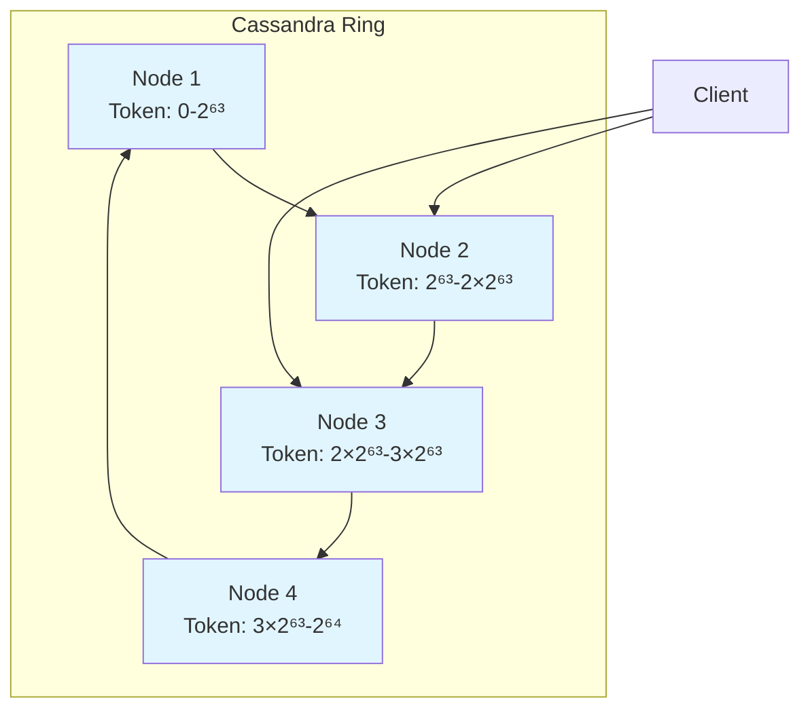
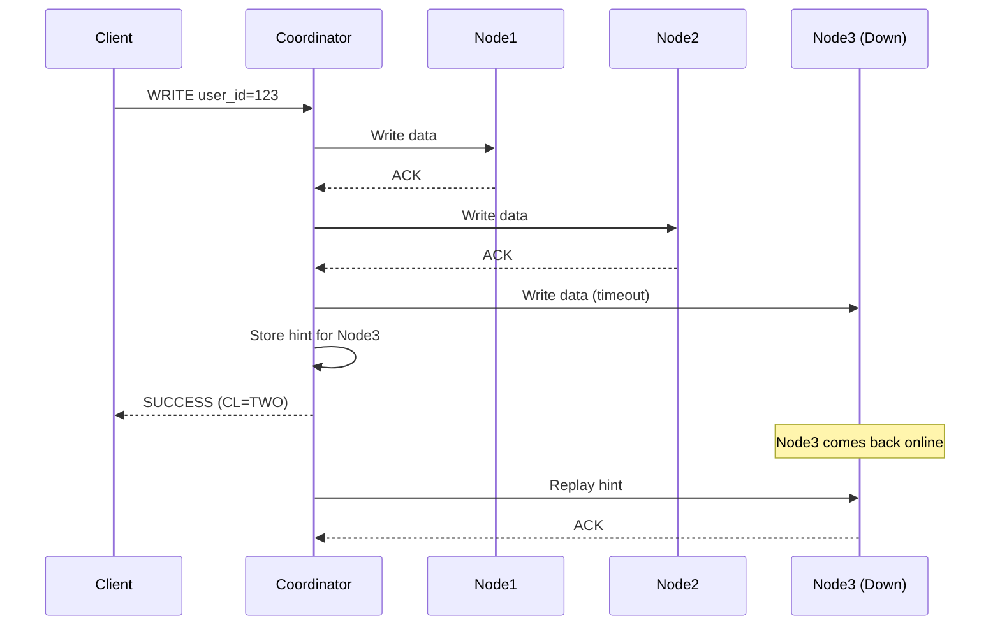
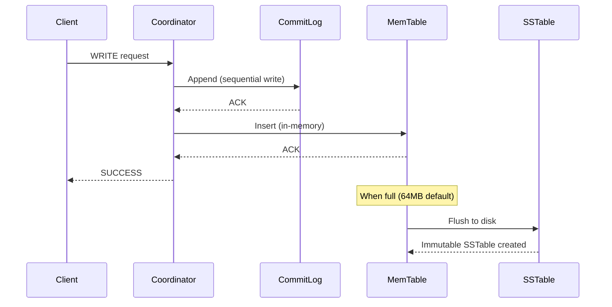
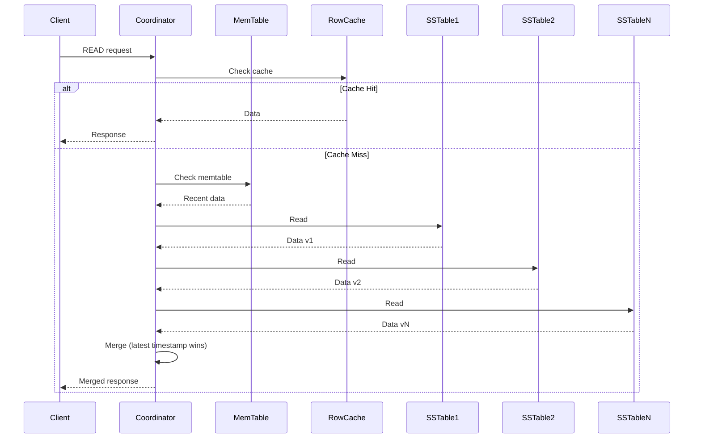
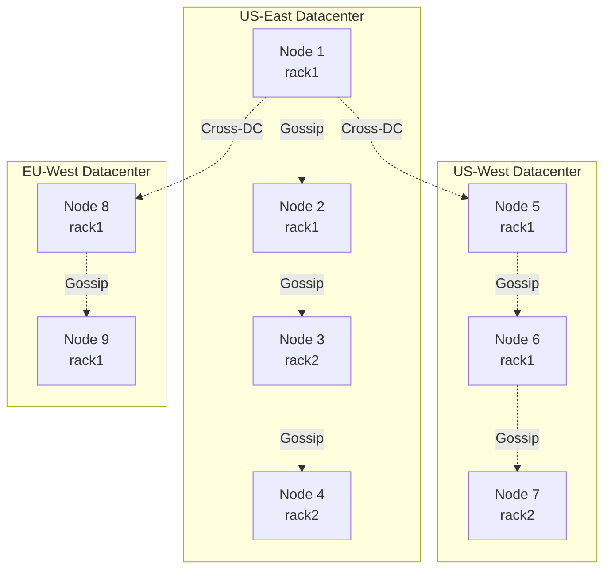

# Apache Cassandra: Highly Available and Scalable NoSQL

## What You'll Learn

- Cassandra's architecture and distributed design principles
- Partitioning, replication, and consistency tuning
- Data modeling for optimal query performance
- Production deployment patterns and operational best practices
- Performance optimization and troubleshooting strategies

## Why This Matters

Apache Cassandra powers mission-critical systems at Netflix (viewing history, recommendations), Apple (200K+ nodes), Instagram (photos metadata), and Uber (geospatial data). It's designed for linear scalability and fault tolerance with no single point of failure. Cassandra handles write-heavy workloads with millisecond latency while maintaining 99.99%+ availability across geographic regions. Understanding Cassandra is crucial for building systems that must remain operational during datacenter failures while serving billions of requests per day.

## Architecture Overview

### Peer-to-Peer Ring Architecture

Cassandra uses a masterless ring architecture where all nodes are equal. There's no primary-replica hierarchy, eliminating single points of failure.



**Key Characteristics**:
- **No Master**: Any node can coordinate any request (coordinator node)
- **Consistent Hashing**: Data distributed using consistent hashing with virtual nodes
- **Gossip Protocol**: Nodes exchange state information every second
- **Tunable Consistency**: Choose consistency level per operation

### Virtual Nodes (vnodes)

Instead of assigning one token range per physical node, Cassandra uses virtual nodes (256 by default per physical node) for better data distribution and faster repairs.

```python
# Each physical node owns multiple token ranges
Physical Node 1: [tokens: 100, 500, 900, 1300, ...]  # 256 vnodes
Physical Node 2: [tokens: 200, 600, 1000, 1400, ...] # 256 vnodes
Physical Node 3: [tokens: 300, 700, 1100, 1500, ...] # 256 vnodes
```

**Benefits**:
- More uniform data distribution across nodes
- Faster streaming when adding/removing nodes (data comes from multiple sources)
- Reduced impact of hot spots
- Easier cluster expansion

## Data Model

### Keyspace, Tables, and Rows

```sql
-- Keyspace: Top-level namespace (like database)
CREATE KEYSPACE ecommerce
WITH replication = {
    'class': 'NetworkTopologyStrategy',
    'datacenter1': 3,    -- 3 replicas in DC1
    'datacenter2': 2     -- 2 replicas in DC2
};

-- Table: Column family
CREATE TABLE ecommerce.orders (
    user_id UUID,
    order_date date,
    order_id timeuuid,
    total_amount decimal,
    status text,
    items list<frozen<item>>,
    shipping_address frozen<address>,
    PRIMARY KEY ((user_id, order_date), order_id)
) WITH CLUSTERING ORDER BY (order_id DESC);

-- User-defined types
CREATE TYPE ecommerce.item (
    product_id UUID,
    name text,
    price decimal,
    quantity int
);

CREATE TYPE ecommerce.address (
    street text,
    city text,
    state text,
    zip text,
    country text
);
```

### Primary Key Components

The primary key determines data distribution and query capabilities.

**Syntax**: `PRIMARY KEY ((partition_key), clustering_column1, clustering_column2)`

```sql
-- Example 1: Simple partition key
CREATE TABLE users_by_email (
    email text,           -- Partition key
    user_id UUID,
    name text,
    created_at timestamp,
    PRIMARY KEY (email)   -- All data on same node
);

-- Example 2: Composite partition key (better distribution)
CREATE TABLE users_by_country (
    country text,         -- Part of partition key
    user_id UUID,         -- Part of partition key
    name text,
    email text,
    PRIMARY KEY ((country, user_id))  -- Distributed by hash(country, user_id)
);

-- Example 3: Partition key + clustering columns
CREATE TABLE sensor_data (
    sensor_id UUID,       -- Partition key
    year int,             -- Clustering column 1
    month int,            -- Clustering column 2
    day int,              -- Clustering column 3
    timestamp timestamp,  -- Clustering column 4
    temperature double,
    humidity double,
    PRIMARY KEY ((sensor_id), year, month, day, timestamp)
) WITH CLUSTERING ORDER BY (year DESC, month DESC, day DESC, timestamp DESC);
```

**Partition Key**: Determines which nodes store the data (via consistent hashing)  
**Clustering Columns**: Determine sort order within a partition (stored on disk sorted)

## Replication and Consistency

### Replication Strategies

```sql
-- NetworkTopologyStrategy (production standard)
CREATE KEYSPACE production
WITH replication = {
    'class': 'NetworkTopologyStrategy',
    'us_east': 3,        -- 3 replicas in us-east datacenter
    'us_west': 3,        -- 3 replicas in us-west datacenter
    'eu_west': 2         -- 2 replicas in eu-west datacenter
};

-- SimpleStrategy (development/single DC only)
CREATE KEYSPACE development
WITH replication = {
    'class': 'SimpleStrategy',
    'replication_factor': 3
};
```

**NetworkTopologyStrategy** ensures replicas are placed across different racks within each datacenter for fault tolerance.

### Consistency Levels

Cassandra offers tunable consistency per request, trading latency for consistency guarantees.

```java
import com.datastax.driver.core.*;

public class ConsistencyExample {
    private Session session;
    
    // Strong consistency: Majority of replicas must respond
    public void strongConsistentWrite(UUID userId, String email) {
        PreparedStatement stmt = session.prepare(
            "INSERT INTO users (user_id, email, created_at) VALUES (?, ?, ?)"
        );
        
        BoundStatement bound = stmt.bind(userId, email, new Date())
            .setConsistencyLevel(ConsistencyLevel.QUORUM);  // Majority
        
        session.execute(bound);
    }
    
    public User strongConsistentRead(UUID userId) {
        PreparedStatement stmt = session.prepare(
            "SELECT * FROM users WHERE user_id = ?"
        );
        
        ResultSet rs = session.execute(
            stmt.bind(userId).setConsistencyLevel(ConsistencyLevel.QUORUM)
        );
        
        return mapToUser(rs.one());
    }
    
    // High availability: Accept writes even if replicas down
    public void highAvailabilityWrite(UUID userId, String action) {
        PreparedStatement stmt = session.prepare(
            "INSERT INTO user_activity (user_id, timestamp, action) VALUES (?, ?, ?)"
        );
        
        BoundStatement bound = stmt.bind(userId, new Date(), action)
            .setConsistencyLevel(ConsistencyLevel.ONE);  // Only 1 replica
        
        session.execute(bound);
    }
    
    // Local datacenter only (cross-DC latency)
    public void localDCWrite(UUID orderId, String status) {
        PreparedStatement stmt = session.prepare(
            "UPDATE orders SET status = ? WHERE order_id = ?"
        );
        
        BoundStatement bound = stmt.bind(status, orderId)
            .setConsistencyLevel(ConsistencyLevel.LOCAL_QUORUM);
        
        session.execute(bound);
    }
}
```

### Consistency Level Matrix

| Level | Replicas Required | Use Case | Latency | Availability |
|-------|-------------------|----------|---------|--------------|
| **ANY** | 1 (hint accepted) | Max availability, low durability | Lowest | Highest |
| **ONE** | 1 replica | High availability writes/reads | Very Low | Very High |
| **TWO** | 2 replicas | Better durability than ONE | Low | High |
| **QUORUM** | Majority (RF/2 + 1) | Strong consistency | Medium | Medium |
| **LOCAL_QUORUM** | Majority in local DC | Strong consistency, low latency | Medium-Low | High |
| **EACH_QUORUM** | Majority in each DC | Multi-DC strong consistency | High | Medium |
| **ALL** | All replicas | Strongest consistency | Highest | Lowest |

**Formula for Strong Consistency**: `R + W > RF`
- R = Read consistency level
- W = Write consistency level  
- RF = Replication factor

Example: `QUORUM read + QUORUM write = strong consistency` when RF=3

### Hinted Handoff

When a replica is temporarily unavailable, the coordinator stores hints for later delivery.



Hints are stored for up to 3 hours by default. After that, manual repair is needed.

## Data Modeling for Performance

### Rule 1: Design for Queries, Not Relationships

```sql
-- ❌ Anti-pattern: Normalized design requiring multiple queries
CREATE TABLE users (
    user_id UUID PRIMARY KEY,
    name text,
    email text
);

CREATE TABLE orders (
    order_id UUID PRIMARY KEY,
    user_id UUID,  -- Requires separate lookup
    order_date date,
    total decimal
);

-- Application needs 2 queries:
-- 1. SELECT * FROM users WHERE user_id = ?
-- 2. SELECT * FROM orders WHERE user_id = ?  -- REQUIRES ALLOW FILTERING (slow!)

-- ✅ Best practice: Denormalized design optimized for query
CREATE TABLE orders_by_user (
    user_id UUID,
    order_date date,
    order_id timeuuid,
    user_name text,        -- Denormalized from users
    user_email text,       -- Denormalized from users
    total_amount decimal,
    status text,
    items list<frozen<item>>,
    PRIMARY KEY ((user_id), order_date, order_id)
) WITH CLUSTERING ORDER BY (order_date DESC, order_id DESC);

-- Single efficient query:
SELECT * FROM orders_by_user 
WHERE user_id = ? 
AND order_date >= '2024-01-01'
LIMIT 20;
```

### Rule 2: One Query Per Table

Design each table to answer one specific query pattern efficiently.

```sql
-- Query 1: Get user's recent orders
CREATE TABLE orders_by_user (
    user_id UUID,
    order_date date,
    order_id timeuuid,
    total_amount decimal,
    status text,
    PRIMARY KEY ((user_id), order_date, order_id)
) WITH CLUSTERING ORDER BY (order_date DESC, order_id DESC);

-- Query 2: Get order details by order_id
CREATE TABLE orders_by_id (
    order_id UUID PRIMARY KEY,
    user_id UUID,
    order_date date,
    total_amount decimal,
    status text,
    items list<frozen<item>>,
    shipping_address frozen<address>
);

-- Query 3: Get orders by status (for admin)
CREATE TABLE orders_by_status (
    status text,
    order_date date,
    order_id timeuuid,
    user_id UUID,
    total_amount decimal,
    PRIMARY KEY ((status), order_date, order_id)
) WITH CLUSTERING ORDER BY (order_date DESC, order_id DESC);
```

**Application maintains consistency** by writing to all tables in a batch:

```java
public void createOrder(Order order) {
    BatchStatement batch = new BatchStatement(BatchStatement.Type.LOGGED);
    
    // Insert into orders_by_user
    batch.add(insertOrdersByUser.bind(
        order.getUserId(),
        order.getOrderDate(),
        order.getOrderId(),
        order.getTotalAmount(),
        order.getStatus()
    ));
    
    // Insert into orders_by_id
    batch.add(insertOrdersById.bind(
        order.getOrderId(),
        order.getUserId(),
        order.getOrderDate(),
        order.getTotalAmount(),
        order.getStatus(),
        order.getItems(),
        order.getShippingAddress()
    ));
    
    // Insert into orders_by_status
    batch.add(insertOrdersByStatus.bind(
        order.getStatus(),
        order.getOrderDate(),
        order.getOrderId(),
        order.getUserId(),
        order.getTotalAmount()
    ));
    
    session.execute(batch);
}
```

### Rule 3: Avoid Large Partitions

Keep partitions under 100MB and 100K rows. Use bucketing for unbounded data.

```sql
-- ❌ Anti-pattern: Unbounded partition (all user actions in one partition)
CREATE TABLE user_activity_bad (
    user_id UUID,
    timestamp timestamp,
    action text,
    details text,
    PRIMARY KEY (user_id, timestamp)  -- Partition grows forever!
);

-- ✅ Best practice: Bucketed by date
CREATE TABLE user_activity_good (
    user_id UUID,
    bucket date,          -- Partition key includes date bucket
    timestamp timestamp,
    action text,
    details text,
    PRIMARY KEY ((user_id, bucket), timestamp)
) WITH CLUSTERING ORDER BY (timestamp DESC);

-- Query specific date range
SELECT * FROM user_activity_good
WHERE user_id = ? 
AND bucket IN ('2024-01-10', '2024-01-11', '2024-01-12')
AND timestamp >= '2024-01-10 00:00:00'
AND timestamp < '2024-01-13 00:00:00';
```

### Rule 4: Use Collections Wisely

Collections are stored within a single partition. Don't let them grow unbounded.

```sql
-- ✅ Good: Bounded list (e.g., order items)
CREATE TABLE orders (
    order_id UUID PRIMARY KEY,
    items list<frozen<item>>,  -- Typically < 50 items
    tags set<text>             -- Small set of tags
);

-- ❌ Bad: Unbounded list
CREATE TABLE users_bad (
    user_id UUID PRIMARY KEY,
    all_orders list<UUID>  -- Could grow to millions!
);

-- ✅ Good: Use separate table for unbounded relationships
CREATE TABLE orders_by_user (
    user_id UUID,
    order_date date,
    order_id UUID,
    PRIMARY KEY ((user_id), order_date, order_id)
);
```

## Time-Series Data Pattern

Cassandra excels at time-series data with proper bucketing strategy.

```sql
-- IoT sensor data: 10K sensors, 1 reading/second each
CREATE TABLE sensor_readings (
    sensor_id UUID,
    bucket text,          -- Format: 'YYYY-MM-DD-HH'
    timestamp timestamp,
    temperature double,
    humidity double,
    pressure double,
    battery_level int,
    PRIMARY KEY ((sensor_id, bucket), timestamp)
) WITH CLUSTERING ORDER BY (timestamp DESC)
AND compaction = {
    'class': 'TimeWindowCompactionStrategy',
    'compaction_window_unit': 'HOURS',
    'compaction_window_size': 1
};

-- TTL for auto-deletion after 90 days
INSERT INTO sensor_readings (sensor_id, bucket, timestamp, temperature, humidity, pressure, battery_level)
VALUES (?, ?, ?, ?, ?, ?, ?)
USING TTL 7776000;  -- 90 days in seconds
```

```python
from cassandra.cluster import Cluster
from cassandra.query import BatchStatement, SimpleStatement
from datetime import datetime, timedelta
import uuid

class SensorDataRepository:
    def __init__(self):
        self.cluster = Cluster(['127.0.0.1'])
        self.session = self.cluster.connect('iot')
        
        self.insert_stmt = self.session.prepare(
            """
            INSERT INTO sensor_readings 
            (sensor_id, bucket, timestamp, temperature, humidity, pressure, battery_level)
            VALUES (?, ?, ?, ?, ?, ?, ?)
            USING TTL 7776000
            """
        )
        
    def insert_reading(self, sensor_id, temperature, humidity, pressure, battery_level):
        """Insert single sensor reading with hourly bucket"""
        now = datetime.utcnow()
        bucket = now.strftime('%Y-%m-%d-%H')  # Hour-based bucket
        
        self.session.execute(
            self.insert_stmt,
            (sensor_id, bucket, now, temperature, humidity, pressure, battery_level)
        )
    
    def batch_insert_readings(self, readings):
        """Batch insert multiple readings (same partition)"""
        batch = BatchStatement()
        
        for reading in readings:
            now = datetime.utcnow()
            bucket = now.strftime('%Y-%m-%d-%H')
            
            batch.add(
                self.insert_stmt,
                (reading['sensor_id'], bucket, now, 
                 reading['temperature'], reading['humidity'],
                 reading['pressure'], reading['battery_level'])
            )
        
        self.session.execute(batch)
    
    def query_recent(self, sensor_id, hours=24):
        """Query recent readings efficiently"""
        query = """
            SELECT timestamp, temperature, humidity, pressure, battery_level
            FROM sensor_readings
            WHERE sensor_id = ? AND bucket = ?
            AND timestamp >= ?
            ORDER BY timestamp DESC
        """
        
        # Query multiple buckets
        results = []
        now = datetime.utcnow()
        
        for hour_offset in range(hours):
            query_time = now - timedelta(hours=hour_offset)
            bucket = query_time.strftime('%Y-%m-%d-%H')
            start_time = query_time - timedelta(hours=1)
            
            rows = self.session.execute(
                query,
                (sensor_id, bucket, start_time)
            )
            results.extend(rows)
        
        return results
    
    def query_aggregated(self, sensor_id, start_date, end_date):
        """Query with in-app aggregation"""
        query = """
            SELECT timestamp, temperature, humidity
            FROM sensor_readings
            WHERE sensor_id = ? AND bucket = ?
        """
        
        temp_sum = 0
        humidity_sum = 0
        count = 0
        
        # Generate buckets for date range
        current = start_date
        while current <= end_date:
            for hour in range(24):
                bucket = current.strftime(f'%Y-%m-%d-{hour:02d}')
                
                rows = self.session.execute(query, (sensor_id, bucket))
                
                for row in rows:
                    temp_sum += row.temperature
                    humidity_sum += row.humidity
                    count += 1
            
            current += timedelta(days=1)
        
        return {
            'avg_temperature': temp_sum / count if count > 0 else 0,
            'avg_humidity': humidity_sum / count if count > 0 else 0,
            'reading_count': count
        }
```

## Write Path and Read Path

### Write Path



**Write Performance**: Cassandra writes are extremely fast because:
1. Sequential append to commit log (no seeks)
2. In-memory memtable update
3. No read-before-write (unlike B-trees)
4. Acknowledges before disk sync (tunable)

### Read Path



**Read Performance Optimization**:
- Row cache: Cache frequently accessed rows in memory
- Bloom filters: Avoid reading SSTables that don't contain the key
- Compaction: Merge SSTables to reduce read amplification
- Partition summary: In-memory index of partition keys

## Compaction Strategies

Compaction merges SSTables to reclaim space and improve read performance.

```sql
-- Size-Tiered Compaction (default): Good for write-heavy workloads
CREATE TABLE user_activity (
    user_id UUID,
    timestamp timestamp,
    action text,
    PRIMARY KEY ((user_id), timestamp)
) WITH compaction = {
    'class': 'SizeTieredCompactionStrategy',
    'min_threshold': 4,
    'max_threshold': 32
};

-- Leveled Compaction: Better for read-heavy workloads
CREATE TABLE user_profiles (
    user_id UUID PRIMARY KEY,
    name text,
    email text,
    created_at timestamp
) WITH compaction = {
    'class': 'LeveledCompactionStrategy',
    'sstable_size_in_mb': 160
};

-- Time-Window Compaction: Best for time-series data with TTL
CREATE TABLE sensor_data (
    sensor_id UUID,
    bucket text,
    timestamp timestamp,
    temperature double,
    PRIMARY KEY ((sensor_id, bucket), timestamp)
) WITH compaction = {
    'class': 'TimeWindowCompactionStrategy',
    'compaction_window_unit': 'HOURS',
    'compaction_window_size': 24
};
```

| Strategy | Use Case | Write Amp | Read Amp | Space Amp |
|----------|----------|-----------|----------|-----------|
| **STCS** | Write-heavy, uniform access | Low | High | High |
| **LCS** | Read-heavy, frequent updates | High | Low | Low |
| **TWCS** | Time-series with TTL | Low | Medium | Low |

## Production Deployment Patterns

### Multi-Datacenter Setup

```yaml
# cassandra.yaml configuration
cluster_name: 'production_cluster'

# Seeds: Entry points for gossip (2-3 per datacenter)
seed_provider:
  - class_name: org.apache.cassandra.locator.SimpleSeedProvider
    parameters:
      - seeds: "10.0.1.10,10.0.1.11,10.0.2.10,10.0.2.11"

# Endpoint snitch: Determines datacenter/rack topology
endpoint_snitch: GossipingPropertyFileSnitch

# Network configuration
listen_address: 10.0.1.10
rpc_address: 0.0.0.0
broadcast_rpc_address: 10.0.1.10

# Datacenter and rack info (cassandra-rackdc.properties)
dc=us-east-1
rack=rack1
```



### Hardware Recommendations

**Production Node Specs** (per node):
- **CPU**: 16+ cores (compaction and read/write threads)
- **RAM**: 32-64GB (heap: 8-16GB, off-heap cache: remaining)
- **Disk**: NVMe SSD (10K+ IOPS), RAID not recommended
- **Network**: 10Gbps minimum for cross-datacenter replication
- **Capacity**: 1-3TB per node (allows headroom for compaction)

**Cluster Sizing**:
- Minimum 3 nodes per datacenter (replication factor 3)
- Plan for 30-50% headroom for compaction and repairs
- Add nodes before reaching 70% disk capacity

### JVM Tuning

```bash
# jvm.options (Cassandra 4.x)

# Heap size: 8-16GB (never more than 32GB, avoid GC overhead)
-Xms8G
-Xmx8G

# G1GC collector (recommended for Cassandra 4.x)
-XX:+UseG1GC
-XX:G1RSetUpdatingPauseTimePercent=5
-XX:MaxGCPauseMillis=200
-XX:InitiatingHeapOccupancyPercent=70

# Heap dump on OOM
-XX:+HeapDumpOnOutOfMemoryError
-XX:HeapDumpPath=/var/lib/cassandra/heap_dump.hprof

# GC logging
-Xlog:gc*:file=/var/log/cassandra/gc.log:time,uptime:filecount=10,filesize=10m
```

## Performance Optimization

### Use Prepared Statements

```java
// ❌ Anti-pattern: String concatenation
public void badInsert(UUID userId, String name) {
    session.execute(
        "INSERT INTO users (user_id, name) VALUES (" + 
        userId + ", '" + name + "')"
    );
    // 1. SQL injection risk
    // 2. No query cache
    // 3. Parsing overhead every time
}

// ✅ Best practice: Prepared statements
private PreparedStatement insertUser;

public void initialize() {
    insertUser = session.prepare(
        "INSERT INTO users (user_id, name, email, created_at) VALUES (?, ?, ?, ?)"
    );
}

public void goodInsert(UUID userId, String name, String email) {
    BoundStatement bound = insertUser.bind(userId, name, email, new Date());
    session.execute(bound);
    // Prepared once, executed many times
    // Server-side compiled query plan
}
```

### Batch Operations

```java
// ✅ Use logged batches for atomicity (same partition)
public void updateUserProfile(UUID userId, String name, String email, String phone) {
    BatchStatement batch = new BatchStatement(BatchStatement.Type.LOGGED);
    
    batch.add(updateName.bind(name, userId));
    batch.add(updateEmail.bind(email, userId));
    batch.add(updatePhone.bind(phone, userId));
    
    session.execute(batch);
    // All or nothing within same partition
}

// ✅ Use unlogged batches for bulk loading (different partitions)
public void bulkInsertUsers(List<User> users) {
    BatchStatement batch = new BatchStatement(BatchStatement.Type.UNLOGGED);
    
    for (User user : users) {
        batch.add(insertUser.bind(
            user.getUserId(),
            user.getName(),
            user.getEmail(),
            new Date()
        ));
    }
    
    session.execute(batch);
    // Sends all inserts in one network round-trip
}

// ❌ Anti-pattern: Large batches
public void badBatch(List<User> users) {
    BatchStatement batch = new BatchStatement();
    
    for (User user : users) {  // Don't batch 1000s of statements
        batch.add(insertUser.bind(...));
    }
    session.execute(batch);
    // Coordinator node runs out of memory
}
```

Keep batches under 50KB or 100 statements.

### Async Queries

```java
import com.datastax.driver.core.*;
import java.util.concurrent.CompletableFuture;
import java.util.List;
import java.util.stream.Collectors;

public class AsyncQueries {
    private Session session;
    private PreparedStatement selectUser;
    
    // Parallel async queries
    public CompletableFuture<List<User>> getUsersAsync(List<UUID> userIds) {
        List<CompletableFuture<User>> futures = userIds.stream()
            .map(userId -> {
                ResultSetFuture resultFuture = session.executeAsync(
                    selectUser.bind(userId)
                );
                
                return CompletableFuture.supplyAsync(() -> {
                    ResultSet rs = resultFuture.getUninterruptibly();
                    Row row = rs.one();
                    return row != null ? mapToUser(row) : null;
                });
            })
            .collect(Collectors.toList());
        
        // Wait for all queries to complete
        return CompletableFuture.allOf(
            futures.toArray(new CompletableFuture[0])
        ).thenApply(v ->
            futures.stream()
                .map(CompletableFuture::join)
                .filter(user -> user != null)
                .collect(Collectors.toList())
        );
    }
    
    private User mapToUser(Row row) {
        return new User(
            row.getUUID("user_id"),
            row.getString("name"),
            row.getString("email")
        );
    }
}
```

## Monitoring and Operations

### Key Metrics to Monitor

```bash
# Nodetool commands for monitoring

# Cluster status
nodetool status
# Output: Shows UN (Up/Normal), DN (Down/Normal) status for each node

# Node info
nodetool info
# Shows heap usage, token count, uptime, etc.

# Table statistics
nodetool tablestats keyspace_name.table_name
# Shows read/write latency, SSTable count, partition size

# Thread pool stats (identify bottlenecks)
nodetool tpstats
# Shows pending/active tasks in each thread pool

# GC stats
nodetool gcstats

# Compaction stats
nodetool compactionstats
```

**Critical Metrics**:
- **Read/Write Latency**: p99 < 10ms (local), p99 < 50ms (cross-DC)
- **Pending Compactions**: Should be near 0; growth indicates issues
- **Heap Usage**: < 75% to avoid GC pressure
- **Disk Usage**: < 70% per node
- **Dropped Mutations**: Should be 0; indicates overload
- **Tombstone Warnings**: High tombstones degrade read performance

### Repair and Maintenance

```bash
# Full repair (resource-intensive, run during low traffic)
nodetool repair --full

# Incremental repair (recommended, runs continuously)
nodetool repair

# Repair specific keyspace
nodetool repair -pr keyspace_name

# Subrange repair (parallelize across nodes)
nodetool repair -pr -st 0 -et 1000000 keyspace_name
```

**Repair Schedule**: Run repair every 7 days to prevent data inconsistencies (before gc_grace_seconds expires, default 10 days).

## Best Practices

**Model Data for Queries**: Design tables around access patterns. One query = one table. Accept denormalization.

**Use Appropriate Consistency**: LOCAL_QUORUM for most operations balances consistency and performance. Use ONE for high availability, ALL only when necessary.

**Limit Partition Size**: Keep partitions under 100MB. Use bucketing (year, month, day) for unbounded data.

**Batch Within Partitions**: Batches are atomic within a partition. Avoid cross-partition batches except for bulk loading.

**Use TTL for Temporal Data**: Auto-expire old data to manage storage. Essential for time-series, sessions, caches.

**Monitor Tombstones**: High tombstone ratios (>100K per read) cause performance issues. Adjust gc_grace_seconds and compaction.

**Prepare Statements**: Always use prepared statements for better performance and security.

**Connection Pooling**: Maintain persistent connections. Creating connections is expensive.

**Set Read/Write Timeouts**: Configure appropriate timeouts to prevent cascading failures.

```java
// Production-grade configuration
Cluster cluster = Cluster.builder()
    .addContactPoints("node1", "node2", "node3")
    .withLoadBalancingPolicy(
        DCAwareRoundRobinPolicy.builder()
            .withLocalDc("us-east-1")
            .build()
    )
    .withRetryPolicy(DefaultRetryPolicy.INSTANCE)
    .withReconnectionPolicy(
        new ExponentialReconnectionPolicy(1000, 10000)
    )
    .withQueryOptions(
        new QueryOptions()
            .setConsistencyLevel(ConsistencyLevel.LOCAL_QUORUM)
            .setDefaultIdempotence(true)
    )
    .withSocketOptions(
        new SocketOptions()
            .setConnectTimeoutMillis(5000)
            .setReadTimeoutMillis(12000)
    )
    .build();
```

## Anti-Patterns

❌ **Using ALLOW FILTERING**: Indicates query doesn't use partition key. Scans entire table.

```sql
-- ❌ Anti-pattern
SELECT * FROM users WHERE email = 'john@example.com' ALLOW FILTERING;

-- ✅ Solution: Create table for this query
CREATE TABLE users_by_email (
    email text PRIMARY KEY,
    user_id UUID,
    name text
);
```

❌ **Counter Anti-pattern**: Using reads before writes for counters.

```java
// ❌ Don't do this
int currentCount = getCurrentCount(userId);
updateCount(userId, currentCount + 1);

// ✅ Use counter columns
UPDATE user_stats SET login_count = login_count + 1 WHERE user_id = ?;
```

❌ **Large Collections**: Unbounded lists/sets/maps grow partitions indefinitely.

❌ **Secondary Indexes**: Poor performance in distributed systems. Create materialized views or denormalized tables instead.

❌ **SELECT * Queries**: Fetches entire partition. Use LIMIT and select specific columns.

❌ **Ignoring Consistency Math**: R + W > RF for strong consistency. QUORUM + QUORUM with RF=3 works, but ONE + ONE doesn't guarantee consistency.

## Real-World Use Case: Netflix

Netflix uses Cassandra for multiple use cases:

**Viewing History**: 100+ million subscribers, billions of viewing events per day
- **Keyspace**: `viewing_history` with RF=3 across 3 AWS regions
- **Table**: Partitioned by user_id, clustered by timestamp (bucketed by month)
- **Consistency**: LOCAL_QUORUM for writes, ONE for reads (eventual consistency acceptable)
- **TTL**: 5 years retention
- **Performance**: Sub-10ms p99 latency, 1M+ writes/second

**Recommendations**: Real-time computation of user preferences
- Pre-computed aggregates stored in Cassandra
- Denormalized tables for different recommendation types
- Expires stale recommendations with TTL

**Architecture**:
- 100+ Cassandra clusters (isolated by use case)
- 200,000+ nodes across AWS regions
- Petabytes of data
- Custom tooling for automated operations (Priam)

---

**Related Notes**:
- [NoSQL Fundamentals](01-nosql-fundamentals.md)
- [MongoDB Deep Dive](03-mongodb.md)
- [Distributed Systems](../system-design/)
