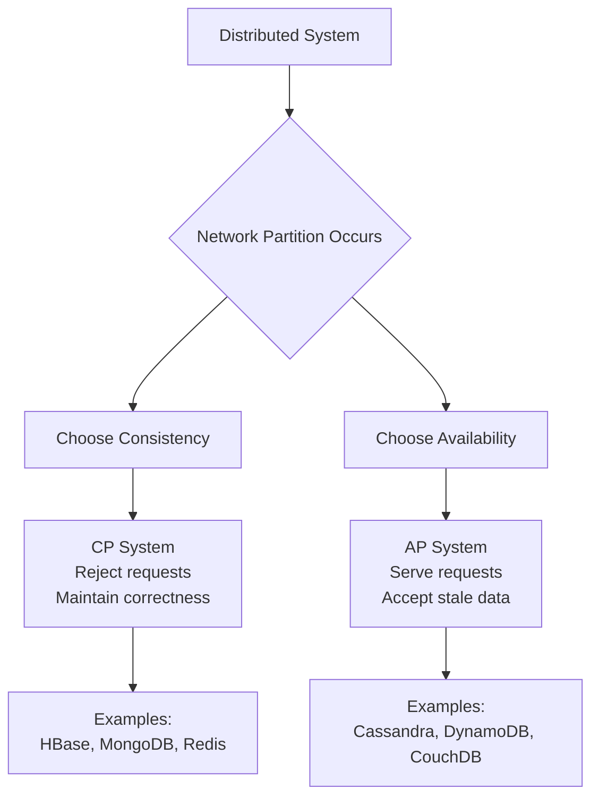

# CAP Theorem and Distributed Systems Trade-offs

## What You'll Learn

CAP theorem states that a distributed system can provide at most two of three guarantees: Consistency, Availability, and Partition Tolerance. This note covers CAP theorem fundamentals, practical implications, real-world trade-offs, and how systems like DynamoDB, Cassandra, and Spanner navigate these constraints.

## Why This Matters

Distributed systems power every large-scale application. Understanding CAP theorem is essential for making informed architecture decisions. When network partitions occur (and they will), your system must choose between consistency and availability. Amazon's DynamoDB chose availability. Google Spanner chose consistency. Your choice depends on your requirements. A banking system cannot sacrifice consistency. A social media feed can tolerate eventual consistency.

## CAP Theorem Explained

### Consistency (C)

Consistency means all nodes see the same data at the same time. After a write completes, all subsequent reads return that value from any node. This is also called strong consistency or linearizability.

In a consistent system, if Client A writes value X to a distributed database, then Client B immediately reads from any node, Client B will see value X. There's no window where different nodes return different values.

Consider a distributed key-value store with three nodes. Client A writes `balance = 1000` to Node 1. With strong consistency, this write doesn't complete until Node 2 and Node 3 also have `balance = 1000`. If Client B reads from Node 3 immediately after, it sees 1000, not the old value.

### Availability (A)

Availability means every request receives a response, even if some nodes are down. The system remains operational despite failures. Users can read and write data as long as at least one node is reachable.

An available system responds to every request with either success or failure, but never hangs or times out indefinitely. If three nodes exist and two fail, the remaining node continues serving requests. It doesn't wait for failed nodes to recover.

Availability doesn't guarantee the response is correct or current. It only guarantees a response. With eventual consistency, an available system might return stale data, but it returns data.

### Partition Tolerance (P)

Partition tolerance means the system continues operating despite network partitions. A partition occurs when network failures split nodes into isolated groups that cannot communicate. 

Network partitions are inevitable in distributed systems. Fiber cables get cut. Switches fail. Data centers lose connectivity. A partition-tolerant system continues functioning despite these failures. However, it must sacrifice either consistency or availability during the partition.

Consider three nodes split into two groups: {Node1, Node2} and {Node3}. Nodes 1 and 2 can communicate. Node 3 is isolated. A partition-tolerant system handles this gracefully. It might continue serving requests with reduced consistency, or it might reject requests to maintain consistency.

### The CAP Trade-off

CAP theorem states you can have at most two of three properties. In practice, partition tolerance is mandatory because network partitions are unavoidable. This reduces CAP to a choice between Consistency and Availability during partitions:

**CP Systems (Consistency + Partition Tolerance)**: Sacrifice availability during partitions. Reject requests or return errors rather than returning potentially incorrect data. Choose this when correctness matters more than availability.

**AP Systems (Availability + Partition Tolerance)**: Sacrifice consistency during partitions. Continue serving requests even if data might be stale. Choose this when availability matters more than immediate consistency.

**CA Systems (Consistency + Availability)**: Only possible without partition tolerance. This means a single-node system or systems that halt during network partitions. Since partitions are inevitable, pure CA systems don't exist in practice.



## CP Systems: Consistency Over Availability

CP systems prioritize correctness. During network partitions, they refuse requests to nodes that cannot guarantee consistency. This means some requests fail, but those that succeed return correct data.

### MongoDB

MongoDB is a CP system when configured with majority write concern. Writes require acknowledgment from a majority of replica set nodes. During partitions, the minority partition refuses writes. Clients connected to minority nodes receive errors.

```javascript
// MongoDB: Strong consistency with majority write concern
const { MongoClient } = require('mongodb');

async function transferMoney(fromAccount, toAccount, amount) {
    const client = new MongoClient('mongodb://replica-set');
    
    try {
        await client.connect();
        const db = client.db('banking');
        const accounts = db.collection('accounts');
        
        // Start transaction with majority write concern
        const session = client.startSession();
        
        await session.withTransaction(async () => {
            // Debit from account
            const debitResult = await accounts.updateOne(
                { accountId: fromAccount, balance: { $gte: amount } },
                { $inc: { balance: -amount } },
                { 
                    session,
                    writeConcern: { w: 'majority', j: true }
                }
            );
            
            if (debitResult.matchedCount === 0) {
                throw new Error('Insufficient funds');
            }
            
            // Credit to account
            await accounts.updateOne(
                { accountId: toAccount },
                { $inc: { balance: amount } },
                { 
                    session,
                    writeConcern: { w: 'majority', j: true }
                }
            );
        }, {
            readConcern: { level: 'snapshot' },
            writeConcern: { w: 'majority' },
            readPreference: 'primary'
        });
        
        console.log('Transfer completed successfully');
        
    } catch (error) {
        // If majority nodes unavailable, transaction fails
        // System sacrifices availability for consistency
        console.error('Transfer failed:', error.message);
        throw error;
        
    } finally {
        await client.close();
    }
}
```

If a network partition isolates the primary node, MongoDB triggers an election. During election, no writes are accepted. The cluster is unavailable for writes until a new primary is elected. This ensures consistency but sacrifices availability.

### Apache HBase

HBase is a CP system built on HDFS. Each region has a single region server. If that region server fails or is partitioned, the region becomes unavailable until reassignment completes. HBase sacrifices availability to maintain consistency.

```java
// HBase: Strong consistency, single region server per region
public class HBaseStrongConsistency {
    
    public void writeWithConsistency(String rowKey, String value) 
            throws IOException {
        Configuration config = HBaseConfiguration.create();
        
        try (Connection conn = ConnectionFactory.createConnection(config);
             Table table = conn.getTable(TableName.valueOf("users"))) {
            
            // HBase writes go to single region server
            // No replication until write is confirmed
            Put put = new Put(Bytes.toBytes(rowKey));
            put.addColumn(
                Bytes.toBytes("cf"),
                Bytes.toBytes("data"),
                Bytes.toBytes(value)
            );
            
            // Durability: write to WAL before returning
            put.setDurability(Durability.SYNC_WAL);
            
            table.put(put);
            
            // Write is guaranteed durable and consistent
            // If region server fails during write, client gets exception
        }
    }
    
    public String readConsistent(String rowKey) throws IOException {
        Configuration config = HBaseConfiguration.create();
        
        try (Connection conn = ConnectionFactory.createConnection(config);
             Table table = conn.getTable(TableName.valueOf("users"))) {
            
            Get get = new Get(Bytes.toBytes(rowKey));
            
            // Reads go to same region server as writes
            // Always consistent, never stale
            Result result = table.get(get);
            
            byte[] value = result.getValue(
                Bytes.toBytes("cf"),
                Bytes.toBytes("data")
            );
            
            return value != null ? Bytes.toString(value) : null;
        }
    }
}
```

### Google Cloud Spanner

Spanner is a globally distributed CP system that provides strong consistency across data centers using TrueTime API and synchronized clocks. It sacrifices availability during partitions but provides stronger guarantees than most systems.

## AP Systems: Availability Over Consistency

AP systems prioritize availability. During partitions, they continue serving requests from all nodes, accepting that different nodes may have different data temporarily. They use eventual consistency where all nodes converge to the same state after the partition heals.

### Apache Cassandra

Cassandra is an AP system with tunable consistency. By default, it favors availability. During partitions, all nodes accept writes and reads, even if they cannot communicate. Data synchronizes after the partition heals.

```python
# Cassandra: Eventual consistency with tunable guarantees
from cassandra.cluster import Cluster
from cassandra.query import SimpleStatement, ConsistencyLevel

class CassandraAvailability:
    def __init__(self):
        self.cluster = Cluster(['node1', 'node2', 'node3'])
        self.session = self.cluster.connect('ecommerce')
    
    def write_with_availability(self, user_id, product_id, quantity):
        """Write succeeds even during partitions"""
        query = """
            INSERT INTO shopping_cart (user_id, product_id, quantity, updated_at)
            VALUES (?, ?, ?, toTimestamp(now()))
        """
        
        statement = SimpleStatement(query)
        
        # ONE consistency: write succeeds if any node acknowledges
        # Provides maximum availability
        statement.consistency_level = ConsistencyLevel.ONE
        
        try:
            self.session.execute(
                statement,
                (user_id, product_id, quantity)
            )
            print(f"Write succeeded (eventual consistency)")
            return True
            
        except Exception as e:
            # Only fails if ALL nodes are unreachable
            print(f"Write failed: {e}")
            return False
    
    def read_with_availability(self, user_id):
        """Read succeeds even if data might be stale"""
        query = """
            SELECT product_id, quantity, updated_at
            FROM shopping_cart
            WHERE user_id = ?
        """
        
        statement = SimpleStatement(query)
        
        # ONE consistency: read from any available node
        # May return stale data during partitions
        statement.consistency_level = ConsistencyLevel.ONE
        
        try:
            rows = self.session.execute(statement, (user_id,))
            return list(rows)
            
        except Exception as e:
            print(f"Read failed: {e}")
            return []
    
    def write_with_quorum(self, user_id, product_id, quantity):
        """Stronger consistency: majority of nodes must acknowledge"""
        query = """
            INSERT INTO shopping_cart (user_id, product_id, quantity, updated_at)
            VALUES (?, ?, ?, toTimestamp(now()))
        """
        
        statement = SimpleStatement(query)
        
        # QUORUM: requires (N/2 + 1) nodes to acknowledge
        # Balances consistency and availability
        statement.consistency_level = ConsistencyLevel.QUORUM
        
        try:
            self.session.execute(
                statement,
                (user_id, product_id, quantity)
            )
            return True
            
        except Exception as e:
            # Fails during major partitions
            print(f"Quorum write failed: {e}")
            return False
```

During network partitions, Cassandra with ONE consistency continues serving all requests. Different nodes may have different data temporarily. After partition heals, Cassandra uses read repair and anti-entropy mechanisms to converge data.

### Amazon DynamoDB

DynamoDB is an AP system that provides eventual consistency by default, with optional strong consistency for reads. Writes always succeed if the partition is reachable, even during network issues.

```java
// DynamoDB: Eventual consistency with optional strong reads
public class DynamoDBAvailability {
    
    private final DynamoDbClient dynamoDb;
    
    public DynamoDBAvailability() {
        this.dynamoDb = DynamoDbClient.builder()
            .region(Region.US_EAST_1)
            .build();
    }
    
    public void writeEventuallyConsistent(String userId, String preferences) {
        // DynamoDB write - always succeeds if node reachable
        PutItemRequest request = PutItemRequest.builder()
            .tableName("UserPreferences")
            .item(Map.of(
                "userId", AttributeValue.builder().s(userId).build(),
                "preferences", AttributeValue.builder().s(preferences).build(),
                "timestamp", AttributeValue.builder()
                    .n(String.valueOf(System.currentTimeMillis())).build()
            ))
            .build();
        
        try {
            dynamoDb.putItem(request);
            System.out.println("Write succeeded - eventual consistency");
        } catch (Exception e) {
            System.err.println("Write failed: " + e.getMessage());
        }
    }
    
    public String readEventuallyConsistent(String userId) {
        // Eventually consistent read - fast but may be stale
        GetItemRequest request = GetItemRequest.builder()
            .tableName("UserPreferences")
            .key(Map.of(
                "userId", AttributeValue.builder().s(userId).build()
            ))
            .consistentRead(false)  // Eventually consistent (default)
            .build();
        
        GetItemResponse response = dynamoDb.getItem(request);
        
        if (response.hasItem()) {
            return response.item().get("preferences").s();
        }
        return null;
    }
    
    public String readStronglyConsistent(String userId) {
        // Strongly consistent read - slower but guaranteed current
        // May fail during partitions
        GetItemRequest request = GetItemRequest.builder()
            .tableName("UserPreferences")
            .key(Map.of(
                "userId", AttributeValue.builder().s(userId).build()
            ))
            .consistentRead(true)  // Strong consistency
            .build();
        
        try {
            GetItemResponse response = dynamoDb.getItem(request);
            
            if (response.hasItem()) {
                return response.item().get("preferences").s();
            }
            return null;
            
        } catch (Exception e) {
            System.err.println("Strong read failed: " + e.getMessage());
            // Fallback to eventual consistency
            return readEventuallyConsistent(userId);
        }
    }
}
```

## Eventual Consistency Patterns

Eventual consistency means all replicas converge to the same value eventually, given enough time without new updates. During convergence, different nodes may return different values. Applications must handle this.

### Last Write Wins (LWW)

Last write wins uses timestamps to resolve conflicts. The write with the latest timestamp wins. This is simple but can lose concurrent writes.

```python
# Last Write Wins conflict resolution
class LastWriteWins:
    def __init__(self):
        self.data = {}  # key -> (value, timestamp)
    
    def write(self, key, value, timestamp):
        """Write with timestamp"""
        if key not in self.data:
            self.data[key] = (value, timestamp)
            return True
        
        current_value, current_timestamp = self.data[key]
        
        # Accept write if timestamp is newer
        if timestamp > current_timestamp:
            self.data[key] = (value, timestamp)
            return True
        
        # Reject older writes
        return False
    
    def read(self, key):
        """Read returns value with latest timestamp"""
        if key in self.data:
            value, timestamp = self.data[key]
            return value
        return None

# Problem: concurrent writes with same timestamp
# Node 1 writes: balance = 100 at t=1000
# Node 2 writes: balance = 200 at t=1000
# Result is non-deterministic - either 100 or 200 wins
```

### Vector Clocks

Vector clocks track causality between writes. Each node maintains a counter. Updates increment the counter. This detects concurrent writes that require application-level conflict resolution.

```java
// Vector clock implementation
public class VectorClock {
    private Map<String, Long> clock;
    
    public VectorClock() {
        this.clock = new HashMap<>();
    }
    
    public VectorClock(Map<String, Long> clock) {
        this.clock = new HashMap<>(clock);
    }
    
    public void increment(String nodeId) {
        clock.put(nodeId, clock.getOrDefault(nodeId, 0L) + 1);
    }
    
    public ClockComparison compare(VectorClock other) {
        boolean thisGreater = false;
        boolean otherGreater = false;
        
        // Check all nodes in both clocks
        Set<String> allNodes = new HashSet<>();
        allNodes.addAll(this.clock.keySet());
        allNodes.addAll(other.clock.keySet());
        
        for (String node : allNodes) {
            long thisValue = this.clock.getOrDefault(node, 0L);
            long otherValue = other.clock.getOrDefault(node, 0L);
            
            if (thisValue > otherValue) {
                thisGreater = true;
            } else if (otherValue > thisValue) {
                otherGreater = true;
            }
        }
        
        if (thisGreater && !otherGreater) {
            return ClockComparison.AFTER;
        } else if (otherGreater && !thisGreater) {
            return ClockComparison.BEFORE;
        } else if (!thisGreater && !otherGreater) {
            return ClockComparison.EQUAL;
        } else {
            return ClockComparison.CONCURRENT;
        }
    }
    
    public enum ClockComparison {
        BEFORE,      // This happened before other
        AFTER,       // This happened after other
        EQUAL,       // Same state
        CONCURRENT   // Concurrent writes - conflict!
    }
}

// Usage: Detect conflicts
VectorClock vc1 = new VectorClock();
vc1.increment("node1");  // {node1: 1}

VectorClock vc2 = new VectorClock();
vc2.increment("node2");  // {node2: 1}

// These are concurrent - application must resolve
assert vc1.compare(vc2) == ClockComparison.CONCURRENT;
```

### CRDTs (Conflict-Free Replicated Data Types)

CRDTs are data structures that automatically resolve conflicts mathematically. They guarantee eventual consistency without application-level conflict resolution.

```python
# CRDT: G-Counter (Grow-only Counter)
class GCounter:
    """Distributed counter that only increments"""
    def __init__(self, node_id):
        self.node_id = node_id
        self.counts = {}  # node_id -> count
    
    def increment(self, amount=1):
        """Increment local counter"""
        current = self.counts.get(self.node_id, 0)
        self.counts[self.node_id] = current + amount
    
    def value(self):
        """Get total count across all nodes"""
        return sum(self.counts.values())
    
    def merge(self, other):
        """Merge with another replica"""
        for node_id, count in other.counts.items():
            current = self.counts.get(node_id, 0)
            # Take maximum - idempotent and associative
            self.counts[node_id] = max(current, count)

# Usage across partitioned nodes
node1_counter = GCounter("node1")
node2_counter = GCounter("node2")

# Node 1 increments
node1_counter.increment(5)
print(f"Node 1 sees: {node1_counter.value()}")  # 5

# Node 2 increments (partition exists)
node2_counter.increment(3)
print(f"Node 2 sees: {node2_counter.value()}")  # 3

# Partition heals - merge counters
node1_counter.merge(node2_counter)
node2_counter.merge(node1_counter)

print(f"After merge: {node1_counter.value()}")  # 8
print(f"After merge: {node2_counter.value()}")  # 8
```

## Real-World Trade-offs

### Banking Systems: CP

Banking systems must maintain consistency. Account balances must be accurate. Transfers must be atomic. During network partitions, banking systems reject requests rather than risk incorrect balances.

Banks use CP databases like Oracle RAC, PostgreSQL with synchronous replication, or MongoDB with majority write concerns. They sacrifice availability during partitions to ensure correctness.

### Social Media Feeds: AP

Social media feeds tolerate eventual consistency. If a user's feed shows posts slightly out of order or misses a recent post temporarily, it's acceptable. Availability matters more than perfect consistency.

Facebook, Twitter, and Instagram use AP systems like Cassandra for feeds. During partitions, users can still read and post. Feeds eventually converge to consistent state.

### E-commerce Product Catalog: AP

Product catalogs can tolerate stale data. If a product description is slightly outdated for a few seconds, it's acceptable. Availability matters more because users expect instant page loads.

However, inventory and checkout use CP systems. Overselling products is unacceptable. Shopping cart can use AP systems, but order placement requires consistency.

## Comparison: Distributed Databases

| Database | CAP | Consistency Model | Use Case |
|----------|-----|-------------------|----------|
| MongoDB | CP | Tunable (default strong) | Documents, transactions |
| Cassandra | AP | Tunable (default eventual) | Time-series, high availability |
| DynamoDB | AP | Eventual (optional strong reads) | Key-value, serverless |
| HBase | CP | Strong | Large tables, Hadoop integration |
| Riak | AP | Eventual | High availability, multi-datacenter |
| Spanner | CP | Strong (global) | Global consistency, transactions |
| CockroachDB | CP | Serializable | Distributed SQL, global |

## Best Practices

✅ **Choose Based on Requirements**: Understand your consistency needs. Financial systems need CP. Social features can use AP.

✅ **Use Tunable Consistency**: Cassandra and DynamoDB offer tunable consistency. Use strong consistency for critical operations, eventual for others.

✅ **Design for Partition Tolerance**: Partitions are inevitable. Design your system to handle them gracefully.

✅ **Implement Idempotency**: With eventual consistency, operations may execute multiple times. Make operations idempotent.

✅ **Monitor Consistency Lag**: Track replication lag in AP systems. Alert when lag exceeds thresholds.

✅ **Test Partition Scenarios**: Use chaos engineering to test partition behavior. Simulate network failures in staging.

✅ **Provide User Feedback**: When using AP systems, inform users about eventual consistency. Show "Saving..." indicators.

## Anti-Patterns

❌ **Assuming CA is Possible**: CA systems don't exist in distributed environments. Accept that partitions happen.

❌ **Using AP for Financial Transactions**: Money transfers require consistency. Don't use eventual consistency for account balances.

❌ **Ignoring Partition Behavior**: Test how your system behaves during partitions. Don't assume network reliability.

❌ **Mixing Consistency Models**: Don't mix strong and eventual consistency without careful design. This creates complex failure modes.

❌ **No Conflict Resolution**: With eventual consistency, conflicts occur. Plan how to resolve them.

❌ **Over-Engineering Consistency**: Don't use CP systems for data that doesn't need strong consistency. It reduces availability unnecessarily.
