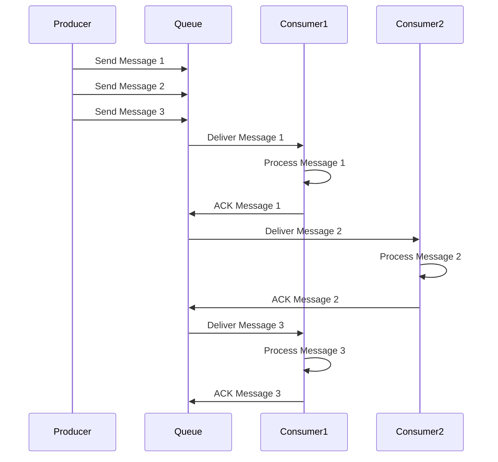

# Message Queues and Asynchronous Processing

## What You'll Learn

Message queues enable asynchronous communication between services, decoupling producers from consumers and providing buffering, reliability, and scalability. This note covers message queue patterns, popular systems (RabbitMQ, Kafka, SQS), delivery guarantees, and production implementations.

## Why This Matters

Synchronous request-response patterns create tight coupling and poor scalability. If Service A calls Service B synchronously, A must wait for B's response. If B is slow or down, A fails. Message queues solve this by decoupling services. LinkedIn processes billions of messages daily through Kafka. Amazon's order processing uses SQS for asynchronous workflows. Understanding message queues is critical for building scalable, resilient systems.

## Message Queue Fundamentals

A message queue is a form of asynchronous service-to-service communication. Producers send messages to the queue without waiting for processing. Consumers pull messages from the queue and process them asynchronously. The queue buffers messages, providing temporal decoupling between producers and consumers.

### Core Components

**Producer**: Sends messages to the queue. Producers don't know who will consume messages or when. After sending, producers continue other work without waiting.

**Queue**: Stores messages temporarily until consumers process them. Provides durability, ordering, and delivery guarantees. Handles load spikes by buffering messages.

**Consumer**: Pulls messages from the queue and processes them. Consumers acknowledge successful processing, allowing the queue to delete messages. Multiple consumers can process messages in parallel.

**Message**: Contains data and metadata. Data is the payload (JSON, binary, etc.). Metadata includes message ID, timestamp, routing key, and properties.

### Benefits

**Decoupling**: Producers and consumers don't need to know about each other. They communicate through the queue. Services can be deployed, scaled, and updated independently.

**Buffering**: Queues absorb traffic spikes. If consumers can't keep up with producers, messages buffer in the queue. Consumers process at their own pace.

**Reliability**: Messages persist in the queue until successfully processed. If a consumer crashes mid-processing, the message remains available for retry.

**Scalability**: Add more consumer instances to increase processing throughput. The queue distributes messages across consumers automatically.

**Asynchronous Processing**: Long-running tasks don't block user requests. Submit a task to the queue and return immediately. Users receive notifications when processing completes.



## Delivery Guarantees

Message queues provide different delivery guarantees, trading off between simplicity and reliability.

### At-Most-Once Delivery

Messages are delivered zero or one time. If delivery fails, the message is lost. This is the simplest approach but risks data loss. Suitable for non-critical data like metrics or logs where occasional loss is acceptable.

Implementation: Send message and forget. No acknowledgments or retries.

### At-Least-Once Delivery

Messages are delivered one or more times. The queue retries failed deliveries until receiving acknowledgment. This guarantees no message loss but may cause duplicates. Suitable for most use cases where consumers can handle duplicates idempotently.

Implementation: Consumers acknowledge successful processing. Unacknowledged messages are redelivered. Producers may retry on network failures, creating duplicates.

### Exactly-Once Delivery

Messages are delivered exactly once, no duplicates or losses. This is the strongest guarantee but complex to implement. Requires distributed transactions or idempotency keys. Suitable for financial transactions where duplicates are unacceptable.

Implementation: Use distributed transactions, deduplication based on message IDs, or idempotency keys.

```python
# Python: Implementing idempotent consumers for at-least-once delivery
import json
import hashlib
from datetime import datetime, timedelta

class IdempotentConsumer:
    def __init__(self):
        # Store processed message IDs with expiration
        self.processed_messages = {}
        self.expiration_seconds = 86400  # 24 hours
    
    def is_duplicate(self, message_id):
        """Check if message was already processed"""
        if message_id in self.processed_messages:
            processed_time = self.processed_messages[message_id]
            
            # Check if still within expiration window
            if datetime.now() < processed_time + timedelta(seconds=self.expiration_seconds):
                return True
            else:
                # Expired, remove from cache
                del self.processed_messages[message_id]
        
        return False
    
    def mark_processed(self, message_id):
        """Mark message as successfully processed"""
        self.processed_messages[message_id] = datetime.now()
    
    def process_message(self, message):
        """Process message idempotently"""
        message_id = message['id']
        
        # Check for duplicate
        if self.is_duplicate(message_id):
            print(f"Message {message_id} already processed, skipping")
            return True
        
        try:
            # Process the message
            self.do_actual_processing(message)
            
            # Mark as processed
            self.mark_processed(message_id)
            return True
            
        except Exception as e:
            print(f"Processing failed: {e}")
            # Don't mark as processed - will be retried
            return False
    
    def do_actual_processing(self, message):
        """Actual business logic"""
        print(f"Processing message: {message['data']}")
        # Your business logic here
        pass

# Usage with RabbitMQ
import pika

def consume_with_idempotency():
    connection = pika.BlockingConnection(
        pika.ConnectionParameters('localhost')
    )
    channel = connection.channel()
    channel.queue_declare(queue='tasks', durable=True)
    
    consumer = IdempotentConsumer()
    
    def callback(ch, method, properties, body):
        message = json.loads(body)
        
        # Process idempotently
        if consumer.process_message(message):
            # Acknowledge only if successfully processed
            ch.basic_ack(delivery_tag=method.delivery_tag)
        else:
            # Reject and requeue for retry
            ch.basic_nack(delivery_tag=method.delivery_tag, requeue=True)
    
    channel.basic_consume(
        queue='tasks',
        on_message_callback=callback,
        auto_ack=False  # Manual acknowledgment
    )
    
    print('Waiting for messages...')
    channel.start_consuming()
```

## RabbitMQ

RabbitMQ is a message broker implementing AMQP protocol. It provides flexible routing through exchanges and supports complex messaging patterns.

### Architecture

**Exchanges**: Receive messages from producers and route to queues based on routing rules. Types: direct, topic, fanout, headers.

**Queues**: Store messages until consumers retrieve them. Queues are declared with properties like durability, exclusivity, and auto-delete.

**Bindings**: Link exchanges to queues with routing keys. Define which messages go to which queues.

```java
// Java: RabbitMQ producer and consumer
import com.rabbitmq.client.*;

public class RabbitMQExample {
    
    private static final String EXCHANGE_NAME = "orders";
    private static final String QUEUE_NAME = "order_processing";
    private static final String ROUTING_KEY = "order.created";
    
    // Producer
    public static void publishOrder(Order order) throws Exception {
        ConnectionFactory factory = new ConnectionFactory();
        factory.setHost("localhost");
        
        try (Connection connection = factory.newConnection();
             Channel channel = connection.createChannel()) {
            
            // Declare durable exchange
            channel.exchangeDeclare(
                EXCHANGE_NAME,
                BuiltinExchangeType.TOPIC,
                true  // durable
            );
            
            // Declare durable queue
            channel.queueDeclare(
                QUEUE_NAME,
                true,   // durable
                false,  // exclusive
                false,  // auto-delete
                null
            );
            
            // Bind queue to exchange
            channel.queueBind(
                QUEUE_NAME,
                EXCHANGE_NAME,
                "order.*"  // Route all order.* messages
            );
            
            // Serialize order
            String message = toJson(order);
            
            // Publish with persistence
            AMQP.BasicProperties properties = new AMQP.BasicProperties.Builder()
                .deliveryMode(2)  // Persistent
                .contentType("application/json")
                .messageId(order.getId())
                .timestamp(new Date())
                .build();
            
            channel.basicPublish(
                EXCHANGE_NAME,
                ROUTING_KEY,
                properties,
                message.getBytes()
            );
            
            System.out.println("Published order: " + order.getId());
        }
    }
    
    // Consumer
    public static void consumeOrders() throws Exception {
        ConnectionFactory factory = new ConnectionFactory();
        factory.setHost("localhost");
        
        Connection connection = factory.newConnection();
        Channel channel = connection.createChannel();
        
        // Ensure queue exists
        channel.queueDeclare(
            QUEUE_NAME,
            true,   // durable
            false,  // exclusive
            false,  // auto-delete
            null
        );
        
        // Prefetch count: process one message at a time
        channel.basicQos(1);
        
        DeliverCallback deliverCallback = (consumerTag, delivery) -> {
            String message = new String(delivery.getBody(), "UTF-8");
            
            try {
                Order order = fromJson(message, Order.class);
                
                // Process order
                processOrder(order);
                
                // Manual acknowledgment
                channel.basicAck(delivery.getEnvelope().getDeliveryTag(), false);
                
                System.out.println("Processed order: " + order.getId());
                
            } catch (Exception e) {
                System.err.println("Processing failed: " + e.getMessage());
                
                // Reject and requeue
                channel.basicNack(
                    delivery.getEnvelope().getDeliveryTag(),
                    false,  // multiple
                    true    // requeue
                );
            }
        };
        
        // Start consuming
        channel.basicConsume(
            QUEUE_NAME,
            false,  // auto-ack disabled
            deliverCallback,
            consumerTag -> {}
        );
        
        System.out.println("Waiting for orders...");
    }
    
    private static void processOrder(Order order) {
        // Business logic
        System.out.println("Processing order: " + order.getId());
        
        // Simulate processing time
        try {
            Thread.sleep(1000);
        } catch (InterruptedException e) {
            Thread.currentThread().interrupt();
        }
    }
}
```

### Exchange Types

**Direct Exchange**: Routes messages based on exact routing key match. Use for simple routing where each message type goes to specific queue.

**Topic Exchange**: Routes based on pattern matching routing keys. Use wildcard patterns: `*` matches one word, `#` matches zero or more words. Example: `order.*` matches `order.created`, `order.updated`.

**Fanout Exchange**: Broadcasts messages to all bound queues, ignoring routing keys. Use for pub-sub patterns where multiple consumers need the same message.

**Headers Exchange**: Routes based on message headers instead of routing keys. Use for complex routing logic based on multiple criteria.

## Apache Kafka

Kafka is a distributed streaming platform designed for high-throughput, fault-tolerant message processing. Unlike traditional message queues, Kafka stores messages persistently and allows multiple consumers to read the same messages.

### Architecture

**Topics**: Named streams of messages. Producers publish to topics, consumers subscribe to topics.

**Partitions**: Topics are split into partitions for parallelism. Each partition is an ordered, immutable sequence of messages. Partitions enable horizontal scaling.

**Brokers**: Kafka servers that store partitions. A Kafka cluster contains multiple brokers for reliability and scalability.

**Consumer Groups**: Multiple consumers form a group to process messages in parallel. Each partition is consumed by exactly one consumer in the group.

**Offsets**: Sequential IDs identifying messages within a partition. Consumers track their offset to resume from where they left off.

```javascript
// Node.js: Kafka producer and consumer
const { Kafka } = require('kafkajs');

class KafkaMessageQueue {
    constructor() {
        this.kafka = new Kafka({
            clientId: 'my-app',
            brokers: ['kafka1:9092', 'kafka2:9092', 'kafka3:9092'],
            retry: {
                retries: 5,
                initialRetryTime: 300
            }
        });
        
        this.producer = this.kafka.producer({
            idempotent: true,  // Exactly-once semantics
            maxInFlightRequests: 5,
            transactionalId: 'my-transactional-id'
        });
        
        this.consumer = this.kafka.consumer({
            groupId: 'order-processing-group',
            sessionTimeout: 30000,
            heartbeatInterval: 3000
        });
    }
    
    async connect() {
        await this.producer.connect();
        await this.consumer.connect();
    }
    
    async publishOrder(order) {
        try {
            // Send message with key for partitioning
            const result = await this.producer.send({
                topic: 'orders',
                messages: [
                    {
                        key: order.userId,  // Messages with same key go to same partition
                        value: JSON.stringify(order),
                        headers: {
                            'event-type': 'order.created',
                            'timestamp': Date.now().toString()
                        }
                    }
                ]
            });
            
            console.log('Published to partition:', result[0].partition);
            console.log('Offset:', result[0].baseOffset);
            
        } catch (error) {
            console.error('Publish failed:', error);
            throw error;
        }
    }
    
    async consumeOrders() {
        await this.consumer.subscribe({
            topic: 'orders',
            fromBeginning: false  // Start from latest
        });
        
        await this.consumer.run({
            partitionsConsumedConcurrently: 3,
            
            eachMessage: async ({ topic, partition, message }) => {
                const order = JSON.parse(message.value.toString());
                
                try {
                    console.log({
                        partition,
                        offset: message.offset,
                        key: message.key.toString(),
                        orderId: order.id
                    });
                    
                    // Process order
                    await this.processOrder(order);
                    
                    // Kafka automatically commits offset after processing
                    
                } catch (error) {
                    console.error('Processing failed:', error);
                    // Can implement custom retry logic or DLQ
                    throw error;
                }
            }
        });
    }
    
    async processOrder(order) {
        // Business logic
        console.log('Processing order:', order.id);
        await new Promise(resolve => setTimeout(resolve, 100));
    }
    
    async disconnect() {
        await this.producer.disconnect();
        await this.consumer.disconnect();
    }
}

// Usage
async function main() {
    const queue = new KafkaMessageQueue();
    await queue.connect();
    
    // Producer
    await queue.publishOrder({
        id: '12345',
        userId: 'user-abc',
        items: ['item1', 'item2'],
        total: 99.99
    });
    
    // Consumer
    await queue.consumeOrders();
}
```

### Kafka vs Traditional Message Queues

**Persistence**: Kafka stores all messages for a configured retention period (days to weeks). Traditional queues delete after consumption.

**Multiple Consumers**: Kafka allows multiple consumer groups to read the same messages independently. Traditional queues deliver each message to one consumer.

**Ordering**: Kafka guarantees ordering within a partition. Traditional queues may not guarantee order with multiple consumers.

**Throughput**: Kafka is optimized for high throughput (millions of messages/second). Traditional queues focus on flexible routing.

**Use Cases**: Kafka excels at event streaming, log aggregation, and real-time analytics. RabbitMQ excels at task queues, RPC, and complex routing.

## AWS SQS (Simple Queue Service)

SQS is a fully managed message queue service. It handles infrastructure, scaling, and reliability automatically.

### Standard Queues

Standard queues provide unlimited throughput with at-least-once delivery. Message order is not guaranteed. Suitable for most use cases where occasional duplicates and out-of-order delivery are acceptable.

### FIFO Queues

FIFO queues provide exactly-once processing with guaranteed ordering. Throughput is limited to 3,000 messages per second with batching. Suitable for workflows requiring strict ordering.

```python
# Python: AWS SQS producer and consumer
import boto3
import json
from botocore.exceptions import ClientError

class SQSMessageQueue:
    def __init__(self, queue_url):
        self.sqs = boto3.client('sqs', region_name='us-east-1')
        self.queue_url = queue_url
    
    def send_message(self, message_body, message_attributes=None):
        """Send message to SQS"""
        try:
            params = {
                'QueueUrl': self.queue_url,
                'MessageBody': json.dumps(message_body)
            }
            
            if message_attributes:
                params['MessageAttributes'] = message_attributes
            
            response = self.sqs.send_message(**params)
            
            print(f"Message sent: {response['MessageId']}")
            return response['MessageId']
            
        except ClientError as e:
            print(f"Failed to send message: {e}")
            raise
    
    def send_batch(self, messages):
        """Send up to 10 messages in batch"""
        entries = []
        
        for i, msg in enumerate(messages[:10]):  # Max 10 per batch
            entry = {
                'Id': str(i),
                'MessageBody': json.dumps(msg)
            }
            entries.append(entry)
        
        response = self.sqs.send_message_batch(
            QueueUrl=self.queue_url,
            Entries=entries
        )
        
        print(f"Sent {len(response['Successful'])} messages")
        return response
    
    def receive_messages(self, max_messages=10, wait_time=20):
        """Receive messages with long polling"""
        try:
            response = self.sqs.receive_message(
                QueueUrl=self.queue_url,
                MaxNumberOfMessages=max_messages,
                WaitTimeSeconds=wait_time,  # Long polling
                MessageAttributeNames=['All'],
                AttributeNames=['All']
            )
            
            messages = response.get('Messages', [])
            print(f"Received {len(messages)} messages")
            
            return messages
            
        except ClientError as e:
            print(f"Failed to receive messages: {e}")
            return []
    
    def process_messages(self):
        """Process messages with visibility timeout"""
        while True:
            messages = self.receive_messages(max_messages=10)
            
            if not messages:
                continue
            
            for message in messages:
                try:
                    # Parse message
                    body = json.loads(message['Body'])
                    receipt_handle = message['ReceiptHandle']
                    
                    # Process message
                    self.process_message(body)
                    
                    # Delete after successful processing
                    self.sqs.delete_message(
                        QueueUrl=self.queue_url,
                        ReceiptHandle=receipt_handle
                    )
                    
                    print(f"Processed and deleted message")
                    
                except Exception as e:
                    print(f"Processing failed: {e}")
                    # Message becomes visible again after visibility timeout
    
    def process_message(self, message_body):
        """Business logic"""
        print(f"Processing: {message_body}")
        # Your processing here

# Usage
queue = SQSMessageQueue('https://sqs.us-east-1.amazonaws.com/123456789012/my-queue')

# Send message
queue.send_message({
    'orderId': '12345',
    'userId': 'user-abc',
    'total': 99.99
})

# Process messages
queue.process_messages()
```

## Dead Letter Queues (DLQ)

Dead letter queues store messages that fail processing repeatedly. After max retries, move messages to DLQ for manual investigation.

```java
// Java: RabbitMQ with Dead Letter Queue
public class DeadLetterQueueExample {
    
    public static void setupQueuesWithDLQ() throws Exception {
        ConnectionFactory factory = new ConnectionFactory();
        factory.setHost("localhost");
        
        try (Connection connection = factory.newConnection();
             Channel channel = connection.createChannel()) {
            
            // Declare DLQ
            String dlqName = "orders.dlq";
            channel.queueDeclare(dlqName, true, false, false, null);
            
            // Declare main queue with DLQ configuration
            Map<String, Object> args = new HashMap<>();
            args.put("x-dead-letter-exchange", "");
            args.put("x-dead-letter-routing-key", dlqName);
            args.put("x-message-ttl", 300000);  // 5 minutes TTL
            
            String queueName = "orders";
            channel.queueDeclare(queueName, true, false, false, args);
            
            System.out.println("Queues configured with DLQ");
        }
    }
    
    public static void processWithRetry() throws Exception {
        ConnectionFactory factory = new ConnectionFactory();
        Connection connection = factory.newConnection();
        Channel channel = connection.createChannel();
        
        DeliverCallback callback = (consumerTag, delivery) -> {
            String message = new String(delivery.getBody());
            
            try {
                processMessage(message);
                
                // Success - acknowledge
                channel.basicAck(delivery.getEnvelope().getDeliveryTag(), false);
                
            } catch (Exception e) {
                // Check retry count from headers
                Map<String, Object> headers = delivery.getProperties().getHeaders();
                Integer retryCount = headers != null 
                    ? (Integer) headers.get("x-retry-count")
                    : 0;
                
                if (retryCount < 3) {
                    // Retry: reject and requeue with incremented counter
                    AMQP.BasicProperties props = new AMQP.BasicProperties.Builder()
                        .headers(Collections.singletonMap("x-retry-count", retryCount + 1))
                        .build();
                    
                    channel.basicPublish(
                        "",
                        "orders",
                        props,
                        delivery.getBody()
                    );
                    
                    channel.basicAck(delivery.getEnvelope().getDeliveryTag(), false);
                    
                } else {
                    // Max retries exceeded - goes to DLQ
                    channel.basicNack(
                        delivery.getEnvelope().getDeliveryTag(),
                        false,
                        false  // Don't requeue - send to DLQ
                    );
                }
            }
        };
        
        channel.basicConsume("orders", false, callback, consumerTag -> {});
    }
}
```

## Best Practices

✅ **Make Consumers Idempotent**: Handle duplicate messages gracefully. Use message IDs or deduplication keys.

✅ **Use Dead Letter Queues**: Capture failed messages for investigation. Don't lose visibility into failures.

✅ **Monitor Queue Depth**: Alert when queues grow large. Indicates consumers can't keep up with load.

✅ **Set Appropriate Timeouts**: Configure visibility timeout longer than processing time. Prevents duplicate processing.

✅ **Use Message Batching**: Send multiple messages in one request. Reduces network overhead and improves throughput.

✅ **Implement Exponential Backoff**: When retrying failed messages, use exponential backoff to avoid overwhelming downstream systems.

✅ **Partition by Key**: In Kafka, use appropriate partition keys to ensure related messages go to same partition.

✅ **Monitor Consumer Lag**: Track how far consumers are behind producers. High lag indicates scaling issues.

## Anti-Patterns

❌ **Using Queues as Databases**: Don't store data long-term in queues. Use databases for persistence.

❌ **Large Message Payloads**: Don't send multi-megabyte messages. Use message as pointer to S3/storage instead.

❌ **Synchronous Message Processing**: Don't wait for queue messages in request path. Defeats async benefits.

❌ **No Error Handling**: Always handle processing failures. Unhandled errors cause message loss or infinite retries.

❌ **Auto-Acknowledge**: Don't auto-ack messages. Acknowledge only after successful processing.

❌ **Single Consumer**: Don't limit to one consumer. Scale consumers horizontally for throughput.
