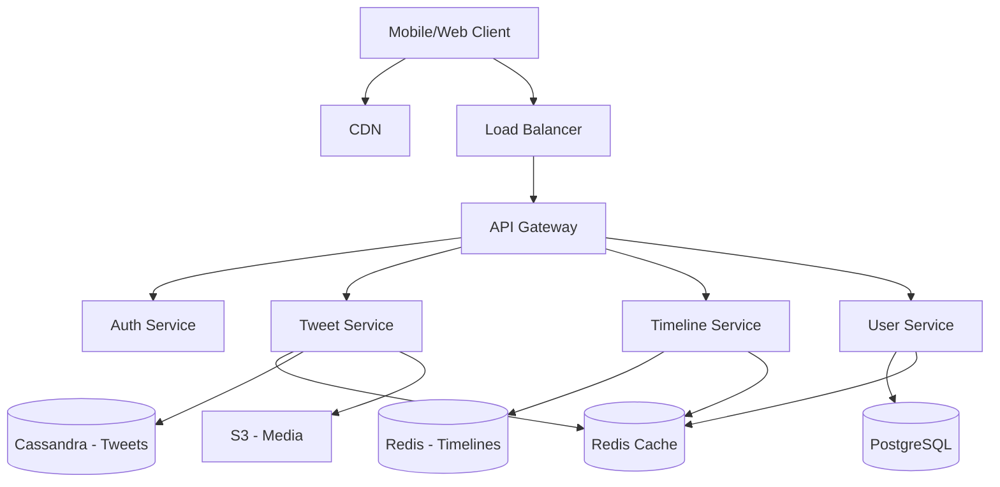

# System Design Interview Questions

## What You'll Learn

System design interviews test your ability to architect large-scale distributed systems. This note covers popular interview questions, systematic approaches to solving them, and detailed solutions for systems like Twitter, Instagram, URL Shortener, and more.

## Why This Matters

System design interviews are critical for senior engineer positions at FAANG companies. They evaluate your understanding of scalability, reliability, and trade-offs. The key is demonstrating structured thinking, asking clarifying questions, and discussing trade-offs. This note provides frameworks and solutions for common interview questions.

## Interview Framework

### 1. Clarify Requirements (5-10 minutes)

Ask questions to understand functional and non-functional requirements.

**Functional Requirements**: What features must the system support?
- Users can post tweets
- Users can follow other users
- Users can see their timeline

**Non-functional Requirements**: What are the scale and performance requirements?
- Scale: 500 million users, 200 million DAU
- Performance: Timeline loads in < 200ms
- Availability: 99.99% uptime

### 2. Estimate Scale (5 minutes)

Calculate traffic, storage, and bandwidth requirements.

**Example**: Twitter-like system
- DAU: 200 million
- Tweets per day: 100 million
- Average tweet size: 300 bytes
- Storage per day: 100M × 300 bytes = 30GB
- Storage per year: 30GB × 365 = 11TB
- Read/write ratio: 100:1

### 3. Design High-Level Architecture (10-15 minutes)

Draw major components and data flow.

**Components**:
- Load Balancer
- API Gateway
- Application Servers
- Cache Layer
- Database Layer
- Object Storage
- CDN

### 4. Design Core Components (15-20 minutes)

Detail critical components:
- Data model
- APIs
- Database schema
- Caching strategy
- Replication and sharding

### 5. Identify Bottlenecks and Scale (5-10 minutes)

Discuss scaling challenges and solutions:
- Database scaling (sharding, replication)
- Caching strategies
- CDN for static content
- Load balancing

## Question 1: Design Twitter

### Requirements

**Functional**:
- Post tweets (280 characters)
- Follow/unfollow users
- View home timeline (tweets from followed users)
- View user timeline (user's tweets)
- Like and retweet

**Non-Functional**:
- 300M users, 200M DAU
- 100M tweets/day
- Home timeline latency < 200ms
- High availability (99.9%)

### Scale Estimation

```
Traffic:
- 100M tweets/day = 1,157 tweets/second
- Read heavy: assume 100:1 read/write ratio
- Timeline reads: 115,700/second

Storage:
- Tweet size: 280 chars × 2 bytes = 560 bytes + metadata = 1KB
- Daily storage: 100M tweets × 1KB = 100GB
- 5 years: 100GB × 365 × 5 = 182TB

Bandwidth:
- Write: 1,157 tweets/s × 1KB = 1.16 MB/s
- Read: 115,700 reads/s × 1KB = 115.7 MB/s
```

### High-Level Design



### Data Models

```sql
-- User table (PostgreSQL)
CREATE TABLE users (
    user_id BIGSERIAL PRIMARY KEY,
    username VARCHAR(50) UNIQUE NOT NULL,
    email VARCHAR(255) UNIQUE NOT NULL,
    display_name VARCHAR(100),
    bio TEXT,
    profile_image_url VARCHAR(500),
    followers_count INT DEFAULT 0,
    following_count INT DEFAULT 0,
    created_at TIMESTAMP DEFAULT NOW(),
    updated_at TIMESTAMP DEFAULT NOW()
);

CREATE INDEX idx_users_username ON users(username);
CREATE INDEX idx_users_email ON users(email);

-- Follows table (PostgreSQL)
CREATE TABLE follows (
    follower_id BIGINT NOT NULL,
    followee_id BIGINT NOT NULL,
    created_at TIMESTAMP DEFAULT NOW(),
    PRIMARY KEY (follower_id, followee_id),
    FOREIGN KEY (follower_id) REFERENCES users(user_id),
    FOREIGN KEY (followee_id) REFERENCES users(user_id)
);

CREATE INDEX idx_follows_followee ON follows(followee_id);

-- Tweets table (Cassandra)
CREATE TABLE tweets (
    tweet_id UUID PRIMARY KEY,
    user_id BIGINT,
    text TEXT,
    media_urls LIST<TEXT>,
    created_at TIMESTAMP,
    likes_count INT,
    retweets_count INT,
    replies_count INT
);

CREATE INDEX ON tweets (user_id);

-- User timeline (Cassandra)
CREATE TABLE user_timeline (
    user_id BIGINT,
    tweet_id UUID,
    created_at TIMESTAMP,
    PRIMARY KEY (user_id, created_at, tweet_id)
) WITH CLUSTERING ORDER BY (created_at DESC);

-- Home timeline (Redis)
-- Key: timeline:{user_id}
-- Value: Sorted Set of tweet_ids with timestamp as score
```

### API Design

```
POST /api/v1/tweets
Request:
{
  "text": "Hello World!",
  "media_urls": ["https://..."]
}
Response:
{
  "tweet_id": "123e4567-e89b-12d3-a456-426614174000",
  "created_at": "2024-01-15T10:30:00Z"
}

GET /api/v1/timeline/home?user_id={id}&limit=20&cursor={cursor}
Response:
{
  "tweets": [...],
  "next_cursor": "abc123"
}

GET /api/v1/timeline/user/{user_id}?limit=20&cursor={cursor}

POST /api/v1/follows
Request:
{
  "followee_id": 12345
}

POST /api/v1/tweets/{tweet_id}/like

POST /api/v1/tweets/{tweet_id}/retweet
```

### Timeline Generation Strategies

**Fan-out on Write (Push Model)**:
- When user posts tweet, push to all followers' timelines
- Pros: Fast reads (timeline pre-computed)
- Cons: Slow writes for users with many followers
- Used for regular users

```python
# Fan-out on write
def post_tweet(user_id, tweet_data):
    # Create tweet
    tweet = create_tweet(user_id, tweet_data)
    
    # Get followers
    followers = get_followers(user_id)
    
    # Push to each follower's timeline (async)
    for follower_id in followers:
        redis.zadd(
            f'timeline:{follower_id}',
            {tweet.id: tweet.timestamp}
        )
        
        # Trim timeline to last 1000 tweets
        redis.zremrangebyrank(f'timeline:{follower_id}', 0, -1001)
    
    return tweet
```

**Fan-out on Read (Pull Model)**:
- When user requests timeline, fetch tweets from followed users
- Pros: Fast writes
- Cons: Slow reads (compute timeline on demand)
- Used for celebrity users with millions of followers

```python
# Fan-out on read
def get_home_timeline(user_id, limit=20):
    # Get users this user follows
    following = get_following(user_id)
    
    # Fetch recent tweets from each followed user
    tweets = []
    for followed_user_id in following:
        user_tweets = cassandra.execute(
            "SELECT * FROM user_timeline WHERE user_id = ? LIMIT 100",
            (followed_user_id,)
        )
        tweets.extend(user_tweets)
    
    # Merge and sort
    tweets.sort(key=lambda t: t.created_at, reverse=True)
    return tweets[:limit]
```

**Hybrid Approach**:
- Fan-out on write for regular users
- Fan-out on read for celebrities
- Mix both in timeline

```python
# Hybrid approach
def get_home_timeline_hybrid(user_id, limit=20):
    # Get pre-computed timeline (fan-out on write)
    timeline_ids = redis.zrevrange(
        f'timeline:{user_id}',
        0,
        limit - 1,
        withscores=True
    )
    
    # Get celebrity users this user follows
    celebrities = get_celebrity_following(user_id)
    
    # Fetch recent tweets from celebrities (fan-out on read)
    celebrity_tweets = []
    for celeb_id in celebrities:
        recent = cassandra.execute(
            "SELECT * FROM user_timeline WHERE user_id = ? LIMIT 10",
            (celeb_id,)
        )
        celebrity_tweets.extend(recent)
    
    # Merge timelines
    all_tweets = fetch_tweets(timeline_ids) + celebrity_tweets
    all_tweets.sort(key=lambda t: t.created_at, reverse=True)
    
    return all_tweets[:limit]
```

### Caching Strategy

```python
# Multi-level caching
class TwitterCache:
    def get_user(self, user_id):
        # Check L1 cache (local)
        if user_id in self.local_cache:
            return self.local_cache[user_id]
        
        # Check L2 cache (Redis)
        user_data = redis.get(f'user:{user_id}')
        if user_data:
            self.local_cache[user_id] = user_data
            return user_data
        
        # Cache miss - fetch from database
        user = db.query("SELECT * FROM users WHERE user_id = ?", user_id)
        
        # Store in caches
        redis.setex(f'user:{user_id}', 3600, user)
        self.local_cache[user_id] = user
        
        return user
    
    def get_timeline(self, user_id, limit=20):
        # Timeline is pre-computed in Redis
        timeline = redis.zrevrange(f'timeline:{user_id}', 0, limit - 1)
        
        # Fetch tweet details (may be cached)
        tweets = []
        for tweet_id in timeline:
            tweet = self.get_tweet(tweet_id)
            if tweet:
                tweets.append(tweet)
        
        return tweets
```

## Question 2: Design Instagram

### Requirements

**Functional**:
- Upload photos/videos
- Follow users
- View feed (photos from followed users)
- Like and comment on photos
- Search users

**Non-Functional**:
- 500M users, 300M DAU
- 100M photos uploaded/day
- Low latency for feed loading
- High availability

### Key Differences from Twitter

1. **Media Storage**: Photos/videos require object storage (S3) and CDN
2. **Image Processing**: Generate thumbnails, compress images
3. **Feed Ranking**: ML-based ranking algorithm (not chronological)

### Architecture Highlights

```python
# Photo upload flow
def upload_photo(user_id, photo_file):
    # Generate unique ID
    photo_id = generate_id()
    
    # Upload original to S3
    s3_url = s3.upload(
        bucket='instagram-photos',
        key=f'photos/{photo_id}/original.jpg',
        file=photo_file
    )
    
    # Async task: Generate thumbnails
    celery.send_task('generate_thumbnails', args=[photo_id, s3_url])
    
    # Store metadata in database
    db.execute(
        "INSERT INTO photos (photo_id, user_id, s3_url, created_at) VALUES (?, ?, ?, NOW())",
        (photo_id, user_id, s3_url)
    )
    
    # Async task: Fan-out to followers
    celery.send_task('fanout_photo', args=[user_id, photo_id])
    
    return {
        'photo_id': photo_id,
        'url': f'https://cdn.instagram.com/photos/{photo_id}/medium.jpg'
    }

# Thumbnail generation (async worker)
def generate_thumbnails(photo_id, original_url):
    # Download original
    image = download_image(original_url)
    
    sizes = {
        'thumbnail': (150, 150),
        'medium': (600, 600),
        'large': (1080, 1080)
    }
    
    for size_name, dimensions in sizes.items():
        resized = resize_image(image, dimensions)
        
        s3.upload(
            bucket='instagram-photos',
            key=f'photos/{photo_id}/{size_name}.jpg',
            file=resized
        )
    
    # Update CDN cache
    cdn.purge([f'/photos/{photo_id}/*'])
```

## Question 3: Design URL Shortener

### Requirements

**Functional**:
- Generate short URL from long URL
- Redirect short URL to long URL
- Custom aliases
- Analytics (click tracking)

**Non-Functional**:
- High availability (99.99%)
- Low latency for redirects (<50ms)
- 1M URLs generated/day
- 100:1 read/write ratio

### URL Generation

```python
# Base62 encoding for short URLs
class URLShortener:
    ALPHABET = '0123456789abcdefghijklmnopqrstuvwxyzABCDEFGHIJKLMNOPQRSTUVWXYZ'
    BASE = len(ALPHABET)
    
    def encode(self, num):
        """Convert number to base62 string"""
        if num == 0:
            return self.ALPHABET[0]
        
        result = []
        while num > 0:
            result.append(self.ALPHABET[num % self.BASE])
            num //= self.BASE
        
        return ''.join(reversed(result))
    
    def decode(self, short_url):
        """Convert base62 string to number"""
        num = 0
        for char in short_url:
            num = num * self.BASE + self.ALPHABET.index(char)
        return num
    
    def shorten_url(self, long_url, custom_alias=None):
        if custom_alias:
            # Check if alias available
            if redis.exists(f'url:{custom_alias}'):
                raise ValueError('Alias already taken')
            
            short_code = custom_alias
        else:
            # Generate unique ID (distributed counter or snowflake)
            url_id = redis.incr('url_id_counter')
            short_code = self.encode(url_id)
        
        # Store in database
        db.execute(
            "INSERT INTO urls (short_code, long_url, created_at) VALUES (?, ?, NOW())",
            (short_code, long_url)
        )
        
        # Cache in Redis
        redis.setex(f'url:{short_code}', 86400, long_url)
        
        return f'https://short.ly/{short_code}'
    
    def redirect(self, short_code):
        # Check cache
        long_url = redis.get(f'url:{short_code}')
        
        if not long_url:
            # Cache miss - fetch from database
            result = db.query(
                "SELECT long_url FROM urls WHERE short_code = ?",
                (short_code,)
            )
            
            if not result:
                raise NotFoundError('URL not found')
            
            long_url = result[0]['long_url']
            
            # Cache for 24 hours
            redis.setex(f'url:{short_code}', 86400, long_url)
        
        # Track analytics (async)
        kafka.send('url_clicks', {
            'short_code': short_code,
            'timestamp': time.time(),
            'ip': request.ip,
            'user_agent': request.user_agent
        })
        
        return long_url
```

## Common Patterns

### Database Sharding

```python
# Consistent hashing for sharding
def get_shard_for_user(user_id, num_shards=16):
    hash_value = hashlib.md5(str(user_id).encode()).hexdigest()
    shard_id = int(hash_value, 16) % num_shards
    return shard_id

# Store user data on appropriate shard
def save_user(user_data):
    shard_id = get_shard_for_user(user_data['user_id'])
    db_connection = get_db_shard(shard_id)
    db_connection.execute("INSERT INTO users ...", user_data)
```

### Rate Limiting

```python
# Token bucket rate limiting
def is_allowed(user_id, limit=100, window=60):
    key = f'rate_limit:{user_id}'
    current = redis.get(key)
    
    if current is None:
        redis.setex(key, window, 1)
        return True
    
    if int(current) < limit:
        redis.incr(key)
        return True
    
    return False
```

### Caching Strategy

- **Cache frequently accessed data** (user profiles, trending topics)
- **Use CDN** for static content (images, videos, CSS, JS)
- **Cache-aside pattern** for database queries
- **Write-through cache** for critical data

## Best Practices

✅ **Ask Clarifying Questions**: Don't assume requirements. Ask about scale, latency, consistency needs.

✅ **Start High-Level**: Draw major components first. Add details iteratively.

✅ **Discuss Trade-offs**: Every decision has trade-offs. Explain why you chose one approach over another.

✅ **Consider Failures**: Discuss how system handles failures. Single points of failure?

✅ **Estimate Numbers**: Do back-of-envelope calculations. Shows you understand scale.

✅ **Think About Monitoring**: How will you monitor the system? What metrics matter?

✅ **Security**: Mention authentication, authorization, encryption, rate limiting.

## Anti-Patterns

❌ **Jumping to Details**: Don't start with database schema. Start high-level.

❌ **Over-Engineering**: Don't add complexity unnecessarily. Start simple, scale as needed.

❌ **Ignoring Constraints**: If interviewer says "focus on availability", don't spend time on consistency.

❌ **No Trade-off Discussion**: Every design has pros and cons. Discuss them.

❌ **Avoiding Questions**: It's okay to ask questions. Shows you think through problems.

❌ **Perfect Solution**: There's no perfect design. Show you understand trade-offs.
