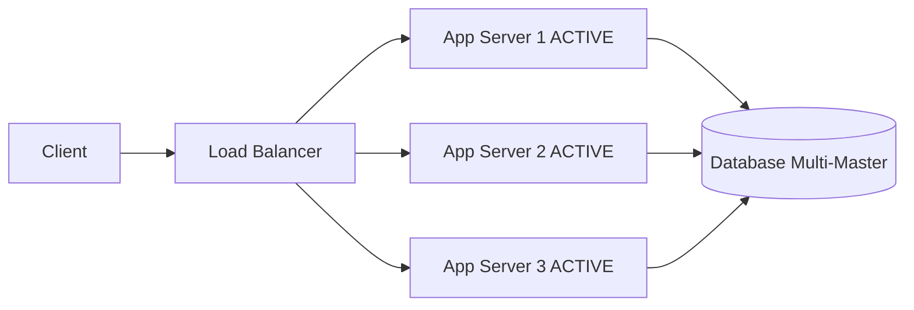
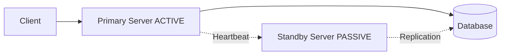

# High Availability and Fault Tolerance

## What You'll Learn

- Availability metrics and SLA definitions
- Redundancy patterns and failover mechanisms
- Disaster recovery strategies
- Health checking and circuit breakers
- Chaos engineering principles

## Why This Matters

System failures are inevitable. Hardware fails, networks partition, software has bugs, and data centers experience outages. Companies lose millions per hour of downtime - Amazon loses $220,000 per minute, Facebook $90,000 per minute. Beyond revenue loss, downtime damages reputation and customer trust. Building highly available, fault-tolerant systems separates production-grade services from prototypes. Understanding how to achieve 99.99% uptime (52 minutes downtime per year) versus 99.9% (8.7 hours per year) determines whether you can compete at scale.

## Availability Metrics

Availability is the percentage of time a system is operational and accessible:

**Availability = (Total Time - Downtime) / Total Time × 100%**

### The Nines of Availability

| Availability | Downtime per Year | Downtime per Month | Downtime per Week | Use Case |
|--------------|-------------------|--------------------|--------------------|----------|
| 90% (one nine) | 36.5 days | 72 hours | 16.8 hours | Development/testing |
| 99% (two nines) | 3.65 days | 7.2 hours | 1.68 hours | Internal tools |
| 99.9% (three nines) | 8.76 hours | 43.8 minutes | 10.1 minutes | Most web services |
| 99.99% (four nines) | 52.56 minutes | 4.38 minutes | 1.01 minutes | E-commerce, SaaS |
| 99.999% (five nines) | 5.26 minutes | 26.3 seconds | 6.05 seconds | Financial systems, telecom |
| 99.9999% (six nines) | 31.5 seconds | 2.63 seconds | 0.605 seconds | Mission-critical systems |

### SLA Components

**Service Level Objective (SLO)**: Target availability metric (e.g., 99.95% uptime)

**Service Level Indicator (SLI)**: Actual measurement (e.g., successful requests / total requests)

**Error Budget**: Allowed downtime before violating SLA (e.g., 99.9% allows 43.8 minutes/month)

```python
class AvailabilityCalculator:
    def __init__(self, slo_percentage):
        self.slo = slo_percentage / 100.0
    
    def calculate_error_budget_seconds(self, period_days):
        """Calculate allowed downtime in seconds"""
        total_seconds = period_days * 24 * 60 * 60
        return total_seconds * (1 - self.slo)
    
    def is_slo_met(self, uptime_seconds, total_seconds):
        """Check if SLO is met"""
        return (uptime_seconds / total_seconds) >= self.slo
    
    def remaining_error_budget(self, downtime_so_far, period_days):
        """Calculate remaining error budget"""
        allowed = self.calculate_error_budget_seconds(period_days)
        return allowed - downtime_so_far

# Example: 99.9% SLO
calc = AvailabilityCalculator(99.9)
monthly_budget = calc.calculate_error_budget_seconds(30)
print(f"Monthly error budget: {monthly_budget / 60:.1f} minutes")
```

## Redundancy Patterns

### Active-Active (Hot-Hot)

All instances actively handle traffic. Load balancer distributes requests across all nodes.



**Advantages**: Maximum utilization, no failover time, linear scalability

**Disadvantages**: Complex consistency, higher cost, multi-master replication needed

```java
public class ActiveActiveLoadBalancer {
    private List<ServiceInstance> instances;
    private AtomicInteger counter = new AtomicInteger(0);
    
    public ServiceInstance getNextHealthyInstance() {
        List<ServiceInstance> healthy = instances.stream()
            .filter(ServiceInstance::isHealthy)
            .collect(Collectors.toList());
        
        if (healthy.isEmpty()) {
            throw new NoHealthyInstancesException();
        }
        
        int index = Math.abs(counter.getAndIncrement() % healthy.size());
        return healthy.get(index);
    }
    
    public Response executeRequest(Request request) {
        int maxRetries = 3;
        
        for (int i = 0; i < maxRetries; i++) {
            try {
                ServiceInstance instance = getNextHealthyInstance();
                return instance.execute(request);
            } catch (InstanceFailureException e) {
                markUnhealthy(e.getInstance());
                if (i == maxRetries - 1) {
                    throw new AllInstancesFailedException();
                }
            }
        }
        throw new AllInstancesFailedException();
    }
}
```

### Active-Passive (Hot-Warm)

Primary instance handles traffic. Secondary standby takes over on failure.



**Advantages**: Simpler consistency, lower cost, clear primary

**Disadvantages**: Wasted capacity, failover time (30-120s), needs failure detection

```java
public class ActivePassiveFailover {
    private volatile boolean isPrimary;
    
    private void promoteToPrimary() {
        synchronized (this) {
            if (isPrimary) return;
            
            log.info("Promoting to primary");
            
            // 1. Fence old primary to prevent split-brain
            fenceOldPrimary();
            
            // 2. Ensure data is current
            waitForReplicationCatchup();
            
            // 3. Start accepting traffic
            isPrimary = true;
            startAcceptingTraffic();
            
            // 4. Update service registry
            updateServiceRegistry("primary");
        }
    }
    
    private void fenceOldPrimary() {
        try {
            coordinationService.acquireLock("primary-lock", 30, TimeUnit.SECONDS);
        } catch (LockAcquisitionException e) {
            throw new FailoverException("Cannot safely promote");
        }
    }
}
```

### N+1 Redundancy

N instances for capacity, plus 1 for redundancy. Example: Need 3 servers for load, deploy 4.

```javascript
class CapacityPlanner {
    calculateRequiredInstances(peakRPS, instanceCapacity, redundancy = 1) {
        const baseInstances = Math.ceil(peakRPS / instanceCapacity);
        return baseInstances + redundancy;
    }
    
    calculateAvailability(instanceAvailability, numInstances, requiredInstances) {
        let availability = 0;
        
        for (let k = requiredInstances; k <= numInstances; k++) {
            const choose = this.binomial(numInstances, k);
            const prob = choose * 
                Math.pow(instanceAvailability, k) * 
                Math.pow(1 - instanceAvailability, numInstances - k);
            availability += prob;
        }
        
        return availability;
    }
    
    binomial(n, k) {
        let result = 1;
        for (let i = 1; i <= k; i++) {
            result *= (n - i + 1) / i;
        }
        return result;
    }
}

// Example: Need 3 servers, deploy 4
const planner = new CapacityPlanner();
const required = planner.calculateRequiredInstances(30000, 10000, 1);
console.log(`Required instances: ${required}`); // 4

// Each server 99% available
const systemAvailability = planner.calculateAvailability(0.99, 4, 3);
console.log(`System availability: ${(systemAvailability * 100).toFixed(2)}%`);
```

### Geographic Redundancy

Replicate across multiple regions to survive regional failures.

```python
class MultiRegionDeployment:
    def __init__(self, regions):
        self.regions = regions  # ['us-east', 'us-west', 'eu-west']
        self.health_status = {region: True for region in regions}
    
    def route_request(self, client_location, request):
        """Route to nearest healthy region"""
        sorted_regions = self.get_regions_by_latency(client_location)
        
        for region in sorted_regions:
            if self.health_status[region]:
                try:
                    return self.execute_in_region(region, request)
                except RegionFailureException:
                    self.health_status[region] = False
        
        raise AllRegionsDownException()
    
    def sync_across_regions(self, data):
        """Replicate data to all regions"""
        primary_region = self.regions[0]
        self.write_to_region(primary_region, data)
        
        # Async replication to other regions
        for region in self.regions[1:]:
            self.async_replicate(region, data)
```

## Health Checking

### Liveness vs Readiness

```java
@RestController
public class HealthCheckController {
    
    @GetMapping("/health/liveness")
    public ResponseEntity<HealthStatus> liveness() {
        // Checks if application is running
        return ResponseEntity.ok(new HealthStatus("UP"));
    }
    
    @GetMapping("/health/readiness")
    public ResponseEntity<HealthStatus> readiness() {
        // Checks if ready to serve traffic
        List<String> failures = new ArrayList<>();
        
        if (!databasePool.isHealthy()) {
            failures.add("database_connection_pool");
        }
        
        if (!cacheService.isHealthy()) {
            failures.add("cache_service");
        }
        
        if (failures.isEmpty()) {
            return ResponseEntity.ok(new HealthStatus("UP"));
        } else {
            return ResponseEntity.status(503)
                .body(new HealthStatus("DOWN", failures));
        }
    }
}
```

### Circuit Breaker

Prevents cascading failures by failing fast when downstream services are unhealthy.

```java
public class CircuitBreaker {
    enum State { CLOSED, OPEN, HALF_OPEN }
    
    private volatile State state = State.CLOSED;
    private final int failureThreshold;
    private final long timeout;
    private final AtomicInteger failureCount = new AtomicInteger(0);
    private final AtomicInteger successCount = new AtomicInteger(0);
    private volatile long openedAt;
    
    public CircuitBreaker(int failureThreshold, long timeoutMs) {
        this.failureThreshold = failureThreshold;
        this.timeout = timeoutMs;
    }
    
    public <T> T execute(Supplier<T> operation) throws CircuitBreakerException {
        if (state == State.OPEN) {
            if (System.currentTimeMillis() - openedAt > timeout) {
                state = State.HALF_OPEN;
                successCount.set(0);
            } else {
                throw new CircuitBreakerException("Circuit breaker is OPEN");
            }
        }
        
        try {
            T result = operation.get();
            onSuccess();
            return result;
        } catch (Exception e) {
            onFailure();
            throw e;
        }
    }
    
    private void onSuccess() {
        failureCount.set(0);
        
        if (state == State.HALF_OPEN) {
            successCount.incrementAndGet();
            if (successCount.get() >= 3) {
                state = State.CLOSED;
            }
        }
    }
    
    private void onFailure() {
        int failures = failureCount.incrementAndGet();
        
        if (failures >= failureThreshold) {
            state = State.OPEN;
            openedAt = System.currentTimeMillis();
            log.warn("Circuit breaker opened after {} failures", failures);
        }
    }
}

// Usage
public class ExternalApiClient {
    private CircuitBreaker breaker = new CircuitBreaker(5, 30000);
    
    public ApiResponse call(Request request) {
        try {
            return breaker.execute(() -> httpClient.post(URL, request));
        } catch (CircuitBreakerException e) {
            return getCachedResponse(request);
        }
    }
}
```

**States**:
- **CLOSED**: Normal operation
- **OPEN**: Failures exceeded threshold, reject immediately
- **HALF_OPEN**: Testing recovery with limited requests

### Bulkhead Pattern

Isolate resources to prevent failures from spreading.

```java
public class BulkheadService {
    // Separate thread pools for different operations
    private final ExecutorService databasePool = Executors.newFixedThreadPool(10);
    private final ExecutorService externalApiPool = Executors.newFixedThreadPool(5);
    private final ExecutorService reportingPool = Executors.newFixedThreadPool(2);
    
    public CompletableFuture<DatabaseResult> queryDatabase(Query query) {
        return CompletableFuture.supplyAsync(() -> 
            database.execute(query), databasePool);
    }
    
    public CompletableFuture<ApiResponse> callExternalApi(Request request) {
        return CompletableFuture.supplyAsync(() -> 
            externalApi.call(request), externalApiPool);
    }
}
```

## Disaster Recovery

### Recovery Metrics

**RTO (Recovery Time Objective)**: Maximum acceptable downtime

**RPO (Recovery Point Objective)**: Maximum acceptable data loss

```python
class DisasterRecoveryStrategy:
    @staticmethod
    def select_strategy(rto_hours, rpo_hours):
        """Select DR strategy based on requirements"""
        if rto_hours <= 1 and rpo_hours <= 1:
            return "Active-Active Multi-Region"
        elif rto_hours <= 4 and rpo_hours <= 4:
            return "Hot Standby with Continuous Replication"
        elif rto_hours <= 24 and rpo_hours <= 24:
            return "Warm Standby with Periodic Snapshots"
        else:
            return "Cold Standby with Backup Restore"

strategy = DisasterRecoveryStrategy.select_strategy(2, 1)
print(f"Recommended: {strategy}")
```

| Strategy | RTO | RPO | Cost | Complexity |
|----------|-----|-----|------|------------|
| Active-Active | Minutes | Near-zero | Very High | High |
| Hot Standby | < 1 hour | < 15 min | High | Medium |
| Warm Standby | 1-4 hours | 1-4 hours | Medium | Medium |
| Cold Standby | 4-24 hours | 4-24 hours | Low | Low |

### Backup Strategies

```java
public class BackupManager {
    
    public void performFullBackup(Database database, Storage storage) {
        log.info("Starting full backup");
        
        database.enableReadOnlyMode();
        try {
            Snapshot snapshot = database.createSnapshot();
            
            byte[] compressed = compress(snapshot.getData());
            byte[] encrypted = encrypt(compressed);
            
            String backupId = generateBackupId();
            storage.upload("s3://backups/full/" + backupId, encrypted);
            storage.upload("gcs://backups/full/" + backupId, encrypted);
            
            saveBackupMetadata(backupId, snapshot.getSize());
            
        } finally {
            database.disableReadOnlyMode();
        }
    }
    
    public void restoreFromBackup(String backupId, Database database) {
        BackupMetadata metadata = getBackupMetadata(backupId);
        
        byte[] encrypted = storage.download("s3://backups/" + metadata.getPath());
        byte[] compressed = decrypt(encrypted);
        byte[] data = decompress(compressed);
        
        if (!verifyChecksum(data, metadata.getChecksum())) {
            throw new CorruptedBackupException();
        }
        
        database.restore(data);
    }
}
```

### Chaos Engineering

Proactively inject failures to validate resilience.

```python
class ChaosExperiment:
    def __init__(self, name):
        self.name = name
        self.steady_state_hypothesis = None
        self.method = []
        self.rollbacks = []
    
    def set_steady_state(self, hypothesis_fn):
        self.steady_state_hypothesis = hypothesis_fn
    
    def add_action(self, action_fn, rollback_fn=None):
        self.method.append(action_fn)
        if rollback_fn:
            self.rollbacks.append(rollback_fn)
    
    def run(self):
        print(f"Running experiment: {self.name}")
        
        if not self.steady_state_hypothesis():
            raise Exception("System not in steady state")
        
        try:
            for action in self.method:
                action()
                time.sleep(5)
            
            if self.steady_state_hypothesis():
                print("✅ System maintained steady state")
                return True
            else:
                print("❌ System deviated from steady state")
                return False
        finally:
            for rollback in reversed(self.rollbacks):
                rollback()

# Example
experiment = ChaosExperiment("Instance Failure")
experiment.set_steady_state(lambda: check_health())
experiment.add_action(kill_random_instance, restore_instance_count)
experiment.run()
```

## Best Practices

**Design for Failure**: Assume everything fails. Plan failure modes for every component.

**Automate Recovery**: Manual recovery is slow. Automate health checks, failover, scaling.

**Test Failure Scenarios**: Regularly test failover, backups, disaster recovery.

**Monitor Everything**: Implement comprehensive monitoring, alerting, tracing.

**Degrade Gracefully**: Provide reduced functionality instead of complete outage.

**Document Runbooks**: Clear procedures for common failure scenarios.

## Anti-Patterns

❌ **Single Point of Failure**: Any non-redundant component risks total outage

❌ **Untested Failover**: DR plans that aren't tested will fail when needed

❌ **Thundering Herd**: All retries at once overwhelm recovering system

❌ **Cascading Failures**: Failures spread through dependent components

❌ **No Circuit Breakers**: Continuing to call failing services wastes resources

## Real-World Examples

**Netflix**: Chaos Monkey randomly terminates instances. Chaos Kong simulates region failure. Achieves 99.99% availability.

**Amazon**: Multi-region active-active. Cell-based architecture contains failures. Each cell independent.

**Google**: SRE practices with error budgets. Teams deploy freely until budget exhausted.

**Stripe**: Active-active database replication. Automatic failover. 99.99% uptime for payments.

## Related Topics

- [Distributed Systems Fundamentals](11-distributed-systems-fundamentals.md)
- [Load Balancing](01-load-balancing.md)
- [Database Scaling Strategies](03-database-scaling-strategies.md)
- [Monitoring & Observability](13-monitoring-observability.md)
