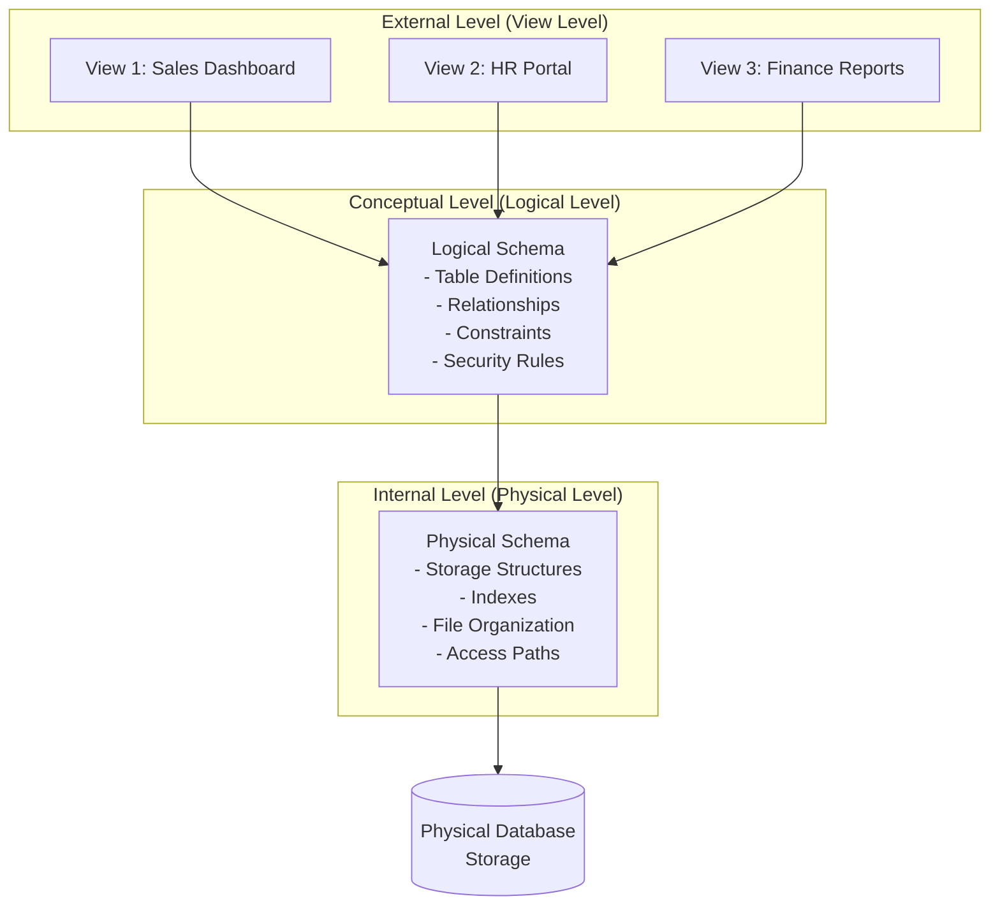
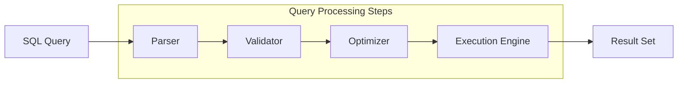

# DBMS Fundamentals

## What You'll Learn

- Core database management system concepts and architecture
- Different database models and their use cases
- DBMS components and their interactions
- Data independence and abstraction levels
- Storage structures and file organization
- Buffer management and memory hierarchy

## Why This Matters

Database Management Systems form the backbone of modern applications, handling everything from simple CRUD operations to complex analytical queries on terabytes of data. Understanding DBMS fundamentals is essential for making informed decisions about data architecture, performance optimization, and choosing the right database technology. Poor database design or misunderstanding of DBMS internals can lead to scalability issues, data inconsistencies, and performance bottlenecks that are expensive to fix in production.

## Database Models

### Hierarchical Model

The hierarchical model organizes data in a tree-like structure with parent-child relationships. Each parent can have multiple children, but each child has only one parent.

**Use Cases:**
- File systems (directories and files)
- Organization charts
- XML data storage
- Legacy mainframe systems

**Limitations:**
- Rigid structure makes changes difficult
- Data redundancy when representing many-to-many relationships
- Complex queries across different hierarchies

### Network Model

An extension of the hierarchical model that allows multiple parent-child relationships, forming a graph structure.

**Advantages:**
- More flexible than hierarchical model
- Supports many-to-many relationships natively
- Faster navigation using pointers

**Limitations:**
- Complex to design and maintain
- Application code tightly coupled to physical storage
- Difficult to modify structure once established

### Relational Model

Data is organized in tables (relations) with rows (tuples) and columns (attributes). Relationships are established through foreign keys.

```sql
-- Example: Relational Model Structure
CREATE TABLE departments (
    dept_id INT PRIMARY KEY,
    dept_name VARCHAR(100) NOT NULL,
    location VARCHAR(100)
);

CREATE TABLE employees (
    emp_id INT PRIMARY KEY,
    emp_name VARCHAR(100) NOT NULL,
    dept_id INT,
    salary DECIMAL(10, 2),
    hire_date DATE,
    FOREIGN KEY (dept_id) REFERENCES departments(dept_id)
);

CREATE TABLE projects (
    project_id INT PRIMARY KEY,
    project_name VARCHAR(100) NOT NULL,
    budget DECIMAL(12, 2)
);

-- Many-to-many relationship through junction table
CREATE TABLE employee_projects (
    emp_id INT,
    project_id INT,
    hours_allocated INT,
    PRIMARY KEY (emp_id, project_id),
    FOREIGN KEY (emp_id) REFERENCES employees(emp_id),
    FOREIGN KEY (project_id) REFERENCES projects(project_id)
);
```

**Advantages:**
- Flexible and easy to modify structure
- Strong mathematical foundation (relational algebra)
- Data independence
- Reduced data redundancy through normalization
- Standardized query language (SQL)

### Object-Oriented Model

Integrates object-oriented programming concepts with database capabilities. Data is stored as objects with attributes and methods.

```java
// Example: Object-Oriented Database (using JPA/Hibernate)
@Entity
@Table(name = "employees")
public class Employee {
    @Id
    @GeneratedValue(strategy = GenerationType.IDENTITY)
    private Long empId;
    
    private String empName;
    
    @ManyToOne(fetch = FetchType.LAZY)
    @JoinColumn(name = "dept_id")
    private Department department;
    
    private BigDecimal salary;
    
    @Temporal(TemporalType.DATE)
    private Date hireDate;
    
    @ManyToMany
    @JoinTable(
        name = "employee_projects",
        joinColumns = @JoinColumn(name = "emp_id"),
        inverseJoinColumns = @JoinColumn(name = "project_id")
    )
    private Set<Project> projects = new HashSet<>();
    
    // Methods
    public void assignToProject(Project project) {
        projects.add(project);
        project.getEmployees().add(this);
    }
    
    public BigDecimal calculateAnnualSalary() {
        return salary.multiply(new BigDecimal("12"));
    }
}
```

**Advantages:**
- Natural mapping to OOP languages
- Support for complex data types
- Inheritance and polymorphism
- Encapsulation of behavior with data

**Limitations:**
- Less mature than relational model
- Limited standardization
- Steeper learning curve
- Fewer optimization tools

### Document Model (NoSQL)

Data is stored as documents (typically JSON or BSON) with flexible schemas.

```javascript
// MongoDB Example
{
    "_id": ObjectId("507f1f77bcf86cd799439011"),
    "emp_name": "John Smith",
    "department": {
        "dept_id": 10,
        "dept_name": "Engineering",
        "location": "Building A"
    },
    "salary": 85000,
    "hire_date": ISODate("2020-03-15"),
    "projects": [
        {
            "project_id": 101,
            "project_name": "Cloud Migration",
            "hours_allocated": 120
        },
        {
            "project_id": 102,
            "project_name": "API Gateway",
            "hours_allocated": 80
        }
    ],
    "skills": ["Java", "Python", "Docker"],
    "certifications": [
        {
            "name": "AWS Solutions Architect",
            "obtained_date": ISODate("2021-06-20"),
            "expiry_date": ISODate("2024-06-20")
        }
    ]
}
```

## DBMS Architecture

### Three-Schema Architecture

The ANSI-SPARC architecture defines three levels of data abstraction:



#### External Level (View Level)

Defines how users interact with the database through views tailored to specific needs.

```sql
-- Example: Views for different user groups
CREATE VIEW sales_summary AS
SELECT 
    d.dept_name,
    COUNT(e.emp_id) as employee_count,
    AVG(e.salary) as avg_salary
FROM departments d
LEFT JOIN employees e ON d.dept_id = e.dept_id
GROUP BY d.dept_name;

-- Restricted view for HR with sensitive information hidden
CREATE VIEW hr_employee_view AS
SELECT 
    emp_id,
    emp_name,
    dept_id,
    hire_date,
    -- Salary hidden for privacy
    CASE 
        WHEN salary > 100000 THEN 'High'
        WHEN salary > 60000 THEN 'Medium'
        ELSE 'Entry'
    END as salary_band
FROM employees;
```

#### Conceptual Level (Logical Level)

Describes what data is stored and the relationships between data elements.

```sql
-- Logical schema definition
CREATE TABLE employees (
    emp_id INT PRIMARY KEY,
    emp_name VARCHAR(100) NOT NULL,
    dept_id INT NOT NULL,
    salary DECIMAL(10, 2) CHECK (salary > 0),
    hire_date DATE NOT NULL,
    email VARCHAR(100) UNIQUE,
    CONSTRAINT fk_department 
        FOREIGN KEY (dept_id) 
        REFERENCES departments(dept_id)
        ON DELETE RESTRICT
        ON UPDATE CASCADE
);

-- Integrity constraints
ALTER TABLE employees 
ADD CONSTRAINT chk_hire_date 
CHECK (hire_date <= CURRENT_DATE);
```

#### Internal Level (Physical Level)

Describes how data is physically stored on disk.

```sql
-- Physical storage decisions
CREATE TABLE employees (
    emp_id INT PRIMARY KEY,
    emp_name VARCHAR(100) NOT NULL,
    dept_id INT NOT NULL,
    salary DECIMAL(10, 2),
    hire_date DATE NOT NULL
)
-- Physical storage parameters
TABLESPACE users
STORAGE (INITIAL 64K NEXT 64K)
-- Partitioning for performance
PARTITION BY RANGE (hire_date) (
    PARTITION emp_2020 VALUES LESS THAN (TO_DATE('2021-01-01', 'YYYY-MM-DD')),
    PARTITION emp_2021 VALUES LESS THAN (TO_DATE('2022-01-01', 'YYYY-MM-DD')),
    PARTITION emp_2022 VALUES LESS THAN (TO_DATE('2023-01-01', 'YYYY-MM-DD')),
    PARTITION emp_current VALUES LESS THAN (MAXVALUE)
);

-- Index creation for physical access optimization
CREATE INDEX idx_dept_salary ON employees(dept_id, salary)
TABLESPACE index_space;
```

### Data Independence

#### Physical Data Independence

Changes to physical storage do not affect the conceptual schema or application programs.

```sql
-- Example: Adding an index (physical change)
-- Applications continue to work without modification
CREATE INDEX idx_employee_name ON employees(emp_name);

-- Changing storage parameters
ALTER TABLE employees MODIFY PARTITION emp_current
STORAGE (INITIAL 128K NEXT 128K);

-- Adding a new partition
ALTER TABLE employees ADD PARTITION emp_2023 
VALUES LESS THAN (TO_DATE('2024-01-01', 'YYYY-MM-DD'));
```

#### Logical Data Independence

Changes to the logical schema minimally affect external schemas and application programs.

```sql
-- Adding a new column (logical change)
ALTER TABLE employees ADD COLUMN middle_name VARCHAR(50);

-- Existing views and queries continue to work
-- because they don't reference the new column
SELECT emp_id, emp_name, salary 
FROM employees 
WHERE dept_id = 10;
```

## DBMS Components

### Query Processor

Transforms user queries into efficient execution plans.



**Components:**

1. **DDL Interpreter**: Processes Data Definition Language commands
2. **DML Compiler**: Translates Data Manipulation Language into query execution plans
3. **Query Optimizer**: Selects the most efficient execution plan
4. **Query Executor**: Executes the chosen plan

```python
# Example: Query optimization comparison
# Query 1: Inefficient (Sequential scan)
"""
SELECT * FROM employees 
WHERE UPPER(emp_name) = 'JOHN SMITH';
"""
# Problem: Function on column prevents index usage
# Execution Plan: Full table scan

# Query 2: Efficient (Index scan)
"""
CREATE INDEX idx_emp_name ON employees(LOWER(emp_name));

SELECT * FROM employees 
WHERE emp_name = 'John Smith';
"""
# Execution Plan: Index seek + Key lookup
# 100x faster for large tables
```

### Storage Manager

Manages the interface between low-level data stored in the database and application programs/queries.

**Components:**

1. **Authorization and Integrity Manager**: Checks constraints and user permissions
2. **Transaction Manager**: Ensures ACID properties
3. **File Manager**: Manages disk space allocation
4. **Buffer Manager**: Manages data transfer between disk and main memory

```java
// Example: Buffer Manager concept in code
public class BufferManager {
    private final int bufferPoolSize;
    private final Map<PageId, BufferFrame> bufferPool;
    private final LRU<PageId> replacementPolicy;
    
    public Page getPage(PageId pageId) {
        // Check if page is in buffer pool
        if (bufferPool.containsKey(pageId)) {
            // Buffer hit - update LRU
            replacementPolicy.access(pageId);
            return bufferPool.get(pageId).getPage();
        }
        
        // Buffer miss - load from disk
        if (bufferPool.size() >= bufferPoolSize) {
            // Evict page using LRU policy
            PageId victimPageId = replacementPolicy.evict();
            BufferFrame victimFrame = bufferPool.remove(victimPageId);
            
            // Write back if dirty
            if (victimFrame.isDirty()) {
                diskManager.writePage(victimPageId, victimFrame.getPage());
            }
        }
        
        // Load page from disk
        Page page = diskManager.readPage(pageId);
        BufferFrame frame = new BufferFrame(page);
        bufferPool.put(pageId, frame);
        replacementPolicy.access(pageId);
        
        return page;
    }
    
    public void flushPage(PageId pageId) {
        BufferFrame frame = bufferPool.get(pageId);
        if (frame != null && frame.isDirty()) {
            diskManager.writePage(pageId, frame.getPage());
            frame.setDirty(false);
        }
    }
}
```

### Transaction Manager

Ensures that transactions are executed atomically and maintains database consistency.

```python
# Example: Transaction manager operations
class TransactionManager:
    def __init__(self):
        self.active_transactions = {}
        self.lock_manager = LockManager()
        self.log_manager = LogManager()
    
    def begin_transaction(self, txn_id):
        """Start a new transaction"""
        txn = Transaction(txn_id)
        self.active_transactions[txn_id] = txn
        self.log_manager.write_log(f"BEGIN {txn_id}")
        return txn
    
    def commit_transaction(self, txn_id):
        """Commit a transaction"""
        txn = self.active_transactions[txn_id]
        
        # Write ahead log - ensure all changes are logged
        self.log_manager.flush()
        self.log_manager.write_log(f"COMMIT {txn_id}")
        
        # Release all locks held by transaction
        self.lock_manager.release_all_locks(txn_id)
        
        # Remove from active transactions
        del self.active_transactions[txn_id]
    
    def rollback_transaction(self, txn_id):
        """Rollback a transaction"""
        txn = self.active_transactions[txn_id]
        
        # Undo all changes made by transaction
        for operation in reversed(txn.operations):
            self._undo_operation(operation)
        
        self.log_manager.write_log(f"ROLLBACK {txn_id}")
        self.lock_manager.release_all_locks(txn_id)
        
        del self.active_transactions[txn_id]
    
    def _undo_operation(self, operation):
        """Undo a single operation"""
        if operation.type == 'UPDATE':
            # Restore old value
            self._restore_value(operation.page_id, operation.old_value)
        elif operation.type == 'INSERT':
            # Delete the inserted record
            self._delete_record(operation.page_id, operation.record_id)
        elif operation.type == 'DELETE':
            # Restore the deleted record
            self._insert_record(operation.page_id, operation.old_value)
```

## Storage Structures

### File Organization

#### Heap File Organization

Records are stored in no particular order, typically in the order they are inserted.

```python
class HeapFile:
    """
    Heap file: Records stored in insertion order
    Fast inserts, slow searches
    """
    def __init__(self, filename):
        self.filename = filename
        self.pages = []
    
    def insert_record(self, record):
        """Insert at the end of the file"""
        # Find first page with free space
        for page in self.pages:
            if page.has_free_space(record.size()):
                page.insert(record)
                return page.page_id
        
        # No free space, create new page
        new_page = Page()
        new_page.insert(record)
        self.pages.append(new_page)
        return new_page.page_id
    
    def search_record(self, predicate):
        """Sequential scan through all records"""
        results = []
        for page in self.pages:  # O(n) pages
            for record in page.records:  # O(m) records per page
                if predicate(record):
                    results.append(record)
        return results  # Total: O(n*m) time complexity
    
    def delete_record(self, record_id):
        """Mark record as deleted"""
        for page in self.pages:
            if page.delete_record(record_id):
                return True
        return False
```

**Use Case:** Write-heavy workloads where scan performance is acceptable.

#### Sequential File Organization

Records are stored in sorted order based on a search key.

```python
class SequentialFile:
    """
    Sequential file: Records stored in sorted order
    Slower inserts, faster range queries
    """
    def __init__(self, filename, sort_key):
        self.filename = filename
        self.sort_key = sort_key
        self.pages = []
        self.overflow_area = []
    
    def insert_record(self, record):
        """Insert in sorted position"""
        position = self._binary_search_position(record)
        
        # Check if insertion point has space
        page = self.pages[position.page_index]
        if page.has_free_space(record.size()):
            page.insert_at(position.slot, record)
        else:
            # Use overflow area
            self.overflow_area.append(record)
            
            # Reorganize when overflow gets too large
            if len(self.overflow_area) > len(self.pages) * 0.1:
                self._reorganize()
    
    def search_range(self, start_key, end_key):
        """Efficient range search using sorted order"""
        start_pos = self._binary_search(start_key)  # O(log n)
        results = []
        
        # Scan sequentially from start to end
        current_page = start_pos.page_index
        while current_page < len(self.pages):
            page = self.pages[current_page]
            for record in page.records:
                key_value = record.get(self.sort_key)
                if key_value > end_key:
                    return results
                if key_value >= start_key:
                    results.append(record)
            current_page += 1
        
        return results
```

#### Hash File Organization

Records are distributed across buckets using a hash function on a search key.

```python
class HashFile:
    """
    Hash file: Records distributed using hash function
    Fast point queries, no support for range queries
    """
    def __init__(self, filename, hash_key, num_buckets=1000):
        self.filename = filename
        self.hash_key = hash_key
        self.num_buckets = num_buckets
        self.buckets = [[] for _ in range(num_buckets)]
    
    def _hash(self, key):
        """Hash function to determine bucket"""
        return hash(key) % self.num_buckets
    
    def insert_record(self, record):
        """Insert into appropriate bucket - O(1)"""
        key_value = record.get(self.hash_key)
        bucket_index = self._hash(key_value)
        self.buckets[bucket_index].append(record)
    
    def search_record(self, key):
        """Point query - O(1) average case"""
        bucket_index = self._hash(key)
        bucket = self.buckets[bucket_index]
        
        # Search within bucket
        for record in bucket:
            if record.get(self.hash_key) == key:
                return record
        return None
    
    def search_range(self, start_key, end_key):
        """Range queries require full scan - inefficient"""
        # ❌ Anti-pattern: Hash files don't support efficient range queries
        results = []
        for bucket in self.buckets:  # Must scan all buckets
            for record in bucket:
                key_value = record.get(self.hash_key)
                if start_key <= key_value <= end_key:
                    results.append(record)
        return results
```

### Comparison of File Organizations

| Organization | Insert | Point Query | Range Query | Update | Delete | Space Utilization |
|-------------|--------|-------------|-------------|--------|--------|-------------------|
| Heap | O(1) | O(n) | O(n) | O(n) | O(n) | Good |
| Sequential | O(n) | O(log n) | O(log n + k) | O(n) | O(n) | Fair (overflow) |
| Hash | O(1) | O(1) | O(n) | O(1) | O(1) | Variable |
| B+ Tree | O(log n) | O(log n) | O(log n + k) | O(log n) | O(log n) | Good |

*Note: n = number of records, k = number of results*

## Buffer Management

The buffer manager maintains a pool of pages in memory to minimize disk I/O.

### Buffer Replacement Policies

```java
// LRU (Least Recently Used) Implementation
public class LRUBufferPool {
    private final int capacity;
    private final Map<Integer, Node> cache;
    private final DoublyLinkedList lruList;
    
    class Node {
        int pageId;
        byte[] data;
        boolean dirty;
        Node prev, next;
    }
    
    public byte[] getPage(int pageId) {
        if (cache.containsKey(pageId)) {
            // Move to front (most recently used)
            Node node = cache.get(pageId);
            lruList.moveToFront(node);
            return node.data;
        }
        
        // Page not in buffer - load from disk
        byte[] data = diskManager.readPage(pageId);
        
        if (cache.size() >= capacity) {
            // Evict least recently used page
            Node lru = lruList.removeLast();
            if (lru.dirty) {
                diskManager.writePage(lru.pageId, lru.data);
            }
            cache.remove(lru.pageId);
        }
        
        // Add new page to buffer
        Node newNode = new Node();
        newNode.pageId = pageId;
        newNode.data = data;
        newNode.dirty = false;
        
        lruList.addToFront(newNode);
        cache.put(pageId, newNode);
        
        return data;
    }
    
    public void markDirty(int pageId) {
        if (cache.containsKey(pageId)) {
            cache.get(pageId).dirty = true;
        }
    }
    
    public void flush() {
        // Write all dirty pages to disk
        for (Node node : cache.values()) {
            if (node.dirty) {
                diskManager.writePage(node.pageId, node.data);
                node.dirty = false;
            }
        }
    }
}
```

### Clock (Second Chance) Algorithm

More efficient than LRU with lower overhead.

```python
class ClockBufferPool:
    """
    Clock algorithm: Approximates LRU with O(1) operations
    Uses reference bit to give pages a second chance
    """
    def __init__(self, capacity):
        self.capacity = capacity
        self.frames = [None] * capacity
        self.reference_bits = [False] * capacity
        self.dirty_bits = [False] * capacity
        self.clock_hand = 0
        self.page_to_frame = {}
    
    def get_page(self, page_id):
        """Get page from buffer or load from disk"""
        if page_id in self.page_to_frame:
            # Page hit
            frame_id = self.page_to_frame[page_id]
            self.reference_bits[frame_id] = True
            return self.frames[frame_id]
        
        # Page miss - need to load from disk
        victim_frame = self._find_victim()
        
        # Evict victim if exists
        if self.frames[victim_frame] is not None:
            victim_page = self.frames[victim_frame]
            if self.dirty_bits[victim_frame]:
                self._write_to_disk(victim_page)
            del self.page_to_frame[victim_page.page_id]
        
        # Load new page
        new_page = self._load_from_disk(page_id)
        self.frames[victim_frame] = new_page
        self.reference_bits[victim_frame] = True
        self.dirty_bits[victim_frame] = False
        self.page_to_frame[page_id] = victim_frame
        
        return new_page
    
    def _find_victim(self):
        """Clock algorithm to find victim frame"""
        while True:
            # Check current position
            if not self.reference_bits[self.clock_hand]:
                # Found victim - reference bit is 0
                victim = self.clock_hand
                self.clock_hand = (self.clock_hand + 1) % self.capacity
                return victim
            
            # Give second chance - clear reference bit
            self.reference_bits[self.clock_hand] = False
            self.clock_hand = (self.clock_hand + 1) % self.capacity
```

## Real-World Scenarios

### Scenario 1: E-commerce Platform

**Requirements:**
- Product catalog with millions of items
- Fast product search and filtering
- Order processing with inventory management
- Customer reviews and ratings

**DBMS Choices:**

```sql
-- Primary transactional database: PostgreSQL/MySQL
CREATE TABLE products (
    product_id BIGINT PRIMARY KEY,
    name VARCHAR(200) NOT NULL,
    category_id INT,
    price DECIMAL(10, 2),
    stock_quantity INT,
    description TEXT,
    created_at TIMESTAMP DEFAULT CURRENT_TIMESTAMP,
    INDEX idx_category (category_id),
    INDEX idx_price (price),
    FULLTEXT INDEX idx_name_desc (name, description)
);

CREATE TABLE orders (
    order_id BIGINT PRIMARY KEY,
    customer_id BIGINT NOT NULL,
    order_date TIMESTAMP DEFAULT CURRENT_TIMESTAMP,
    total_amount DECIMAL(12, 2),
    status VARCHAR(20),
    INDEX idx_customer_date (customer_id, order_date)
);

CREATE TABLE order_items (
    order_id BIGINT,
    product_id BIGINT,
    quantity INT,
    unit_price DECIMAL(10, 2),
    PRIMARY KEY (order_id, product_id),
    FOREIGN KEY (order_id) REFERENCES orders(order_id),
    FOREIGN KEY (product_id) REFERENCES products(product_id)
);
```

```javascript
// Secondary search database: Elasticsearch
// For advanced product search and filtering
{
    "mappings": {
        "properties": {
            "product_id": { "type": "long" },
            "name": {
                "type": "text",
                "analyzer": "standard",
                "fields": {
                    "keyword": { "type": "keyword" }
                }
            },
            "category": { "type": "keyword" },
            "price": { "type": "double" },
            "rating": { "type": "float" },
            "tags": { "type": "keyword" },
            "description": { "type": "text" },
            "stock_status": { "type": "keyword" }
        }
    }
}
```

### Scenario 2: Social Media Platform

**Requirements:**
- User profiles and relationships
- News feed aggregation
- Real-time notifications
- Content storage (posts, images, videos)

**Hybrid Approach:**

```python
# User profiles and relationships: Graph Database (Neo4j)
create_user_query = """
CREATE (u:User {
    user_id: $user_id,
    username: $username,
    email: $email,
    created_at: datetime()
})
"""

create_friendship_query = """
MATCH (u1:User {user_id: $user_id1})
MATCH (u2:User {user_id: $user_id2})
CREATE (u1)-[r:FRIENDS_WITH {since: datetime()}]->(u2)
"""

# Find friends of friends for recommendations
recommendation_query = """
MATCH (me:User {user_id: $user_id})-[:FRIENDS_WITH]->(friend)-[:FRIENDS_WITH]->(fof)
WHERE NOT (me)-[:FRIENDS_WITH]->(fof) AND me <> fof
RETURN fof, COUNT(*) as mutual_friends
ORDER BY mutual_friends DESC
LIMIT 10
"""
```

```javascript
// Posts and feed: Document Database (MongoDB)
db.posts.insertOne({
    post_id: "post_123",
    user_id: "user_456",
    content: "Enjoying the weekend!",
    media: [
        {
            type: "image",
            url: "https://cdn.example.com/img123.jpg",
            thumbnail: "https://cdn.example.com/thumb123.jpg"
        }
    ],
    likes: 42,
    comments_count: 5,
    created_at: new Date(),
    tags: ["weekend", "fun"],
    visibility: "public"
});

// Pre-computed feed for fast reads
db.user_feeds.insertOne({
    user_id: "user_789",
    feed_items: [
        { post_id: "post_123", timestamp: new Date(), score: 95 },
        { post_id: "post_124", timestamp: new Date(), score: 87 },
        // Top 50 posts for this user
    ],
    last_updated: new Date()
});
```

## Best Practices

### ✅ Choose the Right Database Model

Match the database model to your data access patterns and consistency requirements.

```python
# Decision framework
def choose_database(requirements):
    if requirements.complex_joins and requirements.strict_consistency:
        return "Relational (PostgreSQL, MySQL)"
    elif requirements.graph_relationships:
        return "Graph (Neo4j, Amazon Neptune)"
    elif requirements.flexible_schema and requirements.high_write_throughput:
        return "Document (MongoDB, DynamoDB)"
    elif requirements.time_series_data:
        return "Time-Series (InfluxDB, TimescaleDB)"
    elif requirements.key_value_access and requirements.extreme_performance:
        return "Key-Value (Redis, Memcached)"
    else:
        return "Evaluate multiple options with POC"
```

### ✅ Implement Proper Data Independence

Design schemas that minimize impact of changes at different levels.

```sql
-- Use views to provide data independence
CREATE VIEW customer_summary AS
SELECT 
    c.customer_id,
    c.name,
    c.email,
    COUNT(o.order_id) as total_orders,
    SUM(o.total_amount) as lifetime_value
FROM customers c
LEFT JOIN orders o ON c.customer_id = o.customer_id
GROUP BY c.customer_id, c.name, c.email;

-- Applications use the view
-- If underlying table structure changes, only the view needs updating
```

### ✅ Optimize Buffer Pool Size

Configure buffer pool based on workload characteristics.

```ini
# PostgreSQL configuration
# Allocate 25% of system memory for shared buffers
shared_buffers = 4GB

# MySQL InnoDB configuration
# Allocate 70-80% of system memory for buffer pool
innodb_buffer_pool_size = 16GB
innodb_buffer_pool_instances = 16
```

### ✅ Monitor Buffer Hit Ratio

Track buffer cache effectiveness to identify performance issues.

```sql
-- PostgreSQL: Check buffer hit ratio
SELECT 
    sum(heap_blks_read) as heap_read,
    sum(heap_blks_hit) as heap_hit,
    sum(heap_blks_hit) / (sum(heap_blks_hit) + sum(heap_blks_read)) as hit_ratio
FROM pg_statio_user_tables;

-- Target: > 95% hit ratio for OLTP workloads
```

## Anti-Patterns

### ❌ Using Wrong Database Model

Forcing hierarchical data into a relational structure without proper design.

```sql
-- Anti-pattern: Storing tree structure with unlimited depth
CREATE TABLE categories (
    category_id INT PRIMARY KEY,
    parent_id INT,
    category_name VARCHAR(100)
);

-- Problem: Querying full hierarchy requires recursive queries
-- which are expensive and complex
WITH RECURSIVE category_tree AS (
    SELECT category_id, parent_id, category_name, 0 as level
    FROM categories
    WHERE parent_id IS NULL
    UNION ALL
    SELECT c.category_id, c.parent_id, c.category_name, ct.level + 1
    FROM categories c
    INNER JOIN category_tree ct ON c.parent_id = ct.category_id
)
SELECT * FROM category_tree;
```

**✅ Better Approach:** Use specialized structures or consider a graph database for complex hierarchies.

### ❌ Bypassing Buffer Manager

Directly accessing disk without going through buffer manager.

```java
// ❌ Anti-pattern: Direct file I/O
public byte[] readPageDirect(int pageId) {
    RandomAccessFile file = new RandomAccessFile("data.db", "r");
    file.seek(pageId * PAGE_SIZE);
    byte[] data = new byte[PAGE_SIZE];
    file.read(data);
    file.close();
    return data;  // No caching, very slow
}

// ✅ Better: Use buffer manager
public byte[] readPage(int pageId) {
    return bufferManager.getPage(pageId);  // Cached access
}
```

### ❌ Ignoring Data Independence Layers

Mixing physical storage concerns with application logic.

```python
# ❌ Anti-pattern: Application depends on physical storage
query = """
    SELECT * FROM employees 
    WHERE rowid BETWEEN 1000 AND 2000
    ORDER BY physical_address
"""
# Problem: Breaks when data is reorganized or migrated

# ✅ Better: Use logical attributes
query = """
    SELECT * FROM employees 
    WHERE hire_date BETWEEN '2020-01-01' AND '2020-12-31'
    ORDER BY hire_date
"""
```

### ❌ Inefficient Buffer Pool Configuration

Setting buffer pool too small or too large.

```ini
# ❌ Too small - constant disk I/O
shared_buffers = 128MB  # On a server with 64GB RAM

# ❌ Too large - OS memory starvation
innodb_buffer_pool_size = 60GB  # On a server with 64GB RAM

# ✅ Balanced configuration
# PostgreSQL: 25% of RAM
shared_buffers = 16GB
# MySQL: 70-80% of RAM  
innodb_buffer_pool_size = 48GB
```
