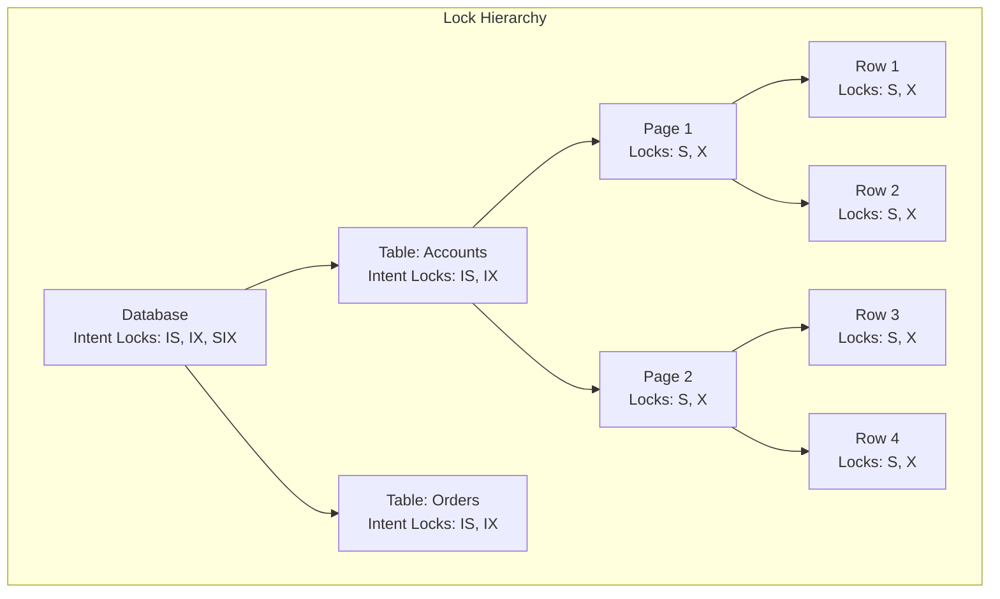

# Concurrency Control and Locking

## What You'll Learn

- Locking mechanisms and protocols (Shared, Exclusive, Intent locks)
- Two-Phase Locking (2PL) protocol
- Deadlock detection, prevention, and resolution
- Timestamp-based concurrency control
- Multi-Version Concurrency Control (MVCC)
- Optimistic vs Pessimistic locking strategies
- Lock granularity and performance trade-offs
- Isolation level implementation techniques

## Why This Matters

Concurrency control is essential for maintaining data consistency when multiple transactions access the database simultaneously. Without proper concurrency control, race conditions, lost updates, and data corruption occur. Understanding locking mechanisms allows you to design systems that balance consistency with performance, avoid deadlocks, and choose appropriate isolation levels for different use cases. In high-throughput applications, poor concurrency control decisions can become the primary bottleneck, limiting scalability and causing transaction conflicts. Senior engineers must understand how databases implement isolation guarantees and how to tune applications for optimal concurrent performance.

## Lock Types

### Shared Lock (S-Lock)

Multiple transactions can hold shared locks on the same resource simultaneously. Used for read operations.

```sql
-- PostgreSQL: Explicit shared lock
BEGIN;
SELECT * FROM accounts WHERE account_id = 1001 FOR SHARE;
-- Other transactions can also acquire shared locks
-- but cannot acquire exclusive locks
COMMIT;
```

```python
class SharedLock:
    """
    Shared lock implementation
    Multiple readers can hold the lock simultaneously
    """
    def __init__(self):
        self.readers = 0
        self.writers = 0
        self.lock = threading.Lock()
        self.read_condition = threading.Condition(self.lock)
        self.write_condition = threading.Condition(self.lock)
    
    def acquire_shared(self, transaction_id):
        """Acquire shared lock for reading"""
        with self.lock:
            # Wait while there are writers
            while self.writers > 0:
                self.read_condition.wait()
            
            self.readers += 1
            print(f"Transaction {transaction_id} acquired shared lock")
    
    def release_shared(self, transaction_id):
        """Release shared lock"""
        with self.lock:
            self.readers -= 1
            print(f"Transaction {transaction_id} released shared lock")
            
            # If no more readers, wake up waiting writers
            if self.readers == 0:
                self.write_condition.notify()
```

### Exclusive Lock (X-Lock)

Only one transaction can hold an exclusive lock. Used for write operations.

```sql
-- PostgreSQL: Explicit exclusive lock
BEGIN;
SELECT * FROM accounts WHERE account_id = 1001 FOR UPDATE;
-- No other transaction can read or write this row until commit
UPDATE accounts SET balance = balance - 100 WHERE account_id = 1001;
COMMIT;
```

```python
class ExclusiveLock:
    """
    Exclusive lock implementation
    Only one writer can hold the lock
    """
    def acquire_exclusive(self, transaction_id):
        """Acquire exclusive lock for writing"""
        with self.lock:
            # Wait while there are readers or writers
            while self.readers > 0 or self.writers > 0:
                self.write_condition.wait()
            
            self.writers += 1
            print(f"Transaction {transaction_id} acquired exclusive lock")
    
    def release_exclusive(self, transaction_id):
        """Release exclusive lock"""
        with self.lock:
            self.writers -= 1
            print(f"Transaction {transaction_id} released exclusive lock")
            
            # Wake up all waiting readers and writers
            self.read_condition.notify_all()
            self.write_condition.notify()
```

### Intent Locks

Intent locks are used in hierarchical locking to indicate that a transaction intends to acquire locks at a finer granularity.



**Intent Lock Types:**

- **IS (Intent Shared)**: Intention to acquire shared locks at finer granularity
- **IX (Intent Exclusive)**: Intention to acquire exclusive locks at finer granularity
- **SIX (Shared with Intent Exclusive)**: Shared lock + intention to acquire exclusive locks

```sql
-- Example: Row-level locking with table-level intent lock
-- PostgreSQL automatically manages intent locks

BEGIN;
-- Acquires IS lock on table, S lock on row
SELECT * FROM accounts WHERE account_id = 1001 FOR SHARE;

-- Acquires IX lock on table, X lock on row
UPDATE accounts SET balance = balance - 100 WHERE account_id = 1001;
COMMIT;
```

## Two-Phase Locking (2PL)

Ensures serializability by dividing transaction execution into two phases.

### Basic 2PL Protocol

```python
class TwoPhaseLockin g:
    """
    Two-Phase Locking protocol implementation
    Phase 1 (Growing): Acquire locks, no releases
    Phase 2 (Shrinking): Release locks, no acquisitions
    """
    def __init__(self):
        self.lock_table = {}  # resource_id -> Lock
        self.transaction_locks = {}  # txn_id -> set of locks
        self.transaction_phase = {}  # txn_id -> 'GROWING' or 'SHRINKING'
    
    def acquire_lock(self, txn_id, resource_id, lock_type):
        """Acquire lock during growing phase"""
        # Check if transaction is in shrinking phase
        if self.transaction_phase.get(txn_id) == 'SHRINKING':
            raise Exception(f"Transaction {txn_id} cannot acquire locks in shrinking phase")
        
        # Set transaction to growing phase
        self.transaction_phase[txn_id] = 'GROWING'
        
        # Acquire the lock
        if resource_id not in self.lock_table:
            self.lock_table[resource_id] = Lock(resource_id)
        
        lock = self.lock_table[resource_id]
        if lock_type == 'SHARED':
            lock.acquire_shared(txn_id)
        else:
            lock.acquire_exclusive(txn_id)
        
        # Track lock for this transaction
        if txn_id not in self.transaction_locks:
            self.transaction_locks[txn_id] = set()
        self.transaction_locks[txn_id].add((resource_id, lock_type))
        
        print(f"Transaction {txn_id} acquired {lock_type} lock on {resource_id}")
    
    def release_lock(self, txn_id, resource_id):
        """Release lock - enters shrinking phase"""
        # First release transitions to shrinking phase
        self.transaction_phase[txn_id] = 'SHRINKING'
        
        lock = self.lock_table[resource_id]
        lock.release(txn_id)
        
        # Remove from transaction's lock set
        self.transaction_locks[txn_id].discard((resource_id, lock.lock_type))
        
        print(f"Transaction {txn_id} released lock on {resource_id} (SHRINKING phase)")
    
    def release_all_locks(self, txn_id):
        """Release all locks held by transaction"""
        if txn_id not in self.transaction_locks:
            return
        
        for resource_id, lock_type in list(self.transaction_locks[txn_id]):
            lock = self.lock_table[resource_id]
            lock.release(txn_id)
        
        del self.transaction_locks[txn_id]
        del self.transaction_phase[txn_id]
        print(f"Transaction {txn_id} released all locks")
```

### Strict Two-Phase Locking

Holds all exclusive locks until commit/abort to prevent cascading rollbacks.

```java
public class StrictTwoPhaseL ocking {
    private Map<String, Lock> lockTable = new ConcurrentHashMap<>();
    private Map<String, Set<LockInfo>> transactionLocks = new ConcurrentHashMap<>();
    
    /**
     * Strict 2PL: Hold all exclusive locks until commit
     */
    public void acquireLock(String txnId, String resourceId, LockType type) {
        Lock lock = lockTable.computeIfAbsent(resourceId, k -> new Lock(resourceId));
        
        if (type == LockType.SHARED) {
            lock.acquireShared(txnId);
        } else {
            lock.acquireExclusive(txnId);
        }
        
        // Track locks
        transactionLocks.computeIfAbsent(txnId, k -> new HashSet<>())
            .add(new LockInfo(resourceId, type));
    }
    
    /**
     * Commit: Release all locks atomically
     */
    public void commit(String txnId) {
        Set<LockInfo> locks = transactionLocks.get(txnId);
        if (locks == null) return;
        
        // Release all locks at once
        for (LockInfo lockInfo : locks) {
            Lock lock = lockTable.get(lockInfo.resourceId);
            lock.release(txnId);
        }
        
        transactionLocks.remove(txnId);
    }
    
    /**
     * Abort: Release all locks and undo changes
     */
    public void abort(String txnId) {
        // Undo all changes made by transaction
        undoTransaction(txnId);
        
        // Release all locks
        commit(txnId);
    }
}
```

## Deadlock Management

### Deadlock Detection

```python
class DeadlockDetector:
    """
    Deadlock detection using wait-for graph
    """
    def __init__(self):
        self.wait_for_graph = {}  # txn_id -> set of txn_ids it's waiting for
        self.lock_holders = {}    # resource_id -> set of txn_ids holding locks
        self.lock_waiters = {}    # resource_id -> queue of (txn_id, lock_type)
    
    def add_wait(self, waiting_txn, resource_id, lock_type):
        """Add a wait relationship when transaction blocks"""
        # Get current lock holders
        holders = self.lock_holders.get(resource_id, set())
        
        # Add wait-for relationships
        if waiting_txn not in self.wait_for_graph:
            self.wait_for_graph[waiting_txn] = set()
        
        for holder_txn in holders:
            if holder_txn != waiting_txn:
                self.wait_for_graph[waiting_txn].add(holder_txn)
        
        # Add to waiters queue
        if resource_id not in self.lock_waiters:
            self.lock_waiters[resource_id] = []
        self.lock_waiters[resource_id].append((waiting_txn, lock_type))
        
        # Check for deadlock
        if self.has_cycle():
            victim = self.select_victim()
            self.abort_transaction(victim)
            raise DeadlockException(f"Deadlock detected, aborted transaction {victim}")
    
    def has_cycle(self):
        """Detect cycle in wait-for graph using DFS"""
        visited = set()
        rec_stack = set()
        
        def dfs(txn):
            visited.add(txn)
            rec_stack.add(txn)
            
            # Visit all neighbors
            for neighbor in self.wait_for_graph.get(txn, []):
                if neighbor not in visited:
                    if dfs(neighbor):
                        return True
                elif neighbor in rec_stack:
                    return True  # Cycle detected
            
            rec_stack.remove(txn)
            return False
        
        # Check all transactions
        for txn in self.wait_for_graph:
            if txn not in visited:
                if dfs(txn):
                    return True
        
        return False
    
    def select_victim(self):
        """Choose transaction to abort (youngest transaction)"""
        # In production: consider transaction age, locks held, work done
        return min(self.wait_for_graph.keys())
    
    def remove_wait(self, txn_id):
        """Remove transaction from wait-for graph"""
        # Remove as waiter
        if txn_id in self.wait_for_graph:
            del self.wait_for_graph[txn_id]
        
        # Remove from others' wait lists
        for waiting_txn, waiters in self.wait_for_graph.items():
            waiters.discard(txn_id)
```

### Deadlock Prevention

```sql
-- Strategy 1: Lock resources in a consistent order
BEGIN;
-- Always lock accounts in ascending order by account_id
SELECT * FROM accounts WHERE account_id = 1001 FOR UPDATE;  -- Lock smaller ID first
SELECT * FROM accounts WHERE account_id = 2001 FOR UPDATE;  -- Then larger ID
-- Transfer between accounts
UPDATE accounts SET balance = balance - 100 WHERE account_id = 1001;
UPDATE accounts SET balance = balance + 100 WHERE account_id = 2001;
COMMIT;

-- Strategy 2: Timeout-based approach
BEGIN;
SET LOCAL statement_timeout = '5s';  -- Abort if locks not acquired within 5 seconds
SELECT * FROM accounts WHERE account_id = 1001 FOR UPDATE;
-- If timeout, transaction aborts and releases locks
COMMIT;

-- Strategy 3: Wait-Die scheme (older transactions wait, younger die)
-- Strategy 4: Wound-Wait scheme (older transactions wound younger, younger wait)
-- These are typically implemented at the database engine level
```

### Deadlock Resolution Example

```java
@Service
public class TransferService {
    
    @Autowired
    private AccountRepository accountRepository;
    
    /**
     * Transfer money with deadlock retry logic
     */
    @Retryable(
        value = DeadlockLoserDataAccessException.class,
        maxAttempts = 3,
        backoff = @Backoff(delay = 100, multiplier = 2)
    )
    @Transactional
    public void transferMoney(Long fromAccountId, Long toAccountId, BigDecimal amount) {
        // Lock accounts in consistent order to prevent deadlock
        Long firstLock = Math.min(fromAccountId, toAccountId);
        Long secondLock = Math.max(fromAccountId, toAccountId);
        
        // Acquire locks in order
        Account first = accountRepository.findByIdWithLock(firstLock);
        Account second = accountRepository.findByIdWithLock(secondLock);
        
        // Determine which is from and which is to
        Account fromAccount = fromAccountId.equals(firstLock) ? first : second;
        Account toAccount = fromAccountId.equals(firstLock) ? second : first;
        
        // Perform transfer
        if (fromAccount.getBalance().compareTo(amount) < 0) {
            throw new InsufficientFundsException();
        }
        
        fromAccount.setBalance(fromAccount.getBalance().subtract(amount));
        toAccount.setBalance(toAccount.getBalance().add(amount));
        
        accountRepository.save(fromAccount);
        accountRepository.save(toAccount);
    }
}
```

## Multi-Version Concurrency Control (MVCC)

MVCC allows readers to see a consistent snapshot without blocking writers.

### MVCC Concept

```python
class MVCCDatabase:
    """
    Multi-Version Concurrency Control implementation
    Each write creates a new version of the data
    """
    def __init__(self):
        self.versions = {}  # (resource_id, version) -> value
        self.latest_version = {}  # resource_id -> latest version number
        self.transaction_snapshots = {}  # txn_id -> snapshot version
        self.current_version = 0
    
    def begin_transaction(self, txn_id):
        """Start transaction with snapshot of current version"""
        self.transaction_snapshots[txn_id] = self.current_version
        print(f"Transaction {txn_id} started at version {self.current_version}")
    
    def read(self, txn_id, resource_id):
        """Read data as of transaction's snapshot"""
        snapshot_version = self.transaction_snapshots[txn_id]
        
        # Find the latest version <= snapshot_version
        for version in range(snapshot_version, -1, -1):
            key = (resource_id, version)
            if key in self.versions:
                print(f"Transaction {txn_id} reads {resource_id} version {version}")
                return self.versions[key]
        
        return None  # Not found
    
    def write(self, txn_id, resource_id, value):
        """Write creates a new version"""
        # Create new version
        self.current_version += 1
        new_version = self.current_version
        
        # Store new version
        self.versions[(resource_id, new_version)] = value
        self.latest_version[resource_id] = new_version
        
        print(f"Transaction {txn_id} wrote {resource_id} version {new_version}: {value}")
    
    def commit(self, txn_id):
        """Commit transaction"""
        # In MVCC, commit makes versions visible
        print(f"Transaction {txn_id} committed")
        del self.transaction_snapshots[txn_id]
    
    def rollback(self, txn_id):
        """Rollback transaction"""
        # Simply discard uncommitted versions
        print(f"Transaction {txn_id} rolled back")
        del self.transaction_snapshots[txn_id]

# Example usage
db = MVCCDatabase()

# Transaction 1: Read-only
db.begin_transaction('T1')
db.write('T1', 'account_1001', 5000)
db.commit('T1')

# Transaction 2: Starts after T1 commits
db.begin_transaction('T2')
value_t2 = db.read('T2', 'account_1001')  # Sees 5000

# Transaction 3: Concurrent with T2
db.begin_transaction('T3')
value_t3 = db.read('T3', 'account_1001')  # Also sees 5000

# T2 updates
db.write('T2', 'account_1001', 4900)
db.commit('T2')

# T3 still sees old version (snapshot isolation)
value_t3_again = db.read('T3', 'account_1001')  # Still sees 5000!
db.commit('T3')
```

### PostgreSQL MVCC Implementation

```sql
-- PostgreSQL uses MVCC by default
-- Each row has hidden columns: xmin (creating txn), xmax (deleting txn)

-- Transaction 1
BEGIN;
SELECT txid_current();  -- Returns: 1001
INSERT INTO accounts (account_id, balance) VALUES (1001, 5000);
-- Row created with xmin = 1001, xmax = NULL
COMMIT;

-- Transaction 2 (concurrent)
BEGIN;
SELECT txid_current();  -- Returns: 1002
SELECT * FROM accounts WHERE account_id = 1001;  -- Sees row (1002 > 1001)

-- Transaction 3 (concurrent with T2)
BEGIN;
SELECT txid_current();  -- Returns: 1003
UPDATE accounts SET balance = 4500 WHERE account_id = 1001;
-- Old row marked with xmax = 1003
-- New row created with xmin = 1003, xmax = NULL
COMMIT;

-- Transaction 2 continuing
SELECT * FROM accounts WHERE account_id = 1001;  
-- Still sees balance = 5000 (snapshot isolation)
-- T2 started before T3 committed, so it sees old version
COMMIT;
```

## Optimistic vs Pessimistic Locking

### Pessimistic Locking

Assumes conflicts are likely; locks resources immediately.

```java
@Service
public class PessimisticLockingService {
    
    @Autowired
    private ProductRepository productRepository;
    
    /**
     * Pessimistic locking: Lock before read
     */
    @Transactional
    public void updateStock Pessimistic(Long productId, int quantity) {
        // Acquire exclusive lock immediately
        Product product = productRepository.findById(productId)
            .orElseThrow(() -> new ProductNotFoundException(productId));
        
        // Lock held until transaction ends
        if (product.getStockQuantity() < quantity) {
            throw new InsufficientStockException();
        }
        
        product.setStockQuantity(product.getStockQuantity() - quantity);
        productRepository.save(product);
        
        // Lock released on commit
    }
    
    /**
     * JPA pessimistic locking
     */
    @Lock(LockModeType.PESSIMISTIC_WRITE)
    @Query("SELECT p FROM Product p WHERE p.id = :id")
    Optional<Product> findByIdWithLock(@Param("id") Long id);
}
```

```sql
-- SQL pessimistic locking
BEGIN;
-- Acquire lock immediately
SELECT * FROM products WHERE product_id = 101 FOR UPDATE;
-- Other transactions wait here until lock is released
UPDATE products SET stock_quantity = stock_quantity - 5 WHERE product_id = 101;
COMMIT;
```

### Optimistic Locking

Assumes conflicts are rare; checks for conflicts before commit.

```java
@Entity
@Table(name = "products")
public class Product {
    @Id
    private Long id;
    
    private String name;
    
    private Integer stockQuantity;
    
    @Version  // Optimistic locking version field
    private Long version;
    
    // Getters and setters
}

@Service
public class OptimisticLockingService {
    
    @Autowired
    private ProductRepository productRepository;
    
    /**
     * Optimistic locking: Check version before update
     */
    @Transactional
    public void updateStockOptimistic(Long productId, int quantity) {
        // No lock acquired on read
        Product product = productRepository.findById(productId)
            .orElseThrow(() -> new ProductNotFoundException(productId));
        
        Long currentVersion = product.getVersion();
        
        if (product.getStockQuantity() < quantity) {
            throw new InsufficientStockException();
        }
        
        product.setStockQuantity(product.getStockQuantity() - quantity);
        
        // JPA automatically checks version before update:
        // UPDATE products 
        // SET stock_quantity = ?, version = version + 1
        // WHERE product_id = ? AND version = ?
        
        try {
            productRepository.save(product);
        } catch (OptimisticLockException e) {
            // Version mismatch - someone else updated the row
            throw new ConcurrentModificationException("Product was modified by another transaction");
        }
    }
    
    /**
     * Optimistic locking with retry
     */
    @Retryable(
        value = ConcurrentModificationException.class,
        maxAttempts = 3,
        backoff = @Backoff(delay = 50, multiplier = 2)
    )
    @Transactional
    public void updateStockWithRetry(Long productId, int quantity) {
        updateStockOptimistic(productId, quantity);
    }
}
```

```sql
-- Manual optimistic locking with version column
-- Read with version
SELECT product_id, stock_quantity, version 
FROM products 
WHERE product_id = 101;
-- Returns: product_id=101, stock_quantity=100, version=5

-- Update with version check
UPDATE products 
SET stock_quantity = 95, version = 6
WHERE product_id = 101 AND version = 5;
-- If version doesn't match, 0 rows updated (conflict detected)

-- Check result
GET DIAGNOSTICS rows_updated = ROW_COUNT;
IF rows_updated = 0 THEN
    RAISE EXCEPTION 'Optimistic lock failure: product was modified';
END IF;
```

## Lock Granularity

### Comparison of Lock Levels

| Granularity | Concurrency | Overhead | Use Case |
|-------------|-------------|----------|----------|
| Database | Lowest | Lowest | Database maintenance |
| Table | Low | Low | Bulk operations |
| Page | Medium | Medium | Range scans |
| Row | Highest | Highest | OLTP transactions |
| Column | Highest | Very High | Rarely used |

```sql
-- Row-level locking (highest concurrency)
BEGIN;
SELECT * FROM orders WHERE order_id = 12345 FOR UPDATE;
-- Only locks single row
COMMIT;

-- Table-level locking (lowest concurrency)
BEGIN;
LOCK TABLE orders IN EXCLUSIVE MODE;
-- Locks entire table
-- No other transactions can access orders table
COMMIT;

-- Page-level locking (implicit in some databases)
-- Database locks entire page (typically 8KB) containing the row
```

## Real-World Scenarios

### Scenario 1: Banking Transfer with Deadlock Prevention

```java
@Service
public class BankingService {
    
    /**
     * Safe money transfer with consistent lock ordering
     */
    @Transactional(isolation = Isolation.REPEATABLE_READ)
    public void transferMoney(String fromAccountId, String toAccountId, BigDecimal amount) {
        // Always lock accounts in lexicographic order
        String firstLock = fromAccountId.compareTo(toAccountId) < 0 ? fromAccountId : toAccountId;
        String secondLock = fromAccountId.compareTo(toAccountId) < 0 ? toAccountId : fromAccountId;
        
        // Acquire locks in consistent order
        Account first = accountRepository.findByAccountIdWithLock(firstLock);
        Account second = accountRepository.findByAccountIdWithLock(secondLock);
        
        // Determine source and destination
        Account source = fromAccountId.equals(firstLock) ? first : second;
        Account destination = fromAccountId.equals(firstLock) ? second : first;
        
        // Validate and transfer
        if (source.getBalance().compareTo(amount) < 0) {
            throw new InsufficientFundsException();
        }
        
        source.setBalance(source.getBalance().subtract(amount));
        destination.setBalance(destination.getBalance().add(amount));
        
        accountRepository.saveAll(List.of(source, destination));
    }
}
```

### Scenario 2: Ticket Booking with Optimistic Locking

```java
@Service
public class TicketBookingService {
    
    /**
     * Book ticket using optimistic locking
     * Suitable for low-contention scenarios
     */
    @Retryable(
        value = OptimisticLockException.class,
        maxAttempts = 5,
        backoff = @Backoff(delay = 100, multiplier = 1.5, random = true)
    )
    @Transactional
    public Booking bookTicket(Long eventId, String userId, int numberOfSeats) {
        // Read without locking
        Event event = eventRepository.findById(eventId)
            .orElseThrow(() -> new EventNotFoundException(eventId));
        
        // Check availability
        if (event.getAvailableSeats() < numberOfSeats) {
            throw new InsufficientSeatsException(
                "Only " + event.getAvailableSeats() + " seats available"
            );
        }
        
        // Optimistic: Assume no conflict
        event.setAvailableSeats(event.getAvailableSeats() - numberOfSeats);
        
        // Create booking
        Booking booking = new Booking();
        booking.setEventId(eventId);
        booking.setUserId(userId);
        booking.setNumberOfSeats(numberOfSeats);
        booking.setStatus(BookingStatus.CONFIRMED);
        
        try {
            eventRepository.save(event);  // Version check happens here
            return bookingRepository.save(booking);
        } catch (OptimisticLockException e) {
            // Conflict detected - retry
            log.warn("Optimistic lock conflict for event {}, retrying", eventId);
            throw e;  // @Retryable will retry
        }
    }
}
```

## Best Practices

### ✅ Choose Appropriate Locking Strategy

```python
def choose_locking_strategy(workload_characteristics):
    """Decision framework for locking strategy"""
    
    if workload_characteristics.high_contention:
        if workload_characteristics.short_transactions:
            return "Pessimistic Locking with row-level locks"
        else:
            return "Consider partitioning data or queue-based processing"
    
    elif workload_characteristics.low_contention:
        return "Optimistic Locking with retry logic"
    
    elif workload_characteristics.read_heavy:
        return "MVCC (snapshot isolation) or read replicas"
    
    elif workload_characteristics.needs_consistency:
        return "Pessimistic Locking with SERIALIZABLE isolation"
    
    else:
        return "Optimistic Locking (default)"
```

### ✅ Minimize Lock Duration

```java
// ❌ Bad: Hold lock during external API call
@Transactional
public void processOrder(Long orderId) {
    Order order = orderRepository.findByIdWithLock(orderId);
    
    // Holding lock while calling external service!
    PaymentResult payment = paymentGateway.charge(order.getAmount());
    
    order.setStatus(OrderStatus.PAID);
    orderRepository.save(order);
}

// ✅ Good: Release lock before external call
public void processOrder(Long orderId) {
    Order order;
    
    // Short transaction to update status
    @Transactional
    void markProcessing() {
        order = orderRepository.findByIdWithLock(orderId);
        order.setStatus(OrderStatus.PROCESSING);
        orderRepository.save(order);
    }
    
    markProcessing();
    
    // External call without holding lock
    PaymentResult payment = paymentGateway.charge(order.getAmount());
    
    // Another short transaction to finalize
    @Transactional
    void finalize() {
        Order latest = orderRepository.findByIdWithLock(orderId);
        latest.setStatus(payment.isSuccess() ? OrderStatus.PAID : OrderStatus.FAILED);
        orderRepository.save(latest);
    }
    
    finalize();
}
```

### ✅ Use Appropriate Isolation Levels

```sql
-- Read Committed for most web applications
SET TRANSACTION ISOLATION LEVEL READ COMMITTED;
BEGIN;
-- Typical CRUD operations
COMMIT;

-- Repeatable Read for financial reporting
SET TRANSACTION ISOLATION LEVEL REPEATABLE READ;
BEGIN;
-- Generate consistent financial report
SELECT SUM(amount) FROM transactions WHERE date = CURRENT_DATE;
COMMIT;

-- Serializable for critical operations
SET TRANSACTION ISOLATION LEVEL SERIALIZABLE;
BEGIN;
-- Critical financial transaction
COMMIT;
```

## Anti-Patterns

### ❌ Lock Escalation Causing Deadlocks

```sql
-- ❌ Anti-pattern: Inconsistent lock ordering
-- Transaction T1:
BEGIN;
UPDATE accounts SET balance = balance - 100 WHERE account_id = 'A001';  -- Locks A001
UPDATE accounts SET balance = balance + 100 WHERE account_id = 'A002';  -- Then locks A002
COMMIT;

-- Transaction T2 (concurrent):
BEGIN;
UPDATE accounts SET balance = balance - 50 WHERE account_id = 'A002';   -- Locks A002
UPDATE accounts SET balance = balance + 50 WHERE account_id = 'A001';   -- Waits for A001
-- DEADLOCK! T1 has A001, waiting for A002; T2 has A002, waiting for A001
COMMIT;
```

### ❌ Long-Running Transactions

```java
// ❌ Anti-pattern: Long transaction holding locks
@Transactional
public void processOrders() {
    List<Order> orders = orderRepository.findPendingOrders();  // Locks many rows
    
    for (Order order : orders) {  // Loop holding locks
        processPayment(order);     // External API call
        updateInventory(order);    // More database operations
        sendEmail(order);          // Another external call
    }
    // Locks held for minutes!
}

// ✅ Better: Process individually with short transactions
public void processOrders() {
    List<Long> orderIds = orderRepository.findPendingOrderIds();  // No locks
    
    for (Long orderId : orderIds) {
        processOrderTransactional(orderId);  // Each has its own transaction
    }
}

@Transactional
public void processOrderTransactional(Long orderId) {
    Order order = orderRepository.findByIdWithLock(orderId);
    // Quick operations only
    order.setStatus(OrderStatus.PROCESSING);
    orderRepository.save(order);
    // Lock released
}
```

### ❌ Not Handling Deadlocks

```python
# ❌ Anti-pattern: No deadlock handling
def transfer_money(from_id, to_id, amount):
    with transaction():
        from_account = Account.objects.select_for_update().get(id=from_id)
        to_account = Account.objects.select_for_update().get(id=to_id)
        # Deadlock possible, no handling!
        
        from_account.balance -= amount
        to_account.balance += amount
        from_account.save()
        to_account.save()

# ✅ Better: Handle deadlocks with retry
@retry(exceptions=OperationalError, tries=3, delay=0.1, backoff=2)
def transfer_money(from_id, to_id, amount):
    # Lock in consistent order
    first_id, second_id = sorted([from_id, to_id])
    
    with transaction():
        first = Account.objects.select_for_update().get(id=first_id)
        second = Account.objects.select_for_update().get(id=second_id)
        
        # Determine which is from/to
        from_account = first if first.id == from_id else second
        to_account = first if first.id == to_id else second
        
        from_account.balance -= amount
        to_account.balance += amount
        from_account.save()
        to_account.save()
```
